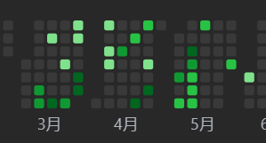
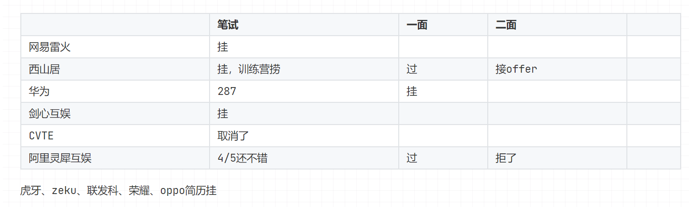
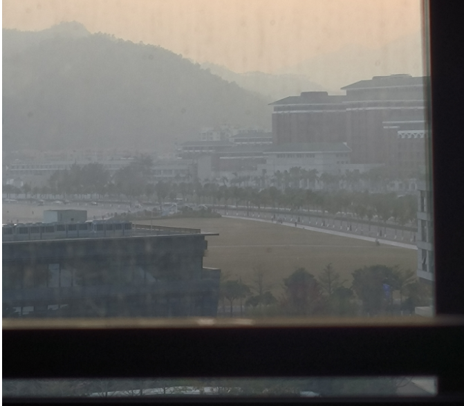

哈哈，没想到距离上一次反思已经快过去一年了，上次反思还是在 2023.2.12 寒假那会儿。

这一次，主要是回顾2023年，展望2024年。

 

2023这一年囊括了大三下和大四上这两个学期，按理来说应该是本科找工作的最关键的时期。目前呢，我还是无offer人士，本来现在还0offer的话应该是很焦虑的，但我感觉还好，因为现在还在西山居实习。这会儿实习也来到第三个月了，后面或许有机会拿到项目组的offer。不过拿不到也没事，毕竟这段时候还是有所收获的

<!--more-->

 

 

 首先是回顾一下2023年的情况吧。

## 2023时间线：

### 1月

- 一月份的话我可能还在打游戏，那会儿玩夜猫永恒玩疯了。
- 大概是到了1月底，也就是大年初七左右，我突然感受到了一股压力，开始慌慌张张地复习了起来。复习是看牛客的webserver项目视频，内容大概就是把游双的《Linux高性能服务器编程》提炼了出来，稍微复习到了一些操作系统的概念和Linux的API，以及计网的东西。

### 2月

- 记得那会儿是2月20多号才补上个学期的期末考试，而我是等到2.17回学校之后才开始期末复习，这段时间里面就没法看别的了。
- 在前面半个月的时间里，应该是在看牛客的视频，然后就是在刷牛客101题。

### 3月

- 三月份充了一年力扣的会员，开始逐步转移到这边刷题，然后还挑了力扣里面的一些八股总结来看。

- 另外就是开始写webserver的代码，因为牛客视频里的那个比较简单，所以我又去找了经典的TinyWebserver来写。与其说是写，不如说是抄吧，基本就是跟着别人的博客还有代码过了一遍，不少地方还有点知其然而不知其所以然。

- 还有就是把之前操作系统课设写的那个协程给捋了捋，也给当作一个项目来用了。

  

  

### 4月

- 四月份开始一边高强度刷题看八股，一边投简历了。
- 从下图可以看到，投的公司不多，但都来自各行各业。
- 这个月的主要战绩是把华为的笔试过了。

### 5月

- 五月份一开始，就葬送了去华为的可能。因为五一出去玩了，没有复习八股和项目，导致面华为约面的时候被打了个措手不及。不过究其原因还是自己对基础知识的理解不够深刻，以及对项目的认识也不够深刻。
- 华为一面G了之后，备受打击，好在这个时候收到了西山居技术训练营的面试。面试特别简单，一面十几分钟，二面就是跟hr聊天和oc了。
- 大概隔了两个星期之后，西山居发了训练营的offer，然后我也接了。这期间，过了阿里灵犀的一面，一面问了大概1小时10分的八股，从C++，到操作系统，到计算机网络，到数据结构和算法，很多都是常问的面试题，但是每一题都会挖得很深，问到不会为止。通过这次面试也发现自己对基础知识的理解还是不够深入的，没有构建起一个互联的体系。
- 在收到西山居训练营的offer之后，我把阿里这边的二面拒了。二面按理来说应该是会问项目，我知道自己对项目的理解不够深。其实如果好好再去准备一下也是可以面一面的，面了不管过没过都能有所收获。但是！但是我把二面拒了，现在想想，好想打屎我这个懒B。此外我也把CVTE的笔试给丢了。
- 在拿了offer之后，我决定往游戏行业靠了，毕竟我也是一个臭打游戏的。我开始入门Unity，还花钱买了麦扣的 3D RPG项目，跟着做了一遍。按后面来看，其实没必要买，免费的部分就足够入门了。而且这个教程也就那样，顶多就是能帮助新手熟悉一下Unity的各个部分，往深了就没了，代码什么的其实写的一般。

### 6月

- 继续学了一点Unity，可惜后来没有按我当时的计划清单里写的，再做一个带有网络对战的 Unity Demo。
- 6月中间是生了场病，病了两个星期，直接把这个月给搞砸了。
- 病好了之后我就又开始狂打游戏了，这个月回头一看几乎是一片空白，毫无收获。

### 7月

- 六月底七月初有期末考，我那会儿应该是在复习吧。
- 7月18号开始训练营，去之前那段时间我应该就多看了一点Unity，别的也来不及看了。
- 然后就是训练营的前2周，是在上课和做作业，客户端、服务端、渲染都讲了些，也都实践了一下，详细内容懒得码字了，简历、实习总结里有。

### 8月

- 训练营的后半部分是进行更多的实践，根据策划文档完成作业。文档内容分了单机和联网两部分，联网的内容可以自己拓展，服务端除了完成文档上的内容，我和我那个给力的队友还加了房间管理和多人游戏同步的内容。
- 8月18号训练营就结束了，虽说顺利拿到了继续实习offer，但是这次还是发现了自己的一些不足，之前在学校动手实践实在太少了。
- 这次训练营让我了解游戏开发大概是怎样的一个情况，提升了我的编码和调试能力（但此时还是很渣）。
- 回去学校之后，先是给自己放空了一个星期。本来打算九月就回去珠海继续实习，但是因为后面9月和10月要校内实习，我就得看导师放不放我远程实习。

### 9月

- 问了导师，导师的回答比较模糊，然后我又去问辅导员和教务员，都没能得到我想要的回答。又因为我对图形学和渲染一直有点爱慕之情，就打算干脆先在学校待两个月再去珠海，这段时间先学一学图形学和 Unity Shader，说不定以后还有机会做做TA啥的。哈哈，因为小时候玩游戏总是很关注画质，所以自己对这方面是有一点天然的兴趣的。可惜了解得太晚了，等到快大四才知道这个方向，现在转这个方向估计是找不了工作的。
- 八月底和九月初其实还行，把GAMES101过了一遍，然后把Unity Shader精要也看了一般。可惜，我还是太懒了，全都是浅看辄止，没有动手实践。
- 后面就开始完蛋了。因为校内实习的事情把我搞得有点烦，然后当时还误以为导师很高冷，我就没有再和导师沟通，校内实习直接啥也没干。现在来看真的很蠢，导师人可好了，有什么事情直接问就行了，不回的话可能是人家比较忙，再多Call一下就行了，实在不行直接上办公室敲门算了。然后我还把EVA剧场版看了，看完就更EMO了，开始天天打游戏，不思进取，秋招直接简历0投递，0准备。

### 10月

- 到了十月，本来我是想10月9号就偷跑回珠海的，但是申请晚了，只能10月18号回。
- 十月第一周，国庆假期，不用想，啥也没干。第二周，也学不了啥了，索性当作最后的疯狂游戏时光。
- 然后就是回来实习了，第一周只有两天半，大概把文档过了一下，环境搭了一下，还把go语言的语法过了一遍，可惜后来完全用不到go。
- 实习第二周，开始过之前项目的代码，但是只是从命名、语法规范等的角度来重构。

### 11月

- 实习第三周，说是要看libuv源码，但是实际看的是别人的博客。然后用自己乱搞的测试客户端来测试项目，出现了一些奇怪的问题，后面就围绕这个问题开始看代码和调试。
- 实习第四周，这次真看了libuv源码，然后调试，找到问题并解决。按师傅和导师的要求，整理了一份文档，内容包括对libuv源码层面的介绍和我的问题解决过程。
- 实习第五周，开始接服务了。接服务就是把这边的游戏服务端通用微服务框架里的各个服务应用到Demo项目里，主要是先看协议和文档了解业务逻辑，然后敲代码，敲完就在客户端画点UI测一下。这周先把客户端网络处理部分的代码重构了，然后接了登录服务。
- 实习第六周，继续接服务，包括在线服务，邮件服务，名字服务。
- 实习第七周，继续接服务，包括聊天服务，好友服务，总计花了三周。

### 12月

- 实习第八周，接完服务不知道干嘛了，看了一周《Lua程序设计》，但没有实践，效率低下。另外把整个项目里面打日志的代码封装了一下。

- 实习第九周，和导师过了一遍接完服务后的代码，重新规范了一下代码，然后从模块设计的层面重构了一下，补充完善了很多功能，主要是针对网络连接的。
- 实习第十周，本来这周是要接中心服务和测试的，然后第一天确实接了，把正常情况下的协议测了一遍。后面请假了，回去填校内实习的坑。
- 实习第十一周，把Lua嵌入C++的方式整合完毕了，又把连接管理几乎重写了，后面可以顺畅地重写其他逻辑了。

 

 

实习的这两个月，写了应该快1万行代码了，我的动手能力是实打实的锻炼到了。然后就是，对于后端接触的这些东西有了一个清晰一点的概念映像了，对一些业务逻辑，对项目里的实际要求，也有了更多的认识。

 

 

好了，下面就来到2024了。

 

 

## 2024规划：

 

### 前言

回顾完了2023，给自己一句简短的总结，大概就是“努力过了，但又没完全努力”。

相比起我在朋友圈看到的，比如有些同学已经顺利保研，或者是收获了腾讯、美团、网易等大厂的offer，我的收获就不值一提了。

但是，别人也不是一蹴而就，每个人总会有一段压力巨大的时期，如果扛过去了，并且稳扎稳打逐步爬升，总能有好结果的。

而我呢，也算是在逐步前进吧，但是三天打鱼两天晒网的现象还是比较严重，也就导致了最终跟别人比起来有些相形见绌。

说实话，看到同班的同学拿到大厂offer，还是挺眼红的。总有一种感觉在说，凭什么别人可以，你就不可以了。也希望者能够成为2024年的一些动力吧，毕竟，我的大学生涯比较失败的原因有很大的部分在于没有明确的目标和源源不断的动力。

 

 

### 目标

- 上半年：
  - 顺利毕业
  - 找到合心的工作
- 下半年：
  - 迅速融入工作环境
  - 争取找到新的目标

 

### 眼下：

眼前需要应付的事情有：实习，毕业设计，春招。

实习：

- 现在已经进入收尾阶段了，目前需要用Lua把之前的东西再过一遍。然后可以多看一些测试的东西，多了解框架里面一些服务。

毕设：

- 估计还是得等实习结束才抽的出时间和精力来搞。

春招准备：

- 八股，项目，算法这三个过一遍就行了。
- 另外要加强一下自己的沟通和表达，以及多注意其他非技术的因素。

 

 

 

再之后的事情再看吧，希望2024的开头能顺顺利利，给后续铺垫基础。

 

 
