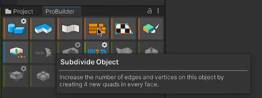
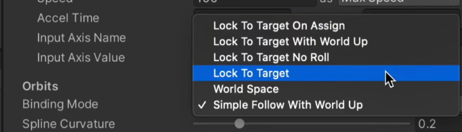
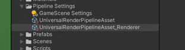
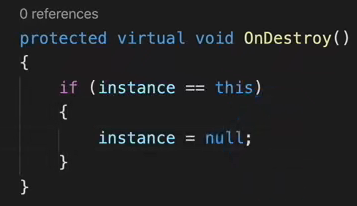
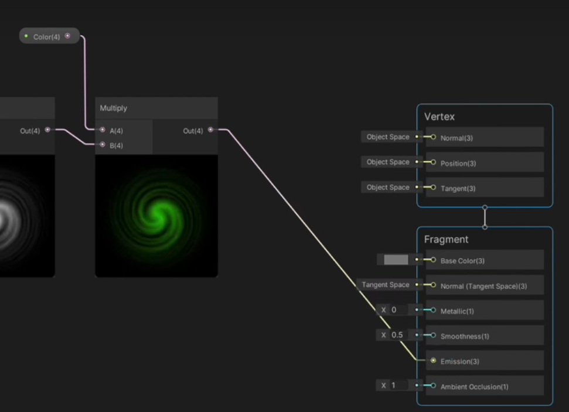
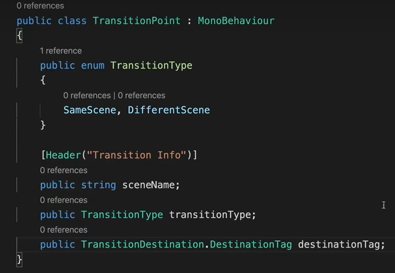

# 3D RPG Demo回顾

## 1.创建项目

包含 **项目创建，渲染管线设置，资源导入，资源材质渲染升级**

<!--more-->

- 新建3D项目
- Window->PackageManager(Packages/ Unity Registry)中下载和导入 **Universal RP** 通用渲染管线
- 在Assets目录中创建 Pipeline Asseet
  -  
- 导入PackageManager(Packages/ My Assets)中的资源包
- 升级资源项目的材质Material到URP
  -  
  -  Window->Rendering->Render Pipeline Converter

## 2.场景搭建

包括 **天空盒，阴影，光照，场景搭建**

- 天空盒设置

  - Window->renderinh->lighting->Environment

- 阴影设置

  -  
  -  在**渲染管线配置文件**中设置Shadow字段的参数

- 光照设置

  - Window->renderinh->lighting->Scene

  - 通过设置 Lighting Settings 文件，配置光照参数

  - 

    设置是否在生成场景时自动渲染光照

  - 光源：在Environment中设置光源 Environment Lighting/Source

- 场景物体摆放

  - shift+F 抓取顶点

  - ctrl+shift+F 快速设置transform

  - 利用空Object分割 Hierarchy 中的各类型对象

  - Polybrush插件

    - 安装：

      - Window->PackageManager(Packages/ Unity Registry)
      - 导入样例Shader
        

    - 使用：Tools菜单/Polybrush Window 

    - 使用Polybrush自带的ShaderGraph来创建材质
      

      使用了该材质的物体可以使用Polybrush的颜色刷子

- 场景模型创建 —— ProBuilder

  - 安装：跟PolyBrush差不多

    

  - 

  - 新版本的参数名称有不同

- 启用Preview Package：ProGrids

  - Edit/Project Setting

  - 

  - Tools/ProGrids

    

## 3.地图导航烘焙

### Navigation

- 开启：Window->AI->Navigation
- 
  - Agent 表示的是 移动物
  - 可以设置坡度、Agent模型体积等参数
- 设置物体为导航路面
  - Static：Navigation static
    
  - 设置是否 Walkable
    
- 为人物添加导航组件
  - Nav Mesh Agent：导航网格人物代理组件
    - 相关参数：
      
- 为障碍物添加导航组件
  - Nav Mesh Obstacle
  - carve：可以实时切割导航路面
    
- 跳跃设置：没有用到

## 4.鼠标控制和人物移动控制

### MouseManager脚本

- 挂载在空物体 Mouse Manager

- 设置鼠标点击事件的处理

  - UnityEngine.Event
    - [System.Serializable] 序列化处理非MonoBehaviour子类，使得Unity界面中能够查看和设置该属性
      
      
    - 设置事件处理
      
      - 将事件设置为NavMeshAgent自带的Destination，表示导航位置。

- 获取鼠标点击位置：利用射线和collider发生碰撞

  - API：

    - Camera.ScreenPointToRay(Vector3 position) 从屏幕发射到position的射线
    - Physics.Raycast(Ray ray, out RaycastHit hitInfo) 检测射线的碰撞

  - 相关参数：

    - RaycastHit hitInfo 作为Physics.Raycast的传出参数，保存有射线的碰撞信息

  - 代码：

    - 射线发射，判断射线碰撞物体，根据物体标签设置鼠标贴图
      

    - 点击鼠标，触发事件处理 OnMouseClicked.Invoke(hitInfo.point) 就是 前面设置的 NavMeshAgent.Destination

      
      

- 移动控制小细节：NavMeshAgent组件 的参数

  - Stopping Distance 的大小设置可以跟攻击距离有关联
  - 速度，角速度，加速度
  - 自动制动 Auto Braking：提前减速，否则就是匀速到达并停止

- 指针贴图设置

  - 导入PNG格式的鼠标贴图，并设置相关参数
  - 脚本代码中，用 Texture2D 类型的变量保存贴图内容
  - 控制代码
    
  - 注意鼠标点击的原始位置是在 鼠标贴图的左上角顶点 ，通过 SetCursor() 的第二个参数来设置偏移使得鼠标点击位置位于贴图中央

  

### 单例模式

写法

 

**只需**保证Mouse Manager的实例**有且仅有一份**就行了，不关心实例是否保持为最早创建的实例。

### PlayerController

- 鼠标移动事件：弃用上面的 UnityEngine.Events/EventVector3，改用 System/event Action\<xxx> ,xxx为参数
  -  
  -  工作原理：
     - 创建事件 OnMouseClicked
     - 将事件处理函数注册到该事件 OnMouseClicked += xxx;
     - 事件发生时，调用 OnMouseClicked.Invoke(arg) 会唤起所有注册了的事件处理函数
  -  代码：
     - 事件处理以及注册（PlayerController中），涉及NavMeshAgent组件
       

## 5.相机设置

### 相机跟踪

- 安装 Cinemashine 工具

- 创建虚拟相机 virtual Cinemashine，设置 MainCamera的brain
- 设置虚拟相机的参数
  -  
  -  Aim参数-do nothing
  -  follow参数-playerObjcet
     - 可以给人物加一个lookAtPoint来作为相机跟随对象
  -  虚拟相机的位置可以通过Ctrl+Shift+F调整

### 视图后处理

#### 设置迷雾

- Window->Rendering->lighting->environment->fog
  - 能见度
  - 颜色
- Scene内也要开启fog

#### Post Processing

- Main Camera中启动PostProcessing

  

- 创建 Global Volume 对象

  -  
  -  创建 Profile ，添加并设置各种效果 Add Override
     
     - Bloom 泛光
     - Color Adjustment 曝光、对比度、饱和等
     - ToneMapping 色调
     - Depth Of Field 景深
     - Chromatic Aberration 畸变、鱼眼效果
     - ...

### Cinemashine之 FreeLook Camera

- 设置 Follow 和 Look At
- 相机移动控制：
  - Axis Control 
    - Input Axis Name：
      可以在Project Setting-InputManager里查看
      
  - Orbits 移动范围
    -  
    -  Binding Mode 设置移动跟随 

## 6.动画控制

- 添加 Animator 组件

- 创建 Animator Controller 动画控制器，并设置到Animator组件中
  

  

- 打开动画控制器

  - 在 Base Layer 创建 Blend Tree，控制基本的移动动作
    
  - 在 Blend Tree 中添加参数：Speed(float)
  - 在 Blend Tree 中添加 Motion Field，并设置相应动画以及数值控制
    

- 代码：

  - 先获取 Animator 组件给anim变量
  - 设置 Speed 的值
    
    - agent.velocity获取速度
    - sqrMagnitude将Vector3的速度数值转为float

## 7.利用ShaderGraph实现剔除遮挡的效果

ShaderGraph提供了可视化编辑渲染管线的功能

- 创建 Unlit Shader Graph
  

- 基于该 Shader，创建一个 Material 供后续使用

- 打开 Shader Graph 窗口
  

- 菲涅尔效果
  - 创建 Fresnel Effect 的Node结点
    
  - 创建 Color 变量，并与菲尼尔效果节点相乘，输出给 Fragment 的 Base Color
    

- 噪点效果：
  - 创建 Dither node，并输出到 Fragment 的 Alpha
  - 

- Alpha阈值设置
  
- 在 Pipeline Setting 中应用该Shader
  - 打开的是另一个 URPRenderPipelineAsset 文件，带_Render后缀
    
  - 添加两个 Render Object
    
    - 一个是被遮挡的渲染模式
      - 首先取消勾选 Write Depth
        
      - 将 Depth Test 设为 Greater
      - 设置 Layer Mask 为 Player图层
        
    - 一个是不被遮挡的渲染模式
      设置 Layer Mask 为Player图层即可，其他的为默认

附加Tip：

如何使得场景中的树木不遮挡鼠标射线?

- 方法一：将树木的 Layer 设为 Ignore Raycast
- 方法二：关闭树木的 Collider 组件

## 8.敌人

### 属性和状态

- 在脚本代码中自动添加组件 
  - 

- 状态机构思：
  - 站桩 or 巡逻
  - 追击
  - 死亡
  - 
- 其他细节：
  - Layer 增加一层Enemy，用于在PipelineSetting里的Layer Mask加上实现遮挡剔除
  - Tag 也加上Enemy，用来设置鼠标贴图

#### 追击状态

**范围内发现Player**

- 视野变量，表示视野范围
- Physics API
  - OverlapSphere(position, Radius)  返回范围内的一组collider
    

**敌人动画控制**

思路

- 追击
- 脱战，回到站桩或巡逻
- 攻击范围内攻击

动画控制器Layer：

- 基本移动
  - idolNormal作为初始动画
  - WalkFWD行走动画，并用bool变量做条件
  - RunFWD跑动动画
- 攻击
  - 权值设置，覆盖/叠加前面Layer的动画
    
  - 如何从其他Layer的动画状态切换过来 —— 创建空state，代表之前的任何一个Layer，并连接到Entry
    
  - 战斗状态动画控制，两个bool
    - 追击 Chase —— 其他动画< - >攻击动画
    - 跟踪 Follow —— 攻击动画< - >跑动动画

代码

- 更新动画变量
  
- 更新脚本变量
  

#### 巡逻状态

**随即巡逻点**

- 辅助线API 
  
- 随机获取范围内的某个点
  
  - 获取当前位置范围内的随机点，也可更改为获取固定范围内的随机点
  - 可能出现的问题是获取到的点位置不可达
- 问题解决：
  - 导航API： 
    SamplePosition() 在指定范围内，找到导航网格上最近的指定Area的点
    
    
    - NavMesh.AllAreas：
      
  - 

**状态控制代码**

- 动画变量设置，移动速度设置
- 若到达目标位置内，获取新的目标点
- 若未到达目标位置，则继续移动
- 

**在巡逻点停留**

- LookAtTime 和 RemainLookAtTime 变量
- 
- 在获取随机点后更新 RemainLookAtTime

**脱战后回到巡逻状态**

 

#### 守卫状态

- 定点站桩
- 若不在站桩点，则走回站桩点站桩
- 走动、站桩的动画控制（bool动画变量）
  - 回到站桩点时，利用插值计算，平滑地使对象转向原来的方向
- 

#### 死亡状态

- **动画管理**
  - 创建新的Layer，Death，并设置覆盖指数为1
  - 创建一个空的动画State，表示上一个动画状态
    
  - 
    - 受攻击：Trigger变量，Hit，被攻击（暴击）时触发
      - 在动画事件里面判断和设置 
        
    - 死亡：bool变量。Death，血量为0
      - 取消勾选，取消自循环播放
        
- 主角的受伤和死亡的动画管理类似

- **脚本管理**
  -  用一个bool表示是否死亡，并且同步States状态
     
  -  状态机状态处理
     - 关闭导航Agent，Collider等组件
     - 延迟销毁 gameObject 对象

### 主角攻击（移动与动画）

- 类似OnMouseClicked事件，在Mouse Manager中增加一个OnEnemyClicked事件

  -  
  -  

- 还要在PlayerController中注册这个事件的回调函数EvntAttack

  - 利用 协程 + while循环 控制移动 MoveToAttcakTarge
    
  - 还要考虑到 **攻击CD，攻击范围，暴击** 等
  - 可以在普通的移动中加上一步终止协程，否则攻击触发之后无法改变状态直至执行完这次攻击。

- 动画

  - 直接拖动画文件到动画编辑窗口内，然后添加动画关联变换，设置变换条件
    

    

### 敌人攻击

- 攻击动作处于状态机的 Chase 状态
- 根据相对位置和攻击距离，管理对象的动作状态（isFollow, isStopped)
- 攻击CD控制
- 暴击控制，bool动画变量
- 动画控制
  - 在攻击动画和idol动画之间切换
  - 使用 Trigger 动画变量
  - 
  - 

## 9.人物属性和数值

使用 **ScriptableObject** 脚本帮助生成 Asset 文件，可以制作数值模板、设置模板

比如

### 基本属性

**ScriptableObject脚本**

- 脚本继承自
  -  
- 在create菜单中添加选项
  -  
  -  
- 为Asset文件设置字段名称和属性变量
  -  
  -   

**Mono Behaviour脚本**

- 管理 Asset 中的数值
- 
- 将 Asset 中的数值读取到 Stats 脚本文件中。简化后续的数值访问（不用 Stats.Data.xxx ）。
  - 利用C# properties 属性 的语法
  - 例如：MaxHealth
    
- #region xxx，#endregion 管理代码块

### 攻击属性

- 数值模板：同样先创建Scriptable object脚本文件管理所创建的Asset文件的数值内容
- 数值控制：再使用Mono脚本作为组件管理数值（在脚本内获取Asset数值文件资源）

### 伤害数值计算

- 在数值控制脚本内声明和定义攻击伤害计算方法
- 伤害处理方法以两个数值控制脚本对象作参数（attacker，defender）
- 

### 伤害生效处理（动画事件）

简单的处理：采用动画事件，而非使用物理方法判断攻击是否生效。

- Animation窗口
  -  
- 攻击事件函数/方法
  -  
- 关键帧+动画事件
  -  

 

## 10.泛型单例模式 与 Game Manager

### GameManager

- 在主角死亡时，可以用Game Manager广播主角死亡的消息

- 特殊图标的Script文件，用 空object 挂载
  
- Game Manager存有PlayerStats数据脚本，游戏中其他的对象要访问Player的数据时，通过Game Manager访问
  - Game Manager 如何获取Player的数据脚本？
    - 采用 观察者 模式，反向注册，当Player生成的时候，向Game Manager注册
    - Game Manager提供注册接口
      
    - Player注册
      

### 泛型单例模式

- 语法
  -  泛型单例脚本
     
  -  泛型\<T>，并且约束T为继承自 Singleton\<T> 的类
  -  不约束T能放任何类，比如Singleton\<Animator>，约束后只能放继承自Singleton\<T>的类，比如Singleton\<MouseManager>
  -  具体类型单例脚本
     
- 生成实例（严格上说是饿汉）
  - 场景生成时，Awake创建了新的Manager
    - 若原来的实例没被销毁，则销毁新生成的泛型单例对象
    - 若原来的实例被销毁了，更新实例为当前泛型单例对象
  -  
- 获取实例（私有变量，公开属性）
  -  
- 析构
  - 当实例对象就是当前单例对象时，销毁单例对象的同时也将实例对象销毁。
    
- 具体类型脚本继承单例类型脚本后
  - 重写Awake，DontDestroyOnLoad(this)使得切换场景时不析构该脚本对象。
    

## 11.接口 与 观察者模式：订阅和广播

主要广播的是Player死亡的消息

### EndGameObserver 接口

如名称所示，该接口意为 游戏结束的观测者 ，其接口方法则是 游戏结束时的处理方法 。

- 接口的脚本文件以I开头
  -  
- 接口声明
  
- 接口方法，使用（继承）了接口的脚本都要实现接口方法
  - EndNotify
- 继承接口和实现接口方法
  -  
  -  

### 观察者模式

Game Manager 记录所有实现了接口的对象，并在事件发生时广播消息给这些对象。

游戏对象作为观察者，并在Game Manager中注册，以在适当的时候接收广播消息。

- Game Manager
  -  提供注册函数和注销函数
     
  -  广播消息
     
- 在游戏对象的Controller脚本中进行注册和注销（启用和关闭时）
  -  

- 在Player死亡时，由PlayerController启动Game Manager的广播
  

### 接口方法的具体实现

- 胜利动画
  - 单独建一个Layer，启用覆盖，并用一个bool值控制，可以从任何动画状态切换进入
    
  - 并且取消勾选 Cant Transition To Self
- 停止其他动画状态
- 攻击目标置空
- 

## 12.更多敌人

### 独享数据文件

- 将 源Scriptable Object文件 作为模板，初始化一份独有的Scriptable Object文件来实际管理数值。
  -  
  -  

### 制作已有类型敌人（史莱姆和乌龟）

- 相同的Controller脚本，附带相同的组件
- 自建Asset数据模板文件，并填写基础数值
- 动画：制作Animator Controller，可以用 Animator Override Controller 快速利用原有的其他Animator Controller。
  - 只能替换动画
    
  - 对有Override关系的动画控制器进行修改的话，会相互影响
- 保存prefab

### 制作新类型敌人（兽人和石头人）

#### 兽人

- 动画：新建Animator Controller，可以通过复制得到后进行修改，不会影响原来的动画控制器。
  - 更换动画文件
  - 暴击攻击换成技能攻击，修改动画变量和切换条件
- 脚本：主要多实现了技能攻击
  - 继承通用Controller
  - 实现 KickOff 动画事件（击退效果）
    -  
    -  采用NavMeshAgent的velocity方法施加力
       

#### 其他内容

##### 动画状态机

**角色被攻击后，设置眩晕或受击时无法移动**

- 为动画状态添加Behaviour脚本
  
- Unity内置的状态机脚本
  
  - 分别设定 进入动画、动画执行、退出动画...时的执行内容
  - 注意NavMeshAgent组件在角色死亡时会先销毁，而动画执行未结束，导致这里报错。可以将死亡时的处理代码改为将NavMeshAgent组件的Radius置0，达到死亡后对导航不挡路的效果。

##### 拓展方法

给一个类加一个自己写的方法，这里是给 Transform 类添加内容

- 语法要求：public static 类，无继承
  
- 添加的是攻击扇形范围的角度，以及判断攻击目标是否处于角度范围内的方法
  
  - this Transform xxx 指定要添加内容的类
  - Transform target 是方法的参数
- 使用：直接用transform组件调用自定义方法
  

#### 石头人

- 动画：override 兽人的动画控制器
- 脚本：继承同样Controller
- 普通攻击带击退 ，远程攻击扔石头+击退
- 设计数值（基本数值，攻击距离，冷却，力度 ...)

**扔石头**

- 对于石头
  - 为石头prefab添加控制脚本、刚体、碰撞体等组件
  - 石头在生成时就飞向攻击目标（抛射），生成位置为举手抛出时的position（利用手部模型子对象的Transform）
  - 
- 对于石头人
  -  
  -  

**玩家击回石头**

- 石头的三个状态
  

- Hit Player

  -  
  -  击退 + 造成伤害
  -  切换状态为 Hit Nothing
  -  在数据控制脚本中重载伤害计算方法
     

- Hit Enemy

  - 伤害造成（对石头人），并销毁自身
    
  - 玩家击打石头
    - 设置石头的标签为 attackable
    - Mouse Manager添加对该标签物体的鼠标指针管理（OnEnemyClicked信号触发）
      
    - 在Player Controller里对 Hit动画事件 做文章，若攻击对象是石头，则造成击飞效果
      
      - 要在打击后，设置石头的初速度

- Hit Nothing

  - 一种是击中玩家后，切换为 Hit Nothing 状态

  - 另一种情况是，未击中玩家，当速度下降接近0时，切换为 Hit Nothing 状态
    - 在 FixedUpdate 中读写物理相关的数据
    - 

- 另外要给小狗加上刚体组件，防止跟石头穿模。并且要勾选 is Kinematic 。

**粒子效果：石头碎裂**

- 在Hierarchy中创建碎石效果
  -  
- 设置各种各样的参数
  - Gravity Modifier 重力下落效果
  - Collision 与其他物体产生碰撞
    
  - Start Lifetime 生命周期
  - Start Size 设为随机尺寸
    
  - Renderer
    - Render mode 改为 Mesh
    - Mesh文件采用石头的Mesh
    - 设置材质
  - 角度变化
    - Rotation By Speed
    - Rotation over Lifetime
- 保存为prefab

- 脚本获取效果并触发效果
  - 用gameObject变量获取
  - 在石头的HitEnemy状态处理代码中生成效果
    

## 13.简单UI

### 血条

- 创建画布 Canvas
  - Render Mode 采用 World Space
  - Event Camera 设为 Main Camera
- 创建画布的子物体：
  - 创建 Image 来作为血条
  - 两条长方 square ，一红一绿，通过覆盖和改变长度来表现血条
- 创建脚本控制UI的生成 : HealthBarUI.cs 每个有血条的角色都要挂载
  - 在每一个角色头上生成、展示血条
  - 提前给每个角色prefab加一个空的子物体表示血条位置，或者也可以自己在代码中计算位置
  - 脚本需要的数据成员
    
    - 相机Transform组件用于使血条平面始终平行于相机画面
  - 更新血量事件。参数为当前血量和最大血量。
    
    - 在每次攻击发生时进行触发事件（TakeDamage伤害计算函数，在数据控制脚本中）
      
    - 注册事件处理函数
      -   
      -   
  - 血条位置更新
    -  LateUpdate的执行时机实在本帧完成后。也可用于相机跟随之类的功能。
    -  
  - 若血条设置不是永久显示，需要更新显示计时
    -   

### 经验值与升级

#### 数据处理

**玩家数据脚本**

- 在玩家的 Scriptable Object 文件中
  - 添加跟等级有关的数据字段
    
  - 添加经验更新方法
    
  - 升级处理方法
    

- 在外部的攻击活动中调用经验更新（击杀时）
  -  

**UI控制脚本**

- 获取UI物件
  -  
- 更新UI物件：生命值、经验值、文字
  - 
  - 不建议在Update中更新
    

#### UI处理

创建画布 Canvas

- Render Mode: Screen Space-Overlay 
- Canvas Scaler 的 Scale Mode 设为 
  
  

**玩家血条**

- 在画布下创建 Image
  - 调整布局位置，按住 alt+shift 选择左上角
    
  - 调整大小，具体位置，颜色
  - 还需要一个子 Image 覆盖实现血条滑动效果
    - 应该是绿色，然后调整Image Type相关参数
      

**经验条**

- 复制上面的血条，调整一下外观即可

**等级**

- 创建一个 Text 然后同上调整位置和外观 

## 14.场景切换

### 传送门

- 创建 Lit Shader Graph
  
- 打开 shader graph 
  - 设定显示模式
    
  - 创建基本节点：Twirl
    
  - 与 Voronol 叠加
    
  - 将时间和一个float变量相乘，作为offset控制旋转速度，并用另一个float设置强度strength
    
    
  - 设置2D纹理，建立 Sample Texture 2D节点，并用一个 Texture 2D 变量指定纹理图片
    
  - 加上颜色，输出到片段着色器的 Emission
    
  - 再加上透明通道
    
    
  - 双向显示，在Graph Inspector中勾选Two Sided
- 利用做好的 Shader 创建 Material
  
- 创建一个 Quad 物体并把材质附上，在Mesh Renderer关闭阴影，勾选 Always Refresh 查看效果
  
- Shader中的颜色节点勾选HDR，可以调整效果更亮/更暗
- 使用Power节点可以再增强效果
  

**传送**

每个传送门表示了 自身地点 和 传送目的地 。

- 给每个传送门创建一个空子物体，作为其传送点
  
  

- 两个脚本管理传送

  - TransitionPoint.cs 管理传送门标签，作为传送门的组件
    
    
  - TransitionDestination.cs 管理传送目的地
    

- 传送门 碰撞检测触发传送
  
  

  在Update里检测按键传送

### 传送

用脚本控制场景切换：SceneController.cs

利用协程异步加载场景和切换角色位置

#### 同场景传送

传送过程：  

- 获取游戏主角的object，及其agent
- 全局查找到目标传送点对象
- 停用Player对象的Agent，切换Player对象的位置角度到传送点，再启用Agent

#### 跨场景传送

传送过程：  

- 异步加载场景
- 重新初始化主角的prefab，位于传送门位置
- 停用Player对象的Agent，切换Player对象的位置角度到传送点，再启用Agent

- 对各种Manager，最好启用DontDestroyOnLoad
  

## 15.数据保存

## 16.主菜单

### 主菜单

### 场景切换淡入淡出

## 17.打包程序

