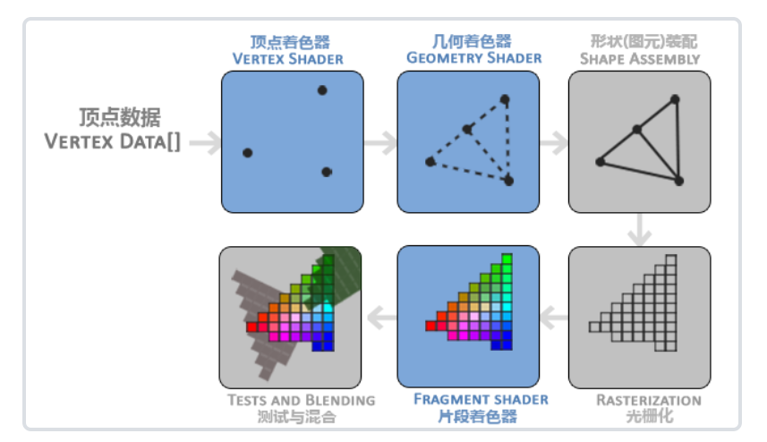
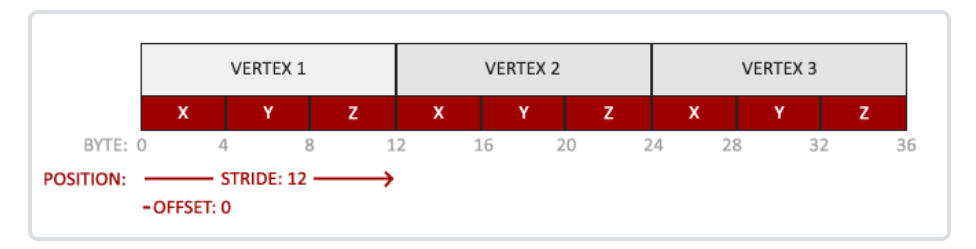
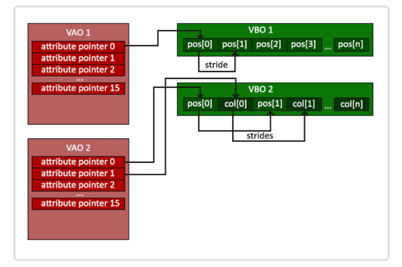
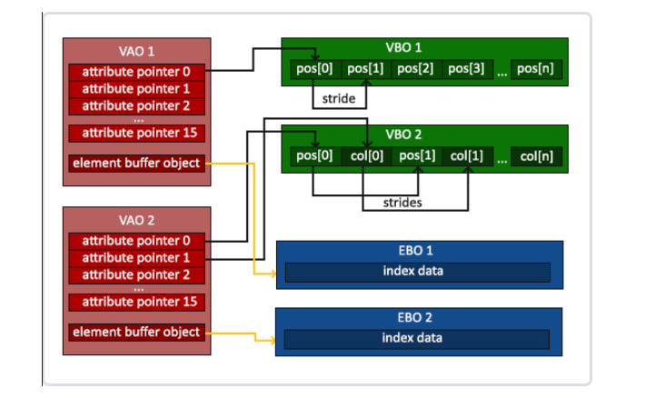

# 基本概念，环境搭建，画三角形


## 一、概述

> OpenGL规范严格规定了每个函数该如何执行，以及它们的输出值。至于内部具体每个函数是如何实现(Implement)的，将由OpenGL库的开发者自行决定（译注：这里开发者是指编写OpenGL库的人）。

- [OpenGL规范](https://registry.khronos.org/OpenGL/specs/gl/glspec33.core.pdf)

<!--more-->

## 

### 核心渲染

- Core-profile mode

- 库函数更加现代，有更高的灵活性和效率。
- 现代函数要求使用者真正理解OpenGL和图形编程。


### 立即渲染

- Immediate mode，也就是固定渲染管线
- 从OpenGL实际运作中抽象掉了很多细节，因此它在易于学习的同时，也很难让人去把握OpenGL具体是如何运作的。


### 扩展

- 不必等待一个新的OpenGL规范面世，就可以使用这些新的渲染特性
- 只需要简单地检查一下显卡是否支持此扩展

```c
if(GL_ARB_extension_name)
{
    // 使用硬件支持的全新的现代特性
}
else
{
    // 不支持此扩展: 用旧的方式去做
}
```


### 状态机

- OpenGL自身是一个巨大的状态机
- OpenGL的状态通常被称为OpenGL上下文(Context)，由一系列的变量描述OpenGL此刻应当如何运行
- 更改OpenGL状态的途径：设置选项，操作缓冲
- 两类函数
  - 状态设置函数(State-changing Function)：改变上下文
  - 状态使用函数(State-using Function)：根据当前OpenGL的状态执行一些操作


### 对象

- 为c语言结构体引入的一层抽象：对象Object
- OpenGL对象：指一些选项的集合，它代表OpenGL状态的一个子集

```c
// 类似的： 
struct object_name {
    float  option1;
    int    option2;
    char[] name;
};
```

- 使用的方式类似下方：

  ```c
  // OpenGL的状态
  struct OpenGL_Context {
      ...
      object* object_Window_Target;
      ...     
  };
  
  
  // 创建对象
  unsigned int objectId = 0;
  glGenObject(1, &objectId);
  // 绑定对象至上下文
  glBindObject(GL_WINDOW_TARGET, objectId);
  // 设置当前绑定到 GL_WINDOW_TARGET 的对象的一些选项
  glSetObjectOption(GL_WINDOW_TARGET, GL_OPTION_WINDOW_WIDTH, 800);
  glSetObjectOption(GL_WINDOW_TARGET, GL_OPTION_WINDOW_HEIGHT, 600);
  // 将上下文对象设回默认
  glBindObject(GL_WINDOW_TARGET, 0);
  ```

- 使用对象的一个好处是在程序中，我们不止可以定义一个对象，并设置它们的选项，每个对象都可以是不同的设置。在我们执行一个使用OpenGL状态的操作的时候，只需要绑定含有需要的设置的对象即可


## 二、实操

- OpenGL编程实操：首先需要一个OpenGL上下文和一个输出显示窗口，以及处理用户输入。
- 有一些库已经封装好了上一步提到的内容，而不需要我们自己进行系统编程。最流行的几个库有GLUT，SDL，SFML和GLFW。
- 教程中使用GLFW。


### GLFW

- 不直接使用编译好的库：从源代码编译库可以保证生成的库完全适合你的操作系统和CPU的，而预编译的二进制文件则并非总是适用于您的系统。
- 自己编译带来的问题：并不是每个人都用相同的IDE或者构建系统来搞开发，因而提供的项目/解决方案文件可能和一些人的IDE不兼容。

#### CMake

- 工程文件生成工具
- 用户可以使用预定义好的CMake脚本，根据自己的选择（像是Visual Studio, Code::Blocks, Eclipse）生成不同IDE的工程文件


> tip：貌似CMake配置VS2017的只能编译32位版本的glfw3.lib，如果自己的项目是64位的，会出现链接错误。
>
> 快速的解决方法是直接用官方编译好的库文件。

#### 步骤

1. 使用CMake配置和生成所选IDE的项目配置和构建信息
2. 用IDE打开项目后进行编译和构建
3. 生成之后就可以使用了。在我们自己的项目中，配置好头文件和库的位置即可。
4. 可以把需要用到的库文件和头文件放到单独的一个地方管理，在其他项目中加入这个地方的路径来引入对应内容即可。


### GLAD

- 由于OpenGL驱动版本众多，它大多数函数的位置都无法在编译时确定下来，需要在运行时查询。开发者需要在运行时获取函数地址并将其保存在一个函数指针中供以后使用。

- 取得地址的方法因平台而异，在Windows上会是类似这样：

  ```c
  // 定义函数原型
  typedef void (*GL_GENBUFFERS) (GLsizei, GLuint*);
  // 找到正确的函数并赋值给函数指针
  GL_GENBUFFERS glGenBuffers  = (GL_GENBUFFERS)wglGetProcAddress("glGenBuffers");
  // 现在函数可以被正常调用了
  GLuint buffer;
  glGenBuffers(1, &buffer);
  ```

- 幸运的是，有些库能简化此过程，其中**GLAD**是目前最新，也是最流行的库。

> 打开GLAD的[在线服务](http://glad.dav1d.de/)，将语言(Language)设置为**C/C++**，在API选项中，选择**3.3**以上的OpenGL(gl)版本（我们的教程中将使用3.3版本，但更新的版本也能用）。之后将模式(Profile)设置为**Core**，并且保证选中了**生成加载器**(Generate a loader)选项。现在可以先（暂时）忽略扩展(Extensions)中的内容。都选择完之后，点击**生成**(Generate)按钮来生成库文件。


### 创建窗口

- 代码一：初始化

```c
int main()
{
    // 初始化glfw窗口
    glfwInit();
    // 告知glfw要使用的opengl版本
    glfwWindowHint(GLFW_CONTEXT_VERSION_MAJOR, 3);
    glfwWindowHint(GLFW_CONTEXT_VERSION_MINOR, 3);
    // 告知glfw要使用的opengl渲染模式
    glfwWindowHint(GLFW_OPENGL_PROFILE, GLFW_OPENGL_CORE_PROFILE);

	//mac os x系统需要用到   
    //glfwWindowHint(GLFW_OPENGL_FORWARD_COMPAT, GL_TRUE);

    return 0;
}
```

- 代码二：创建窗口，设置上下文

```c
GLFWwindow* window = glfwCreateWindow(800, 600, "LearnOpenGL", NULL, NULL);
if (window == NULL)
{
    std::cout << "Failed to create GLFW window" << std::endl;
    glfwTerminate();
    return -1;
}

glfwMakeContextCurrent(window);
```

- 代码三：初始化GLAD

```c
// 在glfw初始化和创建窗口之后才能初始化glad

if (!gladLoadGLLoader((GLADloadproc)glfwGetProcAddress))
{
    std::cout << "Failed to initialize GLAD" << std::endl;
    return -1;
}
```

- 代码四：设置视口View Port

```c
// 前两个参数控制窗口左下角的位置。第三个和第四个参数控制渲染窗口的宽度和高度（像素）
glViewport(0, 0, 800, 600);

// 设置窗口大小变化时的回调函数
void framebuffer_size_callback(GLFWwindow* window, int width, int height)
{
    glViewport(0, 0, width, height);
}

glfwSetFramebufferSizeCallback(window, framebuffer_size_callback);
```

- 代码五：释放资源

```c
glfwTerminate();
return 0;
```


### 渲染循环

让GLFW退出前一直保持运行

```c
while(!glfwWindowShouldClose(window))	// 检查是否被要求退出窗口
{
    glfwSwapBuffers(window);			// 交换颜色缓冲，输出显示到屏幕
    glfwPollEvents();    				// 检查有没有触发什么事件（比如键盘输入、鼠标移动等）、更新窗口状态，并调用对应的回调函数
}
```

>双缓冲：
>
>- 应用程序使用单缓冲绘图时可能会存在图像闪烁的问题。因为生成的图像不是一下子被绘制出来的，而是按照从左到右，由上而下逐像素地绘制而成的。
>- 应用双缓冲渲染窗口应用程序。**前**缓冲保存着最终输出的图像，它会在屏幕上显示；而所有的的渲染指令都会在**后**缓冲上绘制。
>- 当所有的渲染指令执行完毕后，我们**交换**(Swap)前缓冲和后缓冲，这样图像就立即呈显出来，之前提到的不真实感就消除了。


### 输入控制

案例为检测ESC是否按下，按下则关闭窗口

```c
// glfwGetKey函数
void processInput(GLFWwindow *window)
{
    if(glfwGetKey(window, GLFW_KEY_ESCAPE) == GLFW_PRESS)
        glfwSetWindowShouldClose(window, true);
}

// 渲染循环中检测
while (!glfwWindowShouldClose(window))
{
    processInput(window);

    glfwSwapBuffers(window);
    glfwPollEvents();
}
```


### 渲染操作

在渲染循环中加入渲染指令

```c
// 渲染循环
while(!glfwWindowShouldClose(window))
{
    // 输入
    processInput(window);

    // 渲染指令
    glClearColor(0.2f, 0.3f, 0.3f, 1.0f);
	glClear(GL_COLOR_BUFFER_BIT);
    ...

    // 检查并调用事件，交换缓冲
    glfwPollEvents();
    glfwSwapBuffers(window);
}
```

清空缓冲：

- glClear（Buffer Bit）
  - GL_COLOR_BUFFER_BIT 颜色缓冲
  - GL_DEPTH_BUFFER_BIT 深度缓冲
  - GL_STENCIL_BUFFER_BIT 模板缓冲

> tip：glClearColor函数是一个**状态设置**函数，而glClear函数则是一个**状态使用**的函数


### 画三角形

#### 三类OpenGL对象

- 顶点数组对象：Vertex Array Object，VAO
- 顶点缓冲对象：Vertex Buffer Object，VBO
- 元素缓冲对象：Element Buffer Object，EBO 或 索引缓冲对象 Index Buffer Object，IBO


#### 图形渲染管线

- 接受一组3D坐标，然后把它们转变为你屏幕上的有色2D像素输出。
- 可以被划分为几个阶段，每个阶段将会把前一个阶段的输出作为输入。
- 所有这些阶段都是高度专门化的（它们都有一个特定的函数），并且很容易并行执行。

**着色器**

- 在GPU上为每一个（渲染管线）阶段运行各自的小程序。
- 部分着色器可由用户自行定义
- OpenGL着色器是用OpenGL着色器语言(OpenGL Shading Language, GLSL)写成的，在下一节中我们再花更多时间研究它。



> 图元 (Primitive)：
>
> - OpenGL需要你去指定一组顶点数据所表示的渲染类型。我们是希望把这些数据渲染成一系列的点？一系列的三角形？还是仅仅是一个长长的线？
> - 任何一个绘制指令的调用都将把图元传递给OpenGL。
> - 这是其中的几个：GL_POINTS、GL_TRIANGLES、GL_LINE_STRIP。

##### 顶点着色器

- 输入：一个顶点的信息（位置，...）
- 过程：
  - 进行坐标变换
  - 一些其他的处理
- 输出：变换后的顶点信息

##### 几何着色器

- 输入：一组顶点着色器输出的顶点（选择性）
- 过程：
  - 将一组顶点表示为一个图元
  - 根据原有顶点，生成新的顶点，以形成新的或其他的图元和形状
- 输出：新的顶点信息

##### 图元装配(Primitive Assembly)

- 输入：顶点着色器（或几何着色器）输出的所有顶点
- 过程：
  - 将所有的点装配成指定图元的形状
- 输出：图元信息

##### 光栅化

- 输入：图元信息
- 过程：把图元映射为最终屏幕上相应的像素，生成供片段着色器(Fragment Shader)使用的片段(Fragment)
- 输出：片段信息（OpenGL中的一个片段是OpenGL渲染一个像素所需的所有数据）

##### 片段着色器

- 输入：片段信息
- 过程：
  - 运行前，先进行裁切（clipping），丢弃viewport之外的片段
  - 使用3D场景的数据（比如光照、阴影、光的颜色等等）计算最终像素的颜色
- 输出：片段的像素颜色

##### 测试与混合

- 输入：片段信息
- 过程：（逐片段处理）
  - 透明度测试
  - 模板测试
  - 深度测试（遮挡）
  - 混合
- 输出：片段像素的最终颜色


> 在opengl中，需要自己实现 顶点着色器 和 片段着色器

#### 实操

##### 顶点输入，创建VBO缓冲

- opengl接受的顶点坐标是在标准化设备坐标下的，即坐标值（-1，1）之间
- 定义一组顶点

```c
float vertices[] = {
    -0.5f, -0.5f, 0.0f,
     0.5f, -0.5f, 0.0f,
     0.0f,  0.5f, 0.0f
};
```

- 顶点着色器将顶点在3D世界坐标下的坐标，经过一系列变换，变换到标准化设备坐标。
- 标准化设备坐标通过glViewport函数进行视口变换变换到屏幕坐标。
- 片元的位置信息为其屏幕坐标。

> VBO：
>
> - 通过顶点缓冲对象(Vertex Buffer Objects, VBO)管理GPU中存储顶点信息的内存（显存）。
>
> - 使用这些缓冲对象的好处是我们可以一次性的发送一大批数据到显卡上，而不是每个顶点发送一次。
>
> - 可以使用glGenBuffers函数和一个缓冲ID生成一个VBO对象，并绑定顶点缓冲
>
>   ```c
>   unsigned int VBO;
>   glGenBuffers(1, &VBO);
>   glBindBuffer(GL_ARRAY_BUFFER, VBO);  
>         
>   // 把之前定义的顶点数据复制到缓冲的内存
>   glBufferData(GL_ARRAY_BUFFER, sizeof(vertices), vertices, GL_STATIC_DRAW);
>   // 第四个参数为显卡对数据的管理模式
>   ```
>
>   - GL_STATIC_DRAW ：数据不会或几乎不会改变。
>   - GL_DYNAMIC_DRAW：数据会被改变很多。
>   - GL_STREAM_DRAW ：数据每次绘制时都会改变。


##### 顶点着色器

- 着色器语言，此处用GLSL

  ```glsl
  #version 330 core 
  layout (location = 0) in vec3 aPos;
  
  void main()
  {
      gl_Position = vec4(aPos.x, aPos.y, aPos.z, 1.0);
  }
  ```

  - 版本声明
  - 声明输入顶点的所有属性(Input Vertex Attribute)，此处仅位置属性
  - 设定输入变量的位置值(Location)
  - main：对输入数据什么都没有处理就把它传到着色器的输出了
    - 把位置数据赋值给预定义的gl_Position变量
  - 在真实的程序里，顶点着色器的输入数据通常都不是标准化设备坐标，所以我们首先必须先把它们转换至OpenGL的可视区域内。

- 编译着色器

  - 方法一：使用c风格字符串表示着色器内容

    ```c
    // 着色器代码
    const char *vertexShaderSource = "#version 330 core\n"
        "layout (location = 0) in vec3 aPos;\n"
        "void main()\n"
        "{\n"
        "   gl_Position = vec4(aPos.x, aPos.y, aPos.z, 1.0);\n"
        "}\0";
    
    // 着色器对象
    unsigned int vertexShader;
    vertexShader = glCreateShader(GL_VERTEX_SHADER);
    
    // 附加着色器代码到着色器对象上，并编译
    glShaderSource(vertexShader, 1, &vertexShaderSource, NULL);
    glCompileShader(vertexShader);
    
    // 判断编译是否成功的错误处理
    int  success;	// 成功与否标志
    char infoLog[512];	// 错误信息容器
    glGetShaderiv(vertexShader, GL_COMPILE_STATUS, &success);	// 检查编译结果
    if(!success)
    {
        glGetShaderInfoLog(vertexShader, 512, NULL, infoLog);
        std::cout << "ERROR::SHADER::VERTEX::COMPILATION_FAILED\n" << infoLog << std::endl;
    }
    ```

    

##### 片段着色器

片段着色器所做的是计算像素最后的颜色输出。

- 输出黄色的着色器代码

```glsl
#version 330 core
out vec4 FragColor;

void main()
{
    FragColor = vec4(1.0f, 0.5f, 0.2f, 1.0f);
} 
```

- 编译方式同上，着色器类型为GL_FRAGMENT_SHADER

  ```c
  unsigned int fragmentShader;
  fragmentShader = glCreateShader(GL_FRAGMENT_SHADER);
  glShaderSource(fragmentShader, 1, &fragmentShaderSource, NULL);
  glCompileShader(fragmentShader);
  ```

  


##### 着色器程序

着色器程序对象 (Shader Program Object)：多个着色器合并之后并最终链接完成的版本

- 当链接着色器至一个程序的时候，它会把每个着色器的输出链接到下个着色器的输入。

创建着色器程序对象与链接着色器

- ```c
  // 创建着色器程序对象
  unsigned int shaderProgram;
  shaderProgram = glCreateProgram();
  
  // 链接着色器到着色器程序对象
  glAttachShader(shaderProgram, vertexShader);
  glAttachShader(shaderProgram, fragmentShader);
  
  glLinkProgram(shaderProgram);
  
  // 链接结果检查
  int  success;	
  char infoLog[512];
  glGetProgramiv(shaderProgram, GL_LINK_STATUS, &success);
  if(!success) {
      glGetProgramInfoLog(shaderProgram, 512, NULL, infoLog);
      ...
  }
  
  // 激活着色器程序对象，修改opengl上下文
  glUseProgram(shaderProgram);
  
  // 不再需要啊着色器对象（不是着色器程序对象）
  glDeleteShader(vertexShader);
  glDeleteShader(fragmentShader);
  ```

  

##### 链接顶点属性

- 告知opengl如何解释内存中的顶点数据，以及如何将顶点数据链接到顶点着色器的属性上。
- 手动指定输入数据的哪一个部分对应顶点着色器的哪一个顶点属性。


目标格式：



内容

```c
float vertices[] = {
    -0.5f, -0.5f, 0.0f,
     0.5f, -0.5f, 0.0f,
     0.0f,  0.5f, 0.0f
};
```

格式的主要特点

- 位置数据被储存为32位（4字节）浮点值。
- 每个位置包含3个这样的值。
- 在这3个值之间没有空隙（或其他值）。这几个值在数组中紧密排列(Tightly Packed)。
- 数据中第一个值在缓冲开始的位置。

对应的API : glVertexAttribPointer

```c
glVertexAttribPointer(0, 3, GL_FLOAT, GL_FALSE, 3 * sizeof(float), (void*)0);
glEnableVertexAttribArray(0);
```

- 第一个参数指定我们要配置的顶点属性的位置值（location）
- 第二个参数指定顶点属性的大小
- 第三个参数指定数据的类型
- 第四个参数定义我们是否希望数据被标准化(Normalize)
- 第五个参数叫做步长(Stride)，它告诉我们在连续的顶点属性组之间的间隔
- 最后一个参数的类型是`void*`，所以需要我们进行这个奇怪的强制类型转换。它表示位置数据在缓冲中起始位置的偏移量(Offset)。

没有VAO的使用方式：

```c
// 0. 复制顶点数组到缓冲中供OpenGL使用
glBindBuffer(GL_ARRAY_BUFFER, VBO);
glBufferData(GL_ARRAY_BUFFER, sizeof(vertices), vertices, GL_STATIC_DRAW);
// 1. 设置顶点属性指针
glVertexAttribPointer(0, 3, GL_FLOAT, GL_FALSE, 3 * sizeof(float), (void*)0);
glEnableVertexAttribArray(0);
// 2. 当我们渲染一个物体时要使用着色器程序
glUseProgram(shaderProgram);
// 3. 绘制物体
someOpenGLFunctionThatDrawsOurTriangle();
```


##### 顶点对象数组

顶点数组对象(Vertex Array Object, VAO)可以像顶点缓冲对象那样被绑定，任何随后的顶点属性调用都会储存在这个VAO中。

- 即把顶点属性信息（顶点属性指针）存储在数组中
- 在不同顶点数据和属性配置之间切换变得非常简单，只需要绑定不同的VAO就行了

一个顶点数组对象会储存以下这些内容：

- `glEnableVertexAttribArray`和`glDisableVertexAttribArray`的调用。
- 通过`glVertexAttribPointer`设置的顶点属性配置。
- 通过`glVertexAttribPointer`调用与顶点属性关联的顶点缓冲对象。




创建和使用VAO：

```c
// 创建VAO
unsigned int VAO;
glGenVertexArrays(1, &VAO);

// ..:: 初始化代码（只运行一次 (除非你的物体频繁改变)） :: ..
// 1. 绑定VAO
glBindVertexArray(VAO);
// 2. 把顶点数组复制到缓冲中供OpenGL使用
glBindBuffer(GL_ARRAY_BUFFER, VBO);
glBufferData(GL_ARRAY_BUFFER, sizeof(vertices), vertices, GL_STATIC_DRAW);
// 3. 设置顶点属性指针
glVertexAttribPointer(0, 3, GL_FLOAT, GL_FALSE, 3 * sizeof(float), (void*)0);
glEnableVertexAttribArray(0);

[...]

// ..:: 绘制代码（渲染循环中） :: ..
// 4. 绘制物体
glUseProgram(shaderProgram);
glBindVertexArray(VAO);
someOpenGLFunctionThatDrawsOurTriangle();
```

- 要想使用VAO，要做的只是使用glBindVertexArray绑定VAO。
- 从绑定之后起，我们应该绑定和配置对应的VBO和属性指针，之后解绑VAO供之后使用。
- 当我们打算绘制一个物体的时候，我们只要在绘制物体前简单地把VAO绑定到希望使用的设定上就行了。


##### 绘制三角形

- glDrawArrays函数 ：`glDrawArrays(GL_TRIANGLES, 0, 3);`
  - 参数1：图元类型
  - 参数2：顶点数组的起始索引
  - 参数3：要绘制的顶点数


##### 元素缓冲对象 IBO/EBO

元素缓冲对象(Element Buffer Object，EBO)，也叫索引缓冲对象(Index Buffer Object，IBO)

- 解决的问题：绘制多个图型时，在存在一些重复的顶点情况下，如何减少开销。

- 比如：存在2个重复顶点

  ```c
  float vertices[] = {
      // 第一个三角形
      0.5f, 0.5f, 0.0f,   // 右上角
      0.5f, -0.5f, 0.0f,  // 右下角
      -0.5f, 0.5f, 0.0f,  // 左上角
      // 第二个三角形
      0.5f, -0.5f, 0.0f,  // 右下角
      -0.5f, -0.5f, 0.0f, // 左下角
      -0.5f, 0.5f, 0.0f   // 左上角
  };
  ```


使用 IBO/EBO ：

- 有点像OBJ文件里的记录方式

```c
float vertices[] = {
    0.5f, 0.5f, 0.0f,   // 右上角
    0.5f, -0.5f, 0.0f,  // 右下角
    -0.5f, -0.5f, 0.0f, // 左下角
    -0.5f, 0.5f, 0.0f   // 左上角
};

unsigned int indices[] = {
    // 注意索引从0开始! 
    // 此例的索引(0,1,2,3)就是顶点数组vertices的下标，
    // 这样可以由下标代表顶点组合成矩形

    0, 1, 3, // 第一个三角形
    1, 2, 3  // 第二个三角形
};

// 创建EBO
unsigned int EBO;
glGenBuffers(1, &EBO);
// 绑定EBO
glBindBuffer(GL_ELEMENT_ARRAY_BUFFER, EBO);
glBufferData(GL_ELEMENT_ARRAY_BUFFER, sizeof(indices), indices, GL_STATIC_DRAW);
```

- 绘制使用的函数改变：`glDrawElements(GL_TRIANGLES, 6, GL_UNSIGNED_INT, 0);`
  - 第一个参数：绘制的图元类型
  - 第二个参数：绘制顶点的个数
  - 第三个参数：索引的类型
  - 最后一个参数：指定EBO中的偏移量


顶点缓冲属性绑定方式：

- VAO除了跟踪VBO的绑定，也会跟踪EBO的绑定
- 在绑定VAO后，最后一个绑定的EBO会被存储为该VAO的EBO
  - 当目标是GL_ELEMENT_ARRAY_BUFFER的时候，VAO会储存glBindBuffer的函数调用
  - 解绑调用也会被跟踪，确保你没有在解绑VAO之前解绑索引数组缓冲，否则它就没有这个EBO配置了



- 代码组织 belike：

  ```c
  // ..:: 初始化代码 :: ..
  // 1. 绑定顶点数组对象
  glBindVertexArray(VAO);
  // 2. 把我们的顶点数组复制到一个顶点缓冲中，供OpenGL使用
  glBindBuffer(GL_ARRAY_BUFFER, VBO);
  glBufferData(GL_ARRAY_BUFFER, sizeof(vertices), vertices, GL_STATIC_DRAW);
  // 3. 复制我们的索引数组到一个索引缓冲中，供OpenGL使用
  glBindBuffer(GL_ELEMENT_ARRAY_BUFFER, EBO);
  glBufferData(GL_ELEMENT_ARRAY_BUFFER, sizeof(indices), indices, GL_STATIC_DRAW);
  // 4. 设定顶点属性指针
  glVertexAttribPointer(0, 3, GL_FLOAT, GL_FALSE, 3 * sizeof(float), (void*)0);
  glEnableVertexAttribArray(0);
  
  [...]
  
  // ..:: 绘制代码（渲染循环中） :: ..
  glUseProgram(shaderProgram);
  glBindVertexArray(VAO);
  glDrawElements(GL_TRIANGLES, 6, GL_UNSIGNED_INT, 0);
  glBindVertexArray(0);
  ```

  
