# 着色器，纹理，变换，坐标系、摄像机

## 一、着色器 Shader

- **概念**：着色器(Shader)是运行在GPU上的小程序。这些小程序为图形渲染管线的某个特定部分而运行。
- **抽象描述**：着色器只是一种把输入转化为输出的程序。
- **独立**：着色器也是一种非常独立的程序，因为它们之间不能相互通信；它们之间唯一的沟通只有通过输入和输出。

<!--more-->

## 

### OpengGL的着色器语言——GLSL

#### 概念

- C语言 like

- 为图形计算量身定制，包含一些针对向量和矩阵操作的有用特性


#### 基本格式

- 声明版本
- 输入变量，输出变量
- uniform
- main函数

```glsl
#version version_number
in type in_variable_name;

out type out_variable_name;

uniform type uniform_name;

int main()
{
  // 处理输入并进行一些图形操作
  ...
  // 输出处理过的结果到输出变量
  out_variable_name = weird_stuff_we_processed;
}
```

> 每个着色器的入口点都是main函数，在这个函数中我们处理所有的输入变量，并将结果输出到输出变量中。

> 特定于顶点着色器
>
> - 每个输入变量也叫顶点属性(Vertex Attribute)
>
> - 由硬件来决定顶点属性的数量
>
> - OpenGL确保至少有16个包含4分量的顶点属性可用，但是有些硬件或许允许更多的顶点属性
>
> - ```c
>   // 查询顶点属性数量
>   int nrAttributes;
>   glGetIntegerv(GL_MAX_VERTEX_ATTRIBS, &nrAttributes);
>   std::cout << "Maximum nr of vertex attributes supported: " << nrAttributes << std::endl;
>   ```


#### 数据类型

- 默认基础数据类型：`int`,`float`,`double`,`uint`,`bool`
- 容器类型：`Vector`和`Matrix`

##### 向量Vector

- 可以包含有2、3或者4个分量的容器，分量的类型可以是前面默认基础类型的任意一个

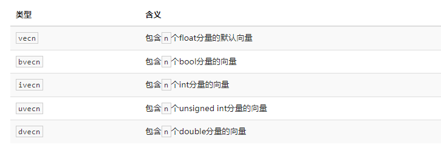

- 可通过`.xyzw`，`.rgba`，`stpq`访问分量

- 向量重组的语法：

  ```glsl
  vec2 someVec;
  vec4 differentVec = someVec.xyxx;
  vec3 anotherVec = differentVec.zyw;
  vec4 otherVec = someVec.xxxx + anotherVec.yxzy;
  
  // 以及构造函数的参数
  vec2 vect = vec2(0.5, 0.7);
  vec4 result = vec4(vect, 0.0, 0.0);
  vec4 otherResult = vec4(result.xyz, 1.0);
  ```


#### 输入与输出

- 着色器之间是各自独立的程序
- 但是为了完成同一个整体目标，需要通过`输入输出`来彼此进行数据交流和传递
- 使用关键字 in out 设定输入和输出，只要一个输出变量与下一个着色器阶段的输入匹配，它就会传递下去。


**在顶点和片段着色器中会有点不同**：

- 顶点着色器 ——— 接收的是一种特殊形式的输入
  - 从顶点数据中直接接收输入
  - 使用`location`这一元数据指定输入变量的位置，对应我们在CPU上配置的顶点属性
  - `layout (location = 0)`：为顶点着色器的输入提供一个额外的`layout`标识，把它链接到顶点数据
- 片段着色器 ———— 需要一个`vec4`颜色输出变量
  - 需要生成一个最终输出的颜色（否则默认输出黑/白）


**定义输入与输出**

- 如果我们打算从一个着色器向另一个着色器发送数据，我们必须在发送方着色器中声明一个输出，在接收方着色器中声明一个类似的输入
- **当类型和名字都一样**的时候，OpenGL就会把两个变量链接到一起，它们之间就能发送数据了（这是在链接着色器程序对象时完成的）

- 新的顶点着色器

  ```glsl
  #version 330 core
  layout (location = 0) in vec3 aPos; // 位置变量的属性位置值为0
  
  out vec4 vertexColor; // 为片段着色器指定一个颜色输出
  
  void main()
  {
      gl_Position = vec4(aPos, 1.0); // 注意我们如何把一个vec3作为vec4的构造器的参数
      vertexColor = vec4(0.5, 0.0, 0.0, 1.0); // 把输出变量设置为暗红色
  }
  ```

- 新的片段着色器

  ```glsl
  #version 330 core
  out vec4 FragColor;
  
  in vec4 vertexColor; // 从顶点着色器传来的输入变量（名称相同、类型相同）
  
  void main()
  {
      FragColor = vertexColor;
  }
  ```

  


#### Uniform

用于从CPU中的应用向GPU中的着色器发送数据的方式

但uniform和顶点属性有些不同

- uniform是全局的(Global)

  - 必须在每个·着色器程序对象·中都是独一无二的
  - 可以被着色器程序的任意着色器在任意阶段访问
  - uniform会一直保存它们的数据，直到它们被重置或更新

- 在着色器代码中声明

  - `uniform vec4 ourColor; // 在OpenGL程序代码中设定这个变量`
  - 声明之后，如果该uniform变量不被使用，编译器会默认移除这个变量。这可能会导致一些问题

- 在应用代码中设置数据

  - 首先需要找到着色器程序中对应uniform属性的索引/位置值：`glGetUniformLocation`

  - 设置数据：`glUniform4`

  - 案例：随时间改变颜色数值

    ```glsl
    float timeValue = glfwGetTime();
    float greenValue = (sin(timeValue) / 2.0f) + 0.5f;
    int vertexColorLocation = glGetUniformLocation(shaderProgram, "ourColor");
    glUseProgram(shaderProgram);
    glUniform4f(vertexColorLocation, 0.0f, greenValue, 0.0f, 1.0f);
    ```

  - 查询uniform地址不要求你之前使用过着色器程序，但是更新一个uniform之前你**必须**先使用程序（调用glUseProgram)，因为它是在当前激活的着色器程序中设置uniform的。

- ```c
  // 变色示例中的渲染循环
  
  while(!glfwWindowShouldClose(window))
  {
      // 输入
      processInput(window);
  
      // 渲染
      // 清除颜色缓冲
      glClearColor(0.2f, 0.3f, 0.3f, 1.0f);
      glClear(GL_COLOR_BUFFER_BIT);
  
      // 记得激活着色器
      glUseProgram(shaderProgram);
  
      // 更新uniform颜色
      float timeValue = glfwGetTime();
      float greenValue = sin(timeValue) / 2.0f + 0.5f;
      int vertexColorLocation = glGetUniformLocation(shaderProgram, "ourColor");
      glUniform4f(vertexColorLocation, 0.0f, greenValue, 0.0f, 1.0f);
  
      // 绘制三角形
      glBindVertexArray(VAO);
      glDrawArrays(GL_TRIANGLES, 0, 3);
  
      // 交换缓冲并查询IO事件
      glfwSwapBuffers(window);
      glfwPollEvents();
  }
  ```


>OpenGL不支持函数重载（C语言库），对应的有多种函数后缀
>
>- 每当你打算配置一个OpenGL的选项时就可以简单地根据这些规则选择适合你的数据类型的重载函数。
>
>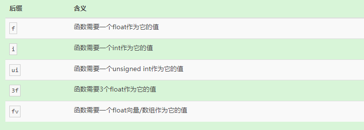


### 为顶点设置更多属性

之前的顶点属性只有位置

在前面的教程中，我们了解了：

- 如何填充VBO（设置顶点缓冲区对象，把内存中的顶点数据映射到GPU显存）
- 配置顶点属性指针（指定顶点数据中的顶点属性信息）
- 如何把它们都储存到一个VAO里（顶点属性指针和VBO的关联可以存放到VAO里，以便于重复利用）


#### 案例

- 顶点数据：

  ```c
  float vertices[] = {
      // 位置              // 颜色
       0.5f, -0.5f, 0.0f,  1.0f, 0.0f, 0.0f,   // 右下
      -0.5f, -0.5f, 0.0f,  0.0f, 1.0f, 0.0f,   // 左下
       0.0f,  0.5f, 0.0f,  0.0f, 0.0f, 1.0f    // 顶部
  };
  ```

- 顶点着色器：新增一个 in 颜色属性，指定location 为 1

  ```glsl
  #version 330 core
  layout (location = 0) in vec3 aPos;   // 位置变量的属性位置值为 0 
  layout (location = 1) in vec3 aColor; // 颜色变量的属性位置值为 1
  
  out vec3 ourColor; // 向片段着色器输出一个颜色
  
  void main()
  {
      gl_Position = vec4(aPos, 1.0);
      ourColor = aColor; // 将ourColor设置为我们从顶点数据那里得到的输入颜色
  }
  ```

- 片段着色器：

  ```glsl
  #version 330 core
  out vec4 FragColor;  
  in vec3 ourColor;
  
  void main()
  {
      FragColor = vec4(ourColor, 1.0);
  }
  ```

- 配置顶点属性指针：

  - 目标
    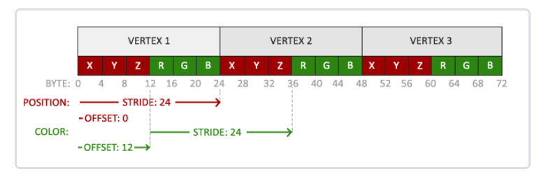

  - ```c
    // 位置属性
    glVertexAttribPointer(0, 3, GL_FLOAT, GL_FALSE, 6 * sizeof(float), (void*)0);
    glEnableVertexAttribArray(0);
    
    // 颜色属性
    glVertexAttribPointer(1, 3, GL_FLOAT, GL_FALSE, 6 * sizeof(float), (void*)(3* sizeof(float)));
    glEnableVertexAttribArray(1);
    
    glVertexAttribPointer:
    - 第一个参数指定我们要配置的顶点属性的位置值（对应顶点着色器中in属性的location）
    - 第二个参数指定顶点属性的大小
    - 第三个参数指定数据的类型
    - 第四个参数定义我们是否希望数据被标准化(Normalize)
    - 第五个参数叫做步长(Stride)，它告诉我们在连续的顶点属性组之间的间隔
    - 最后一个参数的类型是`void*`，所以需要我们进行这个奇怪的强制类型转换。它表示位置数据在缓冲中起始位置的偏移量(Offset)。
    ```


### 着色器管理

编写、编译、管理着色器是件麻烦事。

可以封装一个着色器类：

- 从硬盘读取着色器，然后编译并链接成着色器程序，并对它们进行错误检测
- 激活着色器程序操作
- uniform变量设置操作

详细代码见[着色器 - LearnOpenGL CN (learnopengl-cn.github.io)](https://learnopengl-cn.github.io/01 Getting started/05 Shaders/)


## 二、纹理

纹理是一个2D图片（甚至也有1D和3D的纹理），它可以用来添加物体的细节。

除了图像以外，纹理也可以被用来储存大量的数据，这些数据可以发送到着色器上。

### 相关概念

#### 纹理映射(Map)

- 三角形的每个顶点各自关联着一个纹理坐标(Texture Coordinate)，标明该从纹理图像的哪个部分采样
- 非顶点的片段通过片段插值(Fragment Interpolation)，获取纹理坐标的插值结果，再从纹理上采样对应的数值


#### 纹理坐标

- （2D纹理图像）纹理坐标在x和y轴上，范围为0到1之间。又称uv坐标
- 使用纹理坐标获取纹理颜色叫做采样(Sampling)
- 顶点的纹理坐标一般是先确定好的，需要从应用中传递给顶点着色器。顶点着色器再传递给片段着色器进行插值计算。
  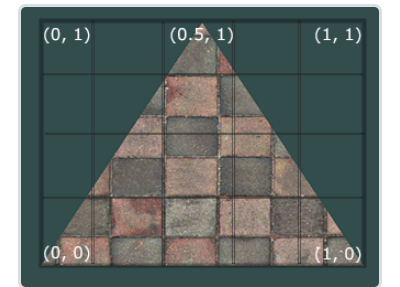


### 纹理环绕方式

纹理坐标值的范围为（0，0）到（1，1）

讨论坐标值在这个范围之外的情况：

- OpenGL默认的行为是重复这个纹理图像（忽略浮点数的整数部分）

- 不同的重复方式：
  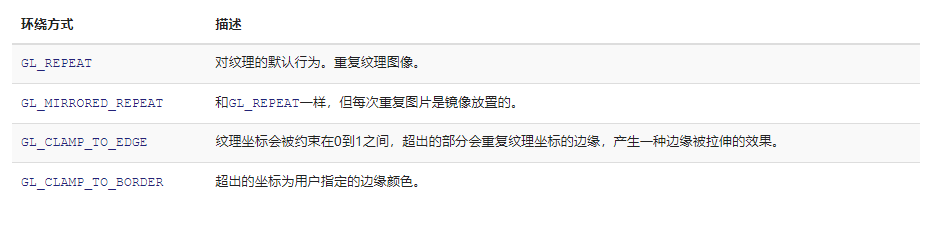

   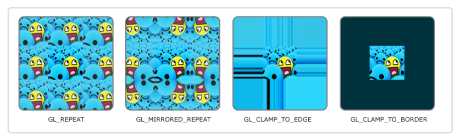

- 设置方法：`glTexParameter*`函数

  ```c
  // 分别对 S,T(,R) 方向（和xyz等价）设置GL_MIRRORED_REPEAT
  glTexParameteri(GL_TEXTURE_2D, GL_TEXTURE_WRAP_S, GL_MIRRORED_REPEAT);
  glTexParameteri(GL_TEXTURE_2D, GL_TEXTURE_WRAP_T, GL_MIRRORED_REPEAT);
  
  或者是
      
  // 设置 GL_CLAMP_TO_BORDER
  float borderColor[] = { 1.0f, 1.0f, 0.0f, 1.0f };
  glTexParameterfv(GL_TEXTURE_2D, GL_TEXTURE_BORDER_COLOR, borderColor);
  ```

  

### 纹理过滤

纹理坐标的基于浮点值，精细度是无限的。

而纹理图片是由有限的像素组成的，是具有有限分辨率的。

考虑一个问题：

- OpenGL需要知道怎样将纹理像素(Texture Pixel，也叫Texel)映射到纹理坐标。
- 即纹理坐标(u,v)，其对应的纹理像素应该是哪个/些，颜色值应该是多少


OpenGL的两种纹理过滤方式

#### GL_NEAREST 临近过滤

- OpenGL默认的纹理过滤方式
- 选择中心点最接近纹理坐标的那个像素
-  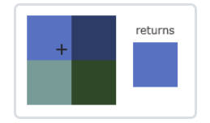

#### GL_LINEAR 线性过滤

- 基于纹理坐标附近的纹理像素，计算出一个插值，近似出这些纹理像素之间的颜色
- 距离越近权值越大
-  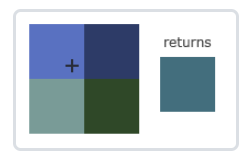


**设置**

- 可以设置纹理在放大(Magnify)和缩小(Minify)情况下的纹理过滤选项

- ```c
  // 在纹理被缩小的时候使用邻近过滤，被放大时使用线性过滤。
  
  glTexParameteri(GL_TEXTURE_2D, GL_TEXTURE_MIN_FILTER, GL_NEAREST);
  glTexParameteri(GL_TEXTURE_2D, GL_TEXTURE_MAG_FILTER, GL_LINEAR);
  ```

-  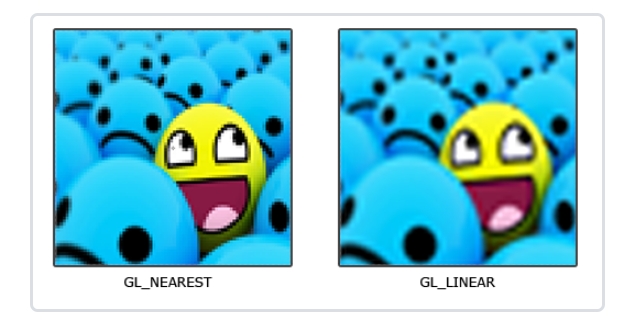


> 纹理分辨率相对太小的情况 (上面文章中的情况)
>
> - 对应纹理放大情况(Magnify)
> - 一个片段的纹理坐标，只能对应到一个纹理像素的内部。或者说一个纹理像素，可能对应着多个片段。
> - 解决：
>   - 临近
>   - 线性（双线性插值）
>   - bicubic
>
> 
>
> 纹理分辨率相对太大的情况：（下面文章中的情况）
>
> - 对应纹理缩小情况(Minify)
> - 纹理像素和片段几乎一一对应，但是临近的两个片段对应的两个纹理像素中间的那些纹理是没有被任何片段对应到的。
> - 解决：
>   - 超采样
>   - 范围查询
>   - mipmap
>   - 三线性插值
>   - 各向异性过滤


### 多级渐远纹理 Mipmap

有些物体会很远，但其纹理会拥有与近处物体同样高的分辨率。

由于远处的物体可能只产生很少的片段，OpenGL从高分辨率纹理中为这些片段获取正确的颜色值就很困难，因为它需要对一个跨过纹理很大部分的片段只拾取一个纹理颜色。

在小物体上这会产生不真实的感觉，更不用说对它们使用高分辨率纹理浪费内存的问题了。


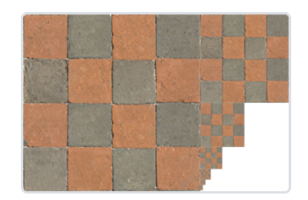


**理念**：距观察者的距离超过一定的阈值，OpenGL会使用不同的多级渐远纹理，即最适合物体的距离的那个。


#### 使用方法

- glGenerateMipmaps，在创建完一个纹理后调用它OpenGL就会承担接下来的所有工作了。

- 不同级别的渐远纹理之间的过渡

  - 跨级的时候纹理会由生硬的边界

  - 可以采样临近过滤或线性过滤来处理

  -  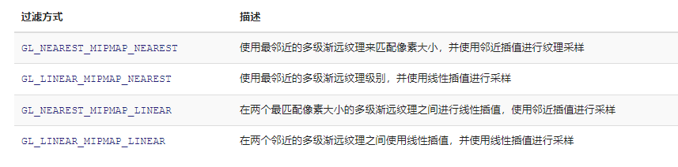

  - ```
    glTexParameteri(GL_TEXTURE_2D, GL_TEXTURE_MIN_FILTER, GL_LINEAR_MIPMAP_LINEAR);
    glTexParameteri(GL_TEXTURE_2D, GL_TEXTURE_MAG_FILTER, GL_LINEAR);
    ```


### 实操：加载和创建纹理

#### 加载纹理

- 纹理的格式：png，jpg，tga等

- 加载纹理的库：stb_image.h

- 加载木箱图片：

  ```c
  int width, height, nrChannels;
  unsigned char *data = stbi_load("container.jpg", &width, &height, &nrChannels, 0);
  
  // 纹理图像的宽度、高度和颜色通道的个数
  ```

- 释放内存：

  ```c
  stbi_image_free(data);
  ```

  

#### 生成纹理

- opengl中对纹理对象也是用一个id引用

- 生成和绑定纹理对象：

  ```c
  unsigned int texture;
  // 生成纹理的数量 1
  glGenTextures(1, &texture);
  // 绑定纹理对象
  glBindTexture(GL_TEXTURE_2D, texture);
  ```

- 为纹理对象附加上纹理图像：

  ```c
  // 附加纹理图像数据，指定多级渐远纹理为基本级别
  glTexImage2D(GL_TEXTURE_2D, 0, GL_RGB, width, height, 0, GL_RGB, GL_UNSIGNED_BYTE, data);
  // 生成所有需要的多级渐远纹理
  glGenerateMipmap(GL_TEXTURE_2D);
  ```

  - glTexImage2D函数
    - 第一个参数指定了纹理目标(Target)
    - 第二个参数为纹理指定多级渐远纹理的级别，0为基本级别
    - 第三个参数告诉OpenGL我们希望把纹理储存为何种格式
    - 第四个和第五个参数设置最终的纹理的宽度和高度
    - 第六个参数设为0就行
    - 第七第八个参数定义了源图的格式和数据类型
    - 第九个参数是是真正的图像数据


#### 大致使用过程

```c
unsigned int texture;
glGenTextures(1, &texture);
glBindTexture(GL_TEXTURE_2D, texture);
// 为当前绑定的纹理对象设置环绕、过滤方式
glTexParameteri(GL_TEXTURE_2D, GL_TEXTURE_WRAP_S, GL_REPEAT);   
glTexParameteri(GL_TEXTURE_2D, GL_TEXTURE_WRAP_T, GL_REPEAT);
glTexParameteri(GL_TEXTURE_2D, GL_TEXTURE_MIN_FILTER, GL_LINEAR);
glTexParameteri(GL_TEXTURE_2D, GL_TEXTURE_MAG_FILTER, GL_LINEAR);
// 加载并生成纹理
int width, height, nrChannels;
unsigned char *data = stbi_load("container.jpg", &width, &height, &nrChannels, 0);
if (data)
{
    glTexImage2D(GL_TEXTURE_2D, 0, GL_RGB, width, height, 0, GL_RGB, GL_UNSIGNED_BYTE, data);
    glGenerateMipmap(GL_TEXTURE_2D);
}
else
{
    std::cout << "Failed to load texture" << std::endl;
}
stbi_image_free(data);
```


### 实操：应用纹理

更新顶点属性格式

-  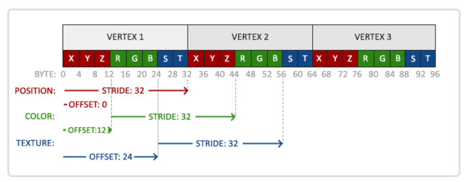

- ```c
      // 位置属性
      glVertexAttribPointer(0, 3, GL_FLOAT, GL_FALSE, 8 * sizeof(float), (void*)0);
      glEnableVertexAttribArray(0);
  
      // 颜色属性
      glVertexAttribPointer(1, 3, GL_FLOAT, GL_FALSE, 8 * sizeof(float), (void*)(3 * sizeof(float)));
      glEnableVertexAttribArray(1);
  
      // 纹理属性
      glVertexAttribPointer(2, 2, GL_FLOAT, GL_FALSE, 8 * sizeof(float), (void*)(6 * sizeof(float)));
      glEnableVertexAttribArray(2);
  ```

- 顶点着色器

  ```glsl
  #version 330 core
  layout (location = 0) in vec3 aPos;
  layout (location = 1) in vec3 aColor;
  layout (location = 2) in vec2 aTexCoord;
  
  out vec3 ourColor;
  out vec2 TexCoord;
  
  void main()
  {
      gl_Position = vec4(aPos, 1.0);
      ourColor = aColor;
      TexCoord = aTexCoord;
  }
  ```

- 片段着色器

  - 片段着色器可以访问纹理对象，通过`uniform sampler2D` 变，此外还有sampler1D、sampler3D
  - GLSL有一个供纹理对象使用的内建数据类型，叫做采样器(Sampler)，以纹理类型作为后缀(1D,2D,3D)
  - GLSL内建的`texture函数`：采样纹理的颜色
    - 第一个参数是纹理采样器sampler
    - 第二个参数是对应的纹理坐标

  ```glsl
  #version 330 core
  out vec4 FragColor;
  
  in vec3 ourColor;
  in vec2 TexCoord;
  
  uniform sampler2D ourTexture;
  
  void main()
  {
      FragColor = texture(ourTexture, TexCoord);
  }
  ```

- 应用层代码：

  ```c
      // 生成和绑定纹理对象
      unsigned int texture;
      glGenTextures(1, &texture);
      glBindTexture(GL_TEXTURE_2D, texture);
  
      // 载入纹理数据
      int width, height, nrChannels;
      unsigned char* data = stbi_load("resource/container.jpg", &width, &height, &nrChannels, 0);
      if (data)
      {
          // 将纹理数据加载到纹理对象
          glTexImage2D(GL_TEXTURE_2D, 0, GL_RGB, width, height, 0, GL_RGB, GL_UNSIGNED_BYTE, data);
          glGenerateMipmap(GL_TEXTURE_2D);
      }
      else
      {
          std::cout << "Failed to load texture" << std::endl;
      }
      stbi_image_free(data);
  
  
  	while(xxx) {
  		...
  
          glBindTexture(GL_TEXTURE_2D, texture);
          glBindVertexArray(VAO);
          glDrawElements(GL_TRIANGLES, 6, GL_UNSIGNED_INT, 0);
  
      	...
      }
      
  ```


### 纹理单元

- 使用`glUniform1i`为纹理采样器sampler分配一个位置值
- 为多个sampler分配多个位置值，我们能够在一个片段着色器中设置多个纹理
- 一个纹理的位置值通常称为一个纹理单元(Texture Unit)


使用：

- 首先激活纹理单元

  ```c
  glActiveTexture(GL_TEXTURE0); // 在绑定纹理之前先激活纹理单元
  
  glBindTexture(GL_TEXTURE_2D, texture); // glBindTexture函数调用会绑定这个纹理到当前激活的纹理单元
  ```

- 纹理单元GL_TEXTURE0默认总是被激活

>- OpenGL至少保证有16个纹理单元供你使用，也就是说你可以激活从GL_TEXTURE0到GL_TEXTRUE15。
>
>- 它们都是按顺序定义的，所以我们也可以通过GL_TEXTURE0 + 8的方式获得GL_TEXTURE8，这在当我们需要循环一些纹理单元的时候会很有用。

- 增加片段着色器中的纹理采样器

  - GLSL内建的mix函数：接受两个值作为参数，并对它们根据第三个参数进行线性插值

  ```glsl
  #version 330 core
  ...
  
  uniform sampler2D texture1;
  uniform sampler2D texture2;
  
  void main()
  {
      FragColor = mix(texture(texture1, TexCoord), texture(texture2, TexCoord), 0.2);
  }
  ```

- 更新用户层代码

  ```c
  // 激活两个纹理单元
  glActiveTexture(GL_TEXTURE0);
  glActiveTexture(GL_TEXTURE1);
  
  // 绑定两个纹理到对应的纹理单元
  glBindTexture(GL_TEXTURE_2D, texture1);
  glBindTexture(GL_TEXTURE_2D, texture2);
  
  // 然后定义哪个uniform采样器对应哪个纹理单元
  shader.use();
  shader.setInt("texture1", 0);
  shader.setInt("texture2", 1);
  
  while(...) {
      ...
      glBindVertexArray(VAO);
      glDrawElements(GL_TRIANGLES, 6, GL_UNSIGNED_INT, 0);
      ...
  }
  
  ```
  


> 注意：
>
> PNG的颜色通道为RGBA，JPG的颜色通道为RGB
>
> - 映射图片数据到纹理对象时注意
>
> ```c
> glBindTexture(GL_TEXTURE_2D, texture1);
> ...
> glTexImage2D(GL_TEXTURE_2D, 0, GL_RGB, width, height, 0, GL_RGB, GL_UNSIGNED_BYTE, data);
> 
> glBindTexture(GL_TEXTURE_2D, texture2);
> ...
>  glTexImage2D(GL_TEXTURE_2D, 0, GL_RGBA, width2, height2, 0, GL_RGBA, GL_UNSIGNED_BYTE, data2);
> ```


## 三、变换

改变顶点位置的两个思路：

- 一（改变输入）：在应用层改变传给OpenGL的顶点数据，以及重新绑定顶点相关对象。
  - 效率低
- 二（变换）：传入的顶点数据不变。在应用层计算变换矩阵，传给着色器。在着色器计算顶点的新位置。


### 向量

概念：

- 表示一个方向
- 包含：方向(Direction)和大小(Magnitude，也叫做强度或长度)

- 习惯上，在字母上面加一横表示向量
- 位置向量(Position Vector)：指定向量起点（一般是原点），则可以表示一个位置

运算：

- 与标量(Scalar)

  -  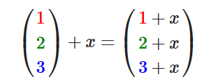

  - > 数学上是没有向量与标量相加这个运算的

- 取反(Negate)

- 加减

- 长度

- 标准化（得到单位向量，单位向量头上有一个^）

- 相乘：

  - 点乘
    -  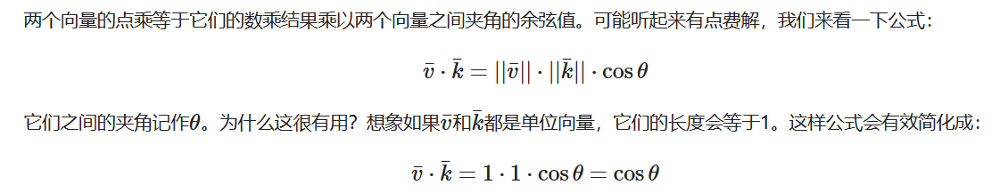
    -  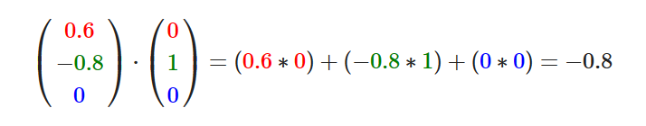
    - 求夹角余弦值
    - 判断正交、平行
  - 叉乘
    - 叉乘只在3D空间中有定义，它需要两个不平行向量作为输入，生成一个正交于两个输入向量的第三个向量。
    -  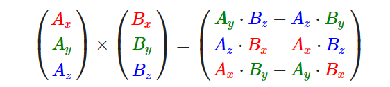
    - 已知两个轴，求3D坐标系中的第三个轴


### 矩阵

- 与标量的加减

  -  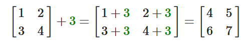

  - > 数学上是没有矩阵与标量相加减的运算的，但是很多线性代数的库都对它有支持

- 矩阵加减

  -  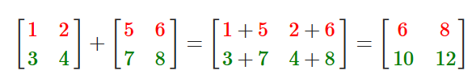

- 矩阵数乘

  -  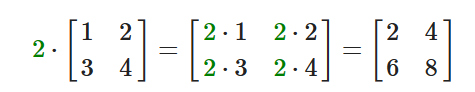

- 矩阵相乘

  -  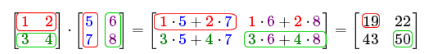
  - 只有当左侧矩阵的列数与右侧矩阵的行数相等，两个矩阵才能相乘。
  - 矩阵相乘不遵守交换律(Commutative)

- 单位矩阵

  -  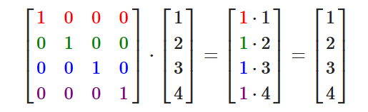

> 单位矩阵通常是生成其他变换矩阵的起点，如果我们深挖线性代数，这还是一个对证明定理、解线性方程非常有用的矩阵。


### 在变换中的应用

- 向量可以拿来表示位置，方向，颜色，甚至是纹理坐标。

- 正巧，很多有趣的2D/3D变换都可以放在一个矩阵中。

- 用这个矩阵乘以我们的向量将**变换**(Transform)这个向量。


#### 缩放

分为

- 不均匀(Non-uniform)缩放
- 均匀缩放(Uniform Scale)

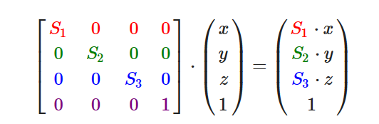


#### 位移

位移(Translation)是在原始向量的基础上加上另一个向量从而获得一个在不同位置的新向量的过程。

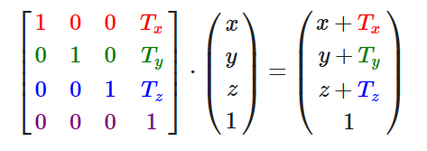


> **齐次坐标(Homogeneous Coordinates)**
>
> 向量的w分量也叫齐次坐标。想要从齐次向量得到3D向量，我们可以把x、y和z坐标分别除以w坐标。我们通常不会注意这个问题，因为w分量通常是1.0。
>
> 使用齐次坐标有几点好处：它允许我们在3D向量上进行位移（如果没有w分量我们是不能位移向量的），而且下一章我们会用w值创建3D视觉效果。
>
> 如果一个向量的齐次坐标是0，这个坐标就是方向向量(Direction Vector)，因为w坐标是0，这个向量就不能位移（译注：这也就是我们说的不能位移一个方向）。
>
> 齐次坐标非0的是位置向量。


#### 旋转

- 度量：角度制（180）或弧度制（PI）
- 在3D空间中旋转需要定义一个角**和**一个旋转轴(Rotation Axis)
  - 沿坐标轴旋转
    -  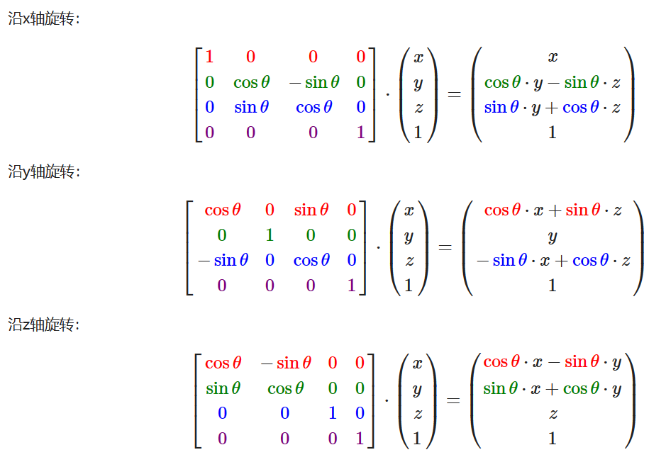
    - 可以组合几次沿坐标轴的旋转
    - 但是会出现`万向节死锁`
  - 沿任意轴旋转
    - （Rx，Ry，Rz）表示旋转轴
    -  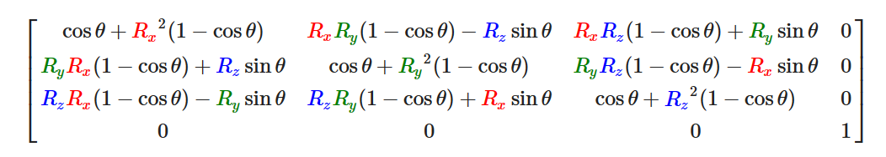
    - 仍存在万向节死锁

> 上面都是基于`欧拉角`的旋转，存在万向节死锁的问题。
>
> 还有一种方案是基于 `四元数` 。


#### 矩阵组合

- 注意矩阵乘法是没有交换率的，即变换的结果跟变换的顺序是有关的。
- 建议：先进行缩放操作，然后是旋转，最后才是位移，否则它们会（消极地）互相影响

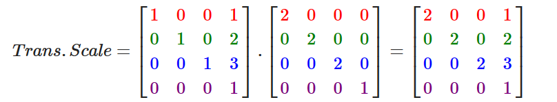


### 实践

#### 库

- 数学库：GLM

>GLM 0.9.9之后的版本中，矩阵的默认初始化为零矩阵，而非之前的单位矩阵。
>
>使用`glm::mat4 mat = glm::mat4(1.0f)`可以初始化单位矩阵。


- 用到的头文件

```c
#include <glm/glm.hpp>
#include <glm/gtc/matrix_transform.hpp>
#include <glm/gtc/type_ptr.hpp>
```


#### 矩阵构造

- 案例一：构造一个位移矩阵，并应用到一个向量上

  ```c
  glm::vec4 vec(1.0f, 0.0f, 0.0f, 1.0f);
  // 译注：下面就是矩阵初始化的一个例子，如果使用的是0.9.9及以上版本
  // 下面这行代码就需要改为:
  // glm::mat4 trans = glm::mat4(1.0f)
  // 之后将不再进行提示
  glm::mat4 trans;
  trans = glm::translate(trans, glm::vec3(1.0f, 1.0f, 0.0f));
  vec = trans * vec;
  std::cout << vec.x << vec.y << vec.z << std::endl;
  ```

- 案例二：构造一个先缩放后旋转的变换矩阵

  ```c
  glm::mat4 trans;
  trans = glm::rotate(trans, glm::radians(90.0f), glm::vec3(0.0, 0.0, 1.0));
  trans = glm::scale(trans, glm::vec3(0.5, 0.5, 0.5));
  
  // 首先，我们把箱子在每个轴都缩放到0.5倍，然后沿z轴旋转90度。GLM希望它的角度是弧度制的(Radian)，所以我们使用glm::radians将角度转化为弧度。
  ```

  

#### 将矩阵传递给着色器

顶点着色器

- glsl中的 mat4 类型

- uniform 变量

- ```glsl
  #version 330 core
  layout (location = 0) in vec3 aPos;
  layout (location = 1) in vec2 aTexCoord;
  
  out vec2 TexCoord;
  
  uniform mat4 transform;
  
  void main()
  {
      gl_Position = transform * vec4(aPos, 1.0f);
      TexCoord = vec2(aTexCoord.x, 1.0 - aTexCoord.y);
  }
  ```


传入着色器程序对象

- ```c
  unsigned int transformLoc = glGetUniformLocation(ourShader.ID, "transform");
  glUniformMatrix4fv(transformLoc, 1, GL_FALSE, glm::value_ptr(trans));
  ```

- 我们首先查询uniform变量的地址，然后用有`Matrix4fv`后缀的glUniform函数把矩阵数据发送给着色器。第一个参数你现在应该很熟悉了，它是uniform的位置值。第二个参数告诉OpenGL我们将要发送多少个矩阵，这里是1。第三个参数询问我们是否希望对我们的矩阵进行转置(Transpose)，也就是说交换我们矩阵的行和列。OpenGL开发者通常使用一种内部矩阵布局，叫做列主序(Column-major Ordering)布局。GLM的默认布局就是列主序，所以并不需要转置矩阵，我们填`GL_FALSE`。最后一个参数是真正的矩阵数据，但是GLM并不是把它们的矩阵储存为OpenGL所希望接受的那种，因此我们要先用GLM的自带的函数value_ptr来变换这些数据。


## 四、坐标系统

### 概述

#### 坐标空间

OpenGL希望在每次顶点着色器运行后，我们可见的所有顶点都为`标准化设备坐标`(Normalized Device Coordinate, NDC)。

- 即顶点着色器输出的`gl_position`是在`标准化设备坐标系`下的坐标
- 每个顶点的**x**，**y**，**z**坐标都应该在**-1.0**到**1.0**之间，超出这个坐标范围的顶点都将不可见


我们通常会自己设定一个坐标的范围，之后再在顶点着色器中将这些坐标变换为标准化设备坐标。

然后将这些标准化设备坐标传入光栅器(Rasterizer)，将它们变换为屏幕上的二维坐标或像素。

- 在顶点从初始坐标系转化到最终的屏幕坐标的过程中，会有经过多种坐标系的过渡转换。
- 原因是：在特定的坐标系统中，一些操作或运算更加方便和容易
  - 例如，当需要对物体进行修改的时候，在局部空间中来操作会更说得通；如果要对一个物体做出一个相对于其它物体位置的操作时，在世界坐标系中来做这个才更说得通，等等。
- 比较重要的5个不同的坐标系：
  - **局部空间**(Local Space，或者称为物体空间(Object Space))
  - **世界空间**(World Space)
  - **观察空间**(View Space，或者称为视觉空间(Eye Space))
  - **裁剪空间**(Clip Space)
  - **屏幕空间**(Screen Space)


#### 坐标空间变换

将坐标从一个坐标系变换到另一个坐标系

- 重要的变换矩阵：模型(Model)、观察(View)、投影(Projection)三个矩阵
- 顶点坐标起始于局部空间(Local Space)，在这里它称为局部坐标(Local Coordinate)，之后会变为世界坐标(World Coordinate)，观察坐标(View Coordinate)，裁剪坐标(Clip Coordinate)，并最后以屏幕坐标(Screen Coordinate)的形式结束。

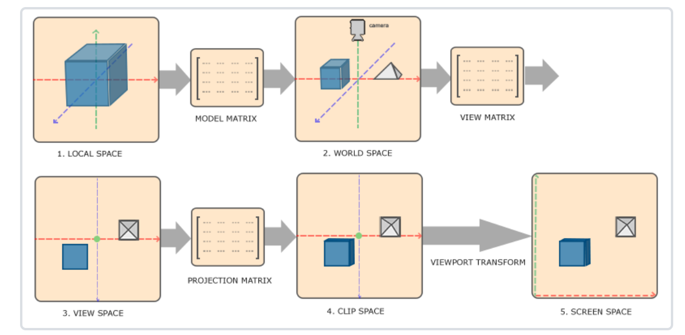


### 局部空间

指物体所在的坐标空间，物体有自己的一个原点位置。

物体/模型的所有顶点的位置是相对于模型自身的局部空间的原点来说的。

### 世界空间

容纳多个物体的世界，采用一个共同的原点和一套坐标轴。

物体在世界空间中的坐标即物体相对于世界原点的坐标。

> 物体的顶点的坐标从局部空间到世界空间的转换 —— 模型转换
>
> - 用到的变换矩阵称为 模型矩阵
> - 包含 缩放、旋转、位移 操作
>
> 通过物体的局部坐标系和世界坐标系的相对关系来求。


### 观察空间

基于眼睛或摄像机的空间，即以摄像机的位置为原点，基于摄像机的朝向建立坐标轴的空间。

> 物体的顶点的坐标从世界空间到相机空间的转换 —— 观察转换
>
> - 用到的变换矩阵称为 观察矩阵
> - 包含 旋转、位移 操作
>
> 摄像机在世界空间中会有一个位置，根据世界坐标系和相机坐标系的相对关系来建立变换矩阵 —— 观察矩阵


### 裁剪空间

在一个顶点着色器运行的最后，OpenGL期望所有的坐标都能落在一个特定的范围内，且任何在这个范围之外的点都应该被裁剪掉(Clipped)。


- 从观察空间（特定范围内）变换到裁剪空间，称为 投影变换；

- 用到的变换矩阵称为 投影矩阵；
- 从观察空间的某个坐标范围内，变换到（-1，1）的范围，范围外的坐标会被裁剪掉。
- 变换到裁剪空间之后，顶点着色器最后会自动进行 `透视除法`
  - 在这个过程中我们将位置向量的x，y，z分量分别除以向量的齐次w分量
  - 将4D裁剪空间坐标变换为3D标准化设备坐标

>如果只是图元(Primitive)(例如三角形)的一部分超出了裁剪体积(Clipping Volume)，则OpenGL会重新构建这个三角形为一个或多个三角形让其能够适合这个裁剪范围。


投影变换是如何进行的？

- 需要先定义观察范围，即摄像机的观察范围，又称为`观察箱`或`平戳头体 Frustum`
- 两种平戳头体：
  - 正交
  - 透视
- 对应的，有两种投影矩阵需要计算


#### 正射/正交投影

- 正射投影矩阵定义了一个类似立方体的平截头箱，它定义了一个裁剪空间，在这空间之外的顶点都会被裁剪掉。
- 需要指定可见平截头体的`宽、高和近(Near)平面和远(Far)平面`

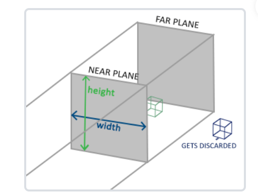

- 任何出现在近平面之前或远平面之后的坐标都会被裁剪掉
- 正射平截头体直接将平截头体内部的所有坐标映射为标准化设备坐标，因为每个向量的w分量都没有进行改变
- 如果w分量等于1.0，透视除法则不会改变这个坐标。


使用glm库创建正射投影矩阵

- 这个投影矩阵会将处于这些x，y，z值范围内的坐标变换为标准化设备坐标。

```c
glm::ortho(0.0f, 800.0f, 0.0f, 600.0f, 0.1f, 100.0f);
// 前两个参数指定了平截头体的左右坐标，第三和第四参数指定了平截头体的底部和顶部。
// 第五和第六个参数则定义了近平面和远平面的距离。
```


#### 透视投影

近大远小


- 透视投影矩阵除了将给定的平截头体范围映射到裁剪空间，还修改了每个顶点坐标的w值，从而使得离观察者越远的顶点坐标w分量越大。

- 被变换到裁剪空间的坐标都会在-w到w的范围之间（任何大于这个范围的坐标都会被裁剪掉）。


在变换到裁剪空间后，需要进行透视除法，以便能够得到最后的归一化设备坐标

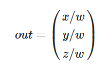

顶点坐标的每个分量都会除以它的w分量，距离观察者越远顶点坐标就会越小。

这是也是w分量非常重要的另一个原因，它能够帮助我们进行透视投影。


在GLM中创建透视投影矩阵：

```c
glm::mat4 proj = glm::perspective(glm::radians(45.0f), (float)width/(float)height, 0.1f, 100.0f);
```

透视平戳头体的定义：

- 视角 FOV
- 宽高比
- 远/近平面与摄像机的距离

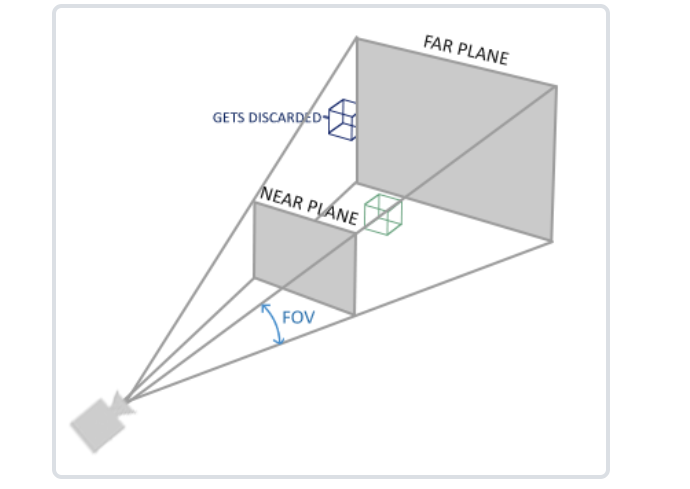


> 正射投影主要用于二维渲染以及一些建筑或工程的程序，在这些场景中我们更希望顶点不会被透视所干扰。
>
> 某些如 *Blender* 等进行三维建模的软件有时在建模时也会使用正射投影，因为它在各个维度下都更准确地描绘了每个物体。
>
> 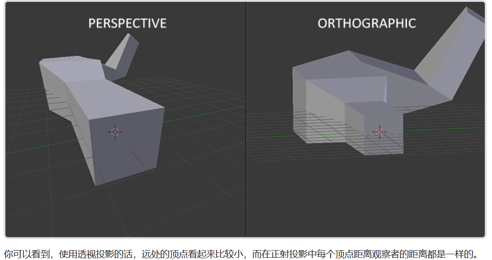


### 屏幕空间

前面的空间变换，组合起来就是：

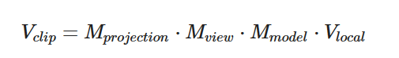


此时得到的是裁剪空间下的坐标（即在顶点着色器中传给gl_position的坐标）

- OpenGL会自己进行透视除法和裁剪
- 最后就得到了标准化设备坐标。


#### 视口变换

- 标准化设备坐标 到 屏幕坐标

有了屏幕大小信息，就可以将标准化设备坐标映射到屏幕坐标，与屏幕的一个像素一一对应。


### 实操一

目标效果

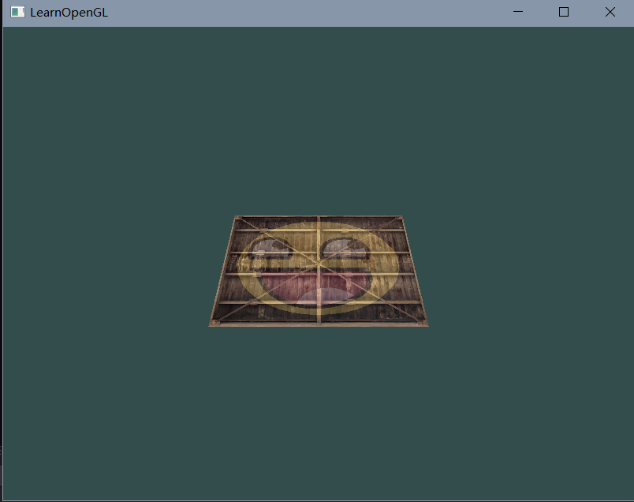


- 首先，顶点的模型坐标就是最初的顶点位置信息

- 然后，定义模型在世界中的坐标/旋转/缩放

  - 构建 模型矩阵 （需要自己计算）

    - 假设：该模型是在世界空间中原点的位置，并绕x轴旋转一定度数

    - ```c
      glm::mat4 model;
      model = glm::rotate(model, glm::radians(-55.0f), glm::vec3(1.0f, 0.0f, 0.0f));
      ```

- 然后，定义摄像机的位置和朝向

  - 构建观察矩阵 （同样需要自己计算）

    - 摄像机一开始在世界空间的原点处

      - 那么将摄像机移动到世界空间中的指定位置，相当于反过来将其他物体的按相反的方式移动。
      - 透视矩阵做的就是，按这个相反的操作移动整个场景

    - 假设：摄像机在z轴正向上的某个位置

    - ```c
      glm::mat4 view;
      // 注意，我们将矩阵向我们要进行移动场景的反方向移动。
      view = glm::translate(view, glm::vec3(0.0f, 0.0f, -3.0f));
      ```

- 然后，确定投影类型

  - 计算投影矩阵（正交和透视两种，确定平戳头体的参数即可）

  - 以透视投影为例：

    - ```c
      glm::mat4 projection;
      projection = glm::perspective(glm::radians(45.0f), screenWidth / screenHeight, 0.1f, 100.0f);
      ```

- 将所有变换矩阵传给顶点着色器

  - ```glsl
    #version 330 core
    layout (location = 0) in vec3 aPos;
    ...
    uniform mat4 model;
    uniform mat4 view;
    uniform mat4 projection;
    
    void main()
    {
        // 注意乘法要从右向左读
        gl_Position = projection * view * model * vec4(aPos, 1.0);
        ...
    }
    ```

  - 传入变换矩阵（这通常在每次的渲染迭代中进行，因为变换矩阵会经常变动）

    ```c
    int modelLoc = glGetUniformLocation(ourShader.ID, "model"));
    glUniformMatrix4fv(modelLoc, 1, GL_FALSE, glm::value_ptr(model));
    ... // 观察矩阵和投影矩阵与之类似
    ```


>**右手坐标系(Right-handed System)**
>
>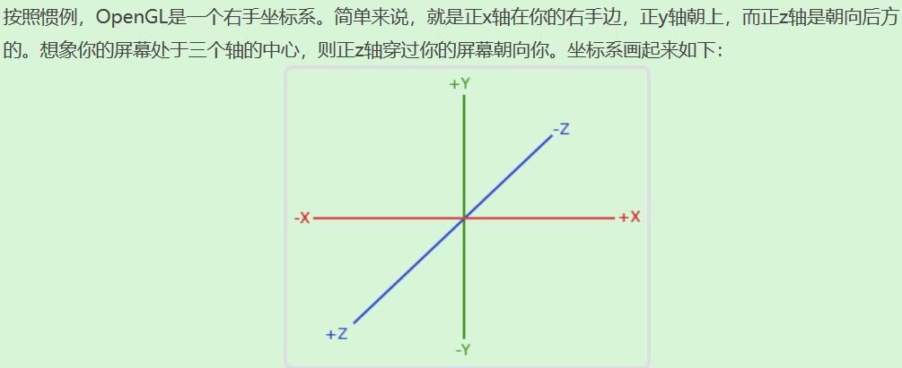
>
>- OpenGL使用的是右手系
>- DirectX使用的是左手系


### 实操二

渲染一个立方体

- 顶点属性

  - 不使用EBO/IBO了，直接使用VBO，即`glDrawArrays`
  - 移除了颜色属性，即仅剩位置属性和纹理坐标属性（需要更新`顶点属性指针`
  - 代码就不贴上来了

  ```c
  float vertices[] = {
      -0.5f, -0.5f, -0.5f,  0.0f, 0.0f,
       0.5f, -0.5f, -0.5f,  1.0f, 0.0f,
       0.5f,  0.5f, -0.5f,  1.0f, 1.0f,
       0.5f,  0.5f, -0.5f,  1.0f, 1.0f,
      -0.5f,  0.5f, -0.5f,  0.0f, 1.0f,
      -0.5f, -0.5f, -0.5f,  0.0f, 0.0f,
  
      -0.5f, -0.5f,  0.5f,  0.0f, 0.0f,
       0.5f, -0.5f,  0.5f,  1.0f, 0.0f,
       0.5f,  0.5f,  0.5f,  1.0f, 1.0f,
       0.5f,  0.5f,  0.5f,  1.0f, 1.0f,
      -0.5f,  0.5f,  0.5f,  0.0f, 1.0f,
      -0.5f, -0.5f,  0.5f,  0.0f, 0.0f,
  
      -0.5f,  0.5f,  0.5f,  1.0f, 0.0f,
      -0.5f,  0.5f, -0.5f,  1.0f, 1.0f,
      -0.5f, -0.5f, -0.5f,  0.0f, 1.0f,
      -0.5f, -0.5f, -0.5f,  0.0f, 1.0f,
      -0.5f, -0.5f,  0.5f,  0.0f, 0.0f,
      -0.5f,  0.5f,  0.5f,  1.0f, 0.0f,
  
       0.5f,  0.5f,  0.5f,  1.0f, 0.0f,
       0.5f,  0.5f, -0.5f,  1.0f, 1.0f,
       0.5f, -0.5f, -0.5f,  0.0f, 1.0f,
       0.5f, -0.5f, -0.5f,  0.0f, 1.0f,
       0.5f, -0.5f,  0.5f,  0.0f, 0.0f,
       0.5f,  0.5f,  0.5f,  1.0f, 0.0f,
  
      -0.5f, -0.5f, -0.5f,  0.0f, 1.0f,
       0.5f, -0.5f, -0.5f,  1.0f, 1.0f,
       0.5f, -0.5f,  0.5f,  1.0f, 0.0f,
       0.5f, -0.5f,  0.5f,  1.0f, 0.0f,
      -0.5f, -0.5f,  0.5f,  0.0f, 0.0f,
      -0.5f, -0.5f, -0.5f,  0.0f, 1.0f,
  
      -0.5f,  0.5f, -0.5f,  0.0f, 1.0f,
       0.5f,  0.5f, -0.5f,  1.0f, 1.0f,
       0.5f,  0.5f,  0.5f,  1.0f, 0.0f,
       0.5f,  0.5f,  0.5f,  1.0f, 0.0f,
      -0.5f,  0.5f,  0.5f,  0.0f, 0.0f,
      -0.5f,  0.5f, -0.5f,  0.0f, 1.0f
  };
  ```

- 效果（未做深度测试）
  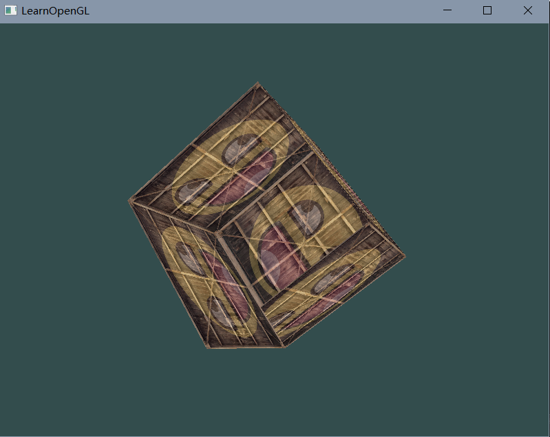


### 实操三

- 在二的基础上，加上深度测试，以显示正确的遮挡关系

- OpenGL会维护 Z-buffer 即深度缓冲，结合片段的深度值，在渲染时可以判断哪些片段应该被显示在前面。

- 深度值存储在每个片段里面（作为片段的**z**值），当片段想要输出它的颜色时，OpenGL会将它的深度值和z缓冲进行比较，如果当前的片段在其它片段之后，它将会被丢弃，否则将会覆盖。这个过程称为深度测试(Depth Testing)，它是由OpenGL自动完成的。

- 启用深度测试：

  - ```c
    glEnable(GL_DEPTH_TEST);
    ```

- 在每一帧开始时，清楚深度缓冲

  - ```c
    glClear(GL_COLOR_BUFFER_BIT | GL_DEPTH_BUFFER_BIT);
    ```

- 效果
  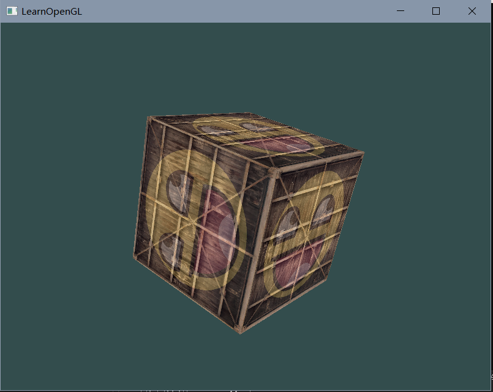


### 实操四

- 绘制更多立方体
- 区别在于它们在世界的位置及旋转角度不同。
- 当渲染更多物体的时候我们不需要改变我们的缓冲数组和属性数组，我们唯一需要做的只是改变每个对象的模型矩阵来将立方体变换到世界坐标系中。

代码：

- 各个物体的位置信息

  ```c
  glm::vec3 cubePositions[] = {
    glm::vec3( 0.0f,  0.0f,  0.0f), 
    glm::vec3( 2.0f,  5.0f, -15.0f), 
    glm::vec3(-1.5f, -2.2f, -2.5f),  
    glm::vec3(-3.8f, -2.0f, -12.3f),  
    glm::vec3( 2.4f, -0.4f, -3.5f),  
    glm::vec3(-1.7f,  3.0f, -7.5f),  
    glm::vec3( 1.3f, -2.0f, -2.5f),  
    glm::vec3( 1.5f,  2.0f, -2.5f), 
    glm::vec3( 1.5f,  0.2f, -1.5f), 
    glm::vec3(-1.3f,  1.0f, -1.5f)  
  };
  ```

- 在渲染循环中，通过改变变换矩阵来渲染同一个模型，以达到渲染多个物体的效果

  ```c
  glBindVertexArray(VAO);
  for(unsigned int i = 0; i < 10; i++)
  {
    glm::mat4 model;
    model = glm::translate(model, cubePositions[i]);
    float angle = 20.0f * i; 
    model = glm::rotate(model, glm::radians(angle), glm::vec3(1.0f, 0.3f, 0.5f));
    ourShader.setMat4("model", model);
  
    glDrawArrays(GL_TRIANGLES, 0, 36);
  }
  ```

- 效果
  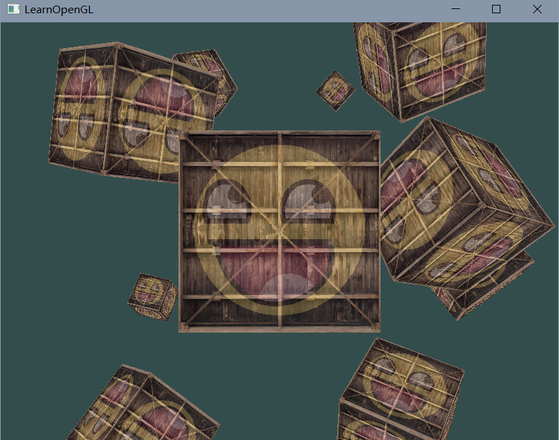


## 五、摄像机

OpenGL本身没有**摄像机**(Camera)的概念，但我们可以通过把场景中的所有物体往相反方向移动的方式来模拟出摄像机，产生一种**我们**在移动的感觉，而不是场景在移动。


### 相机/观察空间

以摄像机的视角作为场景原点时，场景中所有的顶点坐标：观察矩阵把所有的世界坐标变换为相对于摄像机位置与方向的观察坐标。

- 定义一个相机：（在世界空间中）

  - 位置坐标

    ```c
    glm::vec3 cameraPos = glm::vec3(0.0f, 0.0f, 3.0f);
    
    // 右手系中，z轴正方向 是从屏幕指向你的。
    
    ```

    

  - 观察方向（相机z轴）

    ```c
    glm::vec3 cameraTarget = glm::vec3(0.0f, 0.0f, 0.0f);
    glm::vec3 cameraDirection = glm::normalize(cameraPos - cameraTarget);
    
    // 通过两个位置向量相减得到，这里是看向原点。
    // 然而，用来表示相机观察方向的 "方向向量" 一般与相机实际观察方向相反。所以这里是用相机位置减去相机看向的目标。
    ```

    

  - 右侧方向（相机x轴）

    - 需要先定义一个 up 向量，表示世界空间中y轴的方向
    - 将 up向量 和 相机方向向量 进行叉乘，可得相机的右轴（叉乘顺序不能反了——右手螺旋）

    ```c
    glm::vec3 up = glm::vec3(0.0f, 1.0f, 0.0f); 
    glm::vec3 cameraRight = glm::normalize(glm::cross(up, cameraDirection));
    ```

    

  - 上方方向（相机y轴）

    ```c
    glm::vec3 cameraUp = glm::cross(cameraDirection, cameraRight);
    ```

    

- 基于相机上述信息，可以形成一个新的坐标系

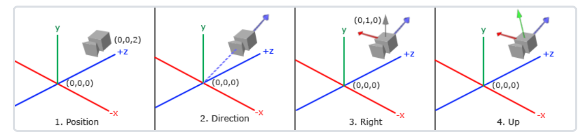


### Look At 矩阵

- 如果你使用3个相互垂直（或非线性）的轴定义了一个坐标空间，你可以用这3个轴外加一个平移向量（根据新坐标空间原点相对原坐标空间的位置）来创建一个矩阵

- 这个矩阵乘以任何向量，可以将其变换到新的坐标空间


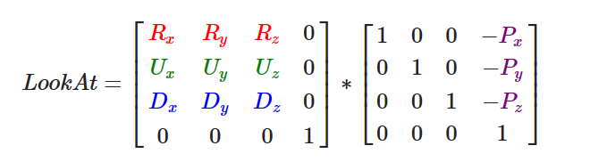

- 其中R是右向量，U是上向量，D是方向向量，P是摄像机位置向量。


把这个 LookAt矩阵 作为 观察矩阵 可以很高效地把所有世界坐标变换到刚刚定义的观察空间。

也即，对于某摄像机，观察变换使用的观察矩阵 就是该摄像机的 Look At 矩阵


在GLM中，可以直接定义LookAt矩阵:

- glm::LookAt函数需要一个相机位置、观察目标和上向量。

```c
glm::mat4 view;
view = glm::lookAt(glm::vec3(0.0f, 0.0f, 3.0f), 
           glm::vec3(0.0f, 0.0f, 0.0f), 
           glm::vec3(0.0f, 1.0f, 0.0f));
```


### 实操一

假设：观察目标保持为世界原点，而摄像机绕着原点在场景中旋转。

- 用sin,cos函数设置相机的x,z坐标即可，并使用LookAt矩阵作为观察矩阵

```c
float radius = 10.0f;
float camX = sin(glfwGetTime()) * radius;
float camZ = cos(glfwGetTime()) * radius;
glm::mat4 view;
view = glm::lookAt(glm::vec3(camX, 0.0, camZ), glm::vec3(0.0, 0.0, 0.0), glm::vec3(0.0, 1.0, 0.0)); 
```


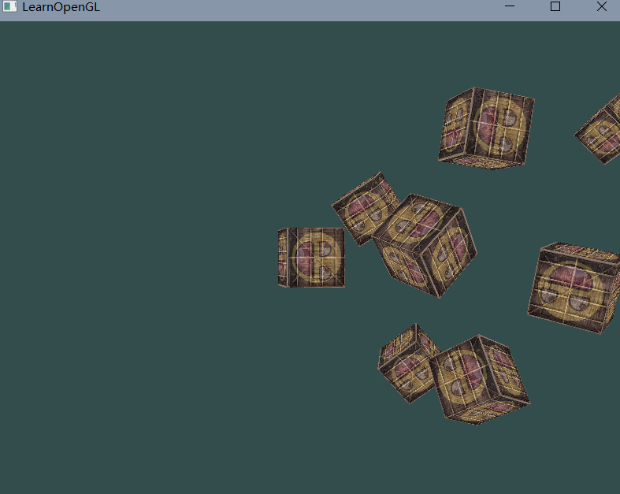


### 实操二

实现一个相机系统，由用户自主控制摄像机的位置、朝向、缩放

- 定义好相机的三个信息：

  - 位置
  - 方向向量
  - up向量

- ```c
  glm::vec3 cameraPos   = glm::vec3(0.0f, 0.0f,  3.0f);
  glm::vec3 cameraFront = glm::vec3(0.0f, 0.0f, -1.0f);
  glm::vec3 cameraUp    = glm::vec3(0.0f, 1.0f,  0.0f);
  ```

- 则LookAt函数的参数为

  ```c
  view = glm::lookAt(cameraPos, cameraPos + cameraFront, cameraUp);
  ```

#### 位置

- 根据键盘输入，修改`cameraPos`

- 由GLFW获取输入

- ```c
  void processInput(GLFWwindow *window)
  {
      ...
      float cameraSpeed = 0.05f; // adjust accordingly
      if (glfwGetKey(window, GLFW_KEY_W) == GLFW_PRESS)
          cameraPos += cameraSpeed * cameraFront;
      if (glfwGetKey(window, GLFW_KEY_S) == GLFW_PRESS)
          cameraPos -= cameraSpeed * cameraFront;
      if (glfwGetKey(window, GLFW_KEY_A) == GLFW_PRESS)
          cameraPos -= glm::normalize(glm::cross(cameraFront, cameraUp)) * cameraSpeed;
      if (glfwGetKey(window, GLFW_KEY_D) == GLFW_PRESS)
          cameraPos += glm::normalize(glm::cross(cameraFront, cameraUp)) * cameraSpeed;
  }
  ```

- 在封装类的时候，如果相机类的成员变量是glm库中的类型，需要注意拷贝数据的方式可能导致的问题。

- 平均速度

  - 渲染帧时间差 Deltatime，储存了渲染上一帧所用的时间
  - 固定速度 * Deltatime 的结果：可以使得在相同的时间内，不同机器上渲染帧数不同的情况下，保持相同的速率

#### 朝向

- 用鼠标控制朝向
  - 水平的移动影响偏航角，竖直的移动影响俯仰角。
  - 储存上一帧鼠标的位置，在当前帧中我们当前计算鼠标位置与上一帧的位置相差多少。
-  欧拉角
  - 俯仰角(Pitch)、偏航角(Yaw)和滚转角(Roll)
  -  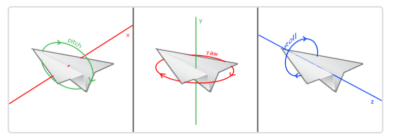

- 一般对于摄像机来说，只关心俯仰角和偏航角即可，滚筒角用不到

  - 对于给定的俯仰角和偏航角，我们需要计算出一个方向向量

  - 引用别人的图：

    - h为方向向量（长度为1），我们的目标是求这个方向向量的x,y,z分量

    - 如图可得：

      - y = sin(pitch)
      - x = cos(pitch) * cos(yaw)
      - z = cos(pitch) * sin(yaw)

      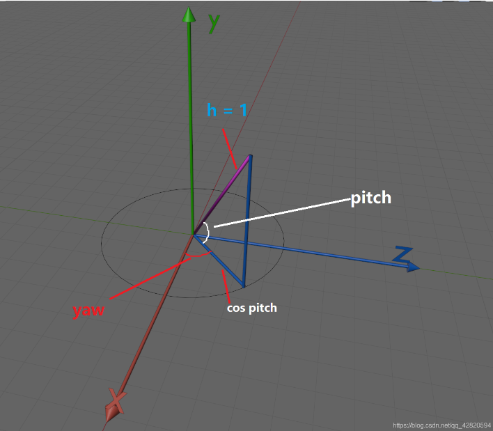

    - pitch，yaw 都初始化为0的话，则初始朝向 x轴 方向。

- 编程

  - FPS风格的鼠标输入和摄像机控制：
    1. 计算鼠标距上一帧的偏移量。
    2. 把偏移量添加到摄像机的俯仰角和偏航角中。
    3. 对偏航角和俯仰角进行最大和最小值的限制。
    4. 计算方向向量。

  - GLFW鼠标设置：隐藏光标，并捕捉(Capture)鼠标

    ```c
    glfwSetInputMode(window, GLFW_CURSOR, GLFW_CURSOR_DISABLED);
    ```

  - 监听鼠标移动事件，鼠标移动时，调用回调函数

    ```c
    // 监听
    glfwSetCursorPosCallback(window, mouse_callback);
    ```

    ```c
    void mouse_callback(GLFWwindow* window, double xpos, double ypos) {
     	if(firstMouse)
        {
            lastX = xpos;
            lastY = ypos;
            firstMouse = false;
        }
    
        float xoffset = xpos - lastX;
        float yoffset = lastY - ypos; 
        lastX = xpos;
        lastY = ypos;
    
        float sensitivity = 0.05;
        xoffset *= sensitivity;
        yoffset *= sensitivity;
    
        yaw   += xoffset;
        pitch += yoffset;
    
        if(pitch > 89.0f)
            pitch = 89.0f;
        if(pitch < -89.0f)
            pitch = -89.0f;
    
        glm::vec3 front;
        front.x = cos(glm::radians(yaw)) * cos(glm::radians(pitch));
        front.y = sin(glm::radians(pitch));
        front.z = sin(glm::radians(yaw)) * cos(glm::radians(pitch));
        cameraFront = glm::normalize(front);
    }
    
    ```


#### 缩放

- 主要是通过改变透视投影矩阵，即改变透视平戳头体

  - 改变FOV的视角：
    - 缩小视角则投影出的空间变少，可以产生放大的效果
    - 反之则是缩小的效果
  - 限定FOV范围为 1.0f ~ 45.0f

- 鼠标滚轮控制

  - 回调函数

    - 当滚动鼠标滚轮的时候，yoffset值代表我们竖直滚动的大小
    - 

    ```c
    void scroll_callback(GLFWwindow* window, double xoffset, double yoffset)
    {
      if(fov >= 1.0f && fov <= 45.0f)
        fov -= yoffset;
      if(fov <= 1.0f)
        fov = 1.0f;
      if(fov >= 45.0f)
        fov = 45.0f;
    }
    ```

    
