# 光照


## 一、光和颜色

### 理论

- 颜色的表示格式之一 `RGB`

  

  ```c
  glm::vec3 coral(1.0f, 0.5f, 0.31f);
  ```

- 现实世界中的颜色：我们在现实生活中看到某一物体的颜色并不是这个物体真正拥有的颜色，而是它所`反射`的(Reflected)颜色。

  - 换句话说，那些不能被物体所吸收(Absorb)的颜色（被拒绝的颜色）就是我们能够感知到的物体的颜色。
  - 白色的阳光相当于是所有颜色的集合。

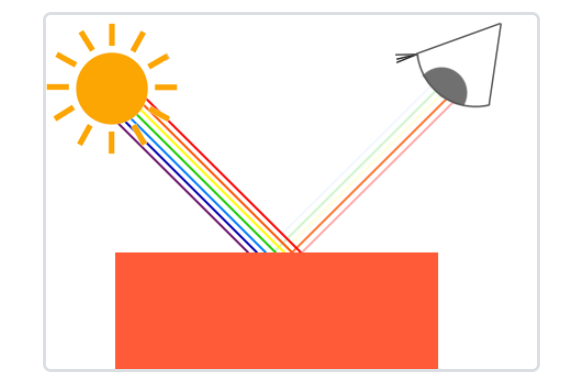

<!--more-->

### 应用

在图形学中如何计算光照？这里是一种简单的方式

- 输入：
  - 具有不同频率（颜色）的能量的光
  - 带有一定颜色（反射率）的物体，

- 过程：吸收一部分光，反射另一部分光
- 输出：反射出的光的颜色（频率）

```
// 这里不是点乘

// 输入：白色光

glm::vec3 lightColor(0.0f, 1.0f, 0.0f);
glm::vec3 toyColor(1.0f, 0.5f, 0.31f);
glm::vec3 result = lightColor * toyColor; // = (0.0f, 0.5f, 0.0f);

// 输入：绿光

glm::vec3 lightColor(0.33f, 0.42f, 0.18f);
glm::vec3 toyColor(1.0f, 0.5f, 0.31f);
glm::vec3 result = lightColor * toyColor; // = (0.33f, 0.21f, 0.06f);
```


### 带有光照的场景

内容：

- 一个光源（用之前的立方体表示）
- 其他物体

- 只考虑颜色，不考虑角度等


对于光源，我们把它当作立方体来渲染。

- 此处建议为光源物体独自创建一个VAO，因为后续光源物体和实际物体的顶点属性差别会很大。


结果图

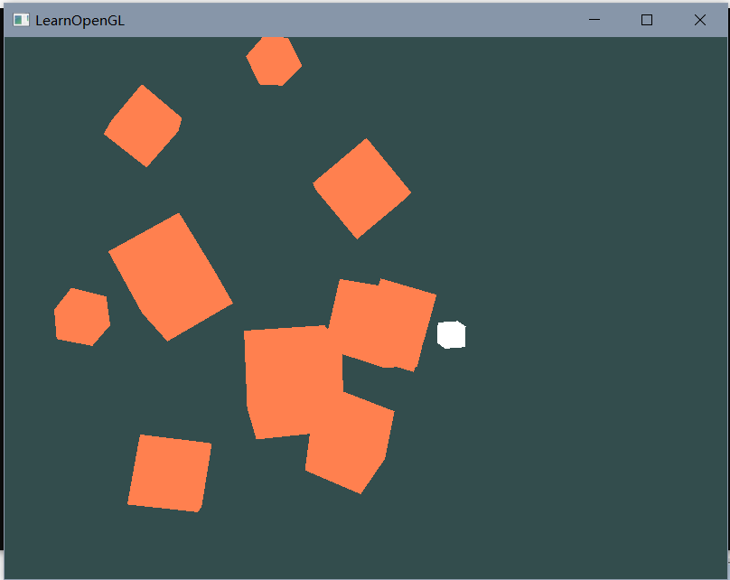


代码

```c++
#include "public.h"
#include <iostream>
#include "ShaderMgr.h"
#include "camera.h"
#include "stb_image.h"
#include "part1.h"

MyCamera g_camera;

float mixValue;

//float vertices[] = {
//    // positions          // colors           // texture coords
//     0.5f,  0.5f, 0.0f,   1.0f, 0.0f, 0.0f,   1.0f, 1.0f, // top right
//     0.5f, -0.5f, 0.0f,   0.0f, 1.0f, 0.0f,   1.0f, 0.0f, // bottom right
//    -0.5f, -0.5f, 0.0f,   0.0f, 0.0f, 1.0f,   0.0f, 0.0f, // bottom left
//    -0.5f,  0.5f, 0.0f,   1.0f, 1.0f, 0.0f,   0.0f, 1.0f  // top left 
//};
//unsigned int indices[] = {
//    // 注意索引从0开始! 
//    // 此例的索引(0,1,2,3)就是顶点数组vertices的下标，
//    // 这样可以由下标代表顶点组合成矩形
//
//    0, 1, 3, // 第一个三角形
//    1, 2, 3  // 第二个三角形
//};

float vertices[] = {
    -0.5f, -0.5f, -0.5f,  0.0f, 0.0f,
     0.5f, -0.5f, -0.5f,  1.0f, 0.0f,
     0.5f,  0.5f, -0.5f,  1.0f, 1.0f,
     0.5f,  0.5f, -0.5f,  1.0f, 1.0f,
    -0.5f,  0.5f, -0.5f,  0.0f, 1.0f,
    -0.5f, -0.5f, -0.5f,  0.0f, 0.0f,

    -0.5f, -0.5f,  0.5f,  0.0f, 0.0f,
     0.5f, -0.5f,  0.5f,  1.0f, 0.0f,
     0.5f,  0.5f,  0.5f,  1.0f, 1.0f,
     0.5f,  0.5f,  0.5f,  1.0f, 1.0f,
    -0.5f,  0.5f,  0.5f,  0.0f, 1.0f,
    -0.5f, -0.5f,  0.5f,  0.0f, 0.0f,

    -0.5f,  0.5f,  0.5f,  1.0f, 0.0f,
    -0.5f,  0.5f, -0.5f,  1.0f, 1.0f,
    -0.5f, -0.5f, -0.5f,  0.0f, 1.0f,
    -0.5f, -0.5f, -0.5f,  0.0f, 1.0f,
    -0.5f, -0.5f,  0.5f,  0.0f, 0.0f,
    -0.5f,  0.5f,  0.5f,  1.0f, 0.0f,

     0.5f,  0.5f,  0.5f,  1.0f, 0.0f,
     0.5f,  0.5f, -0.5f,  1.0f, 1.0f,
     0.5f, -0.5f, -0.5f,  0.0f, 1.0f,
     0.5f, -0.5f, -0.5f,  0.0f, 1.0f,
     0.5f, -0.5f,  0.5f,  0.0f, 0.0f,
     0.5f,  0.5f,  0.5f,  1.0f, 0.0f,

    -0.5f, -0.5f, -0.5f,  0.0f, 1.0f,
     0.5f, -0.5f, -0.5f,  1.0f, 1.0f,
     0.5f, -0.5f,  0.5f,  1.0f, 0.0f,
     0.5f, -0.5f,  0.5f,  1.0f, 0.0f,
    -0.5f, -0.5f,  0.5f,  0.0f, 0.0f,
    -0.5f, -0.5f, -0.5f,  0.0f, 1.0f,

    -0.5f,  0.5f, -0.5f,  0.0f, 1.0f,
     0.5f,  0.5f, -0.5f,  1.0f, 1.0f,
     0.5f,  0.5f,  0.5f,  1.0f, 0.0f,
     0.5f,  0.5f,  0.5f,  1.0f, 0.0f,
    -0.5f,  0.5f,  0.5f,  0.0f, 0.0f,
    -0.5f,  0.5f, -0.5f,  0.0f, 1.0f
};


glm::vec3 cubePositions[] = {
  glm::vec3(0.0f,  0.0f,  0.0f),
  glm::vec3(2.0f,  5.0f, -15.0f),
  glm::vec3(-1.5f, -2.2f, -2.5f),
  glm::vec3(-3.8f, -2.0f, -12.3f),
  glm::vec3(2.4f, -0.4f, -3.5f),
  glm::vec3(-1.7f,  3.0f, -7.5f),
  glm::vec3(1.3f, -2.0f, -2.5f),
  glm::vec3(1.5f,  2.0f, -2.5f),
  glm::vec3(1.5f,  0.2f, -1.5f),
  glm::vec3(-1.3f,  1.0f, -1.5f)
};

int main()
{
    mixValue = 0.2f;

    // GLFW 窗口初始化
    GLFWwindow* window = init_GLFW_window(800, 600, "LearnOpenGL");
    if (window == nullptr) {
        std::cout << "Failed to initialize GLFW" << std::endl;
        return -1;
    }

    // GLAD 函数地址初始化
    if (GL_FALSE == gladLoadGLLoader((GLADloadproc)glfwGetProcAddress))
    {
        std::cout << "Failed to initialize GLAD" << std::endl;
        return -1;
    }
    // 相机初始化
    g_camera.Init(glm::vec3(0.0f, 0.0f, 3.0f), glm::vec3(0.0f, 0.0f, -1.0f), glm::vec3(0.0f, 1.0f, 0.0f));

    // 开启深度缓冲
    glEnable(GL_DEPTH_TEST);

    // 顶点缓冲设置
    unsigned int VBO;
    glGenBuffers(1, &VBO);
    glBindBuffer(GL_ARRAY_BUFFER, VBO);
    // 把之前定义的顶点数据复制到缓冲的内存
    glBufferData(GL_ARRAY_BUFFER, sizeof(vertices), vertices, GL_STATIC_DRAW);

    // 灯光物体的顶点数组和属性设置
    unsigned int lightVAO;
    glGenVertexArrays(1, &lightVAO);
    glBindVertexArray(lightVAO);
    glVertexAttribPointer(0, 3, GL_FLOAT, GL_FALSE, 5 * sizeof(float), (void*)0);
    glEnableVertexAttribArray(0);

    // 物体顶点数组生成
    unsigned int VAO;
    glGenVertexArrays(1, &VAO);
    glBindVertexArray(VAO);
    glVertexAttribPointer(0, 3, GL_FLOAT, GL_FALSE, 5 * sizeof(float), (void*)0);
    glEnableVertexAttribArray(0);

    // 着色器相关初始化，以及uniform变量设置
    Shader shader("./ColorVShader.glsl", "./ColorFShader.glsl");
    shader.use();
    shader.setVec3("objectColor", 1.0f, 0.5f, 0.31f);
    shader.setVec3("lightColor", 1.0f, 1.0f, 1.0f);

    Shader lightShader("./ColorVShader.glsl", "./ColorFShader_Light.glsl");

    // 光照位置
    glm::vec3 lightPos(1.2f, 1.0f, 2.0f);

    // 渲染循环
    while (!glfwWindowShouldClose(window))	// 检查是否被要求退出窗口
    {
        // 输入处理
        processInput(window);

        // 帧渲染时间
        float deltaTime;
        float lastFrame = 0;
        float currentFrame = glfwGetTime();
        deltaTime = currentFrame - lastFrame;
        lastFrame = currentFrame;

        g_camera.SetSpeed(deltaTime);

        // 重置颜色缓冲和深度缓冲
        glClearColor(0.2f, 0.3f, 0.3f, 1.0f);
        glClear(GL_COLOR_BUFFER_BIT | GL_DEPTH_BUFFER_BIT);

        // 计算mvp变换矩阵
        glm::mat4 view = g_camera.GetLookAt();

        glm::mat4 projection = glm::mat4(1.0f);
        projection = glm::perspective(glm::radians(g_camera.GetFov()), 800.0f / 600.0f, 0.1f, 100.0f);

        // 绘制光照立方体
        lightShader.use();
        glm::mat4 light_model = glm::mat4(1.0f);
        light_model = glm::translate(light_model, lightPos);
        light_model = glm::scale(light_model, glm::vec3(0.2f));

        lightShader.setMat4("model", light_model);
        lightShader.setMat4("view", view);
        lightShader.setMat4("projection", projection);

        glBindVertexArray(lightVAO);
        glDrawArrays(GL_TRIANGLES, 0, 36);

        // 绘制立方体
        shader.use();
        shader.setMat4("view", view);
        shader.setMat4("projection", projection);

        glBindVertexArray(VAO);
        for (unsigned int i = 0; i < 10; i++)
        {
            glm::mat4 model = glm::mat4(1.0f);
            model = glm::translate(model, cubePositions[i]);
            float angle = 20.0f * i * (float)glfwGetTime();
            model = glm::rotate(model, glm::radians(angle), glm::vec3(1.0f, 0.3f, 0.5f));
            shader.setMat4("model", model);

            glDrawArrays(GL_TRIANGLES, 0, 36);
        }
        glBindVertexArray(0);

        // 交换颜色缓冲，输出显示到屏幕
        glfwSwapBuffers(window);
        // 检查有没有触发什么事件（比如键盘输入、鼠标移动等）、更新窗口状态，并调用对应的回调函数
        glfwPollEvents();
    }
    glfwTerminate();
    return 0;
}
```


## 二、基础光照

### Phong-光照模型

- 三个分量组成：
  - 环境(Ambient)：
    - 即使在黑暗的情况下，世界上通常也仍然有一些光亮（月亮、远处的光）
    - 用一个常量，表示基础的环境光颜色
  - 漫反射(Diffuse)：
    - 模拟光源对物体的方向性影响(Directional Impact)。
    - 物体的某一部分越是正对着光源，它就会越亮。
    - 影响最显著的一个分量。
  - 镜面(Specular)：
    - 模拟有光泽物体上面出现的亮点。
    - 相比于物体的颜色会更倾向于光的颜色。
    - 与视线和光照之间的夹角有关。

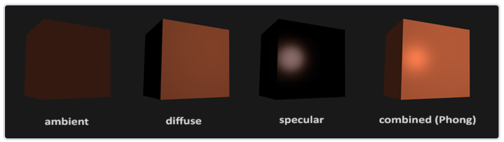


#### 环境光照

> 全局照明(Global Illumination)：
>
> - 考虑分散的很多光源
> - 考虑光在其他表面上的反射，以及对一个物体产生间接的影响


Phong模型里的环境光照是一种最简单的全局照明模型。

一种简单的定义：

- 用光的颜色乘以一个很小的常量环境因子，再乘以物体的颜色

  

  ```glsl
  #version 330 core
  out vec4 FragColor;
  
  uniform vec3 objectColor;
  uniform vec3 lightColor;
  
  void main()
  {
      float ambientStrength = 0.1;
      vec3 ambient = ambientStrength * lightColor;
  
      vec3 result = ambient * objectColor;
      FragColor = vec4(result, 1.0);
  }
  ```

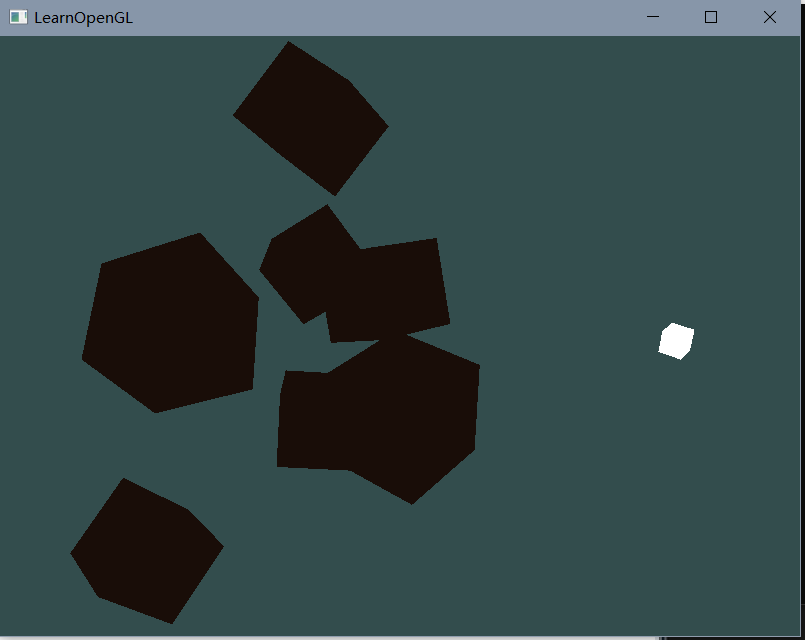


#### 漫反射光照

漫反射光照使物体上与光线方向越接近的片段能从光源处获得更多的亮度。

- 考虑 `光照方向` 和 物体`表面法线方向`
  - 法向量：一个垂直于顶点表面的向量。
  - 光照方向向量：作为光源的位置与片段的位置之间向量差的方向向量。
- 使用这两个方向的`单位向量`进行点乘

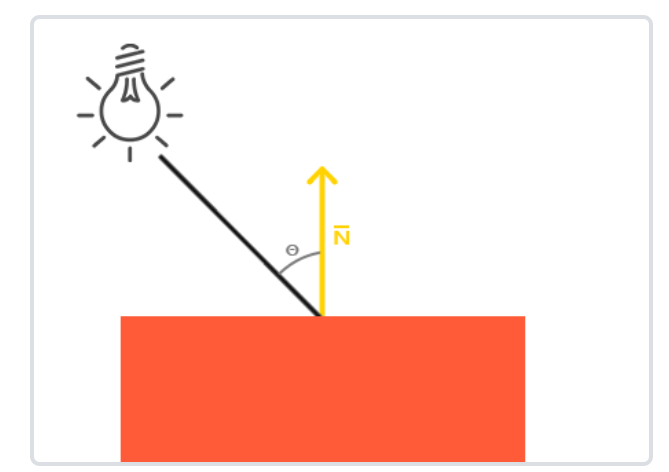

##### 法向量

**顶点法向量：**

- 在obj文件中，一般会给出一个顶点对应的法向量。

- 由于顶点本身并没有表面（它只是空间中一个独立的点），我们利用它周围的顶点来计算出这个顶点的表面。
  - 利用顶点与周围的顶点形成的向量，叉乘求出所在三角形面的法向量。
  - 如果这个顶点同时在多个三角形上，要对各个三角形的法向量计算结果求均值。


**平面法向量：**

三角形平面上的点的法向量通过三角形三个顶点的法向量插值计算求出：

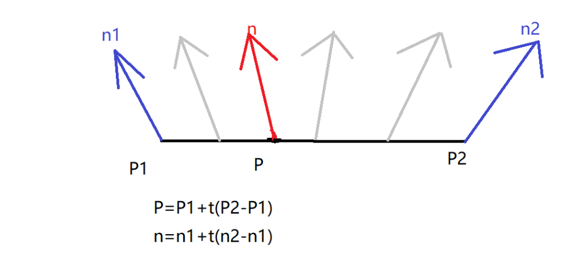


> - 在片段着色器中：
>
>   - 对光线方向和法线夹角的计算，一般都在世界空间中做的
>
>   - 考虑：如何将obj文件中基于模型空间的顶点法向量变换到世界空间中？
>     - 法向量的变换不考虑平移，只考虑缩放和旋转变换
>     - 法向量没有齐次分量
>     - 对于出现非等比缩放的情况（会导致法向量不再垂直于表面）
>
> - 直接说结论：
>
>   - 需要专门定义一个`法线矩阵`
>     - 定义为: `模型矩阵`左上角3x3部分的逆矩阵的转置矩阵
>     - （大部分的资源都会将法线矩阵定义为应用到`模型-观察矩阵`(Model-view Matrix)上的操作）
>
> - 在顶点着色器中，我们可以使用`inverse`和`transpose`函数自己生成这个法线矩阵
>
>   ```glsl
>   Normal = mat3(transpose(inverse(model))) * aNormal;
>   ```
>
> - 此外：
>
>   矩阵求逆是一项对于着色器开销很大的运算，因为它必须在场景中的每一个顶点上进行，所以应该尽可能地避免在着色器中进行求逆运算。以学习为目的的话这样做还好，但是对于一个高效的应用来说，你最好先在CPU上计算出法线矩阵，再通过uniform把它传递给着色器（就像模型矩阵一样）。
>
> 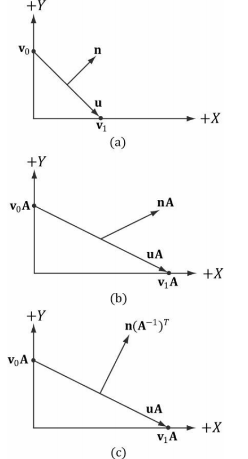


##### 漫反射光照计算

- 需要：
  - 光源位置、片段位置 来计算 光照方向
  - 法向量


感觉不太对

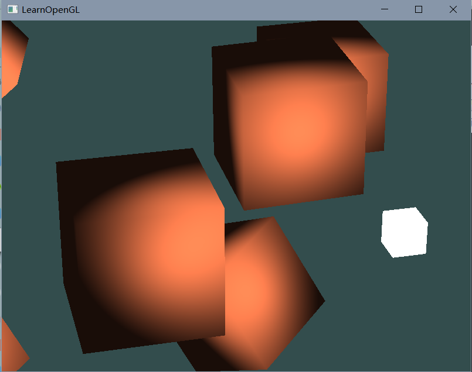

原因是顶点属性设置错了

```c++
    glVertexAttribPointer(0, 3, GL_FLOAT, GL_FALSE, 6 * sizeof(float), (void*)0);
    glEnableVertexAttribArray(0);
    glVertexAttribPointer(1, 3, GL_FLOAT, GL_FALSE, 6 * sizeof(float), (void*)0);
    glEnableVertexAttribArray(1);

    // 改为
    glVertexAttribPointer(0, 3, GL_FLOAT, GL_FALSE, 6 * sizeof(float), (void*)0);
    glEnableVertexAttribArray(0);
    glVertexAttribPointer(1, 3, GL_FLOAT, GL_FALSE, 6 * sizeof(float), (void*)(3 * sizeof(float)));
    glEnableVertexAttribArray(1);

```


正确结果

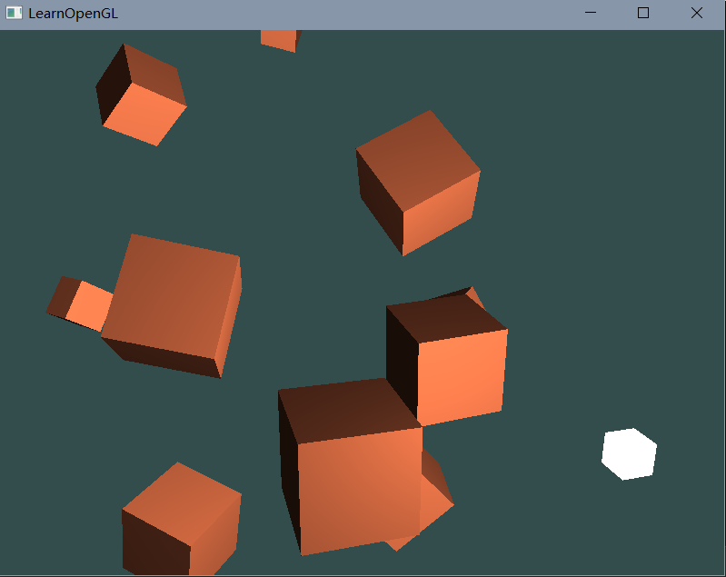


#### 镜面光照

- 和漫反射光照一样，镜面光照也决定于光的方向向量和物体的法向量，但是它也决定于观察方向。

- 如何得到观察方向

  - 使用观察者(相机）的世界空间位置和片段的位置来计算

- 如何计算镜面光照方向与观察方向的夹角关系

  - 根据法向量翻折入射光的方向来计算反射向量 R
  - 然后我们计算反射向量与观察方向的角度差，它们之间夹角越小，镜面光的作用就越大。

- 定义相关常量：

  - 镜面光照强度（Specular Strength） —— 0.5

  - 反光度(Shininess) 系数 —— 32

    - 物体的反光度越高，反射光的能力越强，散射得越少，高光点就会越小。

    
  
    ```glsl
        float specularStrength = 0.5;
        vec3 viewDir = normalize(viewPos - FragPos);
        vec3 reflectDir = reflect(-lightDir, norm);
        float spec = pow(max(dot(viewDir, reflectDir), 0.0), 32);
        vec3 specular = specularStrength * spec * lightColor;
    ```
  
    

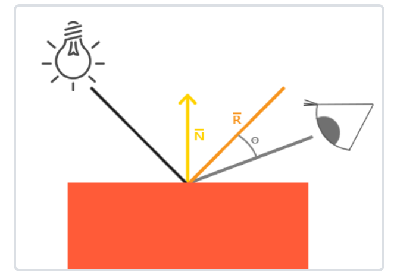


不同反光度：

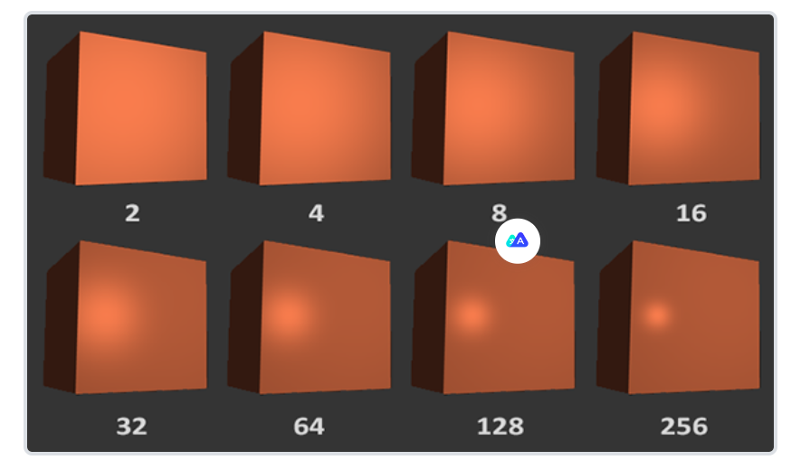

>在哪个坐标空间中计算光照？
>
>我们选择在世界空间进行光照计算，但是大多数人趋向于更偏向在观察空间进行光照计算。在观察空间计算的优势是，观察者的位置总是在(0, 0, 0)，所以你已经零成本地拿到了观察者的位置。然而，若以学习为目的，我认为在世界空间中计算光照更符合直觉。如果你仍然希望在观察空间计算光照的话，你需要将所有相关的向量也用观察矩阵进行变换（不要忘记也修改法线矩阵）。


### Gouraud-光照模型

在顶点着色器中实现Phong冯氏光照模型。

- 相比片段来说，顶点要少得多，光照计算频率会更低。
- 片段的颜色值是由插值顶点的光照颜色所得来的。

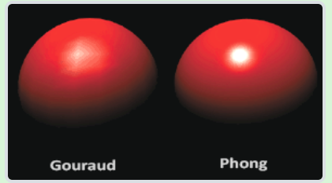


### 实践

结果图：

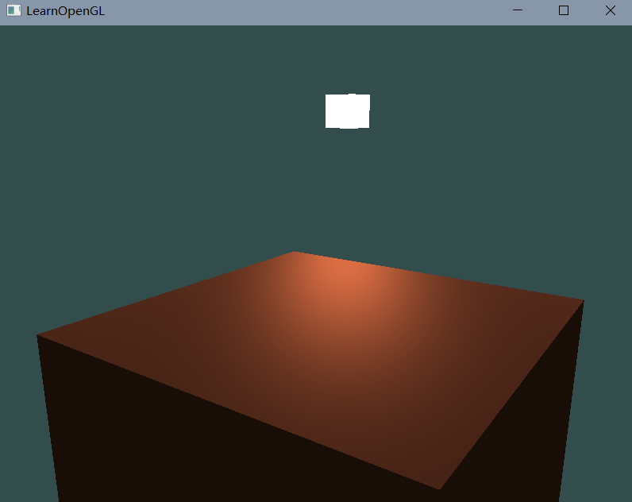

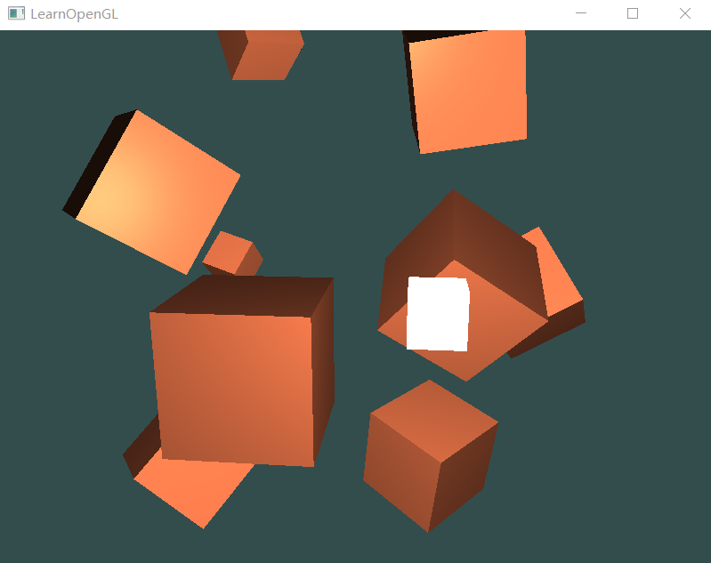


顶点着色器代码

```glsl
#version 330 core
layout (location = 0) in vec3 aPos;
layout (location = 1) in vec3 aNormal;

uniform mat4 model;
uniform mat4 view;
uniform mat4 projection;

out vec3 Normal;
out vec3 FragPos;  

void main()
{
    // 计算MVP变换后的顶点位置，位于投影空间中（OpenGL会完成裁剪，以及转换到归一化设备坐标，并进行视口坐标的映射）
    gl_Position = projection * view * model * vec4(aPos, 1.0);

    // 计算世界空间中的顶点位置
    FragPos = vec3(model * vec4(aPos, 1.0));
    // 计算变换到世界空间的顶点法向量
    Normal = vec3(mat3(transpose(inverse(model))) * aNormal);
}
```


片段着色器代码

```glsl
#version 330 core
out vec4 FragColor;

uniform vec3 objectColor;
uniform vec3 lightColor;
uniform vec3 lightPos;
uniform vec3 viewPos;

in vec3 Normal;
in vec3 FragPos;

void main()
{
    // 环境光项
    float ambientStrength = 0.1;
    vec3 ambient = ambientStrength * lightColor;

    // 漫反射项
    // 计算世界坐标下的片段法向量和光照方向，并点乘得到影响值
    vec3 norm = normalize(Normal);
    vec3 lightDir = normalize(lightPos - FragPos);
    float diff = max(dot(norm, lightDir), 0.0); // 是负数则认为是0
    vec3 diffuse = diff * lightColor;

    // 高光项
    float specularStrength = 0.5;
    vec3 viewDir = normalize(viewPos - FragPos);
    vec3 reflectDir = reflect(-lightDir, norm);
    float spec = pow(max(dot(viewDir, reflectDir), 0.0), 32);
    vec3 specular = specularStrength * spec * lightColor;

    // 最终光照结果
    vec3 result = (ambient + diffuse + specular) * objectColor;

    FragColor = vec4(result, 1.0);
}
```


主要代码

```c++
#include "public.h"
#include <iostream>
#include "ShaderMgr.h"
#include "camera.h"
#include "stb_image.h"
#include "part1.h"

MyCamera g_camera;

float mixValue;

float vertices[] = {
    -0.5f, -0.5f, -0.5f,  0.0f,  0.0f, -1.0f,
     0.5f, -0.5f, -0.5f,  0.0f,  0.0f, -1.0f,
     0.5f,  0.5f, -0.5f,  0.0f,  0.0f, -1.0f,
     0.5f,  0.5f, -0.5f,  0.0f,  0.0f, -1.0f,
    -0.5f,  0.5f, -0.5f,  0.0f,  0.0f, -1.0f,
    -0.5f, -0.5f, -0.5f,  0.0f,  0.0f, -1.0f,

    -0.5f, -0.5f,  0.5f,  0.0f,  0.0f,  1.0f,
     0.5f, -0.5f,  0.5f,  0.0f,  0.0f,  1.0f,
     0.5f,  0.5f,  0.5f,  0.0f,  0.0f,  1.0f,
     0.5f,  0.5f,  0.5f,  0.0f,  0.0f,  1.0f,
    -0.5f,  0.5f,  0.5f,  0.0f,  0.0f,  1.0f,
    -0.5f, -0.5f,  0.5f,  0.0f,  0.0f,  1.0f,

    -0.5f,  0.5f,  0.5f, -1.0f,  0.0f,  0.0f,
    -0.5f,  0.5f, -0.5f, -1.0f,  0.0f,  0.0f,
    -0.5f, -0.5f, -0.5f, -1.0f,  0.0f,  0.0f,
    -0.5f, -0.5f, -0.5f, -1.0f,  0.0f,  0.0f,
    -0.5f, -0.5f,  0.5f, -1.0f,  0.0f,  0.0f,
    -0.5f,  0.5f,  0.5f, -1.0f,  0.0f,  0.0f,

     0.5f,  0.5f,  0.5f,  1.0f,  0.0f,  0.0f,
     0.5f,  0.5f, -0.5f,  1.0f,  0.0f,  0.0f,
     0.5f, -0.5f, -0.5f,  1.0f,  0.0f,  0.0f,
     0.5f, -0.5f, -0.5f,  1.0f,  0.0f,  0.0f,
     0.5f, -0.5f,  0.5f,  1.0f,  0.0f,  0.0f,
     0.5f,  0.5f,  0.5f,  1.0f,  0.0f,  0.0f,

    -0.5f, -0.5f, -0.5f,  0.0f, -1.0f,  0.0f,
     0.5f, -0.5f, -0.5f,  0.0f, -1.0f,  0.0f,
     0.5f, -0.5f,  0.5f,  0.0f, -1.0f,  0.0f,
     0.5f, -0.5f,  0.5f,  0.0f, -1.0f,  0.0f,
    -0.5f, -0.5f,  0.5f,  0.0f, -1.0f,  0.0f,
    -0.5f, -0.5f, -0.5f,  0.0f, -1.0f,  0.0f,

    -0.5f,  0.5f, -0.5f,  0.0f,  1.0f,  0.0f,
     0.5f,  0.5f, -0.5f,  0.0f,  1.0f,  0.0f,
     0.5f,  0.5f,  0.5f,  0.0f,  1.0f,  0.0f,
     0.5f,  0.5f,  0.5f,  0.0f,  1.0f,  0.0f,
    -0.5f,  0.5f,  0.5f,  0.0f,  1.0f,  0.0f,
    -0.5f,  0.5f, -0.5f,  0.0f,  1.0f,  0.0f
};

glm::vec3 cubePositions[] = {
  glm::vec3(0.0f,  0.0f,  0.0f),
  glm::vec3(2.0f,  5.0f, -15.0f),
  glm::vec3(-1.5f, -2.2f, -2.5f),
  glm::vec3(-3.8f, -2.0f, -12.3f),
  glm::vec3(2.4f, -0.4f, -3.5f),
  glm::vec3(-1.7f,  3.0f, -7.5f),
  glm::vec3(1.3f, -2.0f, -2.5f),
  glm::vec3(1.5f,  2.0f, -2.5f),
  glm::vec3(1.5f,  0.2f, -1.5f),
  glm::vec3(-1.3f,  1.0f, -1.5f)
};

int main()
{
    mixValue = 0.2f;

    // GLFW 窗口初始化
    GLFWwindow* window = init_GLFW_window(800, 600, "LearnOpenGL");
    if (window == nullptr) {
        std::cout << "Failed to initialize GLFW" << std::endl;
        return -1;
    }

    // GLAD 函数地址初始化
    if (GL_FALSE == gladLoadGLLoader((GLADloadproc)glfwGetProcAddress))
    {
        std::cout << "Failed to initialize GLAD" << std::endl;
        return -1;
    }
    // 相机初始化
    g_camera.Init(glm::vec3(0.0f, 0.0f, 3.0f), glm::vec3(0.0f, 0.0f, -1.0f), glm::vec3(0.0f, 1.0f, 0.0f));

    // 开启深度缓冲
    glEnable(GL_DEPTH_TEST);

    // 顶点缓冲设置
    unsigned int VBO;
    glGenBuffers(1, &VBO);
    glBindBuffer(GL_ARRAY_BUFFER, VBO);
    // 把之前定义的顶点数据复制到缓冲的内存
    glBufferData(GL_ARRAY_BUFFER, sizeof(vertices), vertices, GL_STATIC_DRAW);

    // 灯光物体的顶点数组和属性设置
    unsigned int lightVAO;
    glGenVertexArrays(1, &lightVAO);
    glBindVertexArray(lightVAO);
    glVertexAttribPointer(0, 3, GL_FLOAT, GL_FALSE, 6 * sizeof(float), (void*)0);
    glEnableVertexAttribArray(0);

    // 物体顶点数组生成
    unsigned int VAO;
    glGenVertexArrays(1, &VAO);
    glBindVertexArray(VAO);
    glVertexAttribPointer(0, 3, GL_FLOAT, GL_FALSE, 6 * sizeof(float), (void*)0);
    glEnableVertexAttribArray(0);
    glVertexAttribPointer(1, 3, GL_FLOAT, GL_FALSE, 6 * sizeof(float), (void*)(3 * sizeof(float)));
    glEnableVertexAttribArray(1);

    // 光源位置
    glm::vec3 lightPos(1.2f, 1.0f, 2.0f);
    // 光物体的着色器
    Shader lightShader("./ColorVShader.glsl", "./ColorFShader_Light.glsl");

    // 普通物体的着色器
    Shader shader("./BasicLightingVShader.glsl", "./BasicLightingFShader.glsl");
    shader.use();
    shader.setVec3("objectColor", glm::vec3(1.0f, 0.5f, 0.31f));
    shader.setVec3("lightColor", glm::vec3(1.0f, 1.0f, 1.0f));
    shader.setVec3("lightPos", lightPos);
    shader.setVec3("viewPos", g_camera.GetPos());

    // 渲染循环
    while (!glfwWindowShouldClose(window))	// 检查是否被要求退出窗口
    {
        // 输入处理
        processInput(window);

        // 帧渲染时间
        float deltaTime;
        float lastFrame = 0;
        float currentFrame = glfwGetTime();
        deltaTime = currentFrame - lastFrame;
        lastFrame = currentFrame;

        g_camera.SetSpeed(deltaTime);
        
        // 更新着色器中的观察位置变量
        shader.setVec3("viewPos", g_camera.GetPos());

        // 重置颜色缓冲和深度缓冲
        glClearColor(0.2f, 0.3f, 0.3f, 1.0f);
        glClear(GL_COLOR_BUFFER_BIT | GL_DEPTH_BUFFER_BIT);

        // 计算mvp变换矩阵
        glm::mat4 view = g_camera.GetLookAt();

        glm::mat4 projection = glm::mat4(1.0f);
        projection = glm::perspective(glm::radians(g_camera.GetFov()), 800.0f / 600.0f, 0.1f, 100.0f);

        // 绘制光照立方体
        lightShader.use();
        glm::mat4 light_model = glm::mat4(1.0f);
        light_model = glm::translate(light_model, lightPos);
        light_model = glm::scale(light_model, glm::vec3(0.2f));

        lightShader.setMat4("model", light_model);
        lightShader.setMat4("view", view);
        lightShader.setMat4("projection", projection);

        glBindVertexArray(lightVAO);
        glDrawArrays(GL_TRIANGLES, 0, 36);

        // 绘制立方体
        shader.use();
        shader.setMat4("view", view);
        shader.setMat4("projection", projection);

        glBindVertexArray(VAO);
        for (unsigned int i = 0; i < 10; i++)
        {
            glm::mat4 model = glm::mat4(1.0f);
            model = glm::translate(model, cubePositions[i]);
            float angle = 20.0f * i * (float)glfwGetTime();
            model = glm::rotate(model, glm::radians(angle), glm::vec3(1.0f, 0.3f, 0.5f));
            shader.setMat4("model", model);

            glDrawArrays(GL_TRIANGLES, 0, 36);
        }
        glBindVertexArray(0);

        // 交换颜色缓冲，输出显示到屏幕
        glfwSwapBuffers(window);
        // 检查有没有触发什么事件（比如键盘输入、鼠标移动等）、更新窗口状态，并调用对应的回调函数
        glfwPollEvents();
    }
    glfwTerminate();
    return 0;
}
```


## 三、材质

在现实世界里，每个物体会<u>对光产生不同的反应</u>。

比如，钢制物体看起来通常会比陶土花瓶更闪闪发光，一个木头箱子也不会与一个钢制箱子反射同样程度的光。

如果我们想要在OpenGL中模拟多种类型的物体，我们必须针对`每种表面`定义不同的`材质(Material)属性`。

### 材质定义

#### 材质属性

包含的内容：（一种定义方式）

- 定义材质对颜色计算的影响因素：物体的

  - 环境色 - ambient
  - 漫反射色 - diffuse
  - 高光色 - specular
  - 反光度 - shininess
  - 相当于将原来单一物体的颜色拆分成Phong-光照模型中的多项

  ```glsl
  #version 330 core
  struct Material {
      vec3 ambient;
      vec3 diffuse;
      vec3 specular;
      float shininess;
  }; 
  
  uniform Material material;
  ```

- 新的片段颜色计算

  ```glsl
  void main()
  {    
      // 环境光
      vec3 ambient = lightColor * material.ambient;
  
      // 漫反射 
      vec3 norm = normalize(Normal);
      vec3 lightDir = normalize(lightPos - FragPos);
      float diff = max(dot(norm, lightDir), 0.0);
      vec3 diffuse = lightColor * (diff * material.diffuse);
  
      // 镜面光
      vec3 viewDir = normalize(viewPos - FragPos);
      vec3 reflectDir = reflect(-lightDir, norm);  
      float spec = pow(max(dot(viewDir, reflectDir), 0.0), material.shininess);
      vec3 specular = lightColor * (spec * material.specular);  
  
      vec3 result = ambient + diffuse + specular;
      FragColor = vec4(result, 1.0);
  }
  ```

- 原来的片段颜色计算

  ```glsl
  void main()
  {
      // 环境光项
      float ambientStrength = 0.1;
      vec3 ambient = ambientStrength * lightColor;
  
      // 漫反射项
      // 计算世界坐标下的片段法向量和光照方向，并点乘得到影响值
      vec3 norm = normalize(Normal);
      vec3 lightDir = normalize(lightPos - FragPos);
      float diff = max(dot(norm, lightDir), 0.0); // 是负数则认为是0
      vec3 diffuse = diff * lightColor;
  
      // 高光项
      float specularStrength = 0.5;
      vec3 viewDir = normalize(viewPos - FragPos);
      vec3 reflectDir = reflect(-lightDir, norm);
      float spec = pow(max(dot(viewDir, reflectDir), 0.0), 32);
      vec3 specular = specularStrength * spec * lightColor;
  
      // 最终光照结果
      vec3 result = (ambient + diffuse + specular) * objectColor;
  
      FragColor = vec4(result, 1.0);
  }
  ```

  

效果：

- 问题：亮度太高了，不真实。
- 原因：
  - 环境光、漫反射和镜面光这三个颜色对任何一个光源都全力反射。
  - 没有定义各项光照的相关系数，参见上面的片段着色器代码

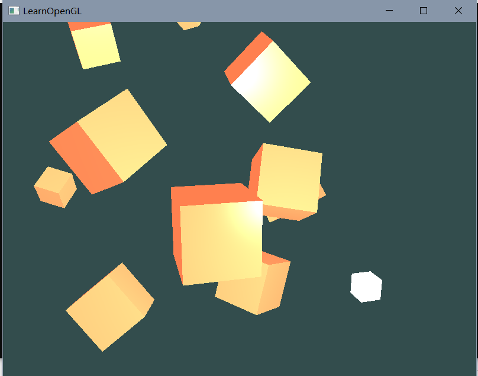


#### 光照属性

定义光源的位置和各项的影响系数

```glsl
struct Light {
    vec3 position;

    vec3 ambient;
    vec3 diffuse;
    vec3 specular;
};

uniform Light light;
```

- 表示一个光源对它的ambient、diffuse和specular光照分量有着不同的强度。
  - 环境光照通常被设置为一个比较低的强度，因为我们不希望环境光颜色太过主导。
  - 光源的漫反射分量通常被设置为我们希望光所具有的那个颜色，通常是一个比较明亮的白色。
  - 镜面光分量通常会保持为`vec3(1.0)`，以最大强度发光。
- 注意我们也将光源的位置向量加入了结构体。

结果：

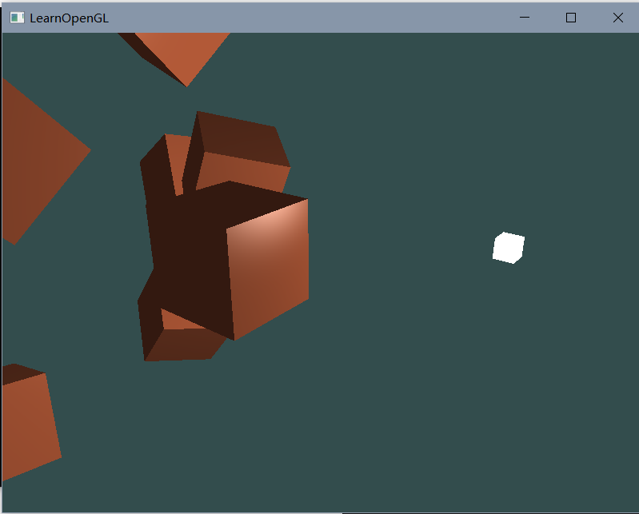


### 其他

- 光源颜色变化

  ```cpp
      // 光照颜色随时间变化
      glm::vec3 lightColor;
      lightColor.x = sin(glfwGetTime() * 2.0f);
      lightColor.y = sin(glfwGetTime() * 0.7f);
      lightColor.z = sin(glfwGetTime() * 1.3f);
  
      glm::vec3 diffuseColor = lightColor * glm::vec3(0.5f); // 降低影响
      glm::vec3 ambientColor = diffuseColor * glm::vec3(0.2f); // 很低的影响
  
      shader.setVec3("light.ambient", ambientColor);
      shader.setVec3("light.diffuse", diffuseColor);
  ```

  

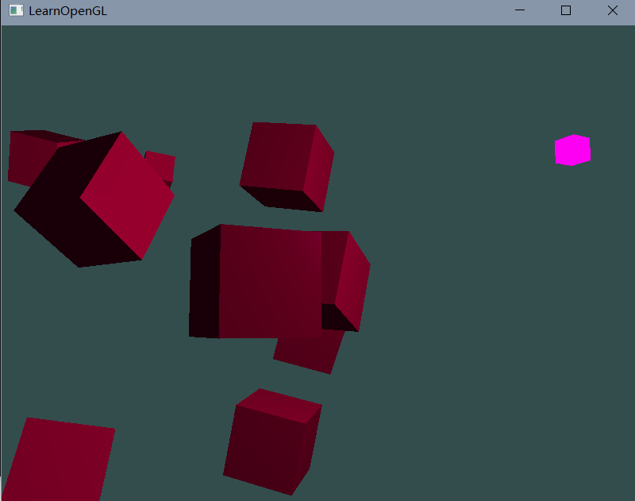


## 四、光照贴图

在同一个物体中，不同的部分可能有多种材质属性，相同的部分在不同的时刻也可能有多种材质属性。

除了材质属性，如何为一个物体的视觉输出提供更多的灵活性。

- 引入**漫反射**和**镜面光**贴图(Map)
- 这允许我们对物体的漫反射分量（以及间接地对环境光分量，它们几乎总是一样的）和镜面光分量有着更精确的控制。


### 漫反射贴图

其实也就是纹理贴图：

- 都是使用一张覆盖物体的图像，让我们能够逐片段索引其独立的颜色值。

在光照场景中，通常叫做一个漫反射贴图(Diffuse Map)（3D艺术家通常都这么叫它），它是一个表现了物体所有的漫反射颜色的纹理图像。


纹理：

 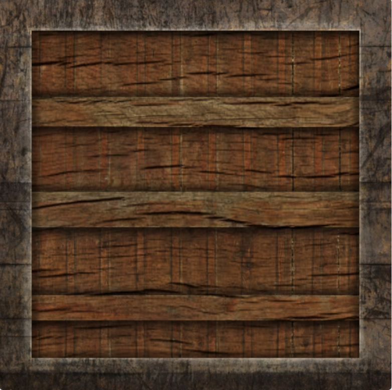


这次将纹理信息 sampler2D 放在片段着色器的material结构体的uniform变量里，替换之前的漫反射颜色向量分量。

片段着色器：

```glsl
#version 330 core

struct Material {
    // vec3 ambient;
    // vec3 diffuse;
    // 替代
    sampler2D diffuse;

    vec3 specular;
    float shininess;
}; 

struct Light {
    vec3 position;

    vec3 ambient;
    vec3 diffuse;
    vec3 specular;
};

uniform Light light;
uniform Material material;
uniform vec3 viewPos;

in vec2 TexCoords;
in vec3 Normal;
in vec3 FragPos;

out vec4 FragColor;

void main()
{
    // 环境光项
    vec3 ambient = light.ambient * vec3(texture(material.diffuse, TexCoords));

    // 漫反射项
    // 计算世界坐标下的片段法向量和光照方向，并点乘得到影响值
    vec3 norm = normalize(Normal);
    vec3 lightDir = normalize(light.position - FragPos);
    float diff = max(dot(norm, lightDir), 0.0); // 是负数则认为是0
    vec3 diffuse = light.diffuse * diff * vec3(texture(material.diffuse, TexCoords));
    
    // 高光项
    vec3 viewDir = normalize(viewPos - FragPos);
    vec3 reflectDir = reflect(-lightDir, norm);
    float spec = pow(max(dot(viewDir, reflectDir), 0.0), material.shininess);
    vec3 specular = light.specular * (spec * material.specular);

    // 最终光照结果
    vec3 result = ambient + diffuse + specular;
    FragColor = vec4(result, 1.0);
}
```


结果：

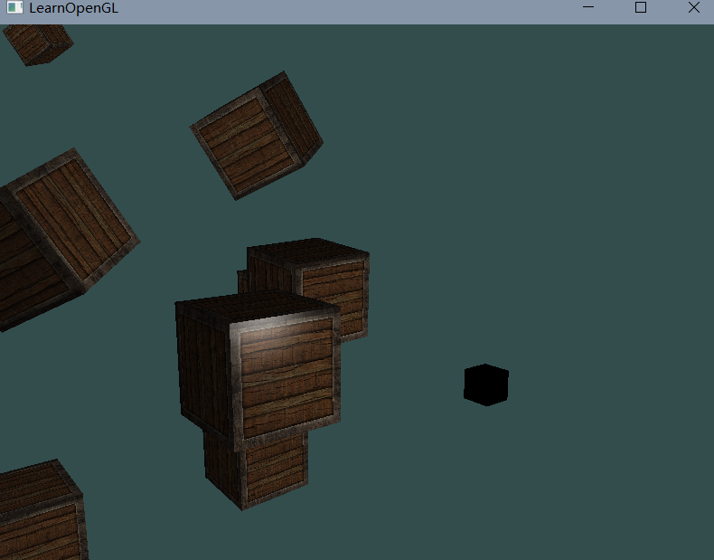


### 镜面光贴图

上面的箱子的木头部分的高光不是很真实，考虑使用镜面光贴图进行改进。

- 我们想要让物体的某些部分以不同的强度显示镜面高光。
- 这也就意味着我们需要生成一个黑白的（如果你想得话也可以是彩色的）纹理，来定义物体每部分的镜面光强度。
- 镜面光贴图上的每个像素都可以由一个颜色向量来表示，比如说黑色代表颜色向量`vec3(0.0)`，灰色代表颜色向量`vec3(0.5)`。


 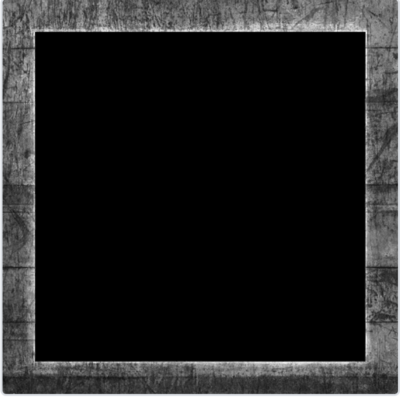

片段着色器：

```glsl
#version 330 core

struct Material {
    // vec3 ambient;
    // vec3 diffuse;
    // vec3 specular;

    sampler2D diffuse;
    sampler2D specular;
    float shininess;
}; 

struct Light {
    vec3 position;

    vec3 ambient;
    vec3 diffuse;
    vec3 specular;
};

uniform Light light;
uniform Material material;
uniform vec3 viewPos;

in vec2 TexCoords;
in vec3 Normal;
in vec3 FragPos;

out vec4 FragColor;

void main()
{
    // 环境光项
    vec3 ambient  = light.ambient  * vec3(texture(material.diffuse, TexCoords));

    // 漫反射项
    // 计算世界坐标下的片段法向量和光照方向，并点乘得到影响值
    vec3 norm = normalize(Normal);
    vec3 lightDir = normalize(light.position - FragPos);
    float diff = max(dot(norm, lightDir), 0.0); // 是负数则认为是0
    vec3 diffuse  = light.diffuse  * diff * vec3(texture(material.diffuse, TexCoords));

    // 高光项
    vec3 viewDir = normalize(viewPos - FragPos);
    vec3 reflectDir = reflect(-lightDir, norm);
    float spec = pow(max(dot(viewDir, reflectDir), 0.0), material.shininess);
    vec3 specular = light.specular * spec * vec3(texture(material.specular, TexCoords));

    // 最终光照结果
    vec3 result = ambient + diffuse + specular;
    FragColor = vec4(result, 1.0);
}
```


结果：

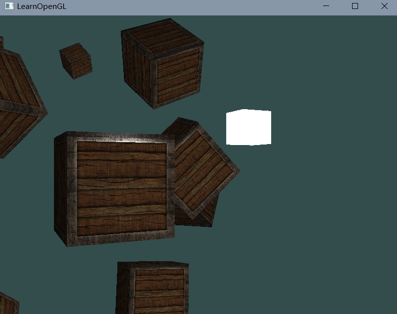


镜面光贴图能够在漫反射贴图之上给予我们更高一层的控制。

比如物体的哪些部分需要有**闪闪发光**的属性，我们甚至可以设置它们对应的强度。


>如果你想另辟蹊径，你也可以在镜面光贴图中使用真正的颜色，不仅设置每个片段的镜面光强度，还设置了镜面高光的颜色。
>
>从现实角度来说，镜面高光的颜色大部分（甚至全部）都是由光源本身所决定的，所以这样并不能生成非常真实的视觉效果（这也是为什么高光贴图的图像通常是黑白的，我们只关心强度）。


> 此外还有法线贴图和反射贴图等，用法不一样。


## 五、投光物

### 平行光

当一个光源处于很远的地方时，来自光源的每条光线就会近似于互相平行。

- 比如太阳光

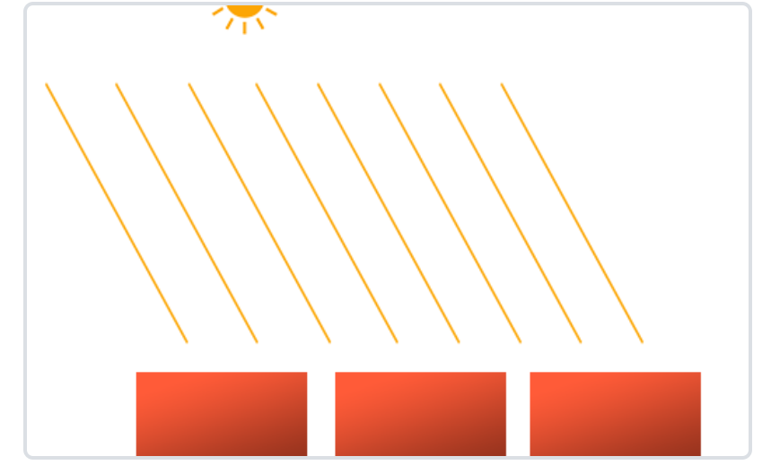


替代之前光照信息中的位置向量，直接给出光照的方向向量

```glsl
struct Light {
    // vec3 position; // 使用定向光就不再需要了
    vec3 direction;

    vec3 ambient;
    vec3 diffuse;
    vec3 specular;
};
...
void main()
{
  // 我们目前使用的光照计算需求一个从片段至光源的光线方向，但人们更习惯定义定向光为一个从光源出发的全局方向，所以需要取反
  vec3 lightDir = normalize(-light.direction);
  ...
}
```

效果：

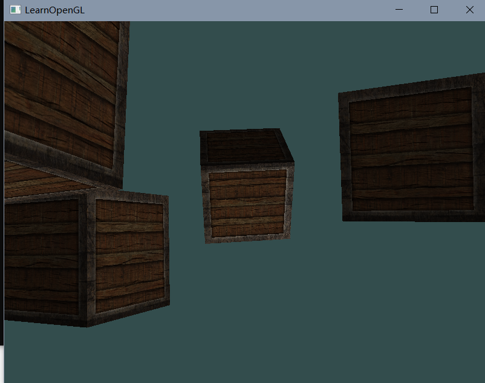


使用一个vec4表示光照的位置向量和方向向量

- 根据w分量为 0 还是 1（表示位置还是方向）
- 可以区分用哪种方式计算光照

```
if(lightVector.w == 0.0) // 注意浮点数据类型的误差
  // 执行定向光照计算
else if(lightVector.w == 1.0)
  // 根据光源的位置做光照计算（与上一节一样）
```


### 点光源

定向光对于照亮整个场景的全局光源是非常棒的，但除了定向光之外我们也需要一些分散在场景中的点光源(Point Light)。

- 点光源是处于世界中某一个位置的光源，它会朝着所有方向发光。
- 但光线会随着距离逐渐衰减。（之前的简单案例都是不考虑衰减的）
- 比如：灯泡和火把

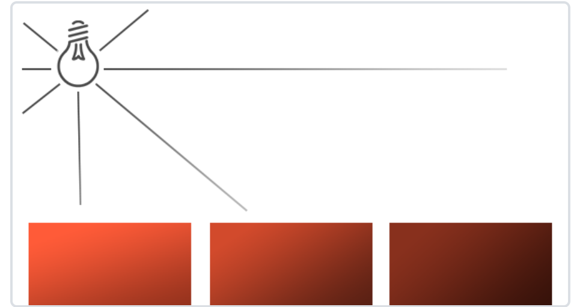


#### 衰减(Attenuation)

在现实世界中，灯在近处通常会非常亮，但随着距离的增加光源的亮度一开始会下降非常快，但在远处时剩余的光强度就会下降的非常缓慢了。

##### 公式：

 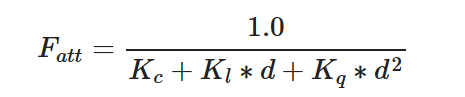

- `d` 代表了片段距光源的距离。

- 系数：常数项`Kc`、一次项 `Kl` 和二次项 `Kq` 。

  - 常数项通常保持为1.0，它的主要作用是保证分母永远不会比1小，否则的话在某些距离上它反而会增加强度，这肯定不是我们想要的效果。

  - 一次项会与距离值相乘，以线性的方式减少强度。

  - 二次项会与距离的平方相乘，让光源以二次递减的方式减少强度。
    - 二次项在距离比较小的时候影响会比一次项小很多
    - 但当距离值比较大的时候它就会比一次项更大了

- 由于二次项的存在，光线会在大部分时候以线性的方式衰退，直到距离变得足够大，让二次项超过一次项，光的强度会以更快的速度下降。
- 以达到这样的效果：光在近距离时亮度很高，但随着距离变远亮度迅速降低，最后会以更慢的速度减少亮度。

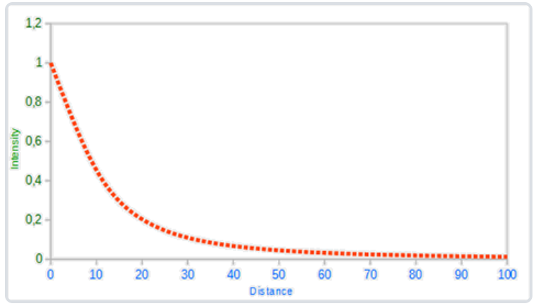


##### 系数的选择：

- 第一列指定的是光所能覆盖的距离。

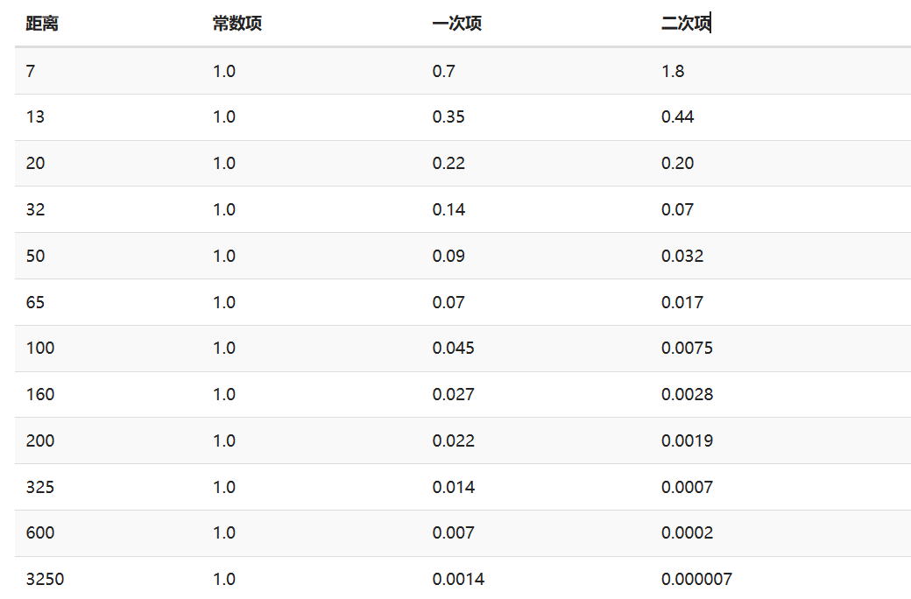


##### 实现：

在片段着色器的光照信息中，除了有光照的位置向量，还要加入三个系数，然后以上面的公式计算

```glsl
struct Light {
    vec3 position;  

    vec3 ambient;
    vec3 diffuse;
    vec3 specular;

    float constant;
    float linear;
    float quadratic;
};
```


计算距离和衰减率

```glsl
    // 片段和光源的距离
    float distance    = length(light.position - FragPos);
    // 衰减率
    float attenuation = 1.0 / (light.constant + light.linear * distance + light.quadratic * (distance * distance));

    ambient  *= attenuation; 
    diffuse  *= attenuation;
    specular *= attenuation;
```


结果：

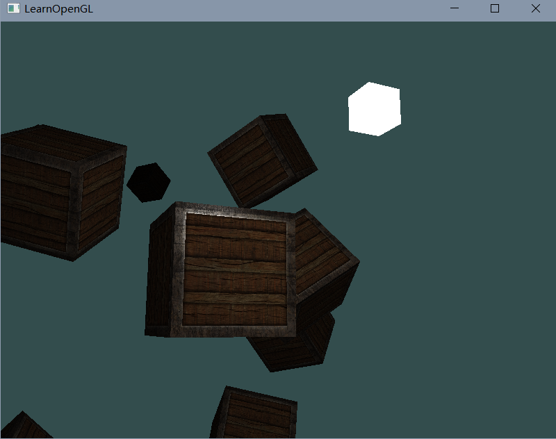


点光源就是一个能够配置位置和衰减的光源。它是我们光照工具箱中的又一个光照类型。


### 聚光灯

聚光(Spotlight)是位于环境中某个位置的光源，它只朝一个特定方向而不是所有方向照射光线。

- 只有在聚光方向的特定半径内的物体才会被照亮，其它的物体都会保持黑暗。
- 比如路灯或手电筒。

OpenGL中聚光的表示:

- 一个世界空间位置
- 一个方向
- 一个切光角(Cutoff Angle)

对于每个片段，我们会计算片段是否位于聚光的切光方向之间（也就是在锥形内），如果是的话，我们就会相应地照亮片段。

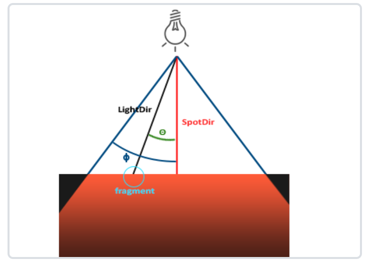

- `LightDir`：从片段指向光源的向量。
- `SpotDir`：聚光所指向的方向。
- `Phi`ϕ：指定了聚光半径（圆锥底部半径）的切光角。落在这个角度之外的物体都不会被这个聚光所照亮。
- `Theta`θ：LightDir向量和SpotDir向量之间的夹角。在聚光内部的话θ值应该比ϕ值小。

所以我们要做的就是计算LightDir向量和SpotDir向量之间的点积，并将它与切光角ϕ值对比。


#### 手电筒

手电筒(Flashlight)是一个位于观察者位置的聚光。其位置和方向会随着玩家的位置和朝向不断更新，而切光角一般是固定的。


- 着色器中的光照信息

```glsl
struct Light {
    vec3  position;
    vec3  direction;
    float cutOff;
    ...
};
```

- 计算

```glsl
float theta = dot(lightDir, normalize(-light.direction));
// 90°以内，余弦值越大，角度越小
if(theta > light.cutOff) 
{       
  // 执行光照计算
}
else  // 否则，使用环境光，让场景在聚光之外时不至于完全黑暗
  color = vec4(light.ambient * vec3(texture(material.diffuse, TexCoords)), 1.0);
```

- 传入的数据（在外部直接计算余弦值，而不是在着色器中计算）

```cpp
lightingShader.setVec3("light.position",  camera.Position);
lightingShader.setVec3("light.direction", camera.Front);
lightingShader.setFloat("light.cutOff",   glm::cos(glm::radians(12.5f)));
```

结果：

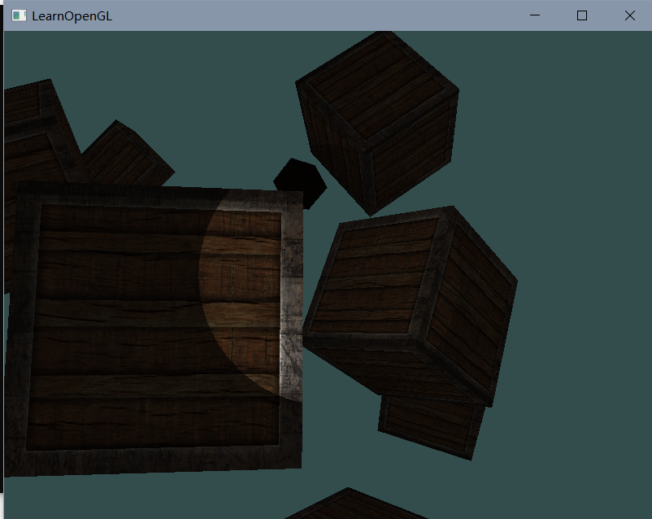


#### 平滑/软化边缘

为了创建一种看起来边缘平滑的聚光，我们需要模拟聚光有一个内圆锥(Inner Cone)和一个外圆锥(Outer Cone)。

- 内圆锥设置为上一部分中的那个圆锥
  - 片段在内圆锥之内，它的强度就是1.0
- 增加一个外圆锥，光从内圆锥逐渐减暗，直到外圆锥的边界
  - 再定义一个余弦值来代表聚光方向向量和外圆锥向量（等于它的半径）的夹角。
  - 如果一个片段处于内外圆锥之间，将会给它计算出一个0.0到1.0之间的强度值。


**公式**：

 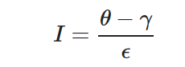


这里ϵ(Epsilon)是内（ϕ）和外圆锥（γ）之间的余弦值差（ϵ=ϕ−γ）。最终的I值就是在当前片段聚光的强度。

- θ就是片段与聚光方向的夹角余弦值

**参考值**：

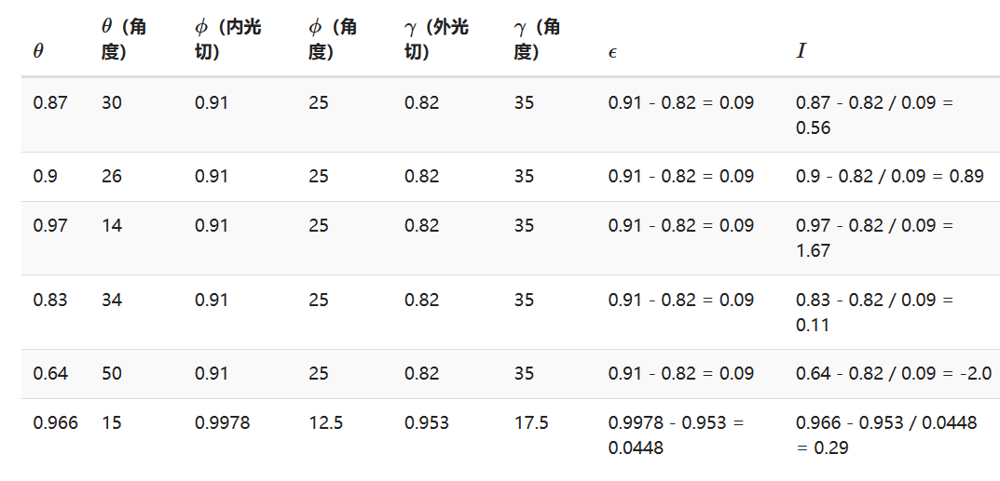

- 基本是在内外余弦值之间根据θ插值
- 在聚光外是负的，在内圆锥内大于1.0的，在边缘处于0-1之间


片段着色器

- clamp函数，它把第一个参数约束(Clamp)在了0.0到1.0之间。

```glsl
float theta     = dot(lightDir, normalize(-light.direction));
float epsilon   = light.cutOff - light.outerCutOff;
float intensity = clamp((theta - light.outerCutOff) / epsilon, 0.0, 1.0);    
...
// 将不对环境光做出影响，让它总是能有一点光
diffuse  *= intensity;
specular *= intensity;
...
```

结果：

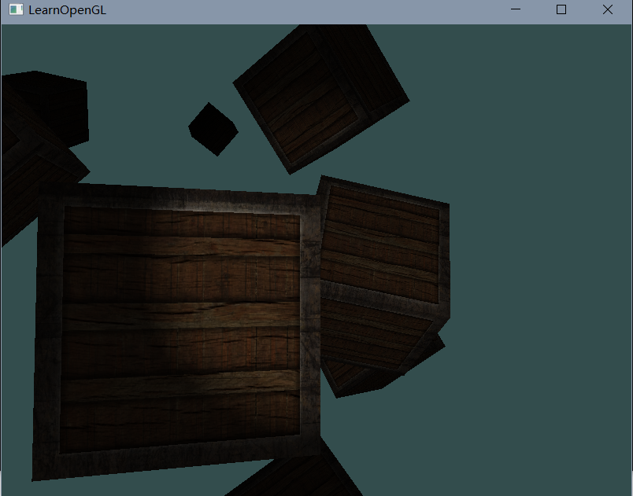


## 六、多光源

目标：

- 创建一个包含六个光源的场景。我们将模拟一个类似太阳的定向光(Directional Light)光源，四个分散在场景中的点光源(Point Light)，以及一个手电筒(Flashlight)。


将光照计算封装到GLSL函数中

- GLSL中的函数和C函数很相似，它有一个函数名、一个返回值类型
- 如果函数不是在main函数之前声明的，我们还必须在代码文件顶部声明一个原型
- 我们对每个光照类型都创建一个不同的函数：定向光、点光源和聚光。


在场景中使用多个光源时的实现思路：

- 有一个单独的颜色向量代表片段的输出颜色

- 对于每一个光源，它对片段的贡献颜色将会加到片段的输出颜色向量上

- 大体结构：

  ```glsl
  out vec4 FragColor;
  
  void main()
  {
    // 定义一个输出颜色值
    vec3 output;
    // 将定向光的贡献加到输出中
    output += someFunctionToCalculateDirectionalLight();
    // 对所有的点光源也做相同的事情
    for(int i = 0; i < nr_of_point_lights; i++)
      output += someFunctionToCalculatePointLight();
    // 也加上其它的光源（比如聚光）
    output += someFunctionToCalculateSpotLight();
  
    FragColor = vec4(output, 1.0);
  }
  ```

  

给着色器中的uniform数组元素设值

```c++
lightingShader.setFloat("pointLights[0].constant", 1.0f);
```


结果：

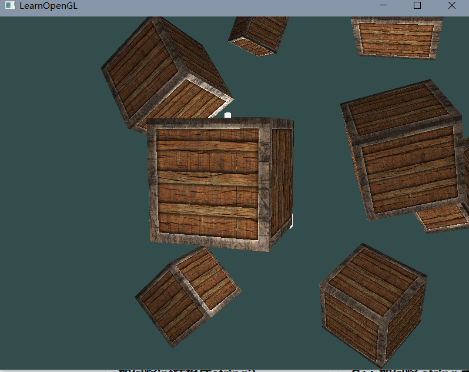


片段着色器

```glsl
#version 330 core
#define NR_POINT_LIGHTS 4

struct Material {
    // vec3 ambient;
    // vec3 diffuse;
    // vec3 specular;

    sampler2D diffuse;
    sampler2D specular;
    float shininess;
}; 

// 定向光
struct DirLight {
    vec3 direction;

    vec3 ambient;
    vec3 diffuse;
    vec3 specular;
};  

// 点光源
struct PointLight {
    vec3 position;

    float constant;
    float linear;
    float quadratic;

    vec3 ambient;
    vec3 diffuse;
    vec3 specular;
};  

// 聚光灯
struct SpotLight {
    vec3 position;    
    vec3 direction;
    float cutOff;
    float outerCutOff;

    vec3 ambient;
    vec3 diffuse;
    vec3 specular;

    float constant;
    float linear;
    float quadratic;
};

uniform DirLight dirLight;
uniform PointLight pointLights[NR_POINT_LIGHTS];
uniform SpotLight spotLight;

uniform Material material;
uniform vec3 viewPos;

in vec2 TexCoords;
in vec3 Normal;
in vec3 FragPos;

out vec4 FragColor;

vec3 CalcDirLight(DirLight light, vec3 normal, vec3 viewDir);
vec3 CalcPointLight(PointLight light, vec3 normal, vec3 fragPos, vec3 viewDir);
vec3 CalcSpotLight(SpotLight light, vec3 norm, vec3 FragPos, vec3 viewDir);

void main()
{
    // 属性
    vec3 norm = normalize(Normal);
    vec3 viewDir = normalize(viewPos - FragPos);

    // 第一阶段：定向光照
    vec3 result = CalcDirLight(dirLight, norm, viewDir);
    // 第二阶段：点光源
    for(int i = 0; i < NR_POINT_LIGHTS; i++)
        result += CalcPointLight(pointLights[i], norm, FragPos, viewDir);    
    // 第三阶段：聚光
    result += CalcSpotLight(spotLight, norm, FragPos, viewDir);    

    FragColor = vec4(result, 1.0);
}

vec3 CalcDirLight(DirLight light, vec3 normal, vec3 viewDir)
{
    vec3 lightDir = normalize(-light.direction);
    // 漫反射着色
    float diff = max(dot(normal, lightDir), 0.0);
    // 镜面光着色
    vec3 reflectDir = reflect(-lightDir, normal);
    float spec = pow(max(dot(viewDir, reflectDir), 0.0), material.shininess);
    // 合并结果
    vec3 ambient  = light.ambient  * vec3(texture(material.diffuse, TexCoords));
    vec3 diffuse  = light.diffuse  * diff * vec3(texture(material.diffuse, TexCoords));
    vec3 specular = light.specular * spec * vec3(texture(material.specular, TexCoords));
    return (ambient + diffuse + specular);
}

vec3 CalcPointLight(PointLight light, vec3 normal, vec3 fragPos, vec3 viewDir)
{
    vec3 lightDir = normalize(light.position - fragPos);
    // 漫反射着色
    float diff = max(dot(normal, lightDir), 0.0);
    // 镜面光着色
    vec3 reflectDir = reflect(-lightDir, normal);
    float spec = pow(max(dot(viewDir, reflectDir), 0.0), material.shininess);
    // 衰减
    float distance    = length(light.position - fragPos);
    float attenuation = 1.0 / (light.constant + light.linear * distance + 
                 light.quadratic * (distance * distance));    
    // 合并结果
    vec3 ambient  = light.ambient  * vec3(texture(material.diffuse, TexCoords));
    vec3 diffuse  = light.diffuse  * diff * vec3(texture(material.diffuse, TexCoords));
    vec3 specular = light.specular * spec * vec3(texture(material.specular, TexCoords));
    ambient  *= attenuation;
    diffuse  *= attenuation;
    specular *= attenuation;
    return (ambient + diffuse + specular);
}

vec3 CalcSpotLight(SpotLight light, vec3 norm, vec3 FragPos, vec3 viewDir) 
{
    vec3 lightDir = normalize(light.position - FragPos);

    float theta     = dot(lightDir, normalize(-light.direction));
    float epsilon   = light.cutOff - light.outerCutOff;
    float intensity = clamp((theta - light.outerCutOff) / epsilon, 0.0, 1.0); 

    // 90°以内，余弦值越大，角度越小
    // 环境光项
    vec3 ambient  = light.ambient  * vec3(texture(material.diffuse, TexCoords));

    // 漫反射项
    // 计算世界坐标下的片段法向量和光照方向，并点乘得到影响值
    float diff = max(dot(norm, lightDir), 0.0); // 是负数则认为是0
    vec3 diffuse  = light.diffuse  * diff * vec3(texture(material.diffuse, TexCoords));

    // 高光项
    vec3 reflectDir = reflect(-lightDir, norm);
    float spec = pow(max(dot(viewDir, reflectDir), 0.0), material.shininess);
    vec3 specular = light.specular * spec * (vec3(texture(material.specular, TexCoords)));

    // 片段和光源的距离
    float distance    = length(light.position - FragPos);
    // 衰减率
    float attenuation = 1.0 / (light.constant + light.linear * distance + 
                    light.quadratic * (distance * distance));

    ambient  *= attenuation;  // 聚光灯不对环境光做出影响，让它总是能有一点光
    diffuse  *= attenuation * intensity;
    specular *= attenuation * intensity;

    // 最终光照结果
    return (ambient + diffuse + specular);
}
```


主要代码

```cpp
#include "public.h"
#include <iostream>
#include "ShaderMgr.h"
#include "camera.h"
#include "stb_image.h"
#include "part1.h"
#include <string>

MyCamera g_camera;

float mixValue;

float vertices[] = {
    // positions          // normals           // texture coords
    -0.5f, -0.5f, -0.5f,  0.0f,  0.0f, -1.0f,  0.0f,  0.0f,
     0.5f, -0.5f, -0.5f,  0.0f,  0.0f, -1.0f,  1.0f,  0.0f,
     0.5f,  0.5f, -0.5f,  0.0f,  0.0f, -1.0f,  1.0f,  1.0f,
     0.5f,  0.5f, -0.5f,  0.0f,  0.0f, -1.0f,  1.0f,  1.0f,
    -0.5f,  0.5f, -0.5f,  0.0f,  0.0f, -1.0f,  0.0f,  1.0f,
    -0.5f, -0.5f, -0.5f,  0.0f,  0.0f, -1.0f,  0.0f,  0.0f,

    -0.5f, -0.5f,  0.5f,  0.0f,  0.0f,  1.0f,  0.0f,  0.0f,
     0.5f, -0.5f,  0.5f,  0.0f,  0.0f,  1.0f,  1.0f,  0.0f,
     0.5f,  0.5f,  0.5f,  0.0f,  0.0f,  1.0f,  1.0f,  1.0f,
     0.5f,  0.5f,  0.5f,  0.0f,  0.0f,  1.0f,  1.0f,  1.0f,
    -0.5f,  0.5f,  0.5f,  0.0f,  0.0f,  1.0f,  0.0f,  1.0f,
    -0.5f, -0.5f,  0.5f,  0.0f,  0.0f,  1.0f,  0.0f,  0.0f,

    -0.5f,  0.5f,  0.5f, -1.0f,  0.0f,  0.0f,  1.0f,  0.0f,
    -0.5f,  0.5f, -0.5f, -1.0f,  0.0f,  0.0f,  1.0f,  1.0f,
    -0.5f, -0.5f, -0.5f, -1.0f,  0.0f,  0.0f,  0.0f,  1.0f,
    -0.5f, -0.5f, -0.5f, -1.0f,  0.0f,  0.0f,  0.0f,  1.0f,
    -0.5f, -0.5f,  0.5f, -1.0f,  0.0f,  0.0f,  0.0f,  0.0f,
    -0.5f,  0.5f,  0.5f, -1.0f,  0.0f,  0.0f,  1.0f,  0.0f,

     0.5f,  0.5f,  0.5f,  1.0f,  0.0f,  0.0f,  1.0f,  0.0f,
     0.5f,  0.5f, -0.5f,  1.0f,  0.0f,  0.0f,  1.0f,  1.0f,
     0.5f, -0.5f, -0.5f,  1.0f,  0.0f,  0.0f,  0.0f,  1.0f,
     0.5f, -0.5f, -0.5f,  1.0f,  0.0f,  0.0f,  0.0f,  1.0f,
     0.5f, -0.5f,  0.5f,  1.0f,  0.0f,  0.0f,  0.0f,  0.0f,
     0.5f,  0.5f,  0.5f,  1.0f,  0.0f,  0.0f,  1.0f,  0.0f,

    -0.5f, -0.5f, -0.5f,  0.0f, -1.0f,  0.0f,  0.0f,  1.0f,
     0.5f, -0.5f, -0.5f,  0.0f, -1.0f,  0.0f,  1.0f,  1.0f,
     0.5f, -0.5f,  0.5f,  0.0f, -1.0f,  0.0f,  1.0f,  0.0f,
     0.5f, -0.5f,  0.5f,  0.0f, -1.0f,  0.0f,  1.0f,  0.0f,
    -0.5f, -0.5f,  0.5f,  0.0f, -1.0f,  0.0f,  0.0f,  0.0f,
    -0.5f, -0.5f, -0.5f,  0.0f, -1.0f,  0.0f,  0.0f,  1.0f,

    -0.5f,  0.5f, -0.5f,  0.0f,  1.0f,  0.0f,  0.0f,  1.0f,
     0.5f,  0.5f, -0.5f,  0.0f,  1.0f,  0.0f,  1.0f,  1.0f,
     0.5f,  0.5f,  0.5f,  0.0f,  1.0f,  0.0f,  1.0f,  0.0f,
     0.5f,  0.5f,  0.5f,  0.0f,  1.0f,  0.0f,  1.0f,  0.0f,
    -0.5f,  0.5f,  0.5f,  0.0f,  1.0f,  0.0f,  0.0f,  0.0f,
    -0.5f,  0.5f, -0.5f,  0.0f,  1.0f,  0.0f,  0.0f,  1.0f
};

glm::vec3 cubePositions[] = {
  glm::vec3(0.0f,  0.0f,  0.0f),
  glm::vec3(2.0f,  5.0f, -15.0f),
  glm::vec3(-1.5f, -2.2f, -2.5f),
  glm::vec3(-3.8f, -2.0f, -12.3f),
  glm::vec3(2.4f, -0.4f, -3.5f),
  glm::vec3(-1.7f,  3.0f, -7.5f),
  glm::vec3(1.3f, -2.0f, -2.5f),
  glm::vec3(1.5f,  2.0f, -2.5f),
  glm::vec3(1.5f,  0.2f, -1.5f),
  glm::vec3(-1.3f,  1.0f, -1.5f)
};


int main()
{
    mixValue = 0.2f;

    // GLFW 窗口初始化
    GLFWwindow* window = init_GLFW_window(800, 600, "LearnOpenGL");
    if (window == nullptr) {
        std::cout << "Failed to initialize GLFW" << std::endl;
        return -1;
    }

    // GLAD 函数地址初始化
    if (GL_FALSE == gladLoadGLLoader((GLADloadproc)glfwGetProcAddress))
    {
        std::cout << "Failed to initialize GLAD" << std::endl;
        return -1;
    }
    // 相机初始化
    g_camera.Init(glm::vec3(0.0f, 0.0f, 3.0f), glm::vec3(0.0f, 0.0f, -1.0f), glm::vec3(0.0f, 1.0f, 0.0f));

    // 开启深度缓冲
    glEnable(GL_DEPTH_TEST);

    // 顶点缓冲设置
    unsigned int VBO;
    glGenBuffers(1, &VBO);
    glBindBuffer(GL_ARRAY_BUFFER, VBO);
    // 把之前定义的顶点数据复制到缓冲的内存
    glBufferData(GL_ARRAY_BUFFER, sizeof(vertices), vertices, GL_STATIC_DRAW);

    // 灯光物体的顶点数组和属性设置
    unsigned int lightVAO;
    glGenVertexArrays(1, &lightVAO);
    glBindVertexArray(lightVAO);
    glVertexAttribPointer(0, 3, GL_FLOAT, GL_FALSE, 8 * sizeof(float), (void*)0);
    glEnableVertexAttribArray(0);

    // 物体顶点数组生成
    unsigned int VAO;
    glGenVertexArrays(1, &VAO);
    glBindVertexArray(VAO);
    glVertexAttribPointer(0, 3, GL_FLOAT, GL_FALSE, 8 * sizeof(float), (void*)0);
    glEnableVertexAttribArray(0);
    glVertexAttribPointer(1, 3, GL_FLOAT, GL_FALSE, 8 * sizeof(float), (void*)(3 * sizeof(float)));
    glEnableVertexAttribArray(1);
    glVertexAttribPointer(2, 2, GL_FLOAT, GL_FALSE, 8 * sizeof(float), (void*)(6 * sizeof(float)));
    glEnableVertexAttribArray(2);

    // 生成和绑定纹理对象，并载入纹理数据
    unsigned int texture1;
    unsigned char* data1 = nullptr;
    int width1, height1, nrChannels1;
    texture1 = GenAndLoadTexture("resource/container2.png", &width1, &height1, &nrChannels1, data1, GL_RGBA);
    if (texture1 == -1) {
        std::cout << "load texture failed1\n" << std::endl;
        return -1;
    }
    stbi_image_free(data1);

    unsigned int texture2;
    unsigned char* data2 = nullptr;
    int width2, height2, nrChannels2;
    texture2 = GenAndLoadTexture("resource/container2_specular.png", &width2, &height2, &nrChannels2, data2, GL_RGBA);
    if (texture2 == -1) {
        std::cout << "load texture failed2\n" << std::endl;
        return -1;
    }
    stbi_image_free(data2);

    // 激活纹理单元并绑定两个纹理对象到对应的纹理单元
    glActiveTexture(GL_TEXTURE0);
    glBindTexture(GL_TEXTURE_2D, texture1);

    glActiveTexture(GL_TEXTURE1);
    glBindTexture(GL_TEXTURE_2D, texture2);

    // 光源位置
    glm::vec3 dirLightPos(1.2f, 1.0f, 2.0f);
    glm::vec3 pointLightPositions[] = {
        glm::vec3(0.7f,  0.2f,  2.0f),
        glm::vec3(2.3f, -3.3f, -4.0f),
        glm::vec3(-4.0f,  2.0f, -12.0f),
        glm::vec3(0.0f,  0.0f, -3.0f)
    };

    // 光物体的着色器
    Shader lightShader("./ColorVShader.glsl", "./MaterialFShader_Light.glsl");

    // 普通物体的着色器
    Shader shader("./MultiLightVShader.glsl", "./MultiLightFShader.glsl");
    shader.use();
    shader.setVec3("viewPos", g_camera.GetPos());

    // 物体材质属性
    shader.setInt("material.diffuse", 0);
    shader.setInt("material.specular", 1);
    shader.setFloat("material.shininess", 32.0f);

    // 光照属性
   
    // 平行光
    shader.setVec3("dirLight.ambient", glm::vec3(0.2f, 0.2f, 0.2f));
    shader.setVec3("dirLight.diffuse", glm::vec3(0.5f, 0.5f, 0.5f)); // 将光照调暗了一些以搭配场景
    shader.setVec3("dirLight.specular", glm::vec3(1.0f, 1.0f, 1.0f));
    shader.setVec3("dirLight.direction", glm::vec3(1.0f, 1.0f, 1.0f));
    // 点光源
    for (int i = 0; i < 4; i++) {
        std::string name = "pointLights[";
        name += std::to_string(i);
        std::string after;
        after = "].constant";
        shader.setFloat(name + after, 1.0f);
        after = "].linear";
        shader.setFloat(name + after, 0.09f);
        after = "].quadratic";
        shader.setFloat(name + after, 0.032f);
        after = "].ambient";
        shader.setVec3(name + after, glm::vec3(0.2f, 0.2f, 0.2f));
        after = "].diffuse";
        shader.setVec3(name + after, glm::vec3(0.5f, 0.5f, 0.5f)); // 将光照调暗了一些以搭配场景
        after = "].specular";
        shader.setVec3(name + after, glm::vec3(1.0f, 1.0f, 1.0f));
    }
    // 聚光灯
    shader.setFloat("spotLight.constant", 1.0f);
    shader.setFloat("spotLight.linear", 0.09f);
    shader.setFloat("spotLight.quadratic", 0.032f);
    shader.setFloat("spotLight.cutOff", glm::cos(glm::radians(12.5f)));
    shader.setFloat("spotLight.outerCutOff", glm::cos(glm::radians(17.5f)));
    shader.setVec3("spotLight.ambient", glm::vec3(0.2f, 0.2f, 0.2f));
    shader.setVec3("spotLight.diffuse", glm::vec3(0.5f, 0.5f, 0.5f)); // 将光照调暗了一些以搭配场景
    shader.setVec3("spotLight.specular", glm::vec3(1.0f, 1.0f, 1.0f));

    // 渲染循环
    while (!glfwWindowShouldClose(window))	// 检查是否被要求退出窗口
    {
        // 输入处理
        processInput(window);

        // 帧渲染时间
        float deltaTime;
        float lastFrame = 0;
        float currentFrame = glfwGetTime();
        deltaTime = currentFrame - lastFrame;
        lastFrame = currentFrame;

        g_camera.SetSpeed(deltaTime);
        
        // 更新着色器中的观察位置变量
        shader.setVec3("viewPos", g_camera.GetPos());

        // 重置颜色缓冲和深度缓冲
        glClearColor(0.2f, 0.3f, 0.3f, 1.0f);
        glClear(GL_COLOR_BUFFER_BIT | GL_DEPTH_BUFFER_BIT);

        // 计算mvp变换矩阵
        glm::mat4 view = g_camera.GetLookAt();

        glm::mat4 projection = glm::mat4(1.0f);
        projection = glm::perspective(glm::radians(g_camera.GetFov()), 800.0f / 600.0f, 0.1f, 100.0f);

        lightShader.use();
        // 绘制点光源光照立方体
        for (int i = 0; i < 4; i++) {
            glm::mat4 light_model = glm::mat4(1.0f);
            light_model = glm::translate(light_model, pointLightPositions[i]);
            // 光源绕圈移动（模型变换修改）
            float angle = 2.0f * (float)glfwGetTime();
            light_model = glm::translate(light_model, glm::vec3(sin(angle), cos(angle), 0));
            light_model = glm::scale(light_model, glm::vec3(0.2f));

            lightShader.setMat4("model", light_model);
            lightShader.setMat4("view", view);
            lightShader.setMat4("projection", projection);
            lightShader.setVec3("lightColor", glm::vec3(1.0f));

            glBindVertexArray(lightVAO);
            glDrawArrays(GL_TRIANGLES, 0, 36);
        }

        // 绘制立方体
        shader.use();
        shader.setMat4("view", view);
        shader.setMat4("projection", projection);
        // 更新着色器中的光源信息
        
        // 点光源位置
        float angle = 2.0f * (float)glfwGetTime();
        for (int i = 0; i < 4; i++) {
            std::string name = "";
            name += "pointLights[";
            name += std::to_string(i);
            name += "].position";
            shader.setVec3(name, pointLightPositions[i] + glm::vec3(sin(angle), cos(angle), 0));
        }

        // 聚光灯位置和方向
        shader.setVec3("spotLight.position", g_camera.GetPos());
        shader.setVec3("spotLight.direction", g_camera.GetFront());

        glBindVertexArray(VAO);
        for (unsigned int i = 0; i < 10; i++)
        {
            glm::mat4 model = glm::mat4(1.0f);
            model = glm::translate(model, cubePositions[i]);
            float angle = 20.0f * i * (float)glfwGetTime();
            model = glm::rotate(model, glm::radians(angle), glm::vec3(1.0f, 0.3f, 0.5f));
            shader.setMat4("model", model);

            glDrawArrays(GL_TRIANGLES, 0, 36);
        }
        glBindVertexArray(0);

        // 交换颜色缓冲，输出显示到屏幕
        glfwSwapBuffers(window);
        // 检查有没有触发什么事件（比如键盘输入、鼠标移动等）、更新窗口状态，并调用对应的回调函数
        glfwPollEvents();
    }
    glfwTerminate();
    return 0;
}
```


