# 高级OpenGL（上）深度测试、模板测试、混合、面剔除、帧缓冲


## 一、深度测试

前面我们运用了`深度缓冲(Depth Buffer)`，来防止被阻挡的面渲染到其它面的前面。

- 深度缓冲（或z缓冲(z-buffer)）
- 深度值(Depth Value)

OpenGL会执行深度测试

- 如果这个测试通过了的话，深度缓冲将会更新为新的深度值
- 如果深度测试失败了，片段将会被丢弃。

在片段着色器运行之后（以及模板测试(Stencil Testing)运行之后）在屏幕空间中运行的。

- 屏幕空间坐标与通过OpenGL的glViewport所定义的视口密切相关
- 可以直接使用GLSL内建变量gl_FragCoord从片段着色器中直接访问
  - gl_FragCoord的x和y分量代表了片段的屏幕空间坐标（其中(0, 0)位于左下角）
  - gl_FragCoord中也包含了一个z分量，它包含了片段真正的深度值。
  - z值就是需要与深度缓冲内容所对比的那个值。

<!--more-->


> 提前深度测试 Early Depth Testing
>
> - 允许深度测试在片段着色器之前运行
> - 限制：在片段着色器中，不能再写入片段的深度值


### 深度测试函数

```cpp
// 启用深度测试
glEnable(GL_DEPTH_TEST);

// 清空缓冲
glClear(GL_COLOR_BUFFER_BIT | GL_DEPTH_BUFFER_BIT);

// 设置为只读的深度缓冲
glDepthMask(GL_FALSE);


```


```cpp
// 设置深度测试中的比较运算符
glDepthFunc(GL_LESS);

```


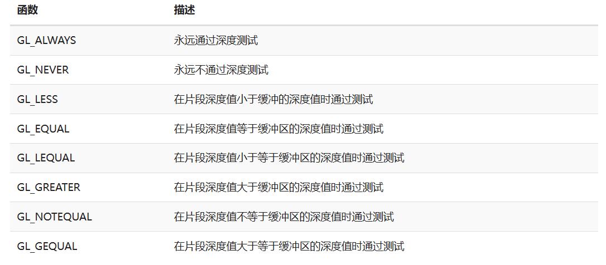


### 深度值精度

深度缓冲包含了一个介于0.0和1.0之间的深度值

- 观察空间的z值可能是投影平截头体的**近平面**(Near)和**远平面**(Far)之间的任何值。

- 我们需要一种方式来将这些观察空间的z值变换到[0, 1]范围之间。

  - 线性变换（透视不正确）

    - 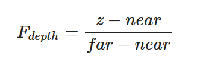

  - 非线性变换（在z值很小的时候提供非常高的精度，而在z值很大的时候提供更少的精度）

    - 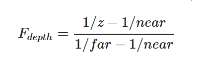
    -  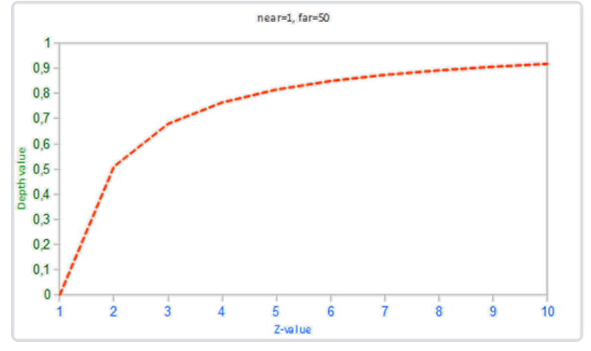


​    

### 深度缓冲可视化

片段着色器

```glsl
void main()
{
    FragColor = vec4(vec3(gl_FragCoord.z), 1.0);
}
```


- OpenGL默认是用非线性的方式计算深度值

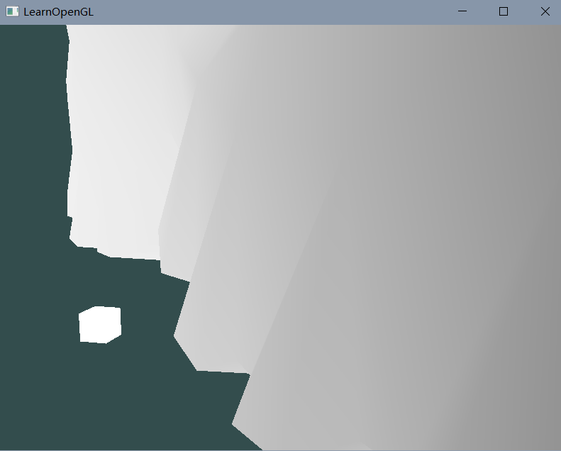


改为线性深度值

```glsl
#version 330 core
out vec4 FragColor;

float near = 0.1; 
float far  = 100.0; 

float LinearizeDepth(float depth) 
{
    float z = depth * 2.0 - 1.0; // back to NDC 
    return (2.0 * near * far) / (far + near - z * (far - near));    
}

void main()
{             
    float depth = LinearizeDepth(gl_FragCoord.z) / far; // 为了演示除以 far
    FragColor = vec4(vec3(depth), 1.0);
}
```


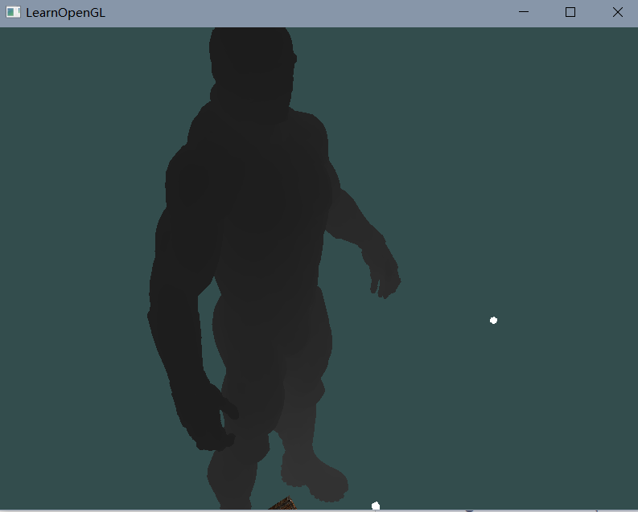


### 深度冲突

深度冲突(Z-fighting)：一个很常见的视觉错误会在两个平面或者三角形非常紧密地平行排列在一起时会发生

- 深度缓冲没有足够的精度来决定两个形状哪个在前面。
- 结果就是这两个形状不断地在切换前后顺序，这会导致很奇怪的花纹。
- 当物体在远处时效果会更明显（因为深度缓冲在z值比较大的时候有着更小的精度）。

防止方法：

- 不要把多个物体摆得太靠近
- 尽可能将`近平面`设置远一些
- 使用更高精度的深度缓冲(牺牲性能)


## 二、模板测试

### 模板测试

- 当片段着色器处理完一个片段之后，模板测试(Stencil Test)会开始执行。

- 和深度测试一样，它也可能会丢弃片段。

- 模板测试之后，被保留的片段会进入深度测试。


### 模板缓冲

- 一个模板缓冲中，（通常）每个模板值(Stencil Value)是8位的。所以每个像素/片段一共能有256种不同的模板值。

- 我们可以将这些模板值设置为我们想要的值，然后当某一个片段有某一个模板值的时候，我们就可以选择丢弃或是保留这个片段了。
- 我们可以在渲染循环中更新模板缓冲

> 每个窗口库都需要为你配置一个模板缓冲。GLFW自动做了这件事，所以我们不需要告诉GLFW来创建一个，但其它的窗口库可能不会默认给你创建一个模板库，所以记得要查看库的文档。

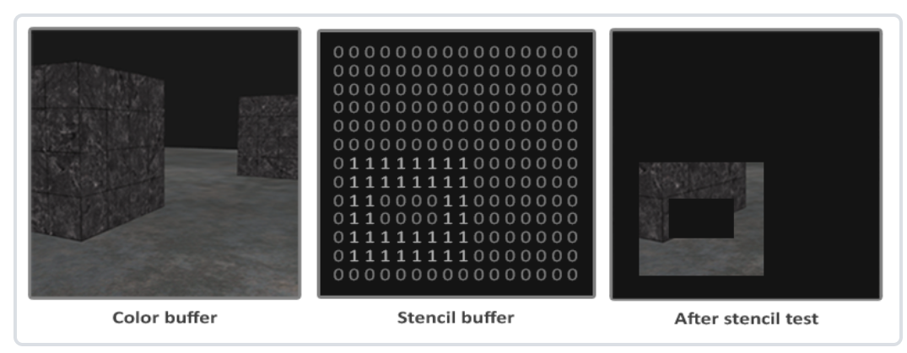


### 模板测试操作流程

- 启用模板缓冲的写入。
- 渲染物体，更新模板缓冲的内容。
- 禁用模板缓冲的写入。
- 渲染（其它）物体，这次根据模板缓冲的内容丢弃特定的片段。

通过使用模板缓冲，我们可以根据场景中已绘制的其它物体的片段，来决定是否丢弃特定的片段。


```cpp
// 启用
glEnable(GL_STENCIL_TEST);

// 清除
glClear(GL_COLOR_BUFFER_BIT | GL_DEPTH_BUFFER_BIT | GL_STENCIL_BUFFER_BIT);

// 掩码设置（与将要写入缓冲的模板值进行与 AND 运算）
glStencilMask(0xFF); // 每一位写入模板缓冲时都保持原样
glStencilMask(0x00); // 每一位在写入模板缓冲时都会变成0（禁用写入）
// 大部分情况下你都只会使用0x00或者0xFF作为模板掩码(Stencil Mask)，但是知道有选项可以设置自定义的位掩码总是好的。
```


### 模板函数

我们对模板缓冲应该通过还是失败，以及它应该如何影响模板缓冲，也是有一定控制的。

#### glStencilFunc

设置如何比较模板值（如何进行模板测试）

```cpp
glStencilFunc(GLenum func, GLint ref, GLuint mask);
```

- `func`：设置模板测试函数(Stencil Test Function)。这个测试函数将会应用到已储存的模板值上和glStencilFunc函数的`ref`值上。可用的选项有：
  - GL_NEVER、GL_LESS、GL_LEQUAL、GL_GREATER、GL_GEQUAL、GL_EQUAL、GL_NOTEQUAL和GL_ALWAYS。
  -  9它们的语义和深度缓冲的函数类似。
- `ref`：设置了模板测试的参考值(Reference Value)。模板缓冲的内容将会与这个值进行比较。
- `mask`：设置一个掩码，它将会与参考值和储存的模板值在测试比较它们之前进行与(AND)运算。初始情况下所有位都为1。


比如 `glStencilFunc(GL_EQUAL, 1, 0xFF)` 告诉OpenGL，只要一个片段的模板值等于(`GL_EQUAL`)参考值1，片段将会通过测试并被绘制，否则会被丢弃。


#### glStencilOp

设置何时更新模板缓冲

```
glStencilOp(GLenum sfail, GLenum dpfail, GLenum dppass)
```

- `sfail`：模板测试失败时采取的行为。
- `dpfail`：模板测试通过，但深度测试失败时采取的行为。
- `dppass`：模板测试和深度测试都通过时采取的行为。

每个选项都可以选用以下的其中一种行为：

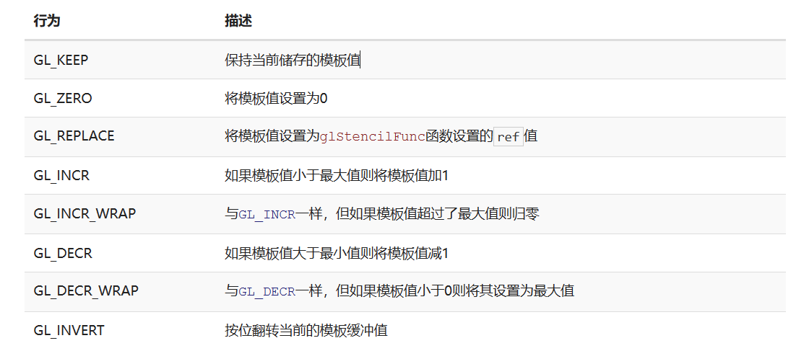


- 默认情况下glStencilOp是设置为`(GL_KEEP, GL_KEEP, GL_KEEP)`的，所以不论任何测试的结果是如何，模板缓冲都会保留它的值。
- 如果你想写入模板缓冲的话，你需要至少对其中一个选项设置不同的值。


### 实操

- 实现物体轮廓效果
- 边缘检测

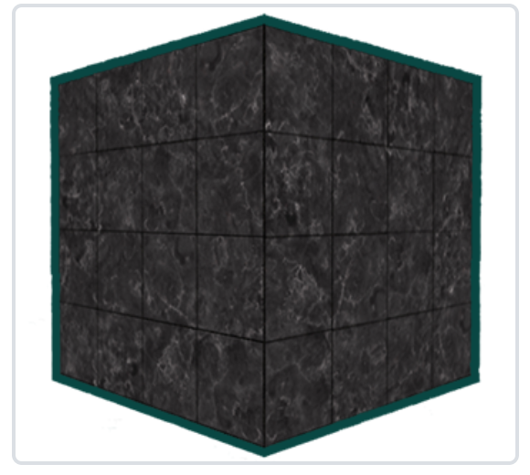

实现步骤：

1. 在绘制（需要添加轮廓的）物体之前，将模板函数设置为GL_ALWAYS，每当物体的片段被渲染时，将模板缓冲更新为1。
2. 渲染物体。
3. 禁用模板写入以及深度测试。
4. 将每个物体缩放一点点。
5. 使用一个不同的片段着色器，输出一个单独的（边框）颜色。
6. 再次绘制物体，但只在它们片段的模板值不等于1时才绘制。
7. 再次启用模板写入和深度测试。


大概如下

```cpp
glEnable(GL_DEPTH_TEST);
glStencilOp(GL_KEEP, GL_KEEP, GL_REPLACE);  

glClear(GL_COLOR_BUFFER_BIT | GL_DEPTH_BUFFER_BIT | GL_STENCIL_BUFFER_BIT); 

glStencilMask(0x00); // 记得保证我们在绘制地板的时候不会更新模板缓冲
normalShader.use();
DrawFloor()  

glStencilFunc(GL_ALWAYS, 1, 0xFF); 
glStencilMask(0xFF); 
DrawTwoContainers();

glStencilFunc(GL_NOTEQUAL, 1, 0xFF);
glStencilMask(0x00); 
glDisable(GL_DEPTH_TEST);
shaderSingleColor.use(); 
DrawTwoScaledUpContainers();
glStencilMask(0xFF);
glEnable(GL_DEPTH_TEST);  
```


> （想想策略游戏中，我们希望选择10个单位，合并边框通常是我们想需要的结果）。如果你想让每个物体都有一个完整的边框，你需要对每个物体都清空模板缓冲，并有创意地利用深度缓冲。
>
> 除了物体轮廓之外，模板测试还有很多用途，比如在一个后视镜中绘制纹理，让它能够绘制到镜子形状中，或者使用一个叫做阴影体积(Shadow Volume)的模板缓冲技术渲染实时阴影。


结果：在大个的模型中的效果有点怪(估计因为模型的模型空间原点是在两脚中间，所以缩放之后是往两边和往上扩的)

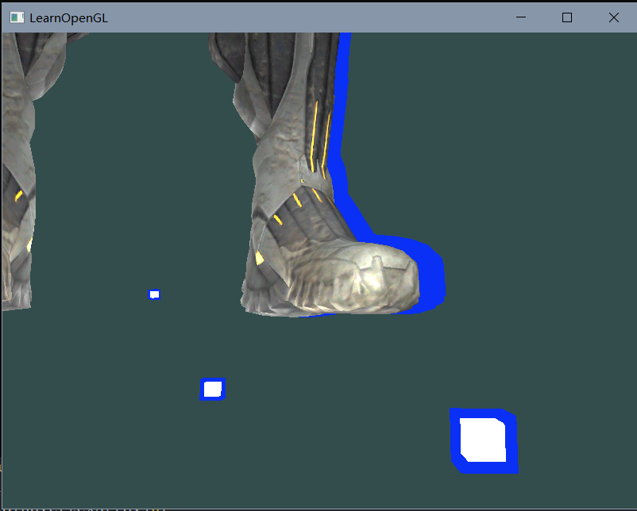


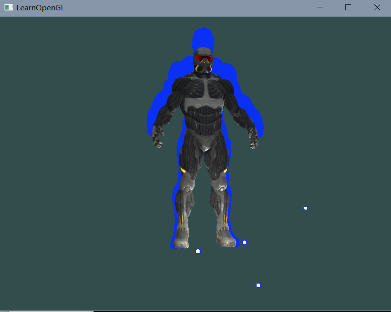


## 三、混合

### 透明

OpenGL中，`混合(Blending)`通常是实现物体`透明度(Transparency)`的一种技术

透明就是指：一个物体（或者其中的一部分）不是纯色(Solid Color)的，它的颜色是物体本身的颜色和它背后其它物体的颜色的不同强度结合。


全透明 VS **半透明玻璃**

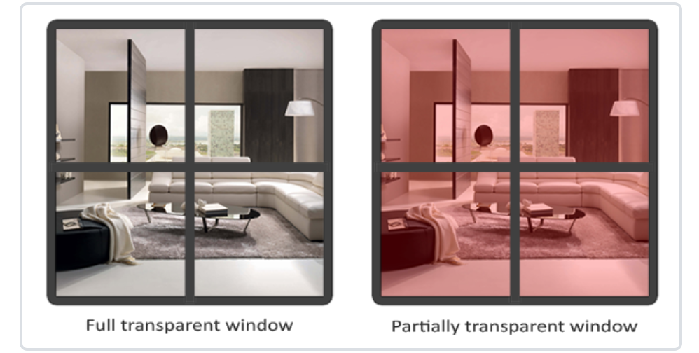


**Alpha值**

一个物体的透明度是通过它颜色的alpha值来决定的，即RGBA中的A。

当alpha值为0.5时，物体的颜色有50%是来自物体自身的颜色，50%来自背后物体的颜色。


### 全透明

用纹理贴图来实现 草 （草的形状很不规则，但是纹理图片是一个四边形）

- 对于不想显示的部分，透明度alpha值为 0.0；
- 对于草的部分，透明度alpha值为 1.0；

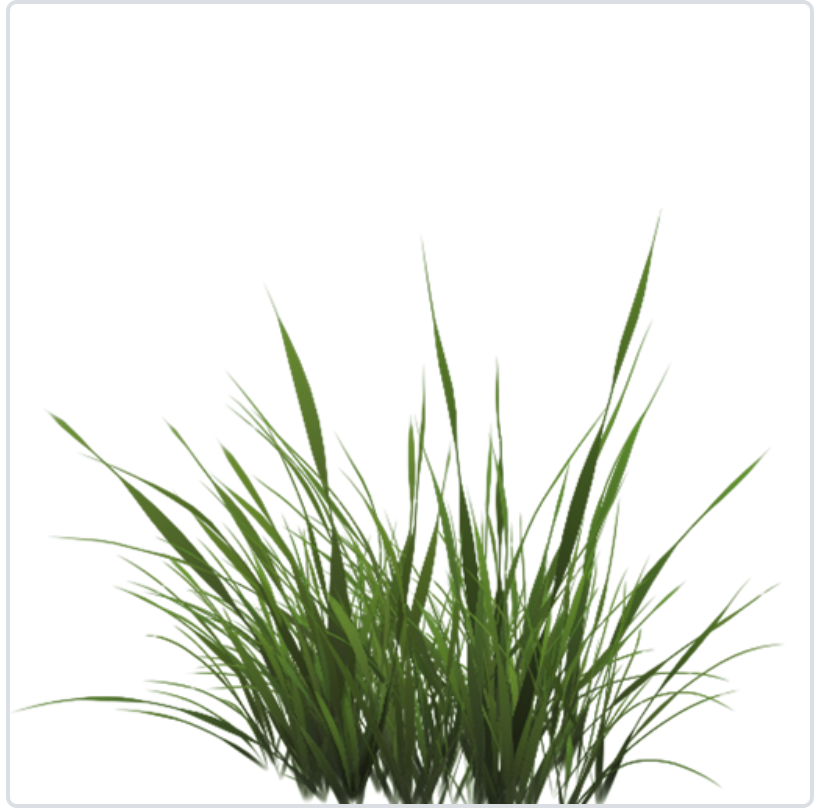

实现注意：

- 纹理生成时使用RGBA模式

  ```cpp
  glTexImage2D(GL_TEXTURE_2D, 0, GL_RGBA, width, height, 0, GL_RGBA, GL_UNSIGNED_BYTE, data);
  ```

- 在片段着色器中采样四个分量，而不是三个

  ```glsl
  void main()
  {
      // FragColor = vec4(vec3(texture(texture1, TexCoords)), 1.0);
      FragColor = texture(texture1, TexCoords);
  }
  ```

- 利用glsl中的 `discard` 命令丢弃片段

  ```glsl
  #version 330 core
  out vec4 FragColor;
  
  in vec2 TexCoords;
  
  uniform sampler2D texture1;
  
  void main()
  {             
      vec4 texColor = texture(texture1, TexCoords);
      if(texColor.a < 0.1)
          discard;
      FragColor = texColor;
  }
  ```

  

> **四边形贴图边缘出现半透明的边框**
>
> 注意，当采样纹理的边缘的时候，OpenGL会对边缘的值和纹理下一个重复的值进行插值（因为我们将它的环绕方式设置为了GL_REPEAT。这通常是没问题的，但是由于我们使用了透明值，纹理图像的顶部将会与底部边缘的纯色值进行插值。这样的结果是一个半透明的有色边框，你可能会看见它环绕着你的纹理四边形。要想避免这个，每当你alpha纹理的时候，请将纹理的环绕方式设置为GL_CLAMP_TO_EDGE：
>
> ```cpp
> glTexParameteri( GL_TEXTURE_2D, GL_TEXTURE_WRAP_S, GL_CLAMP_TO_EDGE);
> glTexParameteri( GL_TEXTURE_2D, GL_TEXTURE_WRAP_T, GL_CLAMP_TO_EDGE);
> ```


### 半透明

#### 理论

直接丢弃片段不能用来渲染半透明的图像，需要使用混合。

- 启用`混合`blending

```cpp
glEnable(GL_BLEND);
```

- 混合公式

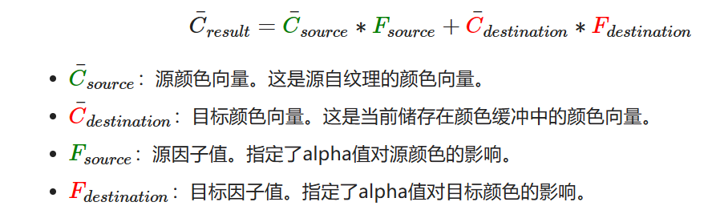

- 混合的执行时机：片段着色器运行完成后，并且所有的测试都通过之后，这个混合方程(Blend Equation)才会应用到片段颜色输出与当前颜色缓冲中的值（当前片段之前储存的之前片段的颜色）上。

- 设置混合的因子值

  - 源颜色和目标颜色将会由OpenGL自动设定，但源因子和目标因子的值可以由我们来决定。

  - 一般源因子值设为纹理的alpha值，目标因子值设为(1 - 纹理的alpha值)

    ```cpp
    glBlendFunc(GL_SRC_ALPHA, GL_ONE_MINUS_SRC_ALPHA);
    ```

    

  - `glBlendFunc(GLenum sfactor, GLenum dfactor)`函数接受两个参数，来设置源和目标因子。

  - 设置选项：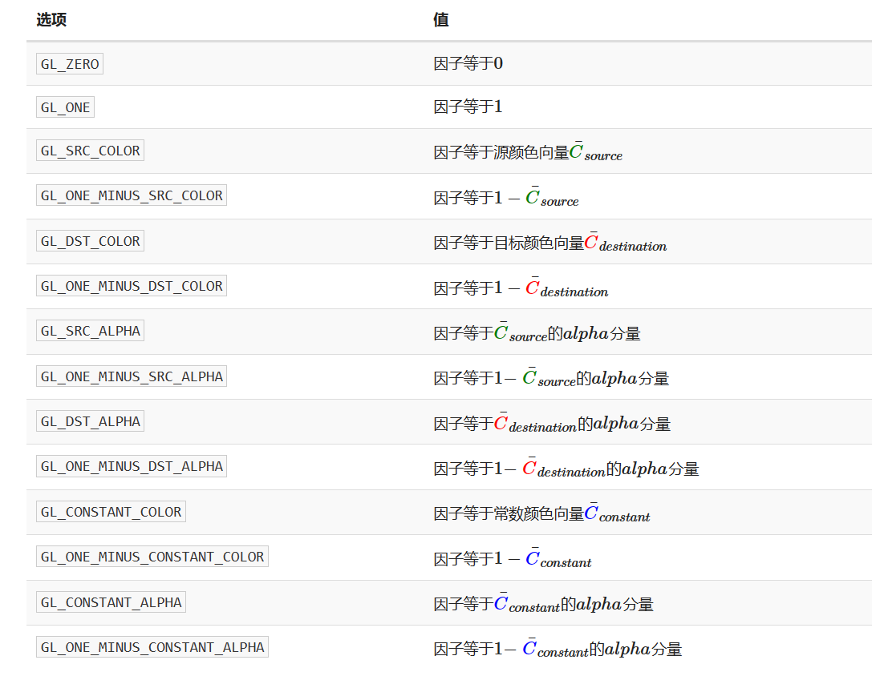

  - 设置 C constant ：`glBlendColor函数`

  - 也可以使用`glBlendFuncSeparate`为 RGB 和 alpha 通道分别设置不同的选项：

    ```cpp
    glBlendFuncSeparate(GL_SRC_ALPHA, GL_ONE_MINUS_SRC_ALPHA, GL_ONE, GL_ZERO);
    ```

  - 改变运算符：`glBlendEquation(GLenum mode)`
    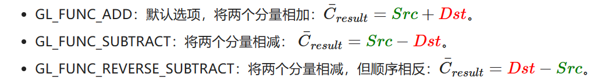

#### 实操

全透明加上半透明

- 由于开启了混合Blending，全透明的效果可以不用丢弃片段的方式实现，但是不推荐。
- 但是深度测试和混合一起使用的话会产生一些麻烦，绘制多个半透明物体需要从后往前绘制才能正常。


草使用discard丢弃片段的方式

```glsl
#version 330 core
out vec4 FragColor;

in vec2 TexCoords;

uniform sampler2D texture1;

void main()
{             
    vec4 texColor = texture(texture1, TexCoords);
    if(texColor.a < 0.1)
        discard;
    FragColor = texColor;
}
```

窗户使用混合的方式

```glsl
#version 330 core
out vec4 FragColor;

in vec2 TexCoords;

uniform sampler2D texture1;

void main()
{             
    FragColor = texture(texture1, TexCoords);
}
```


##### 结果

- 正确

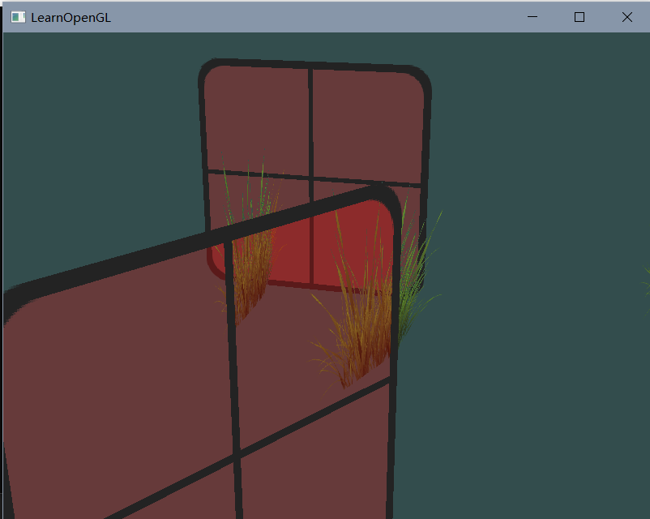


- 错误

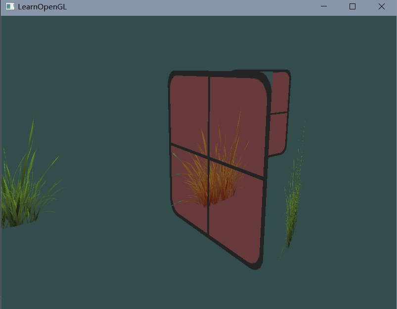

- 发生这一现象的原因是，深度测试和混合一起使用的话会产生一些麻烦。
  - 当写入深度缓冲时，深度缓冲不会检查片段是否是透明的，所以透明的部分会和其它值一样写入到深度缓冲中。
  - 结果就是窗户的整个四边形不论透明度都会进行深度测试。
  - 即使透明的部分应该显示背后的窗户，深度测试仍然丢弃了它们。

- 跟渲染顺序有关
  - 从前往后：如果先绘制了位于前面的窗户，之后在绘制后面的窗户时，深度测试会将后面的窗户的片段丢弃
  - 从后往前：如果先绘制了后面的窗户，则他们一开始不会被丢弃，即颜色会被先存到颜色缓冲中。之后绘制前面的窗户时，则可以用颜色缓冲中的颜色进行混合。

> 当绘制一个有不透明和透明物体的场景的时候，大体的原则如下：
>
> 1. 先绘制所有不透明的物体。
> 2. 对所有透明的物体排序。
> 3. 按顺序绘制所有透明的物体。

>排序物体的一种方式
>
>- 从观察者视角获取物体的距离
>- 通过计算摄像机位置向量和物体的位置向量之间的距离所获得
>- map会自动根据键值(Key)对它的值排序
>- 按反序（由远到近）进行渲染
>
>```cpp
>std::map<float, glm::vec3> sorted;
>for (unsigned int i = 0; i < windows.size(); i++)
>{
>    float distance = glm::length(camera.Position - windows[i]);
>    sorted[distance] = windows[i];
>}
>
>for(std::map<float,glm::vec3>::reverse_iterator it = sorted.rbegin(); it != sorted.rend(); ++it) 
>{
>    model = glm::mat4();
>    model = glm::translate(model, it->second);              
>    shader.setMat4("model", model);
>    glDrawArrays(GL_TRIANGLES, 0, 6);
>}
>```
>
>
>
>欠缺：
>
>- 并没有考虑旋转、缩放或者其它的变换，奇怪形状的物体需要一个不同的计量，而不是仅仅一个位置向量
>- 在场景中排序物体是一个很困难的技术，很大程度上由你场景的类型所决定，更别说它额外需要消耗的处理能力了。


> 更高级的技术
>
> - 次序无关透明度(Order Independent Transparency, OIT)
>
>   

##### 代码

```cpp
#include "public.h"
#include <iostream>
#include "ShaderMgr.h"
#include "camera.h"
#include "part1.h"
#include <string>
#include <vector>
#include <map>
#include "Model.h"

MyCamera g_camera;

float mixValue;

float vertices[] = {
    // positions          // normals           // texture coords
    -0.5f, -0.5f, -0.5f,  0.0f,  0.0f, -1.0f,  0.0f,  0.0f,
     0.5f, -0.5f, -0.5f,  0.0f,  0.0f, -1.0f,  1.0f,  0.0f,
     0.5f,  0.5f, -0.5f,  0.0f,  0.0f, -1.0f,  1.0f,  1.0f,
     0.5f,  0.5f, -0.5f,  0.0f,  0.0f, -1.0f,  1.0f,  1.0f,
    -0.5f,  0.5f, -0.5f,  0.0f,  0.0f, -1.0f,  0.0f,  1.0f,
    -0.5f, -0.5f, -0.5f,  0.0f,  0.0f, -1.0f,  0.0f,  0.0f,

    -0.5f, -0.5f,  0.5f,  0.0f,  0.0f,  1.0f,  0.0f,  0.0f,
     0.5f, -0.5f,  0.5f,  0.0f,  0.0f,  1.0f,  1.0f,  0.0f,
     0.5f,  0.5f,  0.5f,  0.0f,  0.0f,  1.0f,  1.0f,  1.0f,
     0.5f,  0.5f,  0.5f,  0.0f,  0.0f,  1.0f,  1.0f,  1.0f,
    -0.5f,  0.5f,  0.5f,  0.0f,  0.0f,  1.0f,  0.0f,  1.0f,
    -0.5f, -0.5f,  0.5f,  0.0f,  0.0f,  1.0f,  0.0f,  0.0f,

    -0.5f,  0.5f,  0.5f, -1.0f,  0.0f,  0.0f,  1.0f,  0.0f,
    -0.5f,  0.5f, -0.5f, -1.0f,  0.0f,  0.0f,  1.0f,  1.0f,
    -0.5f, -0.5f, -0.5f, -1.0f,  0.0f,  0.0f,  0.0f,  1.0f,
    -0.5f, -0.5f, -0.5f, -1.0f,  0.0f,  0.0f,  0.0f,  1.0f,
    -0.5f, -0.5f,  0.5f, -1.0f,  0.0f,  0.0f,  0.0f,  0.0f,
    -0.5f,  0.5f,  0.5f, -1.0f,  0.0f,  0.0f,  1.0f,  0.0f,

     0.5f,  0.5f,  0.5f,  1.0f,  0.0f,  0.0f,  1.0f,  0.0f,
     0.5f,  0.5f, -0.5f,  1.0f,  0.0f,  0.0f,  1.0f,  1.0f,
     0.5f, -0.5f, -0.5f,  1.0f,  0.0f,  0.0f,  0.0f,  1.0f,
     0.5f, -0.5f, -0.5f,  1.0f,  0.0f,  0.0f,  0.0f,  1.0f,
     0.5f, -0.5f,  0.5f,  1.0f,  0.0f,  0.0f,  0.0f,  0.0f,
     0.5f,  0.5f,  0.5f,  1.0f,  0.0f,  0.0f,  1.0f,  0.0f,

    -0.5f, -0.5f, -0.5f,  0.0f, -1.0f,  0.0f,  0.0f,  1.0f,
     0.5f, -0.5f, -0.5f,  0.0f, -1.0f,  0.0f,  1.0f,  1.0f,
     0.5f, -0.5f,  0.5f,  0.0f, -1.0f,  0.0f,  1.0f,  0.0f,
     0.5f, -0.5f,  0.5f,  0.0f, -1.0f,  0.0f,  1.0f,  0.0f,
    -0.5f, -0.5f,  0.5f,  0.0f, -1.0f,  0.0f,  0.0f,  0.0f,
    -0.5f, -0.5f, -0.5f,  0.0f, -1.0f,  0.0f,  0.0f,  1.0f,

    -0.5f,  0.5f, -0.5f,  0.0f,  1.0f,  0.0f,  0.0f,  1.0f,
     0.5f,  0.5f, -0.5f,  0.0f,  1.0f,  0.0f,  1.0f,  1.0f,
     0.5f,  0.5f,  0.5f,  0.0f,  1.0f,  0.0f,  1.0f,  0.0f,
     0.5f,  0.5f,  0.5f,  0.0f,  1.0f,  0.0f,  1.0f,  0.0f,
    -0.5f,  0.5f,  0.5f,  0.0f,  1.0f,  0.0f,  0.0f,  0.0f,
    -0.5f,  0.5f, -0.5f,  0.0f,  1.0f,  0.0f,  0.0f,  1.0f
};

// 四边形窗户
float verticesWindow[] = {
    // positions        // texture coords
    -0.5f, -0.5f, -0.5f,  0.0f,  1.0f,
     0.5f, -0.5f, -0.5f,  1.0f,  1.0f,
     0.5f,  0.5f, -0.5f,  1.0f,  0.0f,
     0.5f,  0.5f, -0.5f,  1.0f,  0.0f,
    -0.5f,  0.5f, -0.5f,  0.0f,  0.0f,
    -0.5f, -0.5f, -0.5f,  0.0f,  1.0f,
};

int main()
{
    mixValue = 0.2f;

    // GLFW 窗口初始化
    GLFWwindow* window = init_GLFW_window(800, 600, "LearnOpenGL");
    if (window == nullptr) {
        std::cout << "Failed to initialize GLFW" << std::endl;
        return -1;
    }

    // GLAD 函数地址初始化
    if (GL_FALSE == gladLoadGLLoader((GLADloadproc)glfwGetProcAddress))
    {
        std::cout << "Failed to initialize GLAD" << std::endl;
        return -1;
    }
    // 相机初始化
    g_camera.Init(glm::vec3(0.0f, 0.0f, 3.0f), glm::vec3(0.0f, 0.0f, -1.0f), glm::vec3(0.0f, 1.0f, 0.0f));

    // 开启深度缓冲
    glEnable(GL_DEPTH_TEST);

    // 开启和设置混合
    glEnable(GL_BLEND);
    glBlendFunc(GL_SRC_ALPHA, GL_ONE_MINUS_SRC_ALPHA);

    // Grass 和 Window 共用 VBO 和 VAO
    unsigned int windowVBO;
    glGenBuffers(1, &windowVBO);
    glBindBuffer(GL_ARRAY_BUFFER, windowVBO);
    glBufferData(GL_ARRAY_BUFFER, sizeof(verticesWindow), verticesWindow, GL_STATIC_DRAW);
    unsigned int windowVAO;
    glGenVertexArrays(1, &windowVAO);
    glBindVertexArray(windowVAO);
    glVertexAttribPointer(0, 3, GL_FLOAT, GL_FALSE, 5 * sizeof(float), (void*)0);
    glEnableVertexAttribArray(0);
    glVertexAttribPointer(1, 2, GL_FLOAT, GL_FALSE, 5 * sizeof(float), (void*)(3 * sizeof(float)));
    glEnableVertexAttribArray(1);

    // 各用各的纹理
    unsigned int textureGrass;
    unsigned char* data1 = nullptr;
    int width1, height1, nrChannels1;
    textureGrass = GenAndLoadTexture("resource/grass.png", &width1, &height1, &nrChannels1, data1, GL_RGBA);
    if (textureGrass == -1) {
        std::cout << "load texture failed1\n" << std::endl;
        return -1;
    }
    stbi_image_free(data1);

    unsigned int textureWindow;
    unsigned char* data2 = nullptr;
    int width2, height2, nrChannels2;
    textureWindow = GenAndLoadTexture("resource/blending_transparent_window.png", &width2, &height2, &nrChannels2, data2, GL_RGBA);
    if (textureWindow == -1) {
        std::cout << "load texture failed2\n" << std::endl;
        return -1;
    }
    stbi_image_free(data2);

    std::vector<glm::vec3> vegetation;
    vegetation.push_back(glm::vec3(-1.5f, 0.0f, -0.48f));
    vegetation.push_back(glm::vec3(1.5f, 0.0f, 0.51f));
    vegetation.push_back(glm::vec3(0.0f, 0.0f, 0.7f));
    vegetation.push_back(glm::vec3(-0.3f, 0.0f, -2.3f));
    vegetation.push_back(glm::vec3(0.5f, 0.0f, -0.6f));

    // 各用各的着色器
    Shader blendShader("./BlendingVShader.glsl", "./BlendingFShader.glsl");
    Shader discardShader("./BlendingVShader.glsl", "./DiscardFShader.glsl");


    // 渲染循环
    while (!glfwWindowShouldClose(window))	// 检查是否被要求退出窗口
    {
        // 输入处理
        processInput(window);

        // 帧渲染时间
        float deltaTime;
        float lastFrame = 0;
        float currentFrame = glfwGetTime();
        deltaTime = currentFrame - lastFrame;
        lastFrame = currentFrame;

        g_camera.SetSpeed(deltaTime);

        float angle = 2.0f * (float)glfwGetTime();

        // 重置颜色缓冲和深度缓冲
        glClearColor(0.2f, 0.3f, 0.3f, 1.0f);
        glClear(GL_COLOR_BUFFER_BIT | GL_DEPTH_BUFFER_BIT);

        // 计算mvp变换矩阵
        glm::mat4 view = g_camera.GetLookAt();
        glm::mat4 projection = glm::mat4(1.0f);
        projection = glm::perspective(glm::radians(g_camera.GetFov()), 800.0f / 600.0f, 0.1f, 100.0f);

        float nowTime = glfwGetTime();

        glBindVertexArray(windowVAO);
        glBindBuffer(GL_ARRAY_BUFFER, windowVBO);

        // 绘制草
        {
            discardShader.use();

            int i = 0;
            for (auto& vec : vegetation) {
                glm::mat4 model = glm::mat4(1.0f);
                model = glm::translate(model, vec);
                model = glm::rotate(model, glm::radians(i*10.0f), glm::vec3(0.0f, 1.0f, 0.0f));
                discardShader.setMat4("model", model);
                discardShader.setMat4("view", view);
                discardShader.setMat4("projection", projection);
                i++;

                glActiveTexture(GL_TEXTURE0);
                glBindTexture(GL_TEXTURE_2D, textureGrass);
                glDrawArrays(GL_TRIANGLES, 0, 6);

            }
        }

        // 绘制窗户 
        {
            blendShader.use();

            glActiveTexture(GL_TEXTURE0);
            glBindTexture(GL_TEXTURE_2D, textureWindow);

            std::vector<glm::vec3> windows;
            windows.push_back(glm::vec3(1.2f, 0.0f, -0.7f));
            windows.push_back(glm::vec3(0.0f, 0.0f, 0.0f));

            std::map<float, glm::vec3> sorted;
            for (unsigned int i = 0; i < 2; i++)
            {
                float distance = glm::length(g_camera.GetPos() - windows[i]);
                sorted[distance] = windows[i];
            }

            for (std::map<float, glm::vec3>::reverse_iterator it = sorted.rbegin(); it != sorted.rend(); ++it)
            {
                glm::mat4 model = glm::mat4(1.0f);
                model = glm::translate(model, it->second);
                model = glm::rotate(model, glm::radians(angle * 3), glm::vec3(0.0f, 1.0f, 0.0f));
                blendShader.setMat4("model", model);
                blendShader.setMat4("view", view);
                blendShader.setMat4("projection", projection);
                glDrawArrays(GL_TRIANGLES, 0, 6);
            }

        }

        glBindVertexArray(0);

        // 交换颜色缓冲，输出显示到屏幕
        glfwSwapBuffers(window);
        // 检查有没有触发什么事件（比如键盘输入、鼠标移动等）、更新窗口状态，并调用对应的回调函数
        glfwPollEvents();
    }
    
    glfwTerminate();

    return 0;
}
```


> 注意检查顶点着色器的属性布局，此处只有位置和纹理坐标


## 四、面剔除

尝试在脑子中想象一个3D立方体，数数你从任意方向最多能同时看到几个面。

- 最多 3 个

  

对于`闭合形状的物体`，如果我们能够以某种方式丢弃看不见的面，我们能省下超过50%的片段着色器执行数

- 任何一个闭合形状，它的每一个面都有两侧，每一侧要么**面向**用户，要么背对用户
- 只绘制**面向**观察者的面


OpenGL 的面剔除(Face Culling)

- OpenGL能够检查所有面向(Front Facing)观察者的面，并渲染它们
- 并丢弃那些背向(Back Facing)的面


> 对于上一节中的草之类的，需要禁用背面剔除，因为其两面应该是可见的


#### 环绕顺序

我们如何知道一个物体的某一个面不能从观察者视角看到呢？

- 分析顶点数据的环绕顺序

  - 用右手螺旋判断：认为逆时针是指向屏幕（正向），顺时针是背向屏幕（逆向）

  - 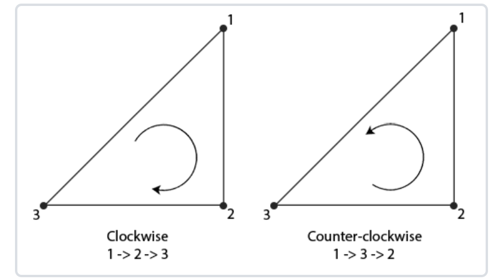

    ```cpp
    float vertices[] = {
        // 顺时针
        vertices[0], // 顶点1
        vertices[1], // 顶点2
        vertices[2], // 顶点3
        // 逆时针   逆时针顶点所定义的三角形将会被处理为正向三角形。
        vertices[0], // 顶点1
        vertices[2], // 顶点3
        vertices[1]  // 顶点2  
    };
    ```

    

  - 实际的环绕顺序是在光栅化阶段中处理的，是在顶点着色器运行之后。

    - 以逆时针顺序定义顶点并且背向观察者的三角形的渲染顺序是顺时针的，也正是我们想要剔除的面
    - 以1、2、3的顺序在观察者当面的视野看，后面的三角形是顺时针的
      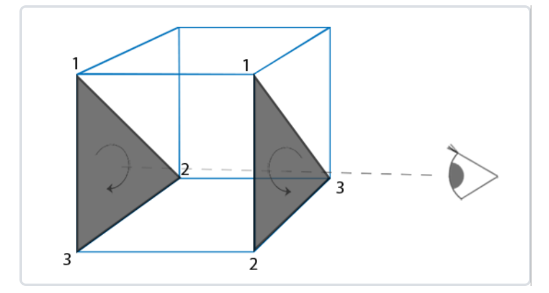


#### 剔除

OpenGL能够丢弃那些渲染为背向三角形的三角形图元。

```cpp
// 开启
glEnable(GL_CULL_FACE);
```


```cpp
// 指定剔除哪种面
glCullFace(GL_FRONT);
```

- `GL_BACK`：只剔除背向面。
- `GL_FRONT`：只剔除正向面。
- `GL_FRONT_AND_BACK`：剔除正向面和背向面。


```cpp
// 指定如何定义正向面
glFrontFace(GL_CCW);

// GL_CCW 逆时针
// GL_CW 顺时针
```


剔除背面：

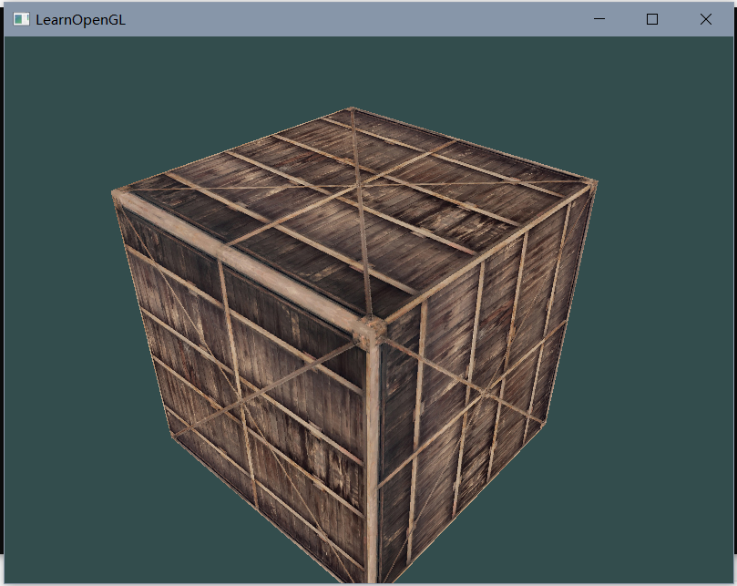


剔除正面：

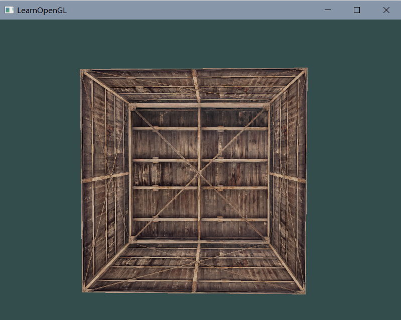


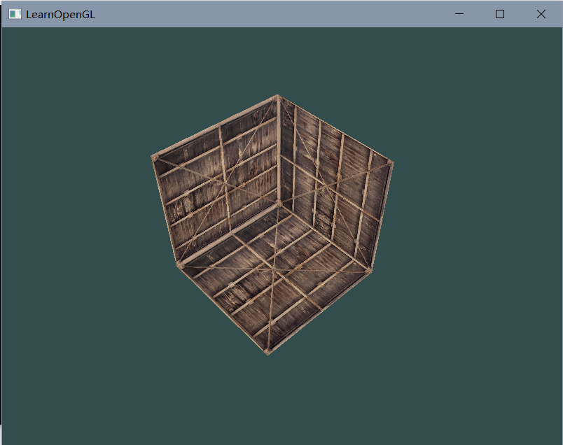


## 五、帧缓冲

### 帧缓冲

各种屏幕缓冲，称为帧缓冲(Framebuffer)：

- 用于写入颜色值的颜色缓冲
- 用于写入深度信息的深度缓冲
- 允许我们根据一些条件丢弃特定片段的模板缓冲


- 帧缓冲储存在内存中

- OpenGL允许自定义颜色缓冲，甚至是深度缓冲和模板缓冲
- 默认的帧缓冲在创建窗口的时候就生成和配置了（GLFW帮我们做了这些）


#### 帧缓冲API

创建 帧缓冲对象(Framebuffer Object, FBO):

```cpp
unsigned int fbo;
glGenFramebuffers(1, &fbo);
```

绑定 (绑定后，所有的**读取**和**写入**帧缓冲的操作将会影响当前绑定的帧缓冲)

```cpp
glBindFramebuffer(GL_FRAMEBUFFER, fbo);

- GL_FRAMEBUFFER 读取和写入目标
- GL_READ_FRAMEBUFFER 读取目标
- GL_DRAW_FRAMEBUFFER 写入目标
// 绑定到GL_READ_FRAMEBUFFER的帧缓冲将会使用在所有像是glReadPixels的读取操作中，而绑定到GL_DRAW_FRAMEBUFFER的帧缓冲将会被用作渲染、清除等写入操作的目标。
```


上面的步骤还不够，一个完整的帧缓冲需要满足以下的条件：

- 附加至少一个缓冲（颜色、深度或模板缓冲）。
- 至少有一个颜色附件(Attachment)。
- 所有的附件都必须是完整的（保留了内存）。
- 每个缓冲都应该有相同的样本数。


以及检查当前绑定的帧缓冲是否完整

```cpp
if(glCheckFramebufferStatus(GL_FRAMEBUFFER) == GL_FRAMEBUFFER_COMPLETE)
{
    // 之后所有的渲染操作将会渲染到当前绑定帧缓冲的附件中
    ...
}
```


渲染到非默认的帧缓冲时，渲染指令将不会对窗口的视觉输出有任何影响：

- 渲染到一个不同的帧缓冲，称为`离屏渲染`(Off-screen Rendering)


重新绑定到默认帧缓冲

```cpp
glBindFramebuffer(GL_FRAMEBUFFER, 0);
```


删除自定义帧缓冲对象

```cpp
glDeleteFramebuffers(1, &fbo);
```


#### 帧缓冲附件

附件是一个内存位置，它能够作为帧缓冲的一个存储空间，可以将它想象为一个图像。

当创建一个附件的时候我们有两个选项：

- 纹理
- 渲染缓冲对象(Renderbuffer Object)


##### 纹理附件

- 所有的渲染指令将会写入到这个纹理中，就像它是一个普通的颜色/深度或模板缓冲一样。
- 所有渲染操作的结果将会被储存在一个纹理图像中
- 可以在着色器中很方便地使用得到的纹理

为帧缓冲创建纹理（和之前差不多）

- 将纹理维度设置为了屏幕大小（尽管这不是必须的）
- 给纹理的`data`参数传递了`NULL`，仅仅分配了内存，在渲染的时候才填充数据
- 不关心环绕方式或多级渐远纹理

```cpp
unsigned int texture;
glGenTextures(1, &texture);
glBindTexture(GL_TEXTURE_2D, texture);

glTexImage2D(GL_TEXTURE_2D, 0, GL_RGB, 800, 600, 0, GL_RGB, GL_UNSIGNED_BYTE, NULL);

glTexParameteri(GL_TEXTURE_2D, GL_TEXTURE_MIN_FILTER, GL_LINEAR);
glTexParameteri(GL_TEXTURE_2D, GL_TEXTURE_MAG_FILTER, GL_LINEAR);
```

附加到帧缓冲上

```cpp
glFramebufferTexture2D(GL_FRAMEBUFFER, GL_COLOR_ATTACHMENT0, GL_TEXTURE_2D, texture, 0);
```

- `target`：帧缓冲的目标（绘制、读取或者两者皆有）
- `attachment`：我们想要附加的附件类型。当前我们正在附加一个颜色附件。注意最后的`0`意味着我们可以附加多个颜色附件。我们将在之后的教程中提到。
- `textarget`：你希望附加的纹理类型
- `texture`：要附加的纹理本身
- `level`：多级渐远纹理的级别。我们将它保留为0。

- 深度缓冲、模板缓冲的相关设置：

  - 要附加深度缓冲的话，我们将附件类型设置为GL_DEPTH_ATTACHMENT。
    - 注意纹理的格式(Format)和内部格式(Internalformat)类型将变为GL_DEPTH_COMPONENT，来反映深度缓冲的储存格式。
  - 要附加模板缓冲的话，你要将第二个参数设置为GL_STENCIL_ATTACHMENT，并将纹理的格式设定为GL_STENCIL_INDEX。

  - 也可以将深度缓冲和模板缓冲附加为一个单独的纹理：

    - 纹理的每32位数值将包含24位的深度信息和8位的模板信息。

    - 使用GL_DEPTH_STENCIL_ATTACHMENT类型，并配置纹理的格式

    - 案例：

      ```cpp
      glTexImage2D(
        GL_TEXTURE_2D, 0, GL_DEPTH24_STENCIL8, 800, 600, 0, 
        GL_DEPTH_STENCIL, GL_UNSIGNED_INT_24_8, NULL
      );
      
      glFramebufferTexture2D(GL_FRAMEBUFFER, GL_DEPTH_STENCIL_ATTACHMENT, GL_TEXTURE_2D, texture, 0);
      ```

      


> 如果你想将你的屏幕渲染到一个更小或更大的纹理上，你需要（在渲染到你的帧缓冲之前）再次调用`glViewport`，使用纹理的新维度作为参数，否则只有一小部分的纹理或屏幕会被渲染到这个纹理上。


##### 渲染缓冲对象附件

- 和纹理图像一样，渲染缓冲对象是一个真正的缓冲，即一系列的字节、整数、像素等。
- 渲染缓冲对象附加的好处是，它会将数据储存为OpenGL原生的渲染格式，它是为离屏渲染到帧缓冲优化过的。


- 渲染缓冲对象直接将所有的渲染数据储存到它的缓冲中，不会做任何针对纹理格式的转换，让它变为一个更快的可写储存介质。

- 渲染缓冲对象通常都是只写的，所以你不能读取它们（比如使用纹理访问）。
  - 经常用于深度和模板附件，因为大部分时间我们都不需要从深度和模板缓冲中读取值（采样），只关心深度和模板测试。

- 当然你仍然还是能够使用glReadPixels来读取它，这会从当前绑定的帧缓冲中返回特定区域的像素，而不是附件本身。


当我们不需要从缓冲中采样的时候，通常都会选择渲染缓冲对象，因为它会更优化一点。

- 渲染缓冲对象是专门被设计作为帧缓冲附件使用的，而不是纹理那样的通用数据缓冲(General Purpose Data Buffer)

- 通常的选择依据：
  - 如果你不需要从一个缓冲中采样数据，那么对这个缓冲使用渲染缓冲对象会是明智的选择。
  - 如果你需要从缓冲中采样颜色或深度值等数据，那么你应该选择纹理附件。


创建和绑定渲染缓冲对象

```cpp
unsigned int rbo;
glGenRenderbuffers(1, &rbo);

glBindRenderbuffer(GL_RENDERBUFFER, rbo);
```

创建一个深度和模板渲染缓冲对象

```cpp
glRenderbufferStorage(GL_RENDERBUFFER, GL_DEPTH24_STENCIL8, 800, 600);
```


#### 实操

目标

- 将场景渲染到一个附加到帧缓冲对象上的颜色纹理中
- 之后将在一个横跨整个屏幕的四边形上绘制这个纹理
- 看到的结果其实和直接绘制到默认帧缓冲是一样的

步骤

1. 将新的帧缓冲绑定为激活的帧缓冲，和往常一样渲染场景
2. 绑定默认的帧缓冲
3. 绘制一个横跨整个屏幕的四边形，将帧缓冲的颜色缓冲作为它的纹理

注意一些事情

- 第一，由于我们使用的每个帧缓冲都有它自己一套缓冲，我们希望设置合适的位，调用glClear，清除这些缓冲。
- 第二，当绘制四边形时，我们将禁用深度测试，因为我们是在绘制一个简单的四边形，并不需要关系深度测试。在绘制普通场景的时候我们将会重新启用深度测试。

渲染迭代的内容be like


```cpp
// 第一处理阶段(Pass)
glBindFramebuffer(GL_FRAMEBUFFER, framebuffer);
glClearColor(0.1f, 0.1f, 0.1f, 1.0f);
glClear(GL_COLOR_BUFFER_BIT | GL_DEPTH_BUFFER_BIT); // 我们现在不使用模板缓冲
glEnable(GL_DEPTH_TEST);
DrawScene();    

// 第二处理阶段
glBindFramebuffer(GL_FRAMEBUFFER, 0); // 返回默认
glClearColor(1.0f, 1.0f, 1.0f, 1.0f); 
glClear(GL_COLOR_BUFFER_BIT);

screenShader.use();  
glBindVertexArray(quadVAO);
glDisable(GL_DEPTH_TEST);
glBindTexture(GL_TEXTURE_2D, textureColorbuffer);
glDrawArrays(GL_TRIANGLES, 0, 6);  
```


主要代码：

VAO，VBO设置（注意调用顺序）

```cpp
    // VBO 和 VAO（先bind VAO，之后再bind VBO设置数据，以及设置顶点属性指针）
    unsigned int cubeVBO;
    unsigned int cubeVAO;
    glGenVertexArrays(1, &cubeVAO);
    glGenBuffers(1, &cubeVBO);

    glBindVertexArray(cubeVAO);
    glBindBuffer(GL_ARRAY_BUFFER, cubeVBO);
    glBufferData(GL_ARRAY_BUFFER, sizeof(cubeVertices), cubeVertices, GL_STATIC_DRAW);
    glVertexAttribPointer(0, 3, GL_FLOAT, GL_FALSE, 5 * sizeof(float), (void*)0);
    glEnableVertexAttribArray(0);
    glVertexAttribPointer(1, 2, GL_FLOAT, GL_FALSE, 5 * sizeof(float), (void*)(3 * sizeof(float)));
    glEnableVertexAttribArray(1);
    
    unsigned int quadVBO;
    unsigned int quadVAO;
    glGenBuffers(1, &quadVBO);
    glGenVertexArrays(1, &quadVAO);

    glBindVertexArray(quadVAO);
    glBindBuffer(GL_ARRAY_BUFFER, quadVBO);
    glBufferData(GL_ARRAY_BUFFER, sizeof(quadVertices), quadVertices, GL_STATIC_DRAW);
    glVertexAttribPointer(0, 3, GL_FLOAT, GL_FALSE, 5 * sizeof(float), (void*)0);
    glEnableVertexAttribArray(0);
    glVertexAttribPointer(1, 2, GL_FLOAT, GL_FALSE, 5 * sizeof(float), (void*)(3 * sizeof(float)));
    glEnableVertexAttribArray(1);
```


渲染循环内

```cpp
        // 第一处理阶段(Pass)
        {
            // 绑定到新的帧缓冲，后续渲染的内容会被写入到帧缓冲附件上

            glBindFramebuffer(GL_FRAMEBUFFER, framebuffer);
            glEnable(GL_DEPTH_TEST);
            glClearColor(0.2f, 0.3f, 0.3f, 1.0f);
            glClear(GL_COLOR_BUFFER_BIT | GL_DEPTH_BUFFER_BIT); // 我们现在不使用模板缓冲
            // 开启面剔除
            glEnable(GL_CULL_FACE);
            glCullFace(GL_BACK);
            // Draw Scene
            {
                boxShader.use();

                // 计算mvp变换矩阵
                glm::mat4 view = g_camera.GetLookAt();
                glm::mat4 projection = glm::mat4(1.0f);
                projection = glm::perspective(glm::radians(g_camera.GetFov()), 800.0f / 600.0f, 0.1f, 100.0f);
                glm::mat4 model = glm::mat4(1.0f);
                boxShader.setMat4("model", model);
                boxShader.setMat4("view", view);
                boxShader.setMat4("projection", projection);

                glActiveTexture(GL_TEXTURE0);
                glBindTexture(GL_TEXTURE_2D, textureBox);

                glBindVertexArray(cubeVAO);
                glDrawArrays(GL_TRIANGLES, 0, 36);
                glBindVertexArray(0);
            }
        }

        // 第二处理阶段(Pass)
        {
            // 绑定默认帧缓冲，渲染真正要显示到屏幕的内容

            glBindFramebuffer(GL_FRAMEBUFFER, 0); 
            glClearColor(0.2f, 0.3f, 0.3f, 1.0f);
            glClear(GL_COLOR_BUFFER_BIT);

            glDisable(GL_DEPTH_TEST);
            glDisable(GL_CULL_FACE);

            viewportShader.use();

            glActiveTexture(GL_TEXTURE0);
            glBindTexture(GL_TEXTURE_2D, texColorBuffer);

            glBindVertexArray(quadVAO);
            glDrawArrays(GL_TRIANGLES, 0, 6);
            glBindVertexArray(0);
        }

```


### 后处理

既然整个场景都被渲染到了一个纹理上，我们可以简单地通过修改纹理数据创建出一些非常有意思的效果。


#### 反相

用1.0减去颜色分量


片段着色器

```glsl
void main()
{
    FragColor = vec4(vec3(1.0 - texture(screenTexture, TexCoords)), 1.0);
}
```


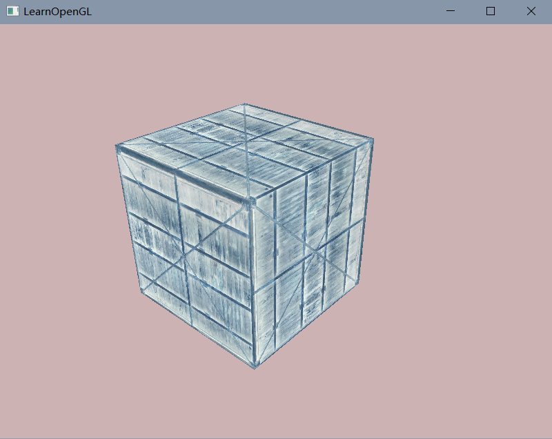


#### 灰度

移除场景中除了黑白灰以外所有的颜色，让整个图像灰度化(Grayscale)

- 简单的实现方式:

  - 取所有的颜色分量，将它们平均化

    ```glsl
    void main()
    {
        FragColor = texture(screenTexture, TexCoords);
        float average = (FragColor.r + FragColor.g + FragColor.b) / 3.0;
        FragColor = vec4(average, average, average, 1.0);
    }
    ```

    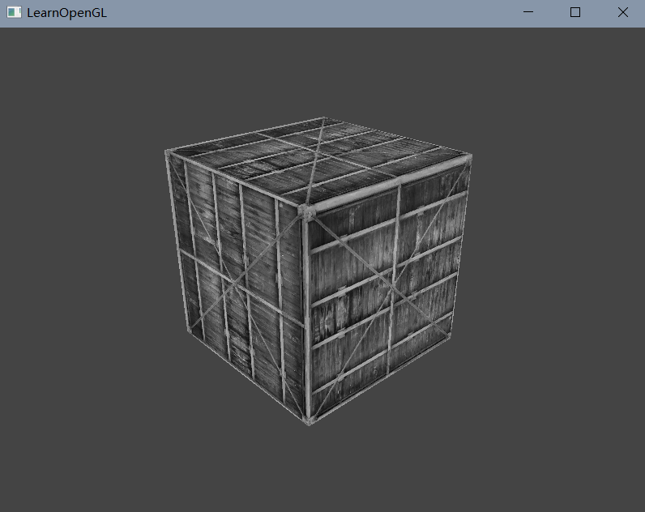

- 采用加权通道：

  - 人眼会对绿色更加敏感一些，而对蓝色不那么敏感。

    ```glsl
    void main()
    {
        FragColor = texture(screenTexture, TexCoords);
        float average = 0.2126 * FragColor.r + 0.7152 * FragColor.g + 0.0722 * FragColor.b;
        FragColor = vec4(average, average, average, 1.0);
    }
    ```

    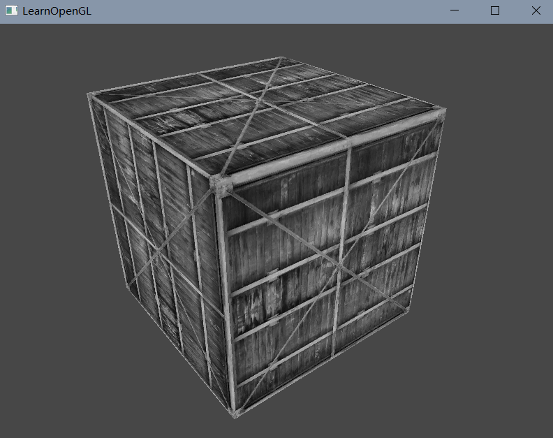


#### 核效果

在一个纹理图像上做后期处理的另外一个好处是，我们可以从纹理的其它地方采样颜色值。

比如说我们可以在当前纹理坐标的周围取一小块区域，对当前纹理值周围的多个纹理值进行采样。


##### 核

核(Kernel)（或卷积矩阵(Convolution Matrix)）是一个类矩阵的数值数组，它的中心为当前的像素，它会用它的核值乘以周围的像素值，并将结果相加变成一个值。

比如：

-  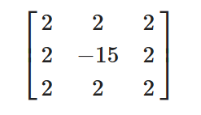
- 这个核取了8个周围像素值，将它们乘以2，而把当前的像素乘以-15

> 你在网上找到的大部分核将所有的权重加起来之后都应该会等于1，如果它们加起来不等于1，这就意味着最终的纹理颜色将会比原纹理值更亮或者更暗了。


##### 锐化(Sharpen)

片段着色器

- 使用 3X3 的核

```glsl
const float offset = 1.0 / 300.0;  

void main()
{
    vec2 offsets[9] = vec2[](
        vec2(-offset,  offset), // 左上
        vec2( 0.0f,    offset), // 正上
        vec2( offset,  offset), // 右上
        vec2(-offset,  0.0f),   // 左
        vec2( 0.0f,    0.0f),   // 中
        vec2( offset,  0.0f),   // 右
        vec2(-offset, -offset), // 左下
        vec2( 0.0f,   -offset), // 正下
        vec2( offset, -offset)  // 右下
    );

    float kernel[9] = float[](
        -1, -1, -1,
        -1,  9, -1,
        -1, -1, -1
    );

    vec3 sampleTex[9];
    for(int i = 0; i < 9; i++)
    {
        sampleTex[i] = vec3(texture(screenTexture, TexCoords.st + offsets[i]));
    }
    vec3 col = vec3(0.0);
    for(int i = 0; i < 9; i++)
        col += sampleTex[i] * kernel[i];

    FragColor = vec4(col, 1.0);
}
```

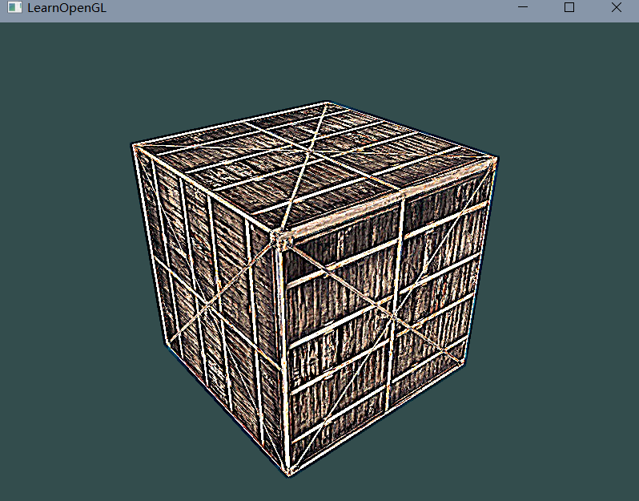


##### 模糊（Blur）

片段着色器

```glsl
float kernel[9] = float[](
    1.0 / 16, 2.0 / 16, 1.0 / 16,
    2.0 / 16, 4.0 / 16, 2.0 / 16,
    1.0 / 16, 2.0 / 16, 1.0 / 16  
);
```

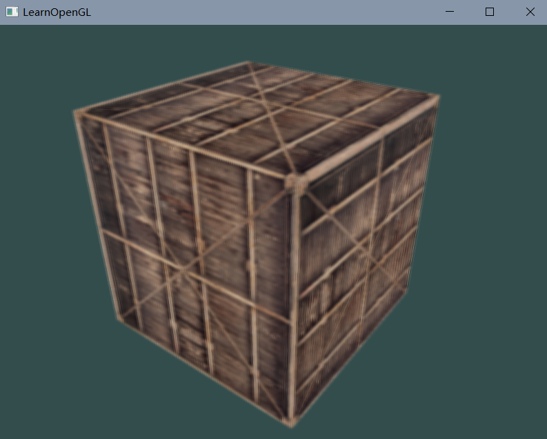


##### 边缘检测

- 与锐化的核很相似

- 这个核高亮了所有的边缘，而暗化了其它部分，在我们只关心图像的边角的时候是非常有用的。

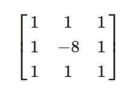

```glsl
    float kernel[9] = float[](
        1, 1, 1,
        1, -8, 1,
        1, 1, 1
    );
```

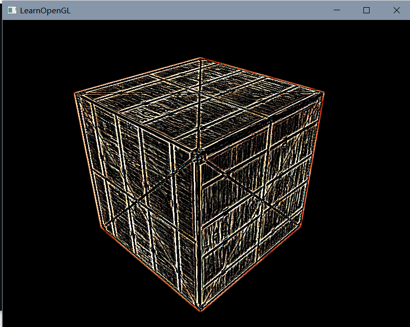


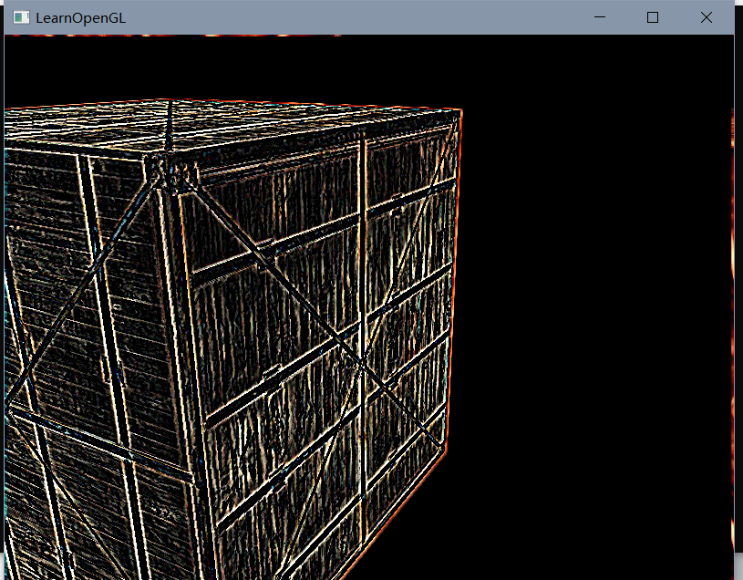

> 注意，核在对屏幕纹理的边缘进行采样的时候，由于还会对中心像素周围的8个像素进行采样，其实会取到纹理之外的像素。由于环绕方式默认是GL_REPEAT，所以在没有设置的情况下取到的是屏幕另一边的像素，而另一边的像素本不应该对中心像素产生影响，这就可能会在屏幕边缘产生很奇怪的条纹。为了消除这一问题，我们可以将屏幕纹理的环绕方式都设置为GL_CLAMP_TO_EDGE。这样子在取到纹理外的像素时，就能够重复边缘的像素来更精确地估计最终的值了
