# 高级OpenGL（下）立方体贴图、高级数据、高级GLSL、几何着色器、实例化、抗锯齿


## 一、立方体贴图

### 立方体贴图

将多个纹理组合起来映射到一张纹理上的一种纹理类型：`立方体贴图(Cube Map)`。

- 立方体贴图就是一个包含了6个2D纹理的纹理
- 一个非常有用的特性：可以通过一个`方向向量`来进行索引/采样。
  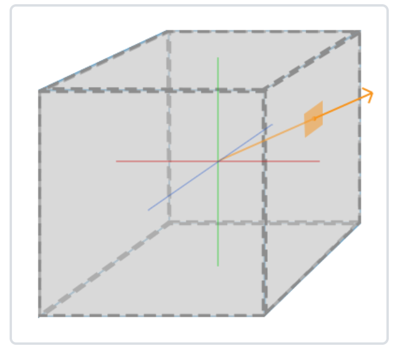
- 如何确定方向向量：
  - 从模型空间的原点出发，到顶点位置的方向向量
  - 非顶点位置的方向向量可以根据周围的顶点插值求得
- 纹理坐标：
  - 由方向向量，确定与立方体相交的面，以及在这个面上的UV坐标


**创建和使用立方体贴图**

```cpp
// 创建和绑定
unsigned int textureID;
glGenTextures(1, &textureID);
glBindTexture(GL_TEXTURE_CUBE_MAP, textureID);

// 分别给6个面生成纹理
int width, height, nrChannels;
unsigned char *data;  
for(unsigned int i = 0; i < textures_faces.size(); i++)
{
    data = stbi_load(textures_faces[i].c_str(), &width, &height, &nrChannels, 0);
    glTexImage2D(
        GL_TEXTURE_CUBE_MAP_POSITIVE_X + i, 
        0, GL_RGB, width, height, 0, GL_RGB, GL_UNSIGNED_BYTE, data
    );
}

// 环绕和过滤方式
glTexParameteri(GL_TEXTURE_CUBE_MAP, GL_TEXTURE_MAG_FILTER, GL_LINEAR);
glTexParameteri(GL_TEXTURE_CUBE_MAP, GL_TEXTURE_MIN_FILTER, GL_LINEAR);
glTexParameteri(GL_TEXTURE_CUBE_MAP, GL_TEXTURE_WRAP_S, GL_CLAMP_TO_EDGE);
glTexParameteri(GL_TEXTURE_CUBE_MAP, GL_TEXTURE_WRAP_T, GL_CLAMP_TO_EDGE);
glTexParameteri(GL_TEXTURE_CUBE_MAP, GL_TEXTURE_WRAP_R, GL_CLAMP_TO_EDGE);

// 绘制图像之前要先激活纹理单元和绑定纹理


```


片段着色器：

- `samplerCube` 立方体纹理采样器

```glsl
in vec3 textureDir; // 代表3D纹理坐标的方向向量
uniform samplerCube cubemap; // 立方体贴图的纹理采样器

void main()
{             
    FragColor = texture(cubemap, textureDir);
}
```


### 天空盒

加载纹理

```cpp
unsigned int loadCubemap(vector<std::string> faces)
{
    unsigned int textureID;
    glGenTextures(1, &textureID);
    glBindTexture(GL_TEXTURE_CUBE_MAP, textureID);

    int width, height, nrChannels;
    for (unsigned int i = 0; i < faces.size(); i++)
    {
        unsigned char *data = stbi_load(faces[i].c_str(), &width, &height, &nrChannels, 0);
        if (data)
        {
            glTexImage2D(GL_TEXTURE_CUBE_MAP_POSITIVE_X + i, 
                         0, GL_RGB, width, height, 0, GL_RGB, GL_UNSIGNED_BYTE, data
            );
            stbi_image_free(data);
        }
        else
        {
            std::cout << "Cubemap texture failed to load at path: " << faces[i] << std::endl;
            stbi_image_free(data);
        }
    }
    glTexParameteri(GL_TEXTURE_CUBE_MAP, GL_TEXTURE_MIN_FILTER, GL_LINEAR);
    glTexParameteri(GL_TEXTURE_CUBE_MAP, GL_TEXTURE_MAG_FILTER, GL_LINEAR);
    glTexParameteri(GL_TEXTURE_CUBE_MAP, GL_TEXTURE_WRAP_S, GL_CLAMP_TO_EDGE);
    glTexParameteri(GL_TEXTURE_CUBE_MAP, GL_TEXTURE_WRAP_T, GL_CLAMP_TO_EDGE);
    glTexParameteri(GL_TEXTURE_CUBE_MAP, GL_TEXTURE_WRAP_R, GL_CLAMP_TO_EDGE);

    return textureID;
}
```


```cpp
vector<std::string> faces
{
    "right.jpg",
    "left.jpg",
    "top.jpg",
    "bottom.jpg",
    "front.jpg",
    "back.jpg"
};
unsigned int cubemapTexture = loadCubemap(faces);
```


顶点着色器

```glsl
#version 330 core
layout (location = 0) in vec3 aPos;

out vec3 TexCoords;

uniform mat4 projection;
uniform mat4 view;

void main()
{
    TexCoords = aPos;
    gl_Position = projection * view * vec4(aPos, 1.0);
}
```


片段着色器

```glsl
#version 330 core
out vec4 FragColor;

in vec3 TexCoords;

uniform samplerCube skybox;

void main()
{    
    FragColor = texture(skybox, TexCoords);
}
```


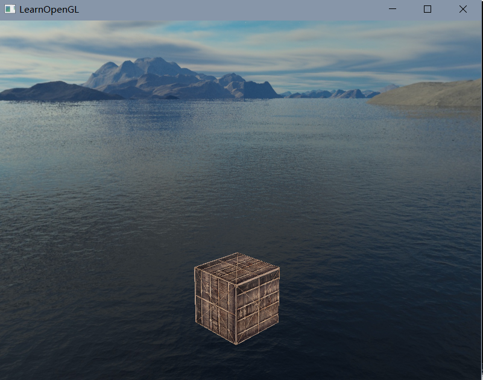


#### 优化

- 上面的做法是先在关闭深度测试的情况下渲染天空盒，然后开启深度测试并渲染其他东西
- 屏幕上的每一个像素都要运行一遍天空盒的片段着色器，即便只有一小部分的天空盒最终是可见的


使用`提前深度测试`(Early Depth Testing)，提前丢弃掉天空盒的片段，节省宝贵的带宽。

- 最后渲染天空盒，以获得轻微的性能提升

- 问题：天空盒距离相机的距离可能比场景物体更近，挡到其他物体

- 解决：

  - 让天空盒所有片段的深度值为1.0（最大值），若深度缓冲中对应位置已有的深度值更小，则不渲染天空盒片段。

  - 如何让深度值为1.0：

    - 在顶点着色器中设置pos中的 z 分量为 w 分量的值（顶点着色器之后的透视除法会将 x y z 都除以 w 来转换到标准化设备坐标）

      ```glsl
      void main()
      {
          TexCoords = aPos;
          vec4 pos = projection * view * vec4(aPos, 1.0);
          gl_Position = pos.xyww;
      }
      ```

  - 将深度测试的比较方式改为`glDepthFunc(GL_LEQUAL);`使得深度值为1.0的天空盒片段能通过并写入深度缓冲。


渲染循环：

```cpp
            // Draw Cube
            {
                boxShader.use();

                // 计算mvp变换矩阵
                glm::mat4 view = g_camera.GetLookAt();
                glm::mat4 projection = glm::mat4(1.0f);
                projection = glm::perspective(glm::radians(g_camera.GetFov()), 800.0f / 600.0f, 0.1f, 100.0f);
                glm::mat4 model = glm::mat4(1.0f);
                boxShader.setMat4("model", model);
                boxShader.setMat4("view", view);
                boxShader.setMat4("projection", projection);

                glActiveTexture(GL_TEXTURE0);
                glBindTexture(GL_TEXTURE_2D, textureBox);

                glBindVertexArray(cubeVAO);
                glDrawArrays(GL_TRIANGLES, 0, 36);
                glBindVertexArray(0);
            }

            // Draw Skybox
            {
                glDepthFunc(GL_LEQUAL);

                skyShader.use();
                glm::mat4 view = glm::mat4(glm::mat3(g_camera.GetLookAt()));
                glm::mat4 projection = glm::mat4(1.0f);
                projection = glm::perspective(glm::radians(g_camera.GetFov()), 800.0f / 600.0f, 0.1f, 100.0f);
                skyShader.setMat4("view", view);
                skyShader.setMat4("projection", projection);

                glBindVertexArray(skyVAO);
                glBindTexture(GL_TEXTURE_CUBE_MAP, textureSky);
                glDrawArrays(GL_TRIANGLES, 0, 36);
                glBindVertexArray(0);
                glDepthFunc(GL_LESS);
            }
```


### 环境映射

环境映射

- 将整个环境映射到了一个纹理对象上

- 通过使用环境的立方体贴图，我们可以给物体`反射`和`折射`的属性


#### 反射 reflect

- 反射这个属性表现为物体（或物体的一部分）反射它周围环境
- 即根据观察者的视角，物体的颜色或多或少等于它周围的环境
- 镜子就是一个反射性物体：它会根据观察者的视角反射它周围的环境。


- 计算反射向量，使用这个向量来从立方体贴图中采样
  - 使用GLSL内建的reflect函数来计算这个反射向量

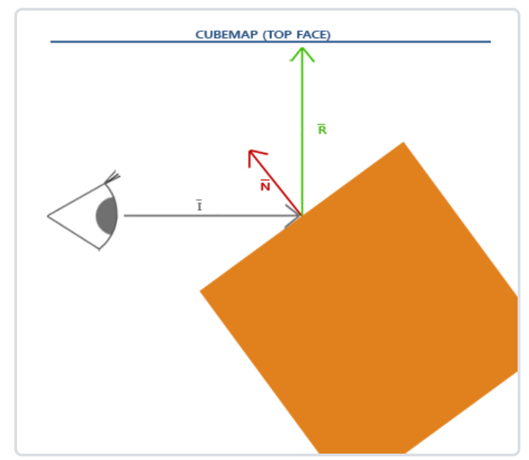


修改箱子的片段着色器

```glsl
#version 330 core
out vec4 FragColor;

in vec3 Normal;
in vec3 Position;

uniform vec3 cameraPos;
uniform samplerCube skybox;

void main()
{             
    vec3 I = normalize(Position - cameraPos);
    vec3 R = reflect(I, normalize(Normal));
    FragColor = vec4(texture(skybox, R).rgb, 1.0);
}
```


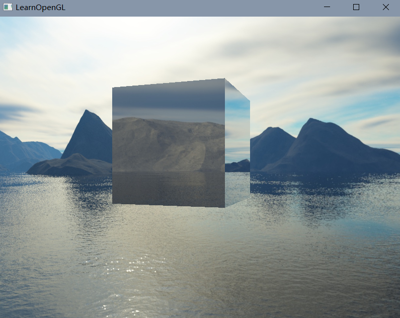

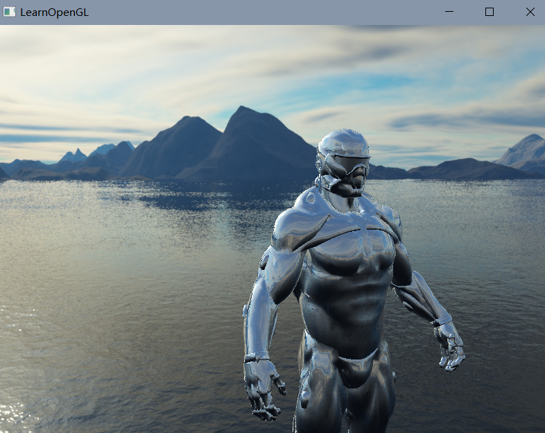


> 现实中大部分的模型都不具有完全反射性
>
> 可以引入反射贴图(Reflection Map)，来给模型更多的细节
>
> - 它决定了片段的反射性
> - 模型的哪些部分该以什么强度显示反射


#### 折射 refract

- 折射是光线由于传播介质的改变而产生的方向变化
- 将你的半只胳膊伸进水里，观察出来的就是这种效果
- [斯涅尔定律](https://en.wikipedia.org/wiki/Snell's_law)(Snell’s Law)

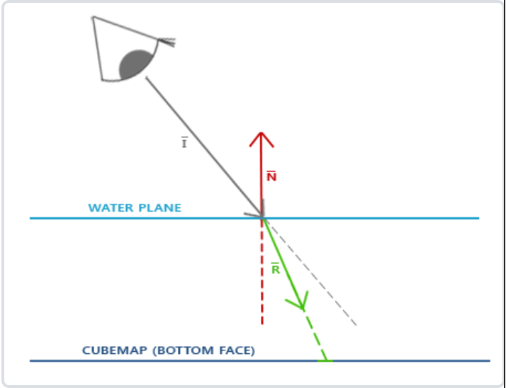

- 折射计算：使用GLSL的内建refract函数
  - 一个法向量
  - 一个观察方向
  - 两个材质之间的折射率(Refractive Index)的比值。

- 折射率
  - 决定了材质中光线弯曲的程度
  - 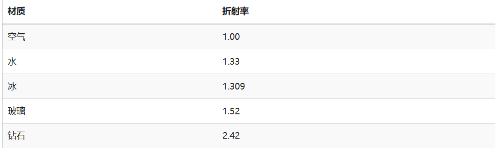
  - 比如光线/视线从**空气**进入**玻璃**：比值为 1.00/1.52 = 0.658


修改片段着色器

```glsl
#version 330 core
out vec4 FragColor;

in vec3 Normal;
in vec3 Position;

uniform vec3 cameraPos;
uniform samplerCube skybox;

void main()
{             
    float ratio = 1.00 / 1.52;
    vec3 I = normalize(Position - cameraPos);
    vec3 R = refract(I, normalize(Normal), ratio);
    FragColor = vec4(texture(skybox, R).rgb, 1.0);
}
```


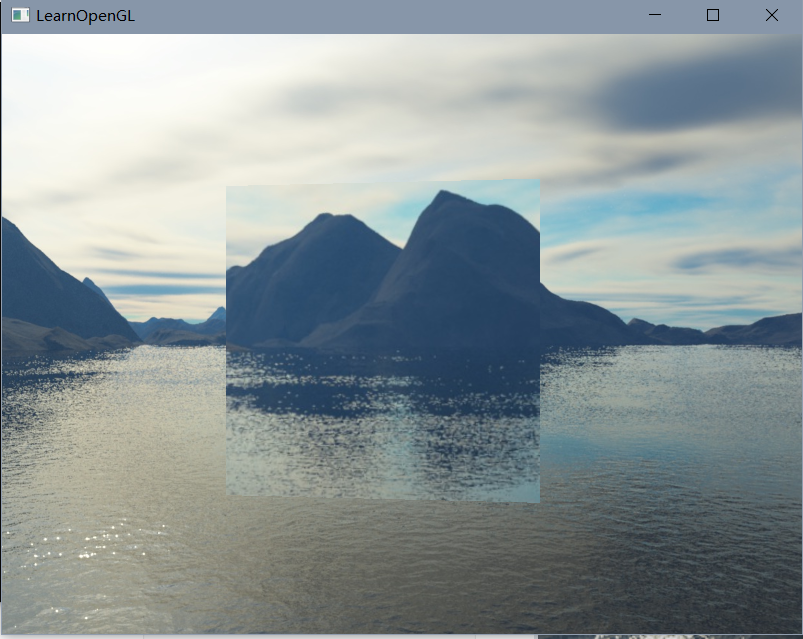

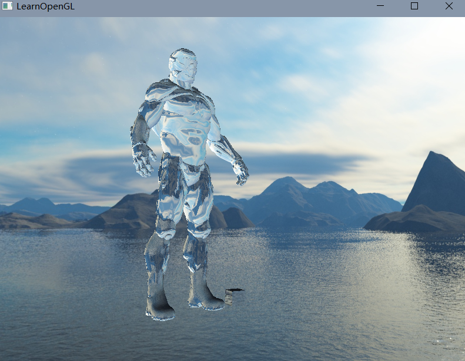


#### 动态环境贴图

静态环境映射

- 只映射天空盒。
- 如果我们有一个镜子一样的物体，周围还有多个物体，镜子中可见的只有天空盒，看起来就像它是场景中唯一一个物体一样。


动态环境映射(Dynamic Environment Mapping)

- 通过使用帧缓冲，我们能够为物体的6个不同角度创建出场景的纹理，并在每个渲染迭代中将它们储存到一个立方体贴图中。

- 之后我们就可以使用这个（动态生成的）立方体贴图来创建出更真实的，包含其它物体的，反射和折射表面了。


缺点：

- 我们需要为每个使用环境贴图的物体渲染场景6次，这是非常大的性能开销
- 现代的程序通常会尽可能使用天空盒，并在可能的时候使用预编译的立方体贴图，只要它们能产生一点动态环境贴图的效果。


## 二、高级数据

- OpenGL中使用缓冲来储存数据
- 操作缓冲其实还有更有意思的方式
- 使用纹理将大量数据传入着色器也有更有趣的方法


### 缓冲操作

#### 内存分配和数据填充

OpenGL中的缓冲只是一个管理特定内存块的对象

在我们将它绑定到一个缓冲目标(Buffer Target)时，我们才赋予了其意义

- 绑定一个缓冲到GL_ARRAY_BUFFER时，它就是一个顶点数组缓冲
- 也可以绑定到GL_ELEMENT_ARRAY_BUFFER等

```cpp
glGenBuffers(1, &cubeVBO);    
glBindBuffer(GL_ARRAY_BUFFER, cubeVBO);

glBufferData(GL_ARRAY_BUFFER, sizeof(data), data, GL_STATIC_DRAW);
// 分配一块内存，并将数据添加到这块内存中。
// 如果我们将它的data参数设置为NULL，那么这个函数将只会分配内存，但不进行填充。
// 可用于 预留(Reserve) 特定大小的内存
```

填充数据到缓冲内存：

- 方法一：`glBufferSubData`函数（需要先用`glBufferData`分配好内存）
- 方法二：`glMapBuffer`函数，获取指向缓冲内存的指针，直接设置内存数据

```cpp
glBufferSubData(GL_ARRAY_BUFFER, 24, sizeof(data), &data); // 填充范围： [24, 24 + sizeof(data)]
// 填充缓冲的特定区域

或者
    
float data[] = {
  0.5f, 1.0f, -0.35f
  ...
};
glBindBuffer(GL_ARRAY_BUFFER, buffer);
// 获取指针
void *ptr = glMapBuffer(GL_ARRAY_BUFFER, GL_WRITE_ONLY);
// 复制数据到内存
memcpy(ptr, data, sizeof(data));
// 记得告诉OpenGL我们不再需要这个指针了
glUnmapBuffer(GL_ARRAY_BUFFER);
```

> 如果要直接映射数据到缓冲，而不事先将其存储到临时内存中，glMapBuffer这个函数会很有用。
>
> 比如说，你可以从文件中读取数据，并直接将它们复制到缓冲内存中。


#### 分批顶点属性

之前学的方法：

- 通过使用glVertexAttribPointer，我们能够指定顶点数组缓冲内容的属性布局。在顶点数组缓冲中，我们对属性进行了交错(Interleave)处理，也就是说，我们将每一个顶点的位置、法线和/或纹理坐标紧密放置在一起。


新的方法：

- 将每一种属性类型的向量数据打包(Batch)为一个大的区块，而不是对它们进行交错储存。
- 与交错布局123123123123不同，我们将采用分批(Batched)的方式111122223333。


使用`glBufferSubData`函数实现：

```cpp
float positions[] = { ... };
float normals[] = { ... };
float tex[] = { ... };

// 填充缓冲
glBufferSubData(GL_ARRAY_BUFFER, 0, sizeof(positions), &positions);
glBufferSubData(GL_ARRAY_BUFFER, sizeof(positions), sizeof(normals), &normals);
glBufferSubData(GL_ARRAY_BUFFER, sizeof(positions) + sizeof(normals), sizeof(tex), &tex);
```

以及更新顶点属性指针

```cpp
glVertexAttribPointer(0, 3, GL_FLOAT, GL_FALSE, 3 * sizeof(float), 0);  
glVertexAttribPointer(1, 3, GL_FLOAT, GL_FALSE, 3 * sizeof(float), (void*)(sizeof(positions)));  
glVertexAttribPointer(
  2, 2, GL_FLOAT, GL_FALSE, 2 * sizeof(float), (void*)(sizeof(positions) + sizeof(normals)));
```


#### 复制缓冲

当你的缓冲已经填充好数据之后，你可能会想与其它的缓冲共享其中的数据，或者想要将缓冲的内容复制到另一个缓冲当中。

`glCopyBufferSubData`函数

```cpp
void glCopyBufferSubData(GLenum readtarget, GLenum writetarget, GLintptr readoffset, GLintptr writeoffset, GLsizeiptr size);
```

- 复制源和复制目标的缓冲目标：
  - 比如说，我们可以将VERTEX_ARRAY_BUFFER缓冲复制到VERTEX_ELEMENT_ARRAY_BUFFER缓冲，分别将这些缓冲目标设置为读和写的目标。
  - 当前绑定到这些缓冲目标的缓冲将会被影响到。
- 对于复制源和复制目标为同样类型的缓冲目标的情况：
  - OpenGL提供给我们另外两个缓冲目标，叫做GL_COPY_READ_BUFFER和GL_COPY_WRITE_BUFFER
  - 将需要的缓冲绑定到这两个缓冲目标上，并将这两个目标作为`readtarget`和`writetarget`参数。

- 使用过程类似：

```cpp
float vertexData[] = { ... };
glBindBuffer(GL_COPY_READ_BUFFER, vbo1);
glBindBuffer(GL_COPY_WRITE_BUFFER, vbo2);
glCopyBufferSubData(GL_COPY_READ_BUFFER, GL_COPY_WRITE_BUFFER, 0, 0, sizeof(vertexData));
```

- 也可以只将`writetarget`缓冲绑定为新的缓冲目标类型之一：

```cpp
float vertexData[] = { ... };
glBindBuffer(GL_ARRAY_BUFFER, vbo1);
glBindBuffer(GL_COPY_WRITE_BUFFER, vbo2);
glCopyBufferSubData(GL_ARRAY_BUFFER, GL_COPY_WRITE_BUFFER, 0, 0, sizeof(vertexData));
```


## 三、高级glsl

内容：

- 在组合使用OpenGL和GLSL创建程序时的一些**最好要知道的东西**，一些**会让你生活更加轻松的特性**
- 一些有趣的内建变量(Built-in Variable)
- 管理着色器输入和输出的新方式
- 一个叫做Uniform缓冲对象(Uniform Buffer Object)的有用工具。


### GLSL内建变量

GLSL定义了以`gl_`为前缀的变量，它们能提供给我们更多的方式来读取/写入数据。

#### 顶点着色器变量

`gl_Position`

- 顶点着色器的裁剪空间输出位置向量


`gl_PointSize`

- 使用图元 GL_POINTS 绘制 每一个顶点都将是一个图元，都会被渲染为一个点

- 对每个顶点使用不同的点大小，会在`粒子生成`之类的技术中很有意思

  - 通过OpenGL的glPointSize函数来设置渲染出来的点的大小
  - 或者在顶点着色器中使用 gl_PointSize 设置点的大小

  ```cpp
  glEnable(GL_PROGRAM_POINT_SIZE);
  ```

  ```glsl
  void main()
  {
      gl_Position = projection * view * model * vec4(aPos, 1.0);    
      gl_PointSize = gl_Position.z;    
  }
  ```

  


`gl_VertexID`

- **输入变量** gl_VertexID。

- gl_Position和gl_PointSize都是**输出变量**，因为它们的值是作为顶点着色器的输出被读取的。

  

- 整型变量gl_VertexID储存了正在绘制顶点的当前ID。
  - 当（使用glDrawElements）进行索引渲染的时候，这个变量会存储正在绘制顶点的当前索引。
  - 当（使用glDrawArrays）不使用索引进行绘制的时候，这个变量会储存从渲染调用开始的已处理顶点数量。


#### 片段着色器变量

`gl_FragCoord`

- 一个只读(Read-only)变量
- gl_FragCoord的z分量等于对应片段的深度值
- gl_FragCoord的x和y分量是片段的窗口空间(Window-space)坐标，其原点为窗口的左下角

```glsl
void main()
{             
    if(gl_FragCoord.x < 400)
        FragColor = vec4(1.0, 0.0, 0.0, 1.0);
    else
        FragColor = vec4(0.0, 1.0, 0.0, 1.0);        
}
```


`gl_FrontFacing`

- 告诉我们当前片段是属于正向面的一部分还是背向面的一部分
- 正向面和背向面分别使用不同的而纹理

```glsl
#version 330 core
out vec4 FragColor;

in vec2 TexCoords;

uniform sampler2D frontTexture;
uniform sampler2D backTexture;

void main()
{             
    if(gl_FrontFacing)
        FragColor = texture(frontTexture, TexCoords);
    else
        FragColor = texture(backTexture, TexCoords);
}
```


`gl_FragDepth`

- 输出变量
- 在着色器内设置片段的深度值（0.0 ~ 1.0）
- 只要我们在片段着色器中对gl_FragDepth进行写入，OpenGL就会禁用所有的提前深度测试(Early Depth Testing)。
  - OpenGL无法在片段着色器运行**之前**得知片段将拥有的深度值，因为片段着色器可能会完全修改这个深度值。
  - 从OpenGL 4.2起，我们仍可以对两者进行一定的调和，在片段着色器的顶部使用深度条件(Depth Condition)重新声明gl_FragDepth变量：
    - `layout (depth_<condition>) out float gl_FragDepth;`
    - 限定写入的深度值的条件，使得提前深度测试能够进行。
    -  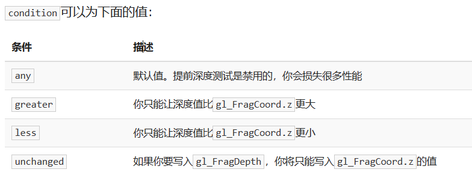

```glsl
#version 420 core // 注意GLSL的版本！
out vec4 FragColor;
layout (depth_greater) out float gl_FragDepth;

void main()
{             
    FragColor = vec4(1.0);
    gl_FragDepth = gl_FragCoord.z + 0.1;
}  
```


### 接口块

之前的 in out 数据都是一个变量。考虑如何处理 in out 数组和结构体。


声明与结构体类似

- 顶点着色器

```glsl
#version 330 core
layout (location = 0) in vec3 aPos;
layout (location = 1) in vec2 aTexCoords;

uniform mat4 model;
uniform mat4 view;
uniform mat4 projection;

out VS_OUT
{
    vec2 TexCoords;
} vs_out;

void main()
{
    gl_Position = projection * view * model * vec4(aPos, 1.0);    
    vs_out.TexCoords = aTexCoords;
}  
```

- 片段着色器

```glsl
#version 330 core
out vec4 FragColor;

in VS_OUT
{
    vec2 TexCoords;
} fs_in;

uniform sampler2D texture;

void main()
{             
    FragColor = texture(texture, fs_in.TexCoords);   
}
```


### Uniform 缓冲对象

当使用多于一个的着色器时，尽管大部分的uniform变量都是相同的，我们还是需要不断地设置它们，所以为什么要这么麻烦地重复设置它们呢？


**UBO**

OpenGL为我们提供了一个叫做Uniform缓冲对象(Uniform Buffer Object)的工具，它允许我们定义一系列在多个着色器中相同的**全局**Uniform变量。


- 顶点着色器
  - `layout (std140)`：设置了Uniform块布局(Uniform Block Layout)
  - 将 投影矩阵 和 观察矩阵 放到共享的 uniform接口块 里。

```glsl
#version 330 core
layout (location = 0) in vec3 aPos;

layout (std140) uniform Matrices
{
    mat4 projection;
    mat4 view;
};

uniform mat4 model;

void main()
{
    gl_Position = projection * view * model * vec4(aPos, 1.0);
}
```


#### Uniform块布局

- Uniform块的内容是储存在一个缓冲对象中的，它实际上只是一块预留内存，不会保存它具体保存的是什么类型的数据。
- 块布局告诉OpenGL内存的哪一部分对应着着色器中的哪一个uniform变量。


默认布局

- 共享(Shared)布局
- 一旦硬件定义了偏移量，它们在多个程序中是**共享**并一致的
- GLSL是可以为了优化而对uniform变量的位置进行变动的，只要变量的顺序保持不变
- 共享布局给了我们很多节省空间的优化，但是我们需要查询每个uniform变量的偏移量


std140布局

- 每个变量的偏移量都是由一系列规则所决定的，这**显式地**声明了每个变量类型的内存布局
- 可以手动计算出每个变量的偏移量
- 每个变量都有一个基准对齐量(Base Alignment)，它等于一个变量在Uniform块中所占据的空间（包括填充量(Padding)）
- 对每个变量，我们再计算它的对齐偏移量(Aligned Offset)，它是一个变量从块起始位置的字节偏移量。一个变量的对齐字节偏移量**必须**等于基准对齐量的倍数。

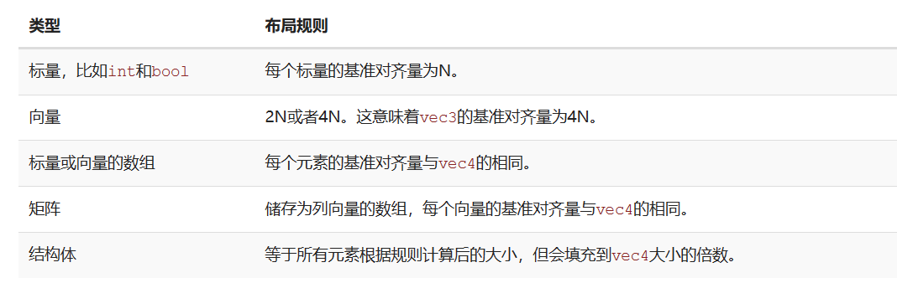

```glsl
layout (std140) uniform ExampleBlock
{
                     // 基准对齐量       // 对齐偏移量
    float value;     // 4               // 0 
    vec3 vector;     // 16              // 16  (必须是16的倍数，所以 4->16)
    mat4 matrix;     // 16              // 32  (列 0)
                     // 16              // 48  (列 1)
                     // 16              // 64  (列 2)
                     // 16              // 80  (列 3)
    float values[3]; // 16              // 96  (values[0])
                     // 16              // 112 (values[1])
                     // 16              // 128 (values[2])
    bool boolean;    // 4               // 144
    int integer;     // 4               // 148
}; 
```


紧凑(Packed)布局

- 不能保证这个布局在每个程序中保持不变的（即非共享）
- 允许编译器去将uniform变量从Uniform块中优化掉


#### 使用Uniform缓冲

- 创建一个Uniform缓冲对象

- 绑定到GL_UNIFORM_BUFFER目标

- 分配足够的内存

```cpp
unsigned int uboExampleBlock;
glGenBuffers(1, &uboExampleBlock);
glBindBuffer(GL_UNIFORM_BUFFER, uboExampleBlock);
glBufferData(GL_UNIFORM_BUFFER, 152, NULL, GL_STATIC_DRAW); // 分配152字节的内存
glBindBuffer(GL_UNIFORM_BUFFER, 0);
```

- 对缓冲更新或者插入数据:
  - 绑定到UBO对象，并使用glBufferSubData来更新它的内存

- 如何才能让OpenGL知道哪个Uniform缓冲对应的是哪个Uniform块呢？
  - OpenGL上下文中定义了一些`绑定点(Binding Point)`
  - 可以将一个Uniform缓冲对象链接至一个绑定点，并将着色器中的Uniform块绑定到相同的绑定点
    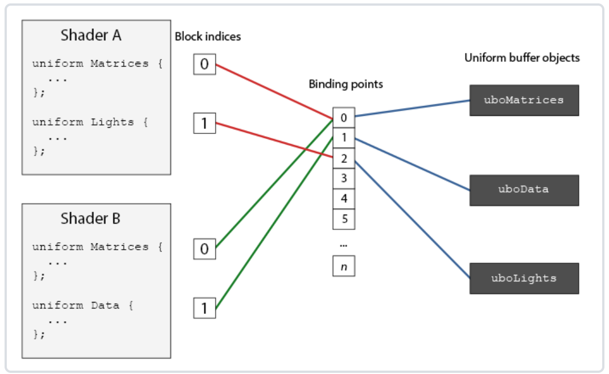


使用方法

- 绑定 着色器的Uniform块 到绑定点

  - 第一个参数是一个程序对象
  - 之后是一个 Uniform块索引 和 链接到的绑定点
    - Uniform块索引(Uniform Block Index)是着色器中已定义Uniform块的位置值索引
    - 通过调用glGetUniformBlockIndex来获取
  - 注意我们需要对**每个**着色器程序对象重复这一步骤。

  ```cpp
  unsigned int lights_index = glGetUniformBlockIndex(shaderA.ID, "Lights");   
  
  glUniformBlockBinding(shaderA.ID, lights_index, 2);
  ```

>从OpenGL 4.2版本起，你也可以添加一个布局标识符，显式地将Uniform块的绑定点储存在着色器中，这样就不用再调用glGetUniformBlockIndex和glUniformBlockBinding了。
>
>下面的代码显式地设置了Lights Uniform块的绑定点
>
>```glsl
>layout(std140, binding = 2) uniform Lights { ... };
>```


- 绑定 Uniform缓冲对象 到绑定点

  - `glBindbufferBase`需要 一个目标，一个绑定点索引和一个Uniform缓冲对象 作为它的参数。
  - `glBindBufferRange`需要 一个附加的偏移量和大小参数 ，这样子你可以绑定Uniform缓冲的特定一部分到绑定点中。

  ```cpp
  glBindBufferBase(GL_UNIFORM_BUFFER, 2, uboExampleBlock); 
  // 或
  glBindBufferRange(GL_UNIFORM_BUFFER, 2, uboExampleBlock, 0, 152);
  ```


- 设置 Uniform缓冲对象的数据
  - 使用glBufferSubData函数
  - 同样的步骤也能应用到Uniform块中其它的uniform变量上，但需要使用不同的范围参数

```cpp
glBindBuffer(GL_UNIFORM_BUFFER, uboExampleBlock);
int b = true; // GLSL中的bool是4字节的，所以我们将它存为一个integer
glBufferSubData(GL_UNIFORM_BUFFER, 144, 4, &b); 
glBindBuffer(GL_UNIFORM_BUFFER, 0);
```


#### 使用案例

如果我们回头看看之前所有的代码例子，我们不断地在使用3个矩阵：投影、观察和模型矩阵。在所有的这些矩阵中，只有模型矩阵会频繁变动。如果我们有多个着色器使用了这同一组矩阵，那么使用Uniform缓冲对象可能会更好。


顶点着色器

```glsl
#version 330 core
layout (location = 0) in vec3 aPos;

layout (std140) uniform Matrices
{
    mat4 projection;
    mat4 view;
};
uniform mat4 model;

void main()
{
    gl_Position = projection * view * model * vec4(aPos, 1.0);
}
```


初始化代码

```cpp
// 箱子着色器
Shader shaderRed("./MoreGLSLVShader.glsl", "./MoreGLSLFShaderRed.glsl");
Shader shaderGreen("./MoreGLSLVShader.glsl", "./MoreGLSLFShaderGreen.glsl");
Shader shaderBlue("./MoreGLSLVShader.glsl", "./MoreGLSLFShaderBlue.glsl");
Shader shaderYellow("./MoreGLSLVShader.glsl", "./MoreGLSLFShaderYellow.glsl");

Shader skyShader("./SkyboxVShader.glsl", "./SkyboxFShader.glsl");

// 将着色器程序的 uniform块 绑定到 绑定点0
unsigned int uniformBlockIndexRed = glGetUniformBlockIndex(shaderRed.ID, "Matrices");
unsigned int uniformBlockIndexGreen = glGetUniformBlockIndex(shaderGreen.ID, "Matrices");
unsigned int uniformBlockIndexBlue = glGetUniformBlockIndex(shaderBlue.ID, "Matrices");
unsigned int uniformBlockIndexYellow = glGetUniformBlockIndex(shaderYellow.ID, "Matrices");

glUniformBlockBinding(shaderRed.ID, uniformBlockIndexRed, 0);
glUniformBlockBinding(shaderGreen.ID, uniformBlockIndexGreen, 0);
glUniformBlockBinding(shaderBlue.ID, uniformBlockIndexBlue, 0);
glUniformBlockBinding(shaderYellow.ID, uniformBlockIndexYellow, 0);

// 创建 UBO
unsigned int uboMatrices;
glGenBuffers(1, &uboMatrices);
// 分配 UBO 的内存
glBindBuffer(GL_UNIFORM_BUFFER, uboMatrices);
glBufferData(GL_UNIFORM_BUFFER, 2 * sizeof(glm::mat4), NULL, GL_STATIC_DRAW);
glBindBuffer(GL_UNIFORM_BUFFER, 0);
// 绑定 UBO 到 绑定点0
glBindBufferRange(GL_UNIFORM_BUFFER, 0, uboMatrices, 0, 2 * sizeof(glm::mat4));

```

渲染循环内

```cpp

        // 计算变换矩阵
        glm::mat4 view = g_camera.GetLookAt();
        glm::mat4 projection = glm::mat4(1.0f);
        projection = glm::perspective(glm::radians(g_camera.GetFov()), 800.0f / 600.0f, 0.1f, 100.0f);
        
        // 设置 投影变换 和 视图变换 的矩阵数据到 ubo
        glBindBuffer(GL_UNIFORM_BUFFER, uboMatrices);
        glBufferSubData(GL_UNIFORM_BUFFER, 0, sizeof(glm::mat4), glm::value_ptr(projection));
        glBufferSubData(GL_UNIFORM_BUFFER, sizeof(glm::mat4), sizeof(glm::mat4), glm::value_ptr(view));
        glBindBuffer(GL_UNIFORM_BUFFER, 0);

        {
            glEnable(GL_DEPTH_TEST);
            glClearColor(0.2f, 0.3f, 0.3f, 1.0f);
            glClear(GL_COLOR_BUFFER_BIT | GL_DEPTH_BUFFER_BIT);

            // Draw Cube
            {
                glBindVertexArray(cubeVAO);

                glm::mat4 model;

                shaderRed.use();
                model = glm::mat4(1.0f);
                model = glm::translate(model, glm::vec3(-0.75f, 0.75f, 0.0f));  
                shaderRed.setMat4("model", model);
                glDrawArrays(GL_TRIANGLES, 0, 36);

                shaderGreen.use();
                model = glm::mat4(1.0f);
                model = glm::translate(model, glm::vec3(0.75f, 0.75f, 0.0f));  
                shaderGreen.setMat4("model", model);
                glDrawArrays(GL_TRIANGLES, 0, 36);

                shaderBlue.use();
                model = glm::mat4(1.0f);
                model = glm::translate(model, glm::vec3(0.75f, -0.75f, 0.0f));  
                shaderBlue.setMat4("model", model);
                glDrawArrays(GL_TRIANGLES, 0, 36);

                shaderYellow.use();
                model = glm::mat4(1.0f);
                model = glm::translate(model, glm::vec3(-0.75f, -0.75f, 0.0f));  
                shaderYellow.setMat4("model", model);
                glDrawArrays(GL_TRIANGLES, 0, 36);

                glBindVertexArray(0);
            }
            
            ...
```


结果

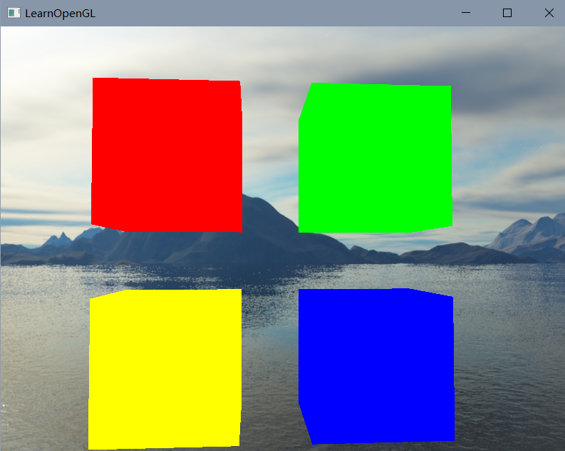


## 四、几何着色器

在顶点和片段着色器之间有一个可选的`几何着色器(Geometry Shader)`

- 几何着色器的输入是`一个图元（如点或三角形）的一组顶点`

- 在顶点发送到下一着色器阶段之前对它们随意变换
- 能够将（这一组）顶点变换为完全不同的图元
- 还能生成比原来更多的顶点


### 基本内容

几何着色器案例：

```glsl
#version 330 core
layout (points) in;
layout (line_strip, max_vertices = 2) out;

void main() {    
    gl_Position = gl_in[0].gl_Position + vec4(-0.1, 0.0, 0.0, 0.0); 
    EmitVertex();

    gl_Position = gl_in[0].gl_Position + vec4( 0.1, 0.0, 0.0, 0.0);
    EmitVertex();

    EndPrimitive();
}
```

- 声明从顶点着色器输入的图元类型：`layout (points) in;`
  - `points`：绘制GL_POINTS图元时（1）
  - `lines`：绘制GL_LINES或GL_LINE_STRIP时（2）
  - `lines_adjacency`：GL_LINES_ADJACENCY或GL_LINE_STRIP_ADJACENCY（4）
  - `triangles`：GL_TRIANGLES、GL_TRIANGLE_STRIP或GL_TRIANGLE_FAN（3）
  - `triangles_adjacency`：GL_TRIANGLES_ADJACENCY或GL_TRIANGLE_STRIP_ADJACENCY（6）
  - 括号内的数字表示的是一个图元所包含的最小顶点数

- 指定几何着色器输出的图元类型，以及该几何着色器能够输出的最大的顶点数量：`layout (line_strip, max_vertices = 2) out;`
  - `points`
  - `line_strip`
  - `triangle_strip`

- 用于传递顶点着色器输出的GLSL内建变量

  - 被声明为一个数组，因为大多数的渲染图元包含多于1个的顶点

  ```glsl
  in gl_Vertex
  {
      vec4  gl_Position;
      float gl_PointSize;
      float gl_ClipDistance[];
  } gl_in[];
  ```

- 2个几何着色器函数，`EmitVertex`和`EndPrimitive`

  - 调用`EmitVertex`时，gl_Position中的向量会被添加到图元中
  - 调用`EndPrimitive`时，所有发射出的(Emitted)顶点都会合成为指定的输出渲染图元
  - 几何着色器希望你能够生成并输出至少一个定义为输出的图元。
  - 在我们的例子中，我们需要至少生成一个线条图元。

  ```glsl
  void main() {
      gl_Position = gl_in[0].gl_Position + vec4(-0.1, 0.0, 0.0, 0.0); 
      EmitVertex();
  
      gl_Position = gl_in[0].gl_Position + vec4( 0.1, 0.0, 0.0, 0.0);
      EmitVertex();
  
      EndPrimitive();
  }
  ```

- 效果

  ```cpp
  glDrawArrays(GL_POINTS, 0, 4);
  ```

  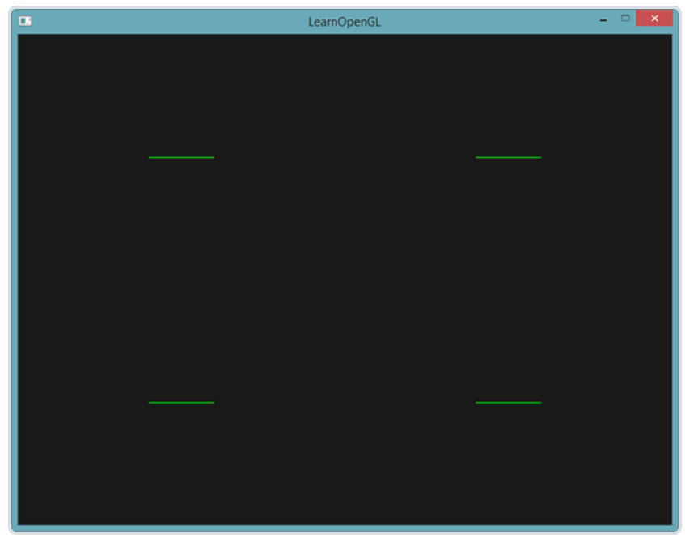


### 使用几何着色器

#### 传递(Pass-through)几何着色器

- 直接原封不动地将顶点着色器地数据，传递给片段着色器

- 定义

```glsl
#version 330 core
layout (points) in;
layout (points, max_vertices = 1) out;

void main() {    
    gl_Position = gl_in[0].gl_Position; 
    EmitVertex();
    EndPrimitive();
}
```

- 着色器代码编译
  - 使用GL_GEOMETRY_SHADER作为着色器类型

```cpp
geometryShader = glCreateShader(GL_GEOMETRY_SHADER);
glShaderSource(geometryShader, 1, &gShaderCode, NULL);
glCompileShader(geometryShader);  
...
glAttachShader(program, geometryShader);
glLinkProgram(program);
```


#### 画三角形

- 将几何着色器的输出设置为 `triangle_strip`
  - `triangle_strip`在第一个三角形绘制完之后，每个后续顶点将会在上一个三角形边上生成另一个三角形
  - 需要按一定的顺序传入三角形顶点
- 绘制三个三角形：其中两个组成一个正方形，另一个用作房顶。
  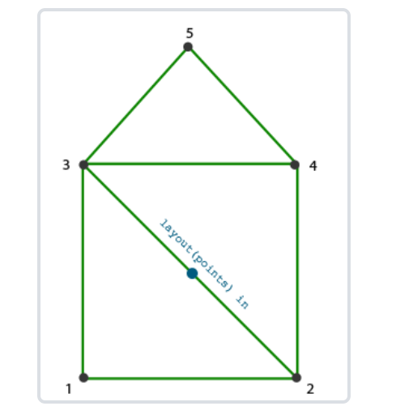

```glsl
#version 330 core
layout (points) in;
layout (triangle_strip, max_vertices = 5) out;

in VS_OUT {
    vec3 color;
} gs_in[];

out vec3 fColor;

void build_house(vec4 position)
{    
    fColor = gs_in[0].color; // gs_in[0] 因为只有一个输入顶点
    gl_Position = position + vec4(-0.2, -0.2, 0.0, 0.0);    // 1:左下  
    EmitVertex();   
    gl_Position = position + vec4( 0.2, -0.2, 0.0, 0.0);    // 2:右下
    EmitVertex();
    gl_Position = position + vec4(-0.2,  0.2, 0.0, 0.0);    // 3:左上
    EmitVertex();
    gl_Position = position + vec4( 0.2,  0.2, 0.0, 0.0);    // 4:右上
    EmitVertex();
    gl_Position = position + vec4( 0.0,  0.4, 0.0, 0.0);    // 5:顶部
    fColor = vec3(1.0, 1.0, 1.0);
    EmitVertex();
    EndPrimitive();
}

void main() {    
    build_house(gl_in[0].gl_Position);
}
```


结果

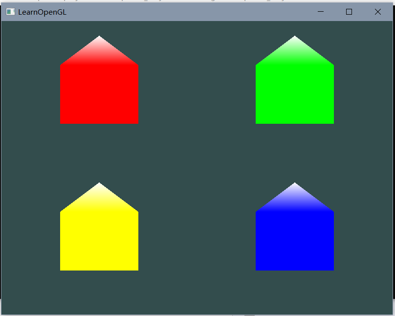


#### 爆破物体

我们是要将每个三角形沿着法向量的方向移动一小段时间，使得整个物体看起来像是沿着每个三角形的法线向量**爆炸**一样。


几何着色器代码应该如此

```glsl
#version 330 core
layout (triangles) in;
layout (triangle_strip, max_vertices = 3) out;

in VS_OUT {
    vec2 texCoords;
} gs_in[];

out vec2 TexCoords; 

uniform float time;

vec3 GetNormal()
{
   vec3 a = vec3(gl_in[0].gl_Position) - vec3(gl_in[1].gl_Position);
   vec3 b = vec3(gl_in[2].gl_Position) - vec3(gl_in[1].gl_Position);
   return normalize(cross(a, b));
}

vec4 explode(vec4 position, vec3 normal)
{
    float magnitude = 2.0;
    vec3 direction = normal * ((sin(time) + 1.0) / 2.0) * magnitude; 
    return position + vec4(direction, 0.0);
}

void main() {    
    vec3 normal = GetNormal();

    gl_Position = explode(gl_in[0].gl_Position, normal);
    TexCoords = gs_in[0].texCoords;
    EmitVertex();
    gl_Position = explode(gl_in[1].gl_Position, normal);
    TexCoords = gs_in[1].texCoords;
    EmitVertex();
    gl_Position = explode(gl_in[2].gl_Position, normal);
    TexCoords = gs_in[2].texCoords;
    EmitVertex();
    EndPrimitive();
}
```


顶点着色器和片段着色器还是用的之前的，懒得改直接用了

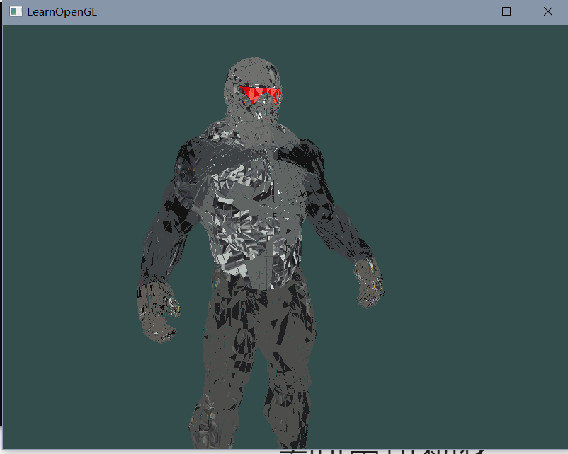

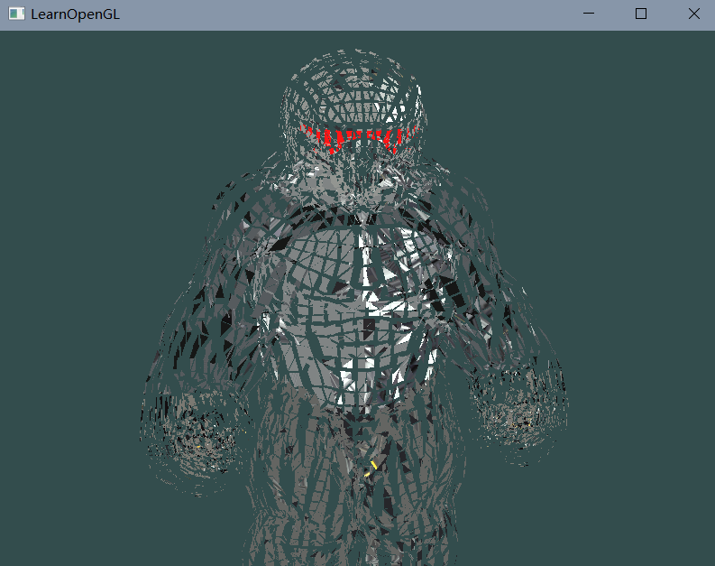


#### 法向量可视化

检测法向量是否正确的一个很好的方式就是对它们进行可视化，几何着色器正是实现这一目的非常有用的工具。


思路是这样的：

- 我们首先不使用几何着色器正常绘制场景。
- 然后再次绘制场景，但这次只显示通过几何着色器生成法向量。
- 几何着色器接收一个三角形图元，并沿着法向量生成三条线——每个顶点一个法向量。


```cpp
shader.use();
DrawScene();
normalDisplayShader.use();
DrawScene();
```


顶点着色器

```glsl
#version 330 core
layout (location = 0) in vec3 aPos;
layout (location = 1) in vec3 aNormal;

out VS_OUT {
    vec3 normal;
} vs_out;

uniform mat4 view;
uniform mat4 model;

void main()
{
    gl_Position = view * model * vec4(aPos, 1.0); 
    mat3 normalMatrix = mat3(transpose(inverse(view * model)));
    vs_out.normal = normalize(vec3(vec4(normalMatrix * aNormal, 0.0)));
}
```


几何着色器

```glsl
#version 330 core
layout (triangles) in;
layout (line_strip, max_vertices = 6) out;

in VS_OUT {
    vec3 normal;
} gs_in[];

const float MAGNITUDE = 0.4;

uniform mat4 projection;

void GenerateLine(int index)
{
    gl_Position = projection * gl_in[index].gl_Position;
    EmitVertex();
    gl_Position = projection * (gl_in[index].gl_Position + 
                                vec4(gs_in[index].normal, 0.0) * MAGNITUDE);
    EmitVertex();
    EndPrimitive();
}

void main()
{
    GenerateLine(0); // 第一个顶点法线
    GenerateLine(1); // 第二个顶点法线
    GenerateLine(2); // 第三个顶点法线
}
```


片段着色器

```glsl
#version 330 core
out vec4 FragColor;

void main()
{
    FragColor = vec4(1.0, 1.0, 0.0, 1.0);
}
```


结果

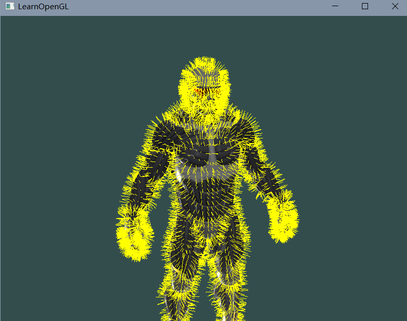


> 这样的几何着色器也经常用于给物体添加毛发(Fur)。


## 五、实例化

假设你有一个绘制了很多模型的场景，而大部分的模型包含的是同一组顶点数据，只不过进行的是不同的世界空间变换。


如果我们需要渲染大量物体时，代码看起来会像这样：

```cpp
for(unsigned int i = 0; i < amount_of_models_to_draw; i++)
{
    DoSomePreparations(); // 绑定VAO，绑定纹理，设置uniform等
    glDrawArrays(GL_TRIANGLES, 0, amount_of_vertices);
}
```

- 如果像这样绘制模型的大量实例(Instance)，你很快就会因为绘制调用过多而达到性能瓶颈。
  - 与绘制顶点本身相比，使用glDrawArrays或glDrawElements函数告诉GPU去绘制你的顶点数据会消耗更多的性能
  - 因为OpenGL在绘制顶点数据之前需要做很多准备工作
    - 比如告诉GPU该从哪个缓冲读取数据，从哪寻找顶点属性，而且这些都是在相对缓慢的CPU到GPU总线(CPU to GPU Bus)上进行的


### **实例化(Instancing)**

- 将数据一次性发送给GPU，然后使用一个绘制函数让OpenGL利用这些数据绘制多个物体
- 使用一个渲染调用来绘制多个物体，来节省每次绘制物体时CPU -> GPU的通信
- 将`glDrawArrays`和`glDrawElements`的渲染调用分别改为`glDrawArraysInstanced`和`glDrawElementsInstanced`


在实例化渲染方式中如何分辨不同实例

- GLSL在顶点着色器中嵌入了另一个内建变量 `gl_InstanceID`
- 在使用实例化渲染调用时，gl_InstanceID会从0开始，在每个实例被渲染时递增1。


案例：

- 顶点着色器

  - 关注 `uniform vec2 offsets[100];` 和 `gl_InstanceID`

  ```glsl
  #version 330 core
  layout (location = 0) in vec2 aPos;
  layout (location = 1) in vec3 aColor;
  
  out vec3 fColor;
  
  uniform vec2 offsets[100];
  
  void main()
  {
      vec2 offset = offsets[gl_InstanceID];
      gl_Position = vec4(aPos + offset, 0.0, 1.0);
      fColor = aColor;
  }
  ```

- 片段着色器

  ```glsl
  #version 330 core
  out vec4 FragColor;
  
  in vec3 fColor;
  
  void main()
  {
      FragColor = vec4(fColor, 1.0);
  }
  ```

- 其他代码

  ```cpp
  // 设置每个实例对应的数据
  glm::vec2 translations[100];
  int index = 0;
  float offset = 0.1f;
  for(int y = -10; y < 10; y += 2)
  {
      for(int x = -10; x < 10; x += 2)
      {
          glm::vec2 translation;
          translation.x = (float)x / 10.0f + offset;
          translation.y = (float)y / 10.0f + offset;
          translations[index++] = translation;
      }
  }
  
  
  // 并传递给着色器
  shader.use();
  for(unsigned int i = 0; i < 100; i++)
  {
      stringstream ss;
      string index;
      ss << i; 
      index = ss.str(); 
      shader.setVec2(("offsets[" + index + "]").c_str(), translations[i]);
  }
  
  // 绘制实例
  glBindVertexArray(quadVAO);
  glDrawArraysInstanced(GL_TRIANGLES, 0, 6, 100);
  ```

  

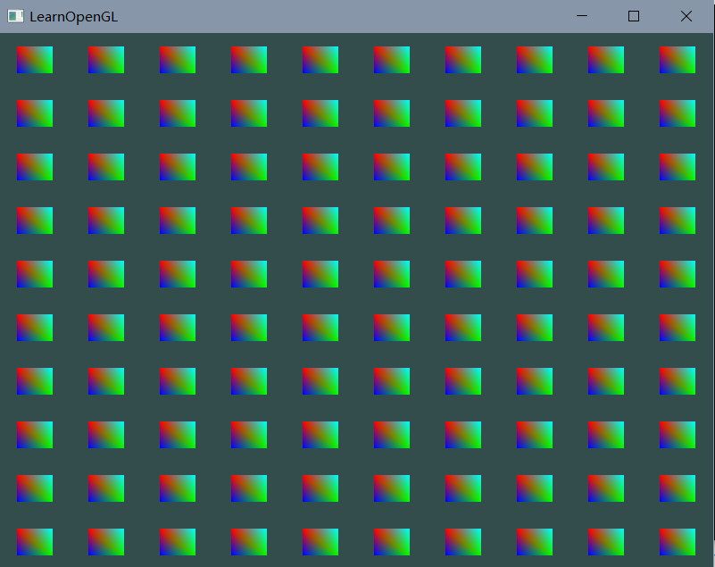


### 实例化数组

要渲染远超过100个实例的时候，我们最终会超过最大能够发送至着色器的uniform数据大小[上限](http://www.opengl.org/wiki/Uniform_(GLSL)#Implementation_limits)；

采用实例化数组(Instanced Array)解决这个问题


- 实例化数组被定义为一个顶点属性（能够让我们储存更多的数据），仅在顶点着色器渲染一个新的实例时才会更新。
- 顶点着色器的每次运行都会让GLSL获取新的一组适用于当前顶点的属性，而对于实例化数组这个属性，只有在渲染下一个实例（而不是下一个顶点）时才进行更新。


设置顶点着色器

```glsl
#version 330 core
layout (location = 0) in vec2 aPos;
layout (location = 1) in vec3 aColor;
layout (location = 2) in vec2 aOffset;

out vec3 fColor;

void main()
{
    gl_Position = vec4(aPos + aOffset, 0.0, 1.0);
    fColor = aColor;
}
```

其他代码

- `glVertexAttribDivisor`函数告诉了OpenGL该**什么时候**更新顶点属性的内容至新一组数据
  - 第一个参数是需要的顶点属性，第二个参数是属性除数(Attribute Divisor)
  - 默认情况下，属性除数是0，告诉OpenGL我们需要在顶点着色器的每次迭代时更新顶点属性。
  - 将它设置为1时，我们告诉OpenGL我们希望在渲染一个新实例的时候更新顶点属性。
  - 而设置为2时，我们希望每2个实例更新一次属性，以此类推。

```cpp
    glm::vec2 translations[100];
    int index = 0;
    float offset = 0.1f;
    for (int y = -10; y < 10; y += 2)
    {
        for (int x = -10; x < 10; x += 2)
        {
            glm::vec2 translation;
            translation.x = (float)x / 10.0f + offset;
            translation.y = (float)y / 10.0f + offset;
            translations[index++] = translation;
        }
    }

    // 将要传给实例化数组的数据映射到一个 instanceVBO
    unsigned int instanceVBO;
    glGenBuffers(1, &instanceVBO);
    glBindBuffer(GL_ARRAY_BUFFER, instanceVBO);
    glBufferData(GL_ARRAY_BUFFER, sizeof(glm::vec2) * 100, &translations[0], GL_STATIC_DRAW);
    glBindBuffer(GL_ARRAY_BUFFER, 0);


    // VBO 和 VAO（先bind VAO，之后再bind VBO设置数据，以及设置顶点属性指针）
    unsigned int VBO;
    unsigned int VAO;
    glGenVertexArrays(1, &VAO);
    glGenBuffers(1, &VBO);

    glBindVertexArray(VAO);
    glBindBuffer(GL_ARRAY_BUFFER, VBO);
    glBufferData(GL_ARRAY_BUFFER, sizeof(quadVertices), quadVertices, GL_STATIC_DRAW);
    glEnableVertexAttribArray(0);
    glVertexAttribPointer(0, 2, GL_FLOAT, GL_FALSE, 5 * sizeof(float), (void*)0);
    glEnableVertexAttribArray(1);
    glVertexAttribPointer(1, 3, GL_FLOAT, GL_FALSE, 5 * sizeof(float), (void*)(2 * sizeof(float)));
    // 设置instanceVBO的顶点属性指针，并启用顶点属性：
    glBindBuffer(GL_ARRAY_BUFFER, instanceVBO);
    glEnableVertexAttribArray(2);
    glVertexAttribPointer(2, 2, GL_FLOAT, GL_FALSE, 2 * sizeof(float), (void*)0);
    glBindBuffer(GL_ARRAY_BUFFER, 0);
    glVertexAttribDivisor(2, 1);
```


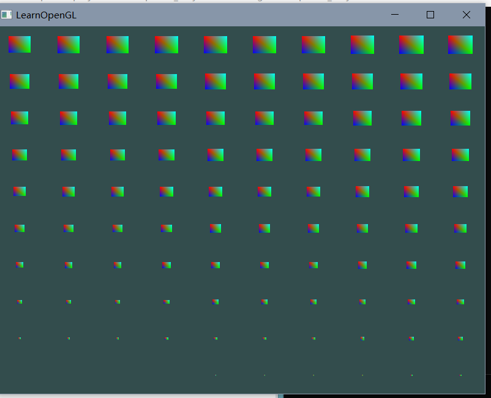


### 小行星带

懒得弄了...

主要是把每个小行星的 `uniform model矩阵` 抽离出来用实例化数组来存，即 `layout (location = 3) in mat4 instanceMatrix;`


>实例化渲染通常会用于渲染草、植被、粒子，以及上面这样的场景，基本上只要场景中有很多重复的形状，都能够使用实例化渲染来提高性能。


## 六、抗锯齿

锯齿边缘(Jagged Edges)的产生和光栅器将顶点数据转化为片段的方式有关。

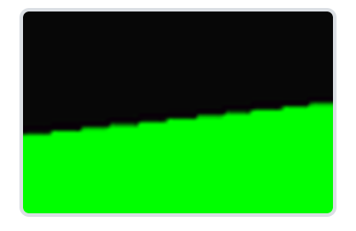

清楚看见形成边缘的像素，这种现象被称之为走样(Aliasing)。

抗锯齿（Anti-aliasing，也被称为反走样）的技术能够帮助我们缓解这种现象，从而产生更**平滑**的边缘。


- 超采样抗锯齿(Super Sample Anti-aliasing, SSAA)
  - 使用比正常分辨率更高的分辨率（即超采样）来渲染场景
  - 当图像输出在帧缓冲中更新时，分辨率会被下采样(Downsample)至正常的分辨率
  - 由于比平时要绘制更多的片段，它会带来很大的性能开销。
- 多重采样抗锯齿(Multisample Anti-aliasing, MSAA)
  - 借鉴了SSAA背后的理念，但却以更加高效的方式实现了抗锯齿


### 多重采样

**OpenGL光栅器的工作方式**

光栅器是位于最终处理过的顶点之后，到片段着色器之前，所经过的所有的算法与过程的总和。

- 光栅器会将一个图元的所有顶点作为输入，并将它转换为一系列的片段
- 顶点坐标理论上可以取任意值，但片段不行，因为它们受限于你窗口的分辨率
- 顶点坐标与片段之间几乎永远也不会有一对一的映射，所以光栅器必须以某种方式来决定每个顶点最终所在的片段/屏幕坐标


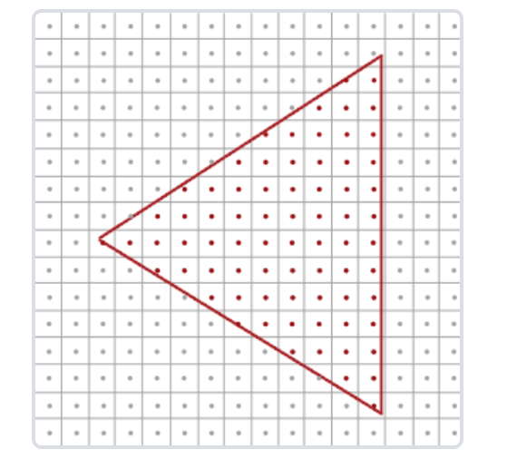


这里我们可以看到一个屏幕像素的网格，每个像素的中心包含有一个`采样点(Sample Point)`，它会被用来决定这个三角形是否遮盖了某个像素。

- 图中红色的采样点被三角形所遮盖，在每一个遮住的像素处都会生成一个片段.
- 虽然三角形边缘的一些部分也遮住了某些屏幕像素，但是这些像素的采样点并没有被三角形**内部**所遮盖，所以它们不会受到片段着色器的影响。


完成渲染后：

- 由于屏幕像素总量的限制，有些边缘的像素能够被渲染出来，而有些则不会。结果就是我们使用了不光滑的边缘来渲染图元，导致之前讨论到的锯齿边缘。

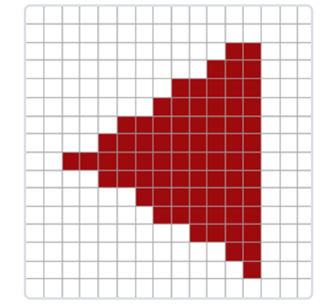


**多重采样**

多重采样所做的正是将单一的采样点变为多个采样点（这也是它名称的由来）

- 取而代之的是以特定图案排列的4个子采样点(Subsample)
  - 采样点的数量可以是任意的，更多的采样点能带来更精确的遮盖率
- 这也意味着颜色缓冲的大小会随着子采样点的增加而增加

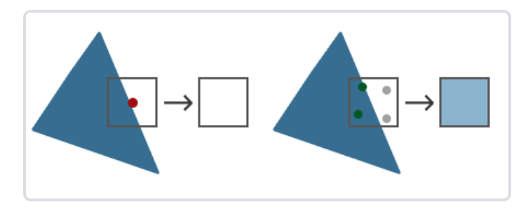

- 我们知道三角形只遮盖了2个子采样点，所以下一步是决定这个像素的颜色。
  - MSAA真正的工作方式是：无论三角形遮盖了多少个子采样点（至少1个），（每个图元中）每个像素只运行**一次**片段着色器。
  - 片段着色器所使用的顶点数据会插值到每个像素的**中心**，所得到的结果颜色会被储存在每个被遮盖住的子采样点中。
  - 当颜色缓冲的子样本被图元的所有颜色填满时，所有的这些颜色将会在每个像素内部平均化。
    - 因为上图的4个采样点中只有2个被遮盖住了，这个像素的颜色将会是三角形颜色与其他两个采样点的颜色（在这里是无色）的平均值，最终形成一种淡蓝色。
  - 对于每个像素来说，越少的子采样点被三角形所覆盖，那么它受到三角形的影响就越小。

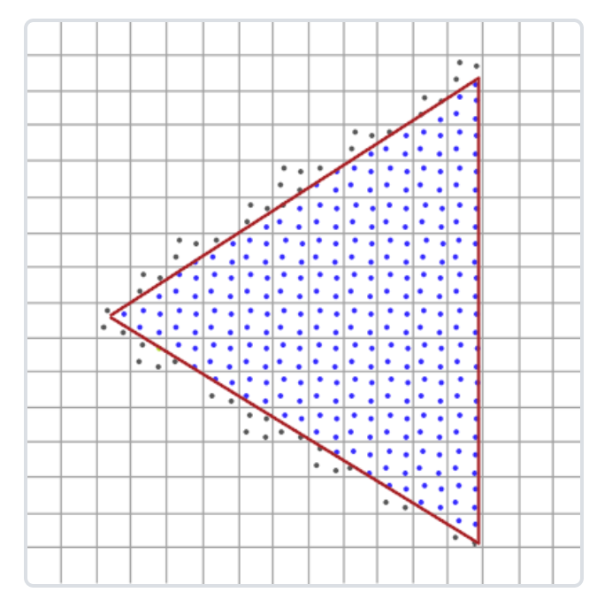

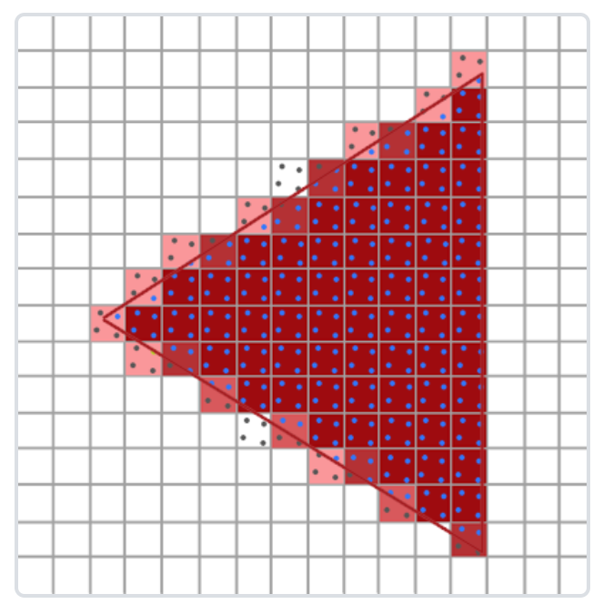

- 三角形的不平滑边缘被稍浅的颜色所包围后，从远处观察时就会显得更加平滑了。


不仅仅是颜色值会受到多重采样的影响，深度和模板测试也能够使用多个采样点。

- 对深度测试来说，每个顶点的深度值会在运行深度测试之前被插值到各个子样本中。
- 对模板测试来说，我们对每个子样本，而不是每个像素，存储一个模板值。

当然，这也意味着深度和模板缓冲的大小会乘以子采样点的个数。


### OpenGL中的MSAA

如果我们想要在OpenGL中使用MSAA，我们必须要使用一个能在每个像素中存储大于1个颜色值的颜色缓冲（因为多重采样需要我们为每个采样点都储存一个颜色）。


`多重采样缓冲(Multisample Buffer)`，存储特定数量的多重采样样本

- 大多数的窗口系统都应该提供了一个多重采样缓冲，用以代替默认的颜色缓冲

- 在创建窗口之前调用`glfwWindowHint`**提示**(Hint) GLFW，我们希望使用一个包含N个样本的多重采样缓冲

  ```cpp
  glfwWindowHint(GLFW_SAMPLES, 4);
  ```

  

调用glEnable启用GL_MULTISAMPLE，来启用多重采样

- 在大多数OpenGL的驱动上，多重采样都是默认启用的

- 只要默认的帧缓冲有了多重采样缓冲的附件，我们所要做的只是调用glEnable来启用多重采样。

  - 多重采样的算法都在OpenGL驱动的光栅器中实现了，我们不需要再多做什么。

  ```CPP
  glEnable(GL_MULTISAMPLE);
  ```

  


### 离屏MSAA

如果我们想要使用我们自己的帧缓冲来进行离屏渲染，那么我们就必须要自己动手生成多重采样缓冲了。

有两种方式可以创建多重采样缓冲，将其作为帧缓冲的附件：

- 纹理附件
- 渲染缓冲对象


#### 多重采样纹理附件

创建一个支持储存多个采样点的纹理

- 它的第二个参数设置的是纹理所拥有的样本个数
- 最后一个参数为GL_TRUE，图像将会对每个纹素使用相同的样本位置以及相同数量的子采样点个数

```cpp
glBindTexture(GL_TEXTURE_2D_MULTISAMPLE, tex);
glTexImage2DMultisample(GL_TEXTURE_2D_MULTISAMPLE, samples, GL_RGB, width, height, GL_TRUE);
glBindTexture(GL_TEXTURE_2D_MULTISAMPLE, 0);
```

使用glFramebufferTexture2D将多重采样纹理附加到帧缓冲上

```cpp
glFramebufferTexture2D(GL_FRAMEBUFFER, GL_COLOR_ATTACHMENT0, GL_TEXTURE_2D_MULTISAMPLE, tex, 0);
```


#### 多重采样渲染缓冲对象

在指定（当前绑定的）渲染缓冲的内存存储时，将`glRenderbufferStorage`的调用改为`glRenderbufferStorageMultisample`就可以了。

```cpp
glRenderbufferStorageMultisample(GL_RENDERBUFFER, 4, GL_DEPTH24_STENCIL8, width, height);
```


#### 渲染到多重采样帧缓冲

一个多重采样的图像包含比普通图像更多的信息，我们所要做的是缩小或者还原(Resolve)图像。

多重采样帧缓冲的还原通常是通过`glBlitFramebuffer`来完成：

- 将一个帧缓冲中的某个区域复制到另一个帧缓冲中，并且将多重采样缓冲还原。
- 将一个用4个屏幕空间坐标所定义的源区域复制到一个同样用4个屏幕空间坐标所定义的目标区域中
- 根据当前绑定的`GL_READ_FRAMEBUFFER`与`GL_DRAW_FRAMEBUFFER`来确定 源 和 目标


将图像位块传送(Blit)到默认的帧缓冲中，即把多重采样的帧缓冲传送到屏幕上。

```cpp
// 源：多重采样帧缓冲 目标：屏幕帧缓冲
glBindFramebuffer(GL_READ_FRAMEBUFFER, multisampledFBO);
glBindFramebuffer(GL_DRAW_FRAMEBUFFER, 0);

glBlitFramebuffer(0, 0, width, height, 0, 0, width, height, GL_COLOR_BUFFER_BIT, GL_NEAREST);
```


#### 使用多重采样帧缓冲做后期处理

使用多重采样帧缓冲的纹理输出来做像是后期处理这样的事情

- 我们不能直接在片段着色器中使用多重采样的纹理
- 我们能做的是将多重采样缓冲位块传送到一个没有使用多重采样纹理附件的FBO中，然后用这个普通的颜色附件来做后期处理

这也意味着我们需要生成一个新的FBO，作为中介帧缓冲对象，将多重采样缓冲还原为一个能在着色器中使用的普通2D纹理。这个过程的伪代码是这样的：

```cpp
unsigned int msFBO = CreateFBOWithMultiSampledAttachments();
// 使用普通的纹理颜色附件创建一个新的FBO
...
glFramebufferTexture2D(GL_FRAMEBUFFER, GL_COLOR_ATTACHMENT0, GL_TEXTURE_2D, screenTexture, 0);
...
while(!glfwWindowShouldClose(window))
{
    ...

    glBindFramebuffer(msFBO);
    ClearFrameBuffer();
    DrawScene();
    // 将多重采样缓冲还原到中介FBO上
    glBindFramebuffer(GL_READ_FRAMEBUFFER, msFBO);
    glBindFramebuffer(GL_DRAW_FRAMEBUFFER, intermediateFBO);
    glBlitFramebuffer(0, 0, width, height, 0, 0, width, height, GL_COLOR_BUFFER_BIT, GL_NEAREST);
    // 现在场景是一个2D纹理缓冲，可以将这个图像用来后期处理
    glBindFramebuffer(GL_FRAMEBUFFER, 0);
    ClearFramebuffer();
    glBindTexture(GL_TEXTURE_2D, screenTexture);
    DrawPostProcessingQuad();  

    ... 
}
```


>因为屏幕纹理又变回了一个只有单一采样点的普通纹理，像是**边缘检测**这样的后期处理滤镜会重新导致锯齿。为了补偿这一问题，你可以之后对纹理进行模糊处理，或者想出你自己的抗锯齿算法。


> 如果将多重采样与离屏渲染结合起来，我们需要自己负责一些额外的细节。


### 自定义抗锯齿算法

将一个多重采样的纹理图像不进行还原直接传入着色器也是可行的

GLSL提供了这样的选项，让我们能够对纹理图像的每个子样本进行采样，所以我们可以创建我们自己的抗锯齿算法

- 将纹理uniform采样器设置为`sampler2DMS`，而不是平常使用的sampler2D
- 使用`texelFetch`函数获取每个子样本的颜色值

```glsl
uniform sampler2DMS screenTextureMS;

void main()
{
    vec4 colorSample = texelFetch(screenTextureMS, TexCoords, 3);  // 第4个子样本
    ...
}
```

