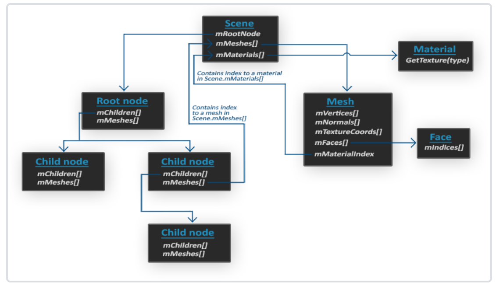
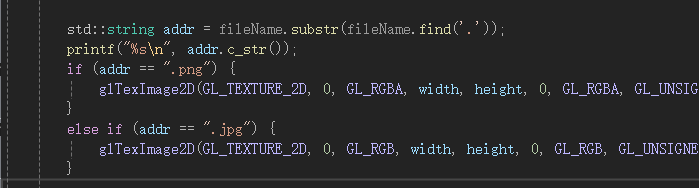
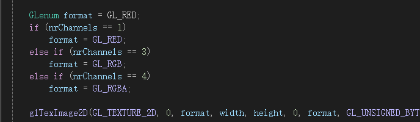
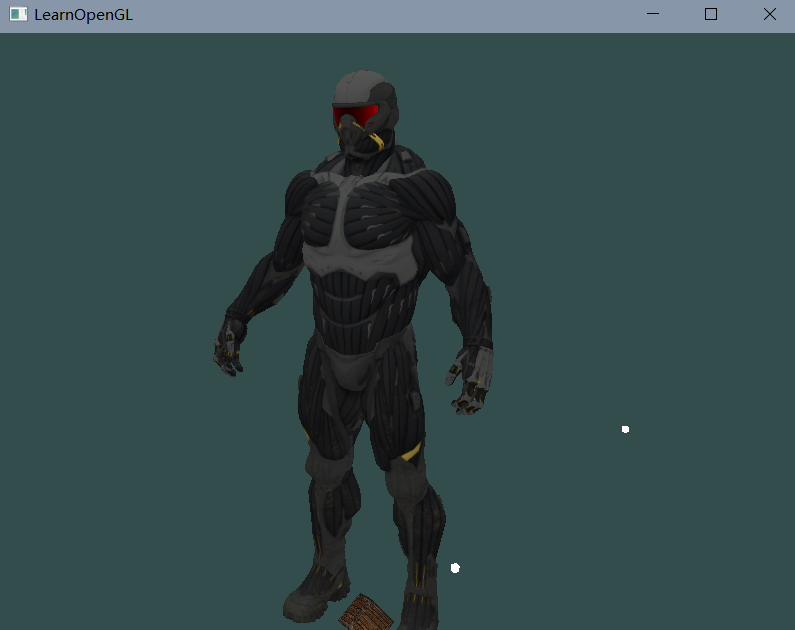
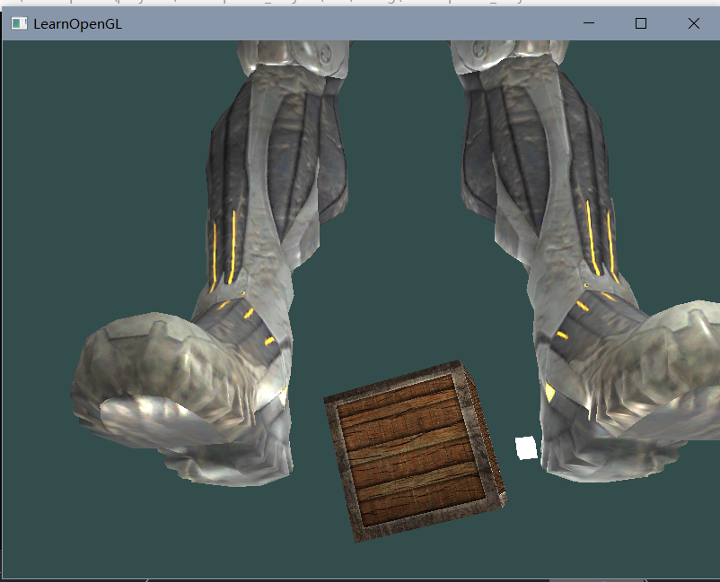
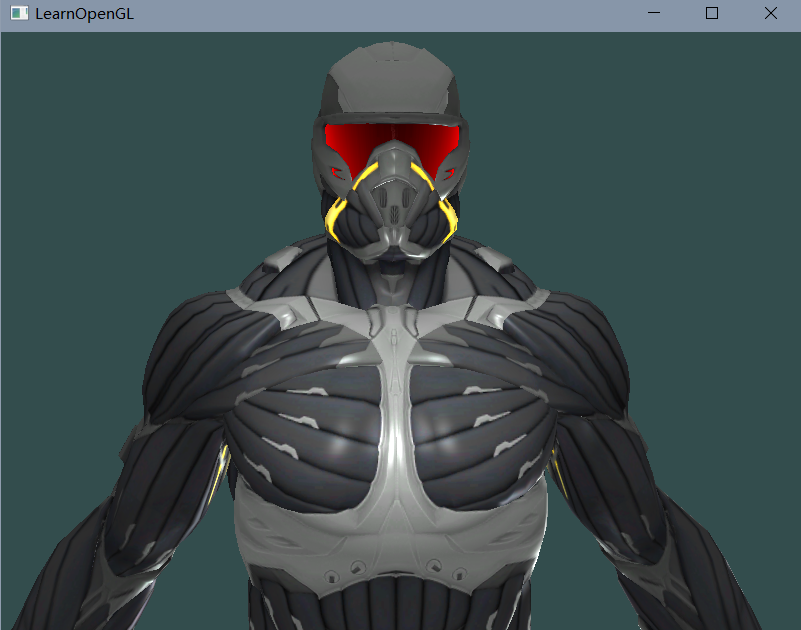
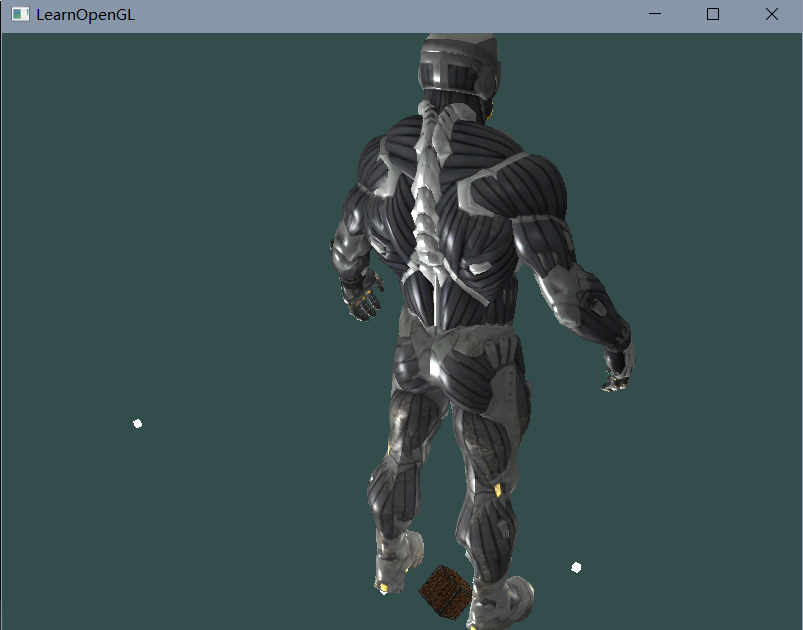
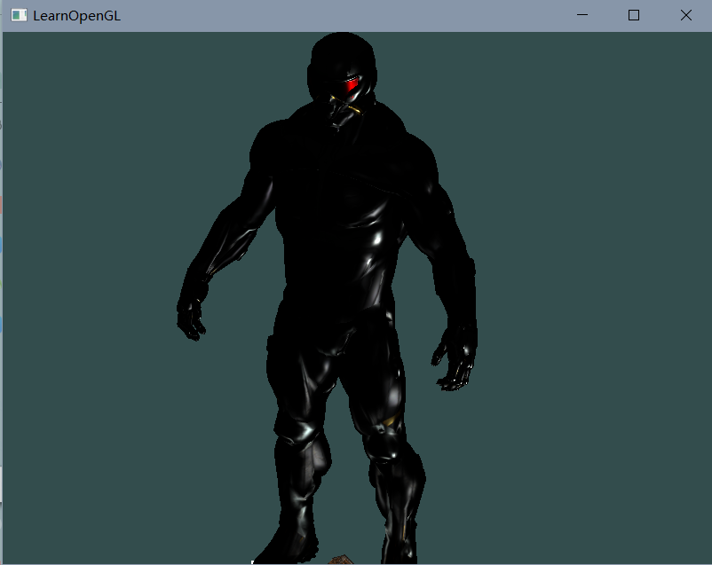

# 模型加载

模型通常都由3D艺术家在[Blender](http://www.blender.org/)、[3DS Max](http://www.autodesk.nl/products/3ds-max/overview)或者[Maya](http://www.autodesk.com/products/autodesk-maya/overview)这样的工具中精心制作。

这些所谓的3D建模工具(3D Modeling Tool)可以让艺术家创建复杂的形状，并使用一种叫做UV映射(uv-mapping)的手段来应用贴图。

我们想要的是将这些模型(Model)**导入**(Import)到程序当中。


模型格式：.obj, XML等


<!--more-->


## 一、Assimp

### 模型加载库

一个非常流行的模型导入库是[Assimp](http://assimp.org/)，开放的资产导入库（Open Asset Import Library）。

Assimp能够导入很多种不同的模型文件格式（并也能够导出部分的格式），它会将所有的模型数据加载至Assimp的通用数据结构中。

当Assimp加载完模型之后，我们就能够从Assimp的数据结构中提取我们所需的所有数据了。


当使用Assimp导入一个模型的时候，它通常会将整个模型加载进一个**场景**(Scene)对象，它会包含导入的模型/场景中的所有数据。

Assimp会将场景载入为一系列的节点(Node)，每个节点包含了场景对象中所储存数据的索引，每个节点都可以有任意数量的子节点。

Assimp数据结构的（简化）模型如下：



- 和材质和网格(Mesh)一样，所有的场景/模型数据都包含在Scene对象中。Scene对象也包含了场景根节点的引用。
- 场景的Root node（根节点）可能包含子节点（和其它的节点一样），它会有一系列指向场景对象中mMeshes数组中储存的网格数据的索引。Scene下的mMeshes数组储存了真正的Mesh对象，节点中的mMeshes数组保存的只是场景中网格数组的索引。
- 一个Mesh对象本身包含了渲染所需要的所有相关数据，像是顶点位置、法向量、纹理坐标、面(Face)和物体的材质。
- 一个网格包含了多个面。Face代表的是物体的渲染图元(Primitive)（三角形、方形、点）。一个面包含了组成图元的顶点的索引。由于顶点和索引是分开的，使用一个索引缓冲来渲染是非常简单的（见[你好，三角形](https://learnopengl-cn.github.io/01 Getting started/04 Hello Triangle/)）。
- 最后，一个网格也包含了一个Material对象，它包含了一些函数能让我们获取物体的材质属性，比如说颜色和纹理贴图（比如漫反射和镜面光贴图）。


所以，我们需要做的第一件事是将一个物体加载到Scene对象中，遍历节点，获取对应的Mesh对象（我们需要递归搜索每个节点的子节点），并处理每个Mesh对象来获取顶点数据、索引以及它的材质属性。

最终的结果是一系列的网格数据，我们会将它们包含在一个`Model`对象中。


>**网格**
>
>当使用建模工具对物体建模的时候，艺术家通常不会用单个形状创建出整个模型。通常每个模型都由几个子模型/形状组合而成。
>
>组合模型的每个单独的形状就叫做一个网格(Mesh)。
>
>比如说有一个人形的角色：艺术家通常会将头部、四肢、衣服、武器建模为分开的组件，并将这些网格组合而成的结果表现为最终的模型。
>
>一个网格是我们在OpenGL中绘制物体所需的最小单位（顶点数据、索引和材质属性）。一个模型（通常）会包括多个网格。


### 链接

链接这个库的时候，我是把assimp.dll直接放在项目的程序生成所在的目录。


而附加依赖项中只放assimp.lib


放在自己指定的目录的时候总是用不了

- 在VS的附加依赖项中加入assimp.dll时，链接的时候就会报错`LINK1107：无法读取assimp.dll的0x300地址处`
- 不加的话，程序启动后又会提示找不到dll。


## 二、网格

通过使用Assimp，我们可以加载不同的模型到程序中，但是载入后它们都被储存为Assimp的数据结构。我们最终仍要将这些数据转换为OpenGL能够理解的格式，这样才能渲染这个物体


网格(Mesh)代表的是单个的可绘制实体，我们现在先来定义一个我们自己的网格类。

### 网格类

一个网格应该至少需要：

- 一系列的顶点
  - 每个顶点包含一个位置向量、一个法向量和一个纹理坐标向量
- 用于索引绘制的索引
- 纹理形式的材质数据（漫反射/镜面光贴图）


#### 类结构

**顶点类**

```cpp
struct Vertex {
    glm::vec3 Position;
    glm::vec3 Normal;
    glm::vec2 TexCoords;
};
```

**纹理类**

```cpp
struct Texture {
    unsigned int id;
    string type;
};
```

**网格类**

```cpp
class Mesh {
    public:
        /*  网格数据  */
        vector<Vertex> vertices;
        vector<unsigned int> indices;
        vector<Texture> textures;
    
        /*  函数  */
        Mesh(vector<Vertex> vertices, vector<unsigned int> indices, vector<Texture> textures);
        void Draw(Shader shader);
    private:
        /*  渲染数据  */
        unsigned int VAO, VBO, EBO;
        /*  函数  */
        void setupMesh();
};  
```


#### 函数

**构造函数**

- 设置 顶点、索引、纹理数据

```cpp
Mesh(vector<Vertex> vertices, vector<unsigned int> indices, vector<Texture> textures)
{
    this->vertices = vertices;
    this->indices = indices;
    this->textures = textures;

    setupMesh();
}
```

**初始化函数**

- 创建顶点数组、顶点缓冲、索引缓冲对象
- 绑定和配置顶点缓冲对象的数据
- 设置顶点属性指针

```cpp
void setupMesh()
{
    // 创建
    glGenVertexArrays(1, &VAO);
    glGenBuffers(1, &VBO);
    glGenBuffers(1, &EBO);

    // 绑定VAO，VBO
    glBindVertexArray(VAO);
    glBindBuffer(GL_ARRAY_BUFFER, VBO);

    // 设置顶点缓冲的顶点数据（我们用 Vertex 结构体存储一个顶点的数据，并且一个顶点结构体中的不同属性的数据在内存中是连续的）
    glBufferData(GL_ARRAY_BUFFER, vertices.size() * sizeof(Vertex), &vertices[0], GL_STATIC_DRAW);  

    // 绑定索引/元素缓冲 设置索引数据
    glBindBuffer(GL_ELEMENT_ARRAY_BUFFER, EBO);
    glBufferData(GL_ELEMENT_ARRAY_BUFFER, indices.size() * sizeof(unsigned int), 
                 &indices[0], GL_STATIC_DRAW);

	// 顶点属性指针设置
    
    // 顶点位置
    glEnableVertexAttribArray(0);   
    glVertexAttribPointer(0, 3, GL_FLOAT, GL_FALSE, sizeof(Vertex), (void*)0);
    // 顶点法线
    glEnableVertexAttribArray(1);   
    glVertexAttribPointer(1, 3, GL_FLOAT, GL_FALSE, sizeof(Vertex), (void*)offsetof(Vertex, Normal));
    // 顶点纹理坐标
    glEnableVertexAttribArray(2);   
    glVertexAttribPointer(2, 2, GL_FLOAT, GL_FALSE, sizeof(Vertex), (void*)offsetof(Vertex, TexCoords));

    // 解绑VAO
    glBindVertexArray(0);
}  
```


> 用结构体组织数据
>
> - 结构体中的不同属性的数据在内存中是连续的
>
> - 预处理指令`offsetof(s, m)`，它的第一个参数是一个结构体，第二个参数是这个结构体中变量的名字。
>
>   - 这个宏会返回那个变量距结构体头部的字节偏移量(Byte Offset)。这正好可以用在定义glVertexAttribPointer函数中的偏移参数（最后一个）
>
>     ```c++
>     glVertexAttribPointer(1, 3, GL_FLOAT, GL_FALSE, sizeof(Vertex), (void*)offsetof(Vertex, Normal)); 
>     ```
>
>     


**渲染**

- 先绑定相应的纹理
  - 统一 uniform 纹理变量的命名规则：
    - 每个漫反射纹理被命名为`texture_diffuseN`
    - 每个镜面光纹理应该被命名为`texture_specularN`
- 调用`glDrawElements`函数绘制

```cpp
void Draw(Shader shader) 
{
    unsigned int diffuseNr = 1;
    unsigned int specularNr = 1;
    for(unsigned int i = 0; i < textures.size(); i++)
    {
        glActiveTexture(GL_TEXTURE0 + i); // 在绑定之前激活相应的纹理单元
        // 获取纹理序号（diffuse_textureN 中的 N）
        string number;
        string name = textures[i].type;
        if(name == "texture_diffuse")
            number = std::to_string(diffuseNr++);
        else if(name == "texture_specular")
            number = std::to_string(specularNr++);

        shader.setInt(("material." + name + number).c_str(), i);
        glBindTexture(GL_TEXTURE_2D, textures[i].id);
    }
    glActiveTexture(GL_TEXTURE0);

    // 绘制网格
    glBindVertexArray(VAO);
    glDrawElements(GL_TRIANGLES, indices.size(), GL_UNSIGNED_INT, 0);
    glBindVertexArray(0);
}
```


## 三、模型

### 模型类

- 数据成员：
  - 一组网格的数据
  - 模型文件所在目录（我们假定把模型文件、纹理贴图都放在同一目录下）
    - 模型文件会给出其纹理贴图的相对路径，且是相对于模型文件所在的目录（一般来说，有些模型文件中给出的是绝对路径）
- 方法：
  - 构造函数：加载模型
  - 模型加载（处理Node，Mesh，纹理加载）
  - 模型绘制：遍历网格，调用draw


**加载模型**

- Assimp::Importer::ReadFile函数的参数：路径，后期处理选项

- 后期处理选项：

  - aiProcess_Triangulate：我们告诉Assimp，如果模型不是（全部）由三角形组成，它需要将模型所有的图元形状变换为三角形。
  - aiProcess_FlipUVs：将在处理的时候翻转y轴的纹理坐标。
  - aiProcess_GenNormals：如果模型不包含法向量的话，就为每个顶点创建法线。

  - aiProcess_SplitLargeMeshes：将比较大的网格分割成更小的子网格，如果你的渲染有最大顶点数限制，只能渲染较小的网格，那么它会非常有用。

  - aiProcess_OptimizeMeshes：和上个选项相反，它会将多个小网格拼接为一个大的网格，减少绘制调用从而进行优化。

```cpp
void Model::loadModel(std::string path)
{
    Assimp::Importer importer;
    // 参数：文件路径，后期处理(Post-processing)的选项
    const aiScene* scene = importer.ReadFile(path, aiProcess_Triangulate | aiProcess_FlipUVs);
    if(!scene || scene->mFlags & AI_SCENE_FLAGS_INCOMPLETE || !scene->mRootNode) 
    {
        cout << "ERROR::ASSIMP::" << importer.GetErrorString() << endl;
        return;
    }
    directory = path.substr(0, path.find_last_of('/'));

    processNode(scene->mRootNode, scene);
}
```

**递归处理得到的节点**

- 每个节点包含了一系列的网格索引，每个索引指向场景对象中的那个特定网格

```cpp
void processNode(aiNode *node, const aiScene *scene)
{
    // 处理节点所有的网格（如果有的话）
    for(unsigned int i = 0; i < node->mNumMeshes; i++)
    {
        aiMesh *mesh = scene->mMeshes[node->mMeshes[i]]; 
        meshes.push_back(processMesh(mesh, scene));         
    }
    // 接下来对它的子节点重复这一过程
    for(unsigned int i = 0; i < node->mNumChildren; i++)
    {
        processNode(node->mChildren[i], scene);
    }
}
```

**解析assimp库Mesh对象**

- 顶点数据
  - 顶点位置、法线、纹理坐标
- 索引数据
  - 以面 face 为单位，每个面代表了一个图元
  - 使用了aiProcess_Triangulate选项则是三角形面
  - 一个面包含了多个索引，它们定义了在每个图元中，我们应该绘制哪个顶点，并以什么顺序绘制
- 材质数据
  - 加载各种纹理贴图，并将纹理id保存到Texture结构
  - 一个材质对象的内部对每种纹理类型都存储了一个纹理位置数组
    - 不同的纹理类型都以`aiTextureType_`为前缀

```cpp
Mesh processMesh(aiMesh *mesh, const aiScene *scene)
{
    vector<Vertex> vertices;
    vector<unsigned int> indices;
    vector<Texture> textures;

    // 处理顶点
    for(unsigned int i = 0; i < mesh->mNumVertices; i++)
    {
        Vertex vertex;
        
        // 处理顶点位置、法线和纹理坐标
        glm::vec3 vector; 
        
        vector.x = mesh->mVertices[i].x;
        vector.y = mesh->mVertices[i].y;
        vector.z = mesh->mVertices[i].z; 
        vertex.Position = vector;
        
        vector.x = mesh->mNormals[i].x;
        vector.y = mesh->mNormals[i].y;
        vector.z = mesh->mNormals[i].z;
        vertex.Normal = vector;
        
        // Assimp允许一个模型在一个顶点上有最多8个不同的纹理坐标，我们不会用到那么多，我们只关心第一组纹理坐标。
        if(mesh->mTextureCoords[0]) // 网格是否有纹理坐标？
        {
            glm::vec2 vec;
            vec.x = mesh->mTextureCoords[0][i].x; 
            vec.y = mesh->mTextureCoords[0][i].y;
            vertex.TexCoords = vec;
        }
        else {
            vertex.TexCoords = glm::vec2(0.0f, 0.0f);
        }
        
        vertices.push_back(vertex);
    }
    
    // 处理索引
    for(unsigned int i = 0; i < mesh->mNumFaces; i++)
    {
        aiFace face = mesh->mFaces[i];
        for(unsigned int j = 0; j < face.mNumIndices; j++)
            indices.push_back(face.mIndices[j]);
    }
    
    // 处理材质
    if(mesh->mMaterialIndex >= 0)
    {
        aiMaterial *material = scene->mMaterials[mesh->mMaterialIndex];
        vector<Texture> diffuseMaps = loadMaterialTextures(material, aiTextureType_DIFFUSE, "texture_diffuse");
        textures.insert(textures.end(), diffuseMaps.begin(), diffuseMaps.end());
        vector<Texture> specularMaps = loadMaterialTextures(material, aiTextureType_SPECULAR, "texture_specular");
        textures.insert(textures.end(), specularMaps.begin(), specularMaps.end());
    }

    return Mesh(vertices, indices, textures);
}
```


**纹理读入和加载**

```cpp
std::vector<Texture> Model::loadMaterialTextures(aiMaterial* mat, aiTextureType type, std::string typeName)
{
    std::vector<Texture> textures;
    for (unsigned int i = 0; i < mat->GetTextureCount(type); i++)
    {
        // 获取模型文件中定义的纹理文件路径
        aiString str;
        mat->GetTexture(type, i, &str);

        // 设置纹理
        Texture texture;
        texture.id = TextureFromFile(str.C_Str(), directory);
        texture.type = typeName;
        texture.path = str.C_Str();
        textures.push_back(texture);
    }
    return textures;
}

unsigned int Model::TextureFromFile(std::string fileName, std::string dict)
{
    unsigned int texture;
    glGenTextures(1, &texture);
    glBindTexture(GL_TEXTURE_2D, texture);
    // 设置延申方式
    glTexParameteri(GL_TEXTURE_2D, GL_TEXTURE_WRAP_S, GL_REPEAT); // note that we set the container wrapping method to GL_CLAMP_TO_EDGE
    glTexParameteri(GL_TEXTURE_2D, GL_TEXTURE_WRAP_T, GL_REPEAT);
    // 设置纹理过滤方式
    glTexParameteri(GL_TEXTURE_2D, GL_TEXTURE_MIN_FILTER, GL_NEAREST); // set texture filtering to nearest neighbor to clearly see the texels/pixels
    glTexParameteri(GL_TEXTURE_2D, GL_TEXTURE_MAG_FILTER, GL_NEAREST);

    int width, height, nrChannels;
    std::string path = dict + fileName;
    printf("texture path: %s\n", path.c_str());
    unsigned char *data = stbi_load(path.c_str(), &width, &height, &nrChannels, 0);
    if (data)
    {
        // 将纹理数据加载到纹理对象

        std::string addr = fileName.substr(fileName.find('.'));
        if (addr == "png") {
            glTexImage2D(GL_TEXTURE_2D, 0, GL_RGBA, width, height, 0, GL_RGBA, GL_UNSIGNED_BYTE, data);
        }
        else if (addr == "jpg") {
            glTexImage2D(GL_TEXTURE_2D, 0, GL_RGB, width, height, 0, GL_RGB, GL_UNSIGNED_BYTE, data);
        }

        glGenerateMipmap(GL_TEXTURE_2D);
    }
    else
    {
        std::cout << "Failed to load texture" << std::endl;
        stbi_image_free(data);
        return -1;
    }

    stbi_image_free(data);
    return texture;
}
```


### 优化

在我们当前的实现中，即便同样的纹理已经被加载过很多遍了，对每个网格仍会加载并生成一个新的纹理。

- 记录已加载的纹理
- 后续给各个网格加载纹理时，先通过纹理文件名判断是否已加载过
  - 已加载则直接使用加载过的纹理id

```cpp
class Texture{
    unsigned int id;
    string type;
    aiString path;  // 我们储存纹理的路径用于与其它纹理进行比较
}

class model {
private:
    ...
    vector<Texture> textures_loaded;
    ...
}

vector<Texture> loadMaterialTextures(aiMaterial *mat, aiTextureType type, string typeName)
{
    vector<Texture> textures;
    for(unsigned int i = 0; i < mat->GetTextureCount(type); i++)
    {
        aiString str;
        mat->GetTexture(type, i, &str);
        bool skip = false;
        // 遍历检查是否已加载过
        for(unsigned int j = 0; j < textures_loaded.size(); j++)
        {
            if(std::strcmp(textures_loaded[j].path.C_Str(), str.C_Str()) == 0)
            {
                textures.push_back(textures_loaded[j]);
                skip = true; 
                break;
            }
        }
        
        if(!skip)
        {   // 如果纹理还没有被加载，则加载它
            Texture texture;
            texture.id = TextureFromFile(str.C_Str(), directory);
            texture.type = typeName;
            texture.path = str.C_Str();
            textures.push_back(texture);
            textures_loaded.push_back(texture); // 添加到已加载的纹理中
        }
    }
    return textures;
}
```


## 结果

- 又是因为载入纹理的地方出错，导致浪费了很多时间

  - 漏掉了一个点，比较处应该是".png"而不是"png" 

  

- 用更好的代码替代：




### 基础版




### 高级版









### 黑金版




### 代码

#### main.cpp

```cpp
#include "public.h"
#include <iostream>
#include "ShaderMgr.h"
#include "camera.h"
#include "part1.h"
#include <string>
#include "Model.h"

MyCamera g_camera;

float mixValue;

float vertices[] = {
    // positions          // normals           // texture coords
    -0.5f, -0.5f, -0.5f,  0.0f,  0.0f, -1.0f,  0.0f,  0.0f,
     0.5f, -0.5f, -0.5f,  0.0f,  0.0f, -1.0f,  1.0f,  0.0f,
     0.5f,  0.5f, -0.5f,  0.0f,  0.0f, -1.0f,  1.0f,  1.0f,
     0.5f,  0.5f, -0.5f,  0.0f,  0.0f, -1.0f,  1.0f,  1.0f,
    -0.5f,  0.5f, -0.5f,  0.0f,  0.0f, -1.0f,  0.0f,  1.0f,
    -0.5f, -0.5f, -0.5f,  0.0f,  0.0f, -1.0f,  0.0f,  0.0f,

    -0.5f, -0.5f,  0.5f,  0.0f,  0.0f,  1.0f,  0.0f,  0.0f,
     0.5f, -0.5f,  0.5f,  0.0f,  0.0f,  1.0f,  1.0f,  0.0f,
     0.5f,  0.5f,  0.5f,  0.0f,  0.0f,  1.0f,  1.0f,  1.0f,
     0.5f,  0.5f,  0.5f,  0.0f,  0.0f,  1.0f,  1.0f,  1.0f,
    -0.5f,  0.5f,  0.5f,  0.0f,  0.0f,  1.0f,  0.0f,  1.0f,
    -0.5f, -0.5f,  0.5f,  0.0f,  0.0f,  1.0f,  0.0f,  0.0f,

    -0.5f,  0.5f,  0.5f, -1.0f,  0.0f,  0.0f,  1.0f,  0.0f,
    -0.5f,  0.5f, -0.5f, -1.0f,  0.0f,  0.0f,  1.0f,  1.0f,
    -0.5f, -0.5f, -0.5f, -1.0f,  0.0f,  0.0f,  0.0f,  1.0f,
    -0.5f, -0.5f, -0.5f, -1.0f,  0.0f,  0.0f,  0.0f,  1.0f,
    -0.5f, -0.5f,  0.5f, -1.0f,  0.0f,  0.0f,  0.0f,  0.0f,
    -0.5f,  0.5f,  0.5f, -1.0f,  0.0f,  0.0f,  1.0f,  0.0f,

     0.5f,  0.5f,  0.5f,  1.0f,  0.0f,  0.0f,  1.0f,  0.0f,
     0.5f,  0.5f, -0.5f,  1.0f,  0.0f,  0.0f,  1.0f,  1.0f,
     0.5f, -0.5f, -0.5f,  1.0f,  0.0f,  0.0f,  0.0f,  1.0f,
     0.5f, -0.5f, -0.5f,  1.0f,  0.0f,  0.0f,  0.0f,  1.0f,
     0.5f, -0.5f,  0.5f,  1.0f,  0.0f,  0.0f,  0.0f,  0.0f,
     0.5f,  0.5f,  0.5f,  1.0f,  0.0f,  0.0f,  1.0f,  0.0f,

    -0.5f, -0.5f, -0.5f,  0.0f, -1.0f,  0.0f,  0.0f,  1.0f,
     0.5f, -0.5f, -0.5f,  0.0f, -1.0f,  0.0f,  1.0f,  1.0f,
     0.5f, -0.5f,  0.5f,  0.0f, -1.0f,  0.0f,  1.0f,  0.0f,
     0.5f, -0.5f,  0.5f,  0.0f, -1.0f,  0.0f,  1.0f,  0.0f,
    -0.5f, -0.5f,  0.5f,  0.0f, -1.0f,  0.0f,  0.0f,  0.0f,
    -0.5f, -0.5f, -0.5f,  0.0f, -1.0f,  0.0f,  0.0f,  1.0f,

    -0.5f,  0.5f, -0.5f,  0.0f,  1.0f,  0.0f,  0.0f,  1.0f,
     0.5f,  0.5f, -0.5f,  0.0f,  1.0f,  0.0f,  1.0f,  1.0f,
     0.5f,  0.5f,  0.5f,  0.0f,  1.0f,  0.0f,  1.0f,  0.0f,
     0.5f,  0.5f,  0.5f,  0.0f,  1.0f,  0.0f,  1.0f,  0.0f,
    -0.5f,  0.5f,  0.5f,  0.0f,  1.0f,  0.0f,  0.0f,  0.0f,
    -0.5f,  0.5f, -0.5f,  0.0f,  1.0f,  0.0f,  0.0f,  1.0f
};

int main()
{
    mixValue = 0.2f;

    // GLFW 窗口初始化
    GLFWwindow* window = init_GLFW_window(800, 600, "LearnOpenGL");
    if (window == nullptr) {
        std::cout << "Failed to initialize GLFW" << std::endl;
        return -1;
    }

    // GLAD 函数地址初始化
    if (GL_FALSE == gladLoadGLLoader((GLADloadproc)glfwGetProcAddress))
    {
        std::cout << "Failed to initialize GLAD" << std::endl;
        return -1;
    }
    // 相机初始化
    g_camera.Init(glm::vec3(0.0f, 0.0f, 3.0f), glm::vec3(0.0f, 0.0f, -1.0f), glm::vec3(0.0f, 1.0f, 0.0f));

    // 开启深度缓冲
    glEnable(GL_DEPTH_TEST);

    // 顶点缓冲设置
    unsigned int VBO;
    glGenBuffers(1, &VBO);
    glBindBuffer(GL_ARRAY_BUFFER, VBO);
    // 把之前定义的顶点数据复制到缓冲的内存
    glBufferData(GL_ARRAY_BUFFER, sizeof(vertices), vertices, GL_STATIC_DRAW);

    // 箱子顶点数组生成
    unsigned int VAO;
    glGenVertexArrays(1, &VAO);
    glBindVertexArray(VAO);
    glVertexAttribPointer(0, 3, GL_FLOAT, GL_FALSE, 8 * sizeof(float), (void*)0);
    glEnableVertexAttribArray(0);
    glVertexAttribPointer(1, 3, GL_FLOAT, GL_FALSE, 8 * sizeof(float), (void*)(3 * sizeof(float)));
    glEnableVertexAttribArray(1);
    glVertexAttribPointer(2, 2, GL_FLOAT, GL_FALSE, 8 * sizeof(float), (void*)(6 * sizeof(float)));
    glEnableVertexAttribArray(2);
    // 生成和绑定纹理对象，并载入纹理数据
    unsigned int texture1;
    unsigned char* data1 = nullptr;
    int width1, height1, nrChannels1;
    texture1 = GenAndLoadTexture("resource/container2.png", &width1, &height1, &nrChannels1, data1, GL_RGBA);
    if (texture1 == -1) {
        std::cout << "load texture failed1\n" << std::endl;
        return -1;
    }
    stbi_image_free(data1);
    unsigned int texture2;
    unsigned char* data2 = nullptr;
    int width2, height2, nrChannels2;
    texture2 = GenAndLoadTexture("resource/container2_specular.png", &width2, &height2, &nrChannels2, data2, GL_RGBA);
    if (texture2 == -1) {
        std::cout << "load texture failed2\n" << std::endl;
        return -1;
    }
    stbi_image_free(data2);


    // 灯光物体的顶点数组和属性设置
    unsigned int lightVAO;
    glGenVertexArrays(1, &lightVAO);
    glBindVertexArray(lightVAO);
    glVertexAttribPointer(0, 3, GL_FLOAT, GL_FALSE, 8 * sizeof(float), (void*)0);
    glEnableVertexAttribArray(0);

    // 光源位置
    glm::vec3 dirLightPos(1.2f, 1.0f, 2.0f);
    glm::vec3 pointLightPositions[] = {
        glm::vec3(2.7f,  0.2f,  2.0f),
        glm::vec3(0.3f, -3.3f, -4.0f),
        glm::vec3(-4.0f,  2.0f, -12.0f),
        glm::vec3(0.0f,  0.0f, -3.0f)
    };

    // 光物体的着色器
    Shader lightShader("./ColorVShader.glsl", "./MaterialFShader_Light.glsl");


    // 模型着色器
    Shader shader("./ModelVShader.glsl", "./ModelFShader.glsl");
    shader.use();
    shader.setVec3("viewPos", g_camera.GetPos());
    shader.setFloat("material.shininess", 32.0f);

    shader.setVec3("dirLight.ambient", glm::vec3(0.2f, 0.2f, 0.2f));
    shader.setVec3("dirLight.diffuse", glm::vec3(0.5f, 0.5f, 0.5f)); // 将光照调暗了一些以搭配场景
    shader.setVec3("dirLight.specular", glm::vec3(1.0f, 1.0f, 1.0f));
    shader.setVec3("dirLight.direction", glm::vec3(1.0f, 1.0f, 1.0f));

    for (int i = 0; i < 4; i++) {
        std::string name = "pointLights[";
        name += std::to_string(i);
        std::string after;
        after = "].constant";
        shader.setFloat(name + after, 1.0f);
        after = "].linear";
        shader.setFloat(name + after, 0.09f);
        after = "].quadratic";
        shader.setFloat(name + after, 0.032f);
        after = "].ambient";
        shader.setVec3(name + after, glm::vec3(0.2f, 0.2f, 0.2f));
        after = "].diffuse";
        shader.setVec3(name + after, glm::vec3(0.5f, 0.5f, 0.5f)); // 将光照调暗了一些以搭配场景
        after = "].specular";
        shader.setVec3(name + after, glm::vec3(1.0f, 1.0f, 1.0f));
    }

    shader.setFloat("spotLight.constant", 1.0f);
    shader.setFloat("spotLight.linear", 0.09f);
    shader.setFloat("spotLight.quadratic", 0.032f);
    shader.setFloat("spotLight.cutOff", glm::cos(glm::radians(12.5f)));
    shader.setFloat("spotLight.outerCutOff", glm::cos(glm::radians(17.5f)));
    shader.setVec3("spotLight.ambient", glm::vec3(0.2f, 0.2f, 0.2f));
    shader.setVec3("spotLight.diffuse", glm::vec3(0.75f, 0.75f, 0.75f)); // 将光照调暗了一些以搭配场景
    shader.setVec3("spotLight.specular", glm::vec3(1.0f, 1.0f, 1.0f));


    // 箱子着色器
    Shader boxShader("./MultiLightVShader.glsl", "./MultiLightFShader.glsl");
    boxShader.use();
    boxShader.setInt("material.diffuse", 0);
    boxShader.setInt("material.specular", 1);
    boxShader.setFloat("material.shininess", 32.0f);
    // 平行光
    boxShader.setVec3("dirLight.ambient", glm::vec3(0.2f, 0.2f, 0.2f));
    boxShader.setVec3("dirLight.diffuse", glm::vec3(0.5f, 0.5f, 0.5f)); // 将光照调暗了一些以搭配场景
    boxShader.setVec3("dirLight.specular", glm::vec3(1.0f, 1.0f, 1.0f));
    boxShader.setVec3("dirLight.direction", glm::vec3(1.0f, 1.0f, 1.0f));
    // 点光源
    for (int i = 0; i < 4; i++) {
        std::string name = "pointLights[";
        name += std::to_string(i);
        std::string after;
        after = "].constant";
        boxShader.setFloat(name + after, 1.0f);
        after = "].linear";
        boxShader.setFloat(name + after, 0.09f);
        after = "].quadratic";
        boxShader.setFloat(name + after, 0.032f);
        after = "].ambient";
        boxShader.setVec3(name + after, glm::vec3(0.2f, 0.2f, 0.2f));
        after = "].diffuse";
        boxShader.setVec3(name + after, glm::vec3(0.5f, 0.5f, 0.5f)); // 将光照调暗了一些以搭配场景
        after = "].specular";
        boxShader.setVec3(name + after, glm::vec3(1.0f, 1.0f, 1.0f));
    }
    // 聚光灯
    boxShader.setFloat("spotLight.constant", 1.0f);
    boxShader.setFloat("spotLight.linear", 0.09f);
    boxShader.setFloat("spotLight.quadratic", 0.032f);
    boxShader.setFloat("spotLight.cutOff", glm::cos(glm::radians(12.5f)));
    boxShader.setFloat("spotLight.outerCutOff", glm::cos(glm::radians(17.5f)));
    boxShader.setVec3("spotLight.ambient", glm::vec3(0.2f, 0.2f, 0.2f));
    boxShader.setVec3("spotLight.diffuse", glm::vec3(0.75f, 0.75f, 0.75f)); // 将光照调暗了一些以搭配场景
    boxShader.setVec3("spotLight.specular", glm::vec3(1.0f, 1.0f, 1.0f));

    Model renderModel("./resource/nanosuit/nanosuit.obj");

    // 渲染循环
    while (!glfwWindowShouldClose(window))	// 检查是否被要求退出窗口
    {
        // 输入处理
        processInput(window);

        // 帧渲染时间
        float deltaTime;
        float lastFrame = 0;
        float currentFrame = glfwGetTime();
        deltaTime = currentFrame - lastFrame;
        lastFrame = currentFrame;

        g_camera.SetSpeed(deltaTime);

        float angle = 2.0f * (float)glfwGetTime();

        // 重置颜色缓冲和深度缓冲
        glClearColor(0.2f, 0.3f, 0.3f, 1.0f);
        glClear(GL_COLOR_BUFFER_BIT | GL_DEPTH_BUFFER_BIT);

        // 计算mvp变换矩阵
        glm::mat4 view = g_camera.GetLookAt();
        glm::mat4 projection = glm::mat4(1.0f);
        projection = glm::perspective(glm::radians(g_camera.GetFov()), 800.0f / 600.0f, 0.1f, 100.0f);

        // 绘制点光源光照立方体
        {
            lightShader.use();

            for (int i = 0; i < 4; i++) {
                glm::mat4 light_model = glm::mat4(1.0f);
                light_model = glm::translate(light_model, pointLightPositions[i]);
                // 光源绕圈移动（模型变换修改）
                light_model = glm::translate(light_model, glm::vec3(sin(angle), cos(angle), 0));
                light_model = glm::scale(light_model, glm::vec3(0.2f));

                lightShader.setMat4("model", light_model);
                lightShader.setMat4("view", view);
                lightShader.setMat4("projection", projection);
                lightShader.setVec3("lightColor", glm::vec3(1.0f));

                glBindVertexArray(lightVAO);
                glDrawArrays(GL_TRIANGLES, 0, 36);
                glBindVertexArray(0);
            }
        }

        // 绘制立方体
        {
            shader.use();
            glm::mat4 model = glm::mat4(1.0f);
            model = glm::rotate(model, glm::radians(angle), glm::vec3(0.0f, 1.0f, 0.0f));
            shader.setMat4("model", model);
            shader.setMat4("view", view);
            shader.setMat4("projection", projection);
            shader.setVec3("viewPos", g_camera.GetPos());

            // 点光源位置
            for (int i = 0; i < 4; i++) {
                std::string name = "";
                name += "pointLights[";
                name += std::to_string(i);
                name += "].position";
                shader.setVec3(name, pointLightPositions[i] + glm::vec3(sin(angle), cos(angle), 0));
            }
            // 聚光灯位置和方向
            shader.setVec3("spotLight.position", g_camera.GetPos());
            shader.setVec3("spotLight.direction", g_camera.GetFront());

            // 绘制模型
            renderModel.Draw(shader);
        }

        // 绘制箱子
        {
            boxShader.use();
            glm::mat4 smodel = glm::mat4(1.0f);
            smodel = glm::rotate(smodel, glm::radians(angle), glm::vec3(1.0f, 0.3f, 0.5f));
            boxShader.setMat4("model", smodel);
            boxShader.setMat4("view", view);
            boxShader.setMat4("projection", projection);
            boxShader.setVec3("viewPos", g_camera.GetPos());

            for (int i = 0; i < 4; i++) {
                std::string name = "";
                name += "pointLights[";
                name += std::to_string(i);
                name += "].position";
                boxShader.setVec3(name, pointLightPositions[i] + glm::vec3(sin(angle), cos(angle), 0));
            }
            boxShader.setVec3("spotLight.position", g_camera.GetPos());
            boxShader.setVec3("spotLight.direction", g_camera.GetFront());

            glActiveTexture(GL_TEXTURE0);
            glBindTexture(GL_TEXTURE_2D, texture1);
            glActiveTexture(GL_TEXTURE1);
            glBindTexture(GL_TEXTURE_2D, texture2);

            glBindVertexArray(VAO);
            glDrawArrays(GL_TRIANGLES, 0, 36);
            glBindVertexArray(0);
        }

        // 交换颜色缓冲，输出显示到屏幕
        glfwSwapBuffers(window);
        // 检查有没有触发什么事件（比如键盘输入、鼠标移动等）、更新窗口状态，并调用对应的回调函数
        glfwPollEvents();
    }

    glfwTerminate();

    return 0;
}
```


#### model.cpp

```cpp
#include "Model.h"

Mesh::Mesh(std::vector<Vertex> vertices, std::vector<unsigned int> indices, std::vector<Texture> textures)
{
    this->vertices = vertices;
    this->indices = indices;
    this->textures = textures;

    setupMesh();
}

void Mesh::Draw(Shader& shader)
{
    shader.use();
    unsigned int diffuseNr = 1;
    unsigned int specularNr = 1;
    for (unsigned int i = 0; i < textures.size(); i++)
    {
        glActiveTexture(GL_TEXTURE0 + i); // 在绑定之前激活相应的纹理单元
        // 获取纹理序号（diffuse_textureN 中的 N）
        std::string number;
        std::string name = textures[i].type;
        if (name == "texture_diffuse")
            number = std::to_string(diffuseNr++);
        else if (name == "texture_specular")
            number = std::to_string(specularNr++);

        std::string target("material." + name + number);
        shader.setInt(target, i);
        glBindTexture(GL_TEXTURE_2D, textures[i].id);
    }
    glActiveTexture(GL_TEXTURE0);

    // 绘制网格
    glBindVertexArray(VAO);
    glDrawElements(GL_TRIANGLES, indices.size(), GL_UNSIGNED_INT, 0);
    glBindVertexArray(0);
}

void Mesh::setupMesh()
{
    glGenVertexArrays(1, &VAO);
    glGenBuffers(1, &VBO);
    glGenBuffers(1, &EBO);

    glBindVertexArray(VAO);
    glBindBuffer(GL_ARRAY_BUFFER, VBO);

    glBufferData(GL_ARRAY_BUFFER, vertices.size() * sizeof(Vertex), &vertices[0], GL_STATIC_DRAW);

    glBindBuffer(GL_ELEMENT_ARRAY_BUFFER, EBO);
    glBufferData(GL_ELEMENT_ARRAY_BUFFER, indices.size() * sizeof(unsigned int),
        &indices[0], GL_STATIC_DRAW);

    // 顶点位置
    glEnableVertexAttribArray(0);
    glVertexAttribPointer(0, 3, GL_FLOAT, GL_FALSE, sizeof(Vertex), (void*)0);
    // 顶点法线
    glEnableVertexAttribArray(1);
    glVertexAttribPointer(1, 3, GL_FLOAT, GL_FALSE, sizeof(Vertex), (void*)offsetof(Vertex, Normal));
    // 顶点纹理坐标
    glEnableVertexAttribArray(2);
    glVertexAttribPointer(2, 2, GL_FLOAT, GL_FALSE, sizeof(Vertex), (void*)offsetof(Vertex, TexCoords));

    glBindVertexArray(0);
}

void Model::Draw(Shader& shader)
{
    for (unsigned int i = 0; i < meshes.size(); i++)
        meshes[i].Draw(shader);
}

void Model::loadModel(std::string path)
{
    Assimp::Importer importer;
    // 参数：文件路径，后期处理(Post-processing)的选项
    const aiScene* scene = importer.ReadFile(path, aiProcess_Triangulate | aiProcess_FlipUVs);
    if (!scene || scene->mFlags & AI_SCENE_FLAGS_INCOMPLETE || !scene->mRootNode)
    {
        std::cout << "ERROR::ASSIMP::" << importer.GetErrorString() << std::endl;
        return;
    }
    directory = path.substr(0, path.find_last_of('/'));

    processNode(scene->mRootNode, scene);
}

void Model::processNode(aiNode* node, const aiScene* scene)
{
    // 处理节点所有的网格（如果有的话）
    for (unsigned int i = 0; i < node->mNumMeshes; i++)
    {
        aiMesh* mesh = scene->mMeshes[node->mMeshes[i]];
        meshes.push_back(processMesh(mesh, scene));
    }
    // 接下来对它的子节点重复这一过程
    for (unsigned int i = 0; i < node->mNumChildren; i++)
    {
        processNode(node->mChildren[i], scene);
    }
}

Mesh Model::processMesh(aiMesh* mesh, const aiScene* scene)
{
    std::vector<Vertex> vertices;
    std::vector<unsigned int> indices;
    std::vector<Texture> textures;

    // 处理顶点
    for (unsigned int i = 0; i < mesh->mNumVertices; i++)
    {
        Vertex vertex;

        // 处理顶点位置、法线和纹理坐标
        glm::vec3 vector;

        vector.x = mesh->mVertices[i].x;
        vector.y = mesh->mVertices[i].y;
        vector.z = mesh->mVertices[i].z;
        vertex.Position = vector;

        if (mesh->HasNormals())
        {
            vector.x = mesh->mNormals[i].x;
            vector.y = mesh->mNormals[i].y;
            vector.z = mesh->mNormals[i].z;
            vertex.Normal = vector;
        }

        // Assimp允许一个模型在一个顶点上有最多8个不同的纹理坐标，我们不会用到那么多，我们只关心第一组纹理坐标。
        if (mesh->mTextureCoords[0]) // 网格是否有纹理坐标？
        {
            glm::vec2 vec;
            vec.x = mesh->mTextureCoords[0][i].x;
            vec.y = mesh->mTextureCoords[0][i].y;
            vertex.TexCoords = vec;
        }
        else {
            vertex.TexCoords = glm::vec2(0.0f, 0.0f);
        }

        vertices.push_back(vertex);
    }

    // 处理索引
    for (unsigned int i = 0; i < mesh->mNumFaces; i++)
    {
        aiFace face = mesh->mFaces[i];
        for (unsigned int j = 0; j < face.mNumIndices; j++)
            indices.push_back(face.mIndices[j]);
    }

    // 处理材质
    if (mesh->mMaterialIndex >= 0)
    {
        aiMaterial* material = scene->mMaterials[mesh->mMaterialIndex];

        std::vector<Texture> diffuseMaps = loadMaterialTextures(material, aiTextureType_DIFFUSE, "texture_diffuse");
        textures.insert(textures.end(), diffuseMaps.begin(), diffuseMaps.end());
        
        std::vector<Texture> specularMaps = loadMaterialTextures(material, aiTextureType_SPECULAR, "texture_specular");
        textures.insert(textures.end(), specularMaps.begin(), specularMaps.end());
    }

    return Mesh(vertices, indices, textures);
}

std::vector<Texture> Model::loadMaterialTextures(aiMaterial* mat, aiTextureType type, std::string typeName)
{
    std::vector<Texture> textures;
    for (unsigned int i = 0; i < mat->GetTextureCount(type); i++)
    {
        aiString str;
        mat->GetTexture(type, i, &str);
        bool skip = false;
        // 遍历检查是否已加载过
        for (unsigned int j = 0; j < textures_loaded.size(); j++)
        {
            if (std::strcmp(textures_loaded[j].path.C_Str(), str.C_Str()) == 0)
            {
                textures.push_back(textures_loaded[j]);
                skip = true;
                break;
            }
        }

        if (!skip)
        {   // 如果纹理还没有被加载，则加载它
            Texture texture;
            texture.id = TextureFromFile(str.C_Str(), directory);
            texture.type = typeName;
            texture.path = str.C_Str();
            textures.push_back(texture);
            textures_loaded.push_back(texture); // 添加到已加载的纹理中
        }
    }
    return textures;
}

unsigned int Model::TextureFromFile(std::string fileName, std::string dict)
{
    unsigned int texture;
    glGenTextures(1, &texture);

    int width, height, nrChannels;
    std::string path = dict + "/" + fileName;

    unsigned char *data = stbi_load(path.c_str(), &width, &height, &nrChannels, 0);
    if (data)
    {

        GLenum format = GL_RED;
        if (nrChannels == 1)
            format = GL_RED;
        else if (nrChannels == 3)
            format = GL_RGB;
        else if (nrChannels == 4)
            format = GL_RGBA;

        glBindTexture(GL_TEXTURE_2D, texture);
        glTexImage2D(GL_TEXTURE_2D, 0, format, width, height, 0, format, GL_UNSIGNED_BYTE, data);
        glGenerateMipmap(GL_TEXTURE_2D);

        glTexParameteri(GL_TEXTURE_2D, GL_TEXTURE_WRAP_S, GL_REPEAT); // note that we set the container wrapping method to GL_CLAMP_TO_EDGE
        glTexParameteri(GL_TEXTURE_2D, GL_TEXTURE_WRAP_T, GL_REPEAT);
        glTexParameteri(GL_TEXTURE_2D, GL_TEXTURE_MIN_FILTER, GL_LINEAR_MIPMAP_LINEAR); // set texture filtering to nearest neighbor to clearly see the texels/pixels
        glTexParameteri(GL_TEXTURE_2D, GL_TEXTURE_MAG_FILTER, GL_LINEAR);
    }
    else
    {
        std::cout << "Failed to load texture" << std::endl;
        stbi_image_free(data);
        return -1;
    }

    stbi_image_free(data);
    return texture;
}
```


#### 片段着色器

```glsl
#version 330 core
#define NR_POINT_LIGHTS 4

struct Material {
    // vec3 ambient;
    // vec3 diffuse;
    // vec3 specular;
    sampler2D texture_diffuse1;
    sampler2D texture_diffuse2;
    sampler2D texture_diffuse3;
    sampler2D texture_diffuse4;

    sampler2D texture_specular1;
    sampler2D texture_specular2;
    sampler2D texture_specular3;
    sampler2D texture_specular4;

    float shininess;
}; 

// 定向光
struct DirLight {
    vec3 direction;

    vec3 ambient;
    vec3 diffuse;
    vec3 specular;
};  

// 点光源
struct PointLight {
    vec3 position;

    float constant;
    float linear;
    float quadratic;

    vec3 ambient;
    vec3 diffuse;
    vec3 specular;
};  

// 聚光灯
struct SpotLight {
    vec3 position;    
    vec3 direction;
    float cutOff;
    float outerCutOff;

    vec3 ambient;
    vec3 diffuse;
    vec3 specular;

    float constant;
    float linear;
    float quadratic;
};

uniform DirLight dirLight;
uniform PointLight pointLights[NR_POINT_LIGHTS];
uniform SpotLight spotLight;

uniform Material material;
uniform vec3 viewPos;

in vec2 TexCoords;
in vec3 Normal;
in vec3 FragPos;

out vec4 FragColor;

vec3 CalcDirLight(DirLight light, vec3 normal, vec3 viewDir);
vec3 CalcPointLight(PointLight light, vec3 normal, vec3 fragPos, vec3 viewDir);
vec3 CalcSpotLight(SpotLight light, vec3 norm, vec3 FragPos, vec3 viewDir);

void main()
{
    // 属性
    vec3 norm = normalize(Normal);
    vec3 viewDir = normalize(viewPos - FragPos);

    // 第一阶段：定向光照
    vec3 result = CalcDirLight(dirLight, norm, viewDir);
    // 第二阶段：点光源
    for(int i = 0; i < NR_POINT_LIGHTS; i++)
        result += CalcPointLight(pointLights[i], norm, FragPos, viewDir);    
    // 第三阶段：聚光
    result += CalcSpotLight(spotLight, norm, FragPos, viewDir);    

    FragColor = vec4(result, 1.0);
}

vec3 CalcDirLight(DirLight light, vec3 normal, vec3 viewDir)
{
    vec3 df = vec3(texture(material.texture_diffuse1, TexCoords));
    df *= vec3(texture(material.texture_diffuse2, TexCoords));
    df *= vec3(texture(material.texture_diffuse3, TexCoords));
    df *= vec3(texture(material.texture_diffuse4, TexCoords));
    vec3 sp = vec3(texture(material.texture_specular1, TexCoords));
    sp += vec3(texture(material.texture_specular2, TexCoords));
    sp += vec3(texture(material.texture_specular3, TexCoords));
    sp += vec3(texture(material.texture_specular4, TexCoords));

    vec3 lightDir = normalize(-light.direction);
    // 漫反射着色
    float diff = max(dot(normal, lightDir), 0.0);
    // 镜面光着色
    vec3 reflectDir = reflect(-lightDir, normal);
    float spec = pow(max(dot(viewDir, reflectDir), 0.0), material.shininess);
    // 合并结果
    vec3 ambient  = light.ambient  * vec3(df);
    vec3 diffuse  = light.diffuse  * diff * vec3(df);
    vec3 specular = light.specular * spec * vec3(sp);
    return (ambient + diffuse + specular);
}

vec3 CalcPointLight(PointLight light, vec3 normal, vec3 fragPos, vec3 viewDir)
{
    vec3 df = vec3(texture(material.texture_diffuse1, TexCoords));
    df *= vec3(texture(material.texture_diffuse2, TexCoords));
    df *= vec3(texture(material.texture_diffuse3, TexCoords));
    df *= vec3(texture(material.texture_diffuse4, TexCoords));
    vec3 sp = vec3(texture(material.texture_specular1, TexCoords));
    sp += vec3(texture(material.texture_specular2, TexCoords));
    sp += vec3(texture(material.texture_specular3, TexCoords));
    sp += vec3(texture(material.texture_specular4, TexCoords));

    vec3 lightDir = normalize(light.position - fragPos);
    // 漫反射着色
    float diff = max(dot(normal, lightDir), 0.0);
    // 镜面光着色
    vec3 reflectDir = reflect(-lightDir, normal);
    float spec = pow(max(dot(viewDir, reflectDir), 0.0), material.shininess);
    // 衰减
    float distance    = length(light.position - fragPos);
    float attenuation = 1.0 / (light.constant + light.linear * distance + 
                 light.quadratic * (distance * distance));    
    // 合并结果
    vec3 ambient  = light.ambient  * vec3(df);
    vec3 diffuse  = light.diffuse  * diff * vec3(df);
    vec3 specular = light.specular * spec * vec3(sp);
    // vec3 ambient  = light.ambient  * vec3(texture(material.texture_diffuse1, TexCoords));
    // vec3 diffuse  = light.diffuse  * diff * vec3(texture(material.texture_diffuse1, TexCoords));
    // vec3 specular = light.specular * spec * vec3(texture(material.texture_specular1, TexCoords));
    ambient  *= attenuation;
    diffuse  *= attenuation;
    specular *= attenuation;
    return (ambient + diffuse + specular);
}

vec3 CalcSpotLight(SpotLight light, vec3 norm, vec3 FragPos, vec3 viewDir) 
{
    vec3 df = vec3(texture(material.texture_diffuse1, TexCoords));
    df *= vec3(texture(material.texture_diffuse2, TexCoords));
    df *= vec3(texture(material.texture_diffuse3, TexCoords));
    df *= vec3(texture(material.texture_diffuse4, TexCoords));
    vec3 sp = vec3(texture(material.texture_specular1, TexCoords));
    sp += vec3(texture(material.texture_specular2, TexCoords));
    sp += vec3(texture(material.texture_specular3, TexCoords));
    sp += vec3(texture(material.texture_specular4, TexCoords));

    vec3 lightDir = normalize(light.position - FragPos);

    float theta     = dot(lightDir, normalize(-light.direction));
    float epsilon   = light.cutOff - light.outerCutOff;
    float intensity = clamp((theta - light.outerCutOff) / epsilon, 0.0, 1.0); 

    //vec3 ambient  = light.ambient  * vec3(texture(material.texture_diffuse1, TexCoords));
     vec3 ambient  = light.ambient  * vec3(df);

    float diff = max(dot(norm, lightDir), 0.0); // 是负数则认为是0
    // vec3 diffuse  = light.diffuse  * diff * vec3(texture(material.texture_diffuse1, TexCoords));
    vec3 diffuse  = light.diffuse  * diff * vec3(df);

    vec3 reflectDir = reflect(-lightDir, norm);
    float spec = pow(max(dot(viewDir, reflectDir), 0.0), material.shininess);
    // vec3 specular = light.specular * spec * (vec3(texture(material.texture_specular1, TexCoords)));
    vec3 specular = light.specular * spec * (vec3(sp));

    float distance    = length(light.position - FragPos);
    float attenuation = 1.0 / (light.constant + light.linear * distance + 
                    light.quadratic * (distance * distance));

    ambient  *= attenuation; 
    diffuse  *= attenuation * intensity;
    specular *= attenuation * intensity;

    return (ambient + diffuse + specular);
}
```

