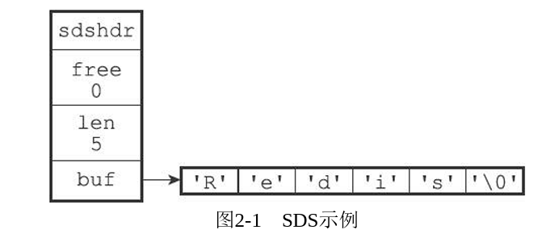
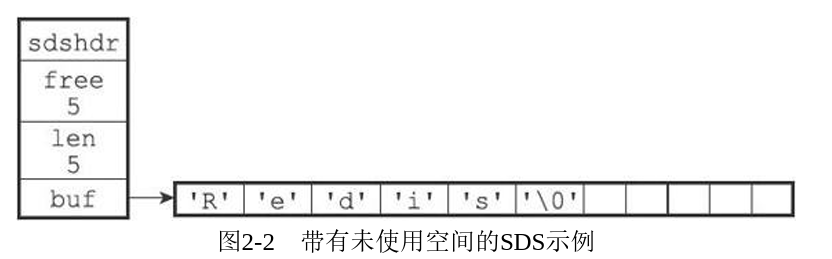
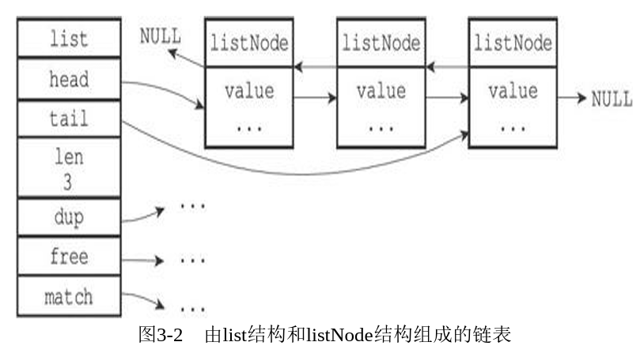
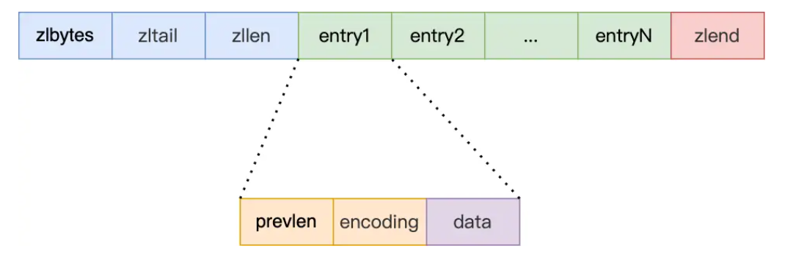

# Redis（一）

## NoSQL

**非关系型数据库**

- 采用 Key-Value 形式存储数据，而不是传统的关系表
- 更好拓展，并发性能高
- 不支持 ACID，不支持回滚事务

**Redis**

- 数据存在内存中，但支持持久化，用作备份恢复
- key-value的value有多种类型：string、list、set、zset、hash等
- 一般是作为缓存数据库辅助持久化的数据库
- Redis 6.0之前是 单线程+I/O多路复用

**MongoDB**

- 文档型数据库，格式类似Json
- 数据一般在内存中，当内存不足时把不常用的数据保存到硬盘
- 对key-value中的 value 提供丰富的查询功能
- 支持二进制数据和大型对象

<!--more-->

## 

## 基本数据类型

### 基础命令使用

- key的增删查
- 库的增删查

### string 字符串

#### 简介

- 是二进制安全的：
  - Redis的string可以表示任何数据。如图片、序列化的对象。
- 单个string最大是512M
- 命令：
  - Set Get
  - 增删查改
  - 字符串操作

> tip：命令操作一般都是原子性的，得益于redis的单线程。
>
> 6.0之后引入的多线程是针对网络I/O的，命令操作仍然使用单线程。

#### 底层数据结构

**简单动态字符串　SDS**

图示：

- 动态记录字符串长度，以及空闲空间，O(1)复杂的获取字符串大小
- 动态空间分配
  - 空间预分配：当字符串大小小于 1M 时成倍增长（提供与len同等大小的free空间），之后都是额外分配1M的free空间
  - 惰性空间释放：缩短字符串后不会立即释放空间，而是继续用作free区域。同时提供了释放空间的API以供不时之需
- 缓冲区溢出检查和自动扩容
- 二进制安全
  - C语言字符串受制于ASCII编码和`'\0'`等的影响，无法用来存储某些二进制数据（像图片、音频、视频、压缩文件）
  - Redis以处理二进制的方式来处理SDS存放在buf数组里的数据
- 保留结尾的'\0'，因此可以兼容部分C库的字符串处理函数

### list 链表

单key多value，value用链表组织起来

#### 简介

- 双向链表
- 命令：lpush/rpush，lpop/rpop
- 增删查改

#### 底层数据结构

- 最简单的基础双向链表
- 3.0之后——ziplist，有点类似STL的deque
- 3.2之后——quicklist
- 5.0之后——listpack

基础双向链表

压缩链表

- 优势
  - 使数据的内存分布更为紧凑（能够提高CPU缓存利用率），节省空间，提高性能
- 缺陷
  - 不能保存过多的元素，否则查询效率就会降低；
  - 新增或修改某个元素时，压缩列表占用的内存空间需要重新分配，甚至可能引发连锁更新的问题。
- 适用于数据数量较少的情况

### hash 哈希

### set 集合

### zset 有序集合

