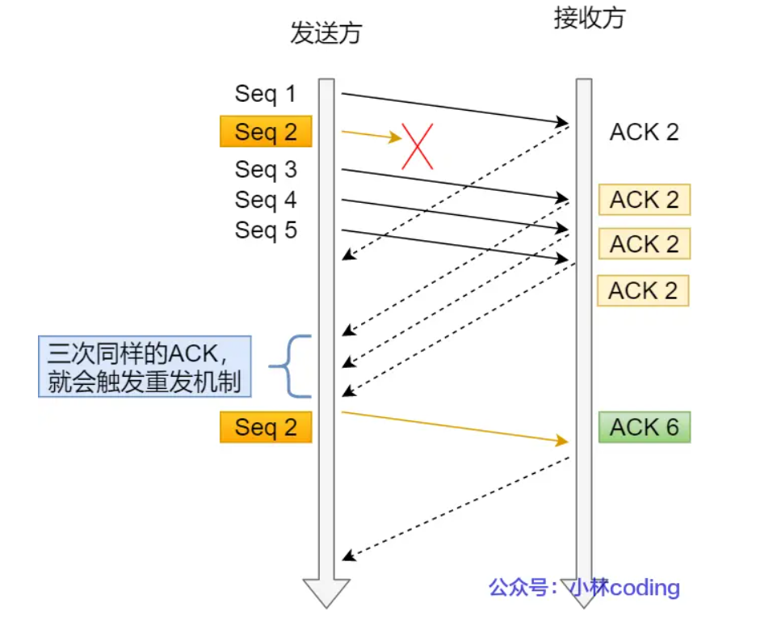
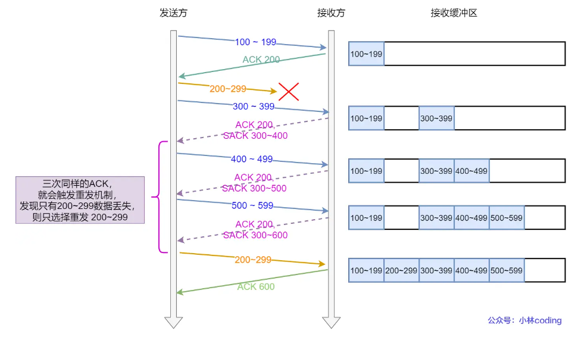
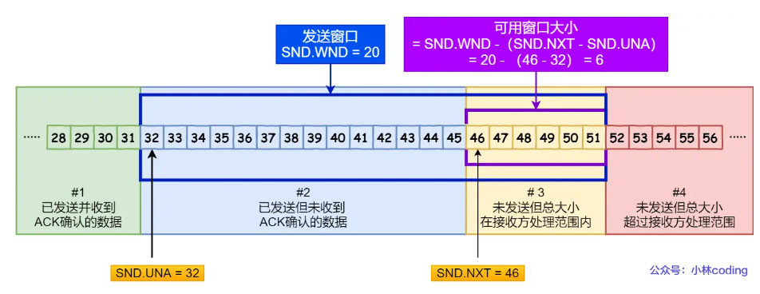
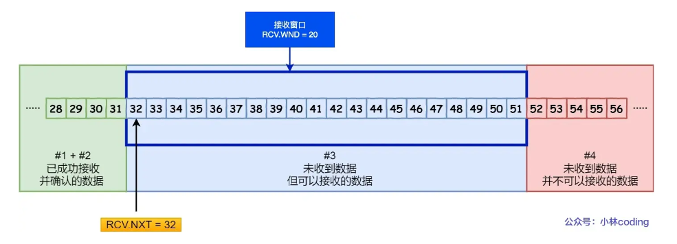
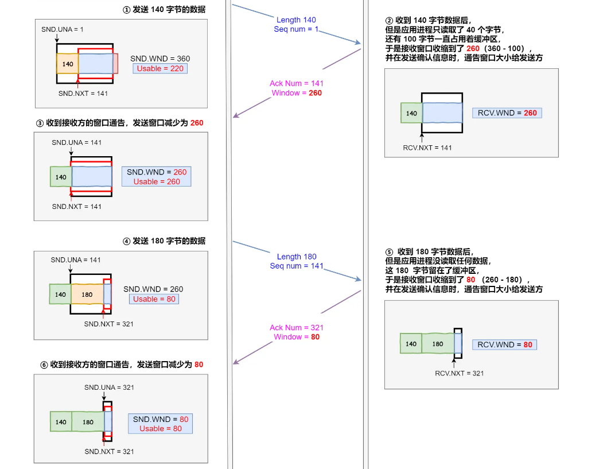
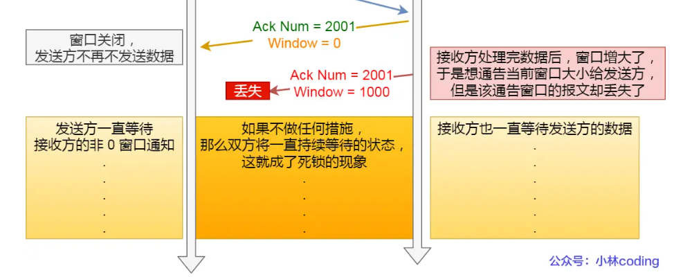
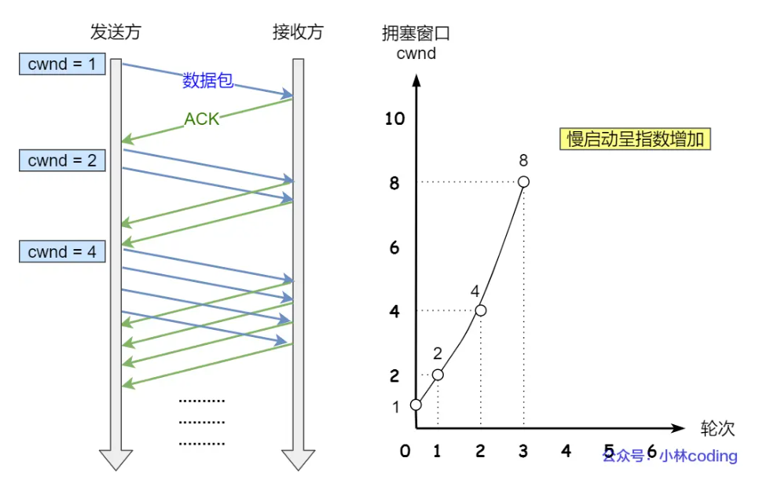
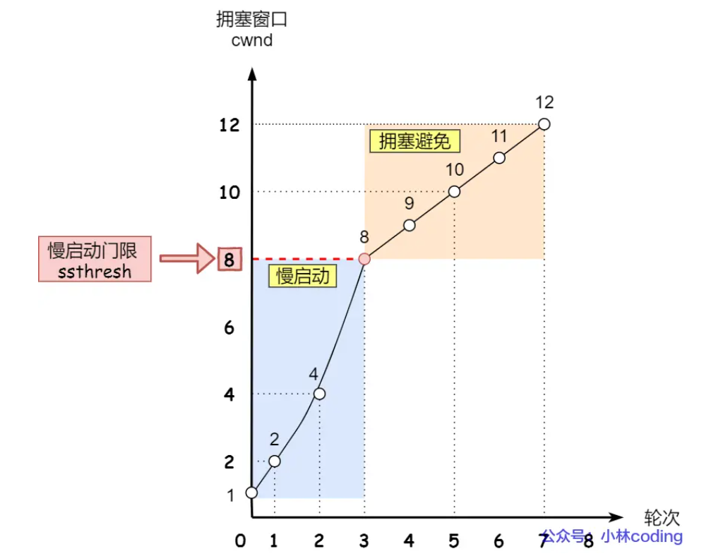
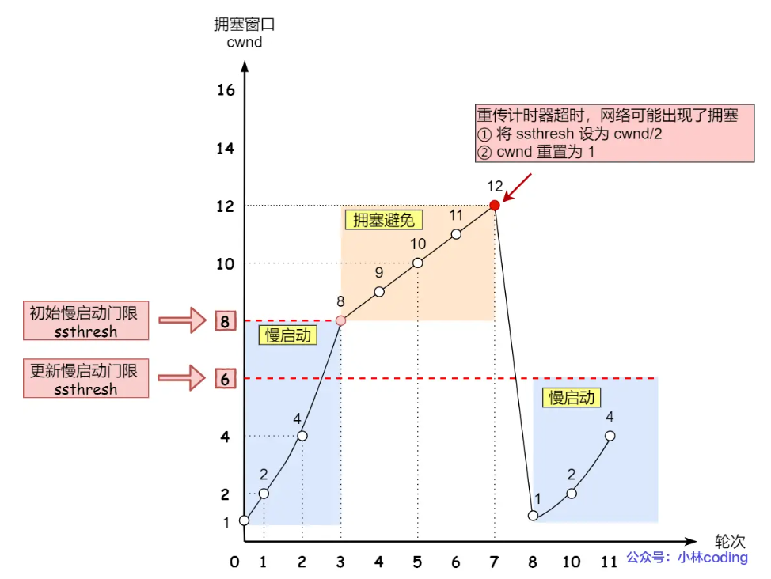
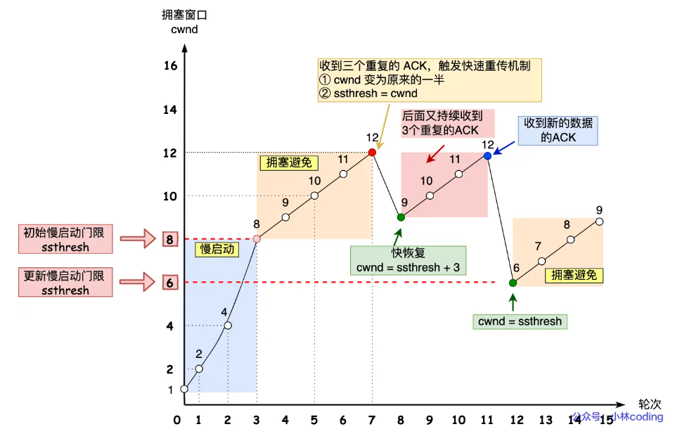

# TCP之协议机制

---

主要讨论TCP实现可靠的信息传输的几种机制：**重传机制**、**流量控制（滑动窗口）**、**拥塞控制**

此外还有**粘包**问题**拆包**处理

---

<!--more-->

## 重传机制

### 超时重传

**数据的发送方**，在发送数据后，以**收到ack响应**作为数据成功发送的标志。

在发送数据时会设置一个**定时器**，若在限定时间内没有收到ack响应，说明<u>发送的数据丢失</u>（或<u>ack丢失</u>），需要**重传**。

> RTT 和 RTO
>
> - **RTT**，Round-Trip Time 往返时延，即从发送数据到收到ack的时间大小。
> - **RTO**，Restransmission Timeout 超时重传时间，超时定时器设置。
>
> **RTO** 应该设置为略大于 **RTT** 的大小。并且根据网络实际情况，RTT和RTO都是动态变化的。

### 快速重传

#### 基本

不依靠**时间**来判断是否需要重传，而是按**收到的ack**判断。减少了判定重传所需的时间。

- 发送方发送的数据包seq=2丢失了，且后续还有成功发送的数据包
- 此时接收方没有收到seq=2，于是在此后都会回应ack=2；

- 发送方收到几次相同的ack=2，说明seq=2丢失了，于是触发了重传。

这里会有一个问题：如何确定需要重传的内容（除了重传ack=2对应的包，**是否还需要重传后续所有的包**）

#### SACK 选择性确认

**通信双方**需要在TCP头部选项字段里添加**SACK选项**。

情况

- 发送方发送的数据丢失

ack数据包中会有 记录**已接收的数据情况**的内容，于是发送方可以根据情况来选择要重发的数据包。

- 接收方发现收到的数据seq非目标序列号时，会回发原来的 ack，但会使用 sack 记录当前的接收情况。
- 这种情况下 ack 会比 sack 小

**Duplicate SACK 重复选择性确认**

也即D-SACK，接收方通过记录**重复接收的数据**，让发送方明确数据是否丢失。

情况：

- ack丢失
- 网络延时

ack 会比 sack 大

作用：

- 可以让「发送方」知道，是发出去的包丢了，还是接收方回应的 ACK 包丢了;
- 可以知道是不是「发送方」的数据包被网络延迟了;
- 可以知道网络中是不是把「发送方」的数据包给复制了;

## 流量控制-滑动窗口

#### 滑动窗口

解决的问题：

- 每发送一份数据，都要等到收到ack之后才发送下一份数据。
- 效率低

使用的方法：

- 发送窗口的实现实际上是操作系统开辟的一个**缓存空间**，发送方主机在等到确认应答返回之前，必须**在缓冲区中保留已发送的数据**。如果按期收到确认应答（根据**最新的ack**即可，**累计确认**），此时数据就可以从缓存区清除。
- **TCP头部**中的**window**大小字段，用来表示接收方**接收窗口**的空闲空间大小。发送方可以根据接受方发来的ack中的window字段来调整发送的数据量。
- 发送方的**发送窗口**
  
  - 需要记录 1.**窗口起始地址** 2.**下一个可发送字节的地址** 3.**窗口末尾下一个字节的地址**（起始地址+窗口大小的偏移）
- 接收方的**接收窗口**
  
  - 需要记录 1.**窗口起始地址** 2.**期望的下一个字节的地址** 3.**窗口末尾下一个字节的地址**
  - 接收窗口中的数据在**接收方回送ack且应用层提取之后**就可以移除并更新窗口

#### 流量控制

解决的问题：

- 发送方不能无脑的发数据给接收方，要考虑接收方处理能力。
- 如果一直无脑的发数据给对方，但对方处理不过来，那么就会导致触发重发机制，从而导致网络流量的无端的浪费。

解决的方法：

- 设置滑动窗口
- 动态调整滑动窗口大小（窗口大小代表着缓冲区情况）

注意：

- 如果发生了先减少缓冲区内存，再收缩窗口，就会出现丢包的现象。
- 为了防止这种情况发生，TCP 规定是**不允许同时减少缓存又收缩窗口**的，而是采用**先收缩窗口**，过段时间**再减少缓存**，这样就可以避免了丢包情况

#### 窗口关闭（大小为0）

窗口关闭后潜在的死锁问题（后面开启窗口的ack包丢失所导致）

- 为了解决这个问题，TCP 为每个连接设有一个持续定时器，**只要 TCP 连接一方收到对方的零窗口通知，就启动持续计时器。**
- 如果持续计时器超时，就会发送**窗口探测 ( Window probe ) 报文**，而对方在确认这个探测报文时，给出自己现在的接收窗口大小。
- 若探测成功则继续发送数据，否则每次探测会更新计时器，到达上限则会使用RST断开连接。

#### 糊涂窗口综合症（小额数据发送）

情况：

- 接收方繁忙时处理数据效率很低，导致接收窗口很小，使得发送方的发送窗口也很小
- 每次接收方处理一点数据就腾出几个字节的窗口空间，并告诉发送方。而发送方立即发送几个字节的数据。（TCP头部就40多字节了，因此效率很低）

解决方法：

- 接收方：当接收方窗口小于某个大小（MSS，1/2缓冲区大小）时，统统当作 **0** 告诉发送方，不让发送方发数据。

- 发送方：**Nagle** 算法，**延迟发送**，满足下面**任意一个**条件才发送，否则把要发的数据屯着。

  - 条件一：要等到窗口大小 >= `MSS` 并且 数据大小 >= `MSS`；
  - 条件二：收到之前发送数据的 `ack` 回包；

  > 如果对于一些需要小数据包交互的场景的程序，比如，telnet 或 ssh 这样的交互性比较强的程序，则需要关闭 Nagle 算法。
  >
  > setsockopt TCP_NODELAY

## 拥塞控制

流量控制只是对双方的发送和接收能力进行协调配合，对于**网络情况**的控制则需要**拥塞控制**机制来做到。

解决的问题：

- 网络出现拥堵，会触发重传机制，如果不做限制，一直重传下去，则会导致网络情况越来越糟。
- 形成恶性循环。

解决方法：

- TCP被设计成无私的协议，当发现网络发送拥堵时，会先减少自己发送的数据量
- 采用一个变量“ **拥塞窗口** **cwnd** ”实现拥塞控制
  - 只要网络中没有出现拥塞，`cwnd` 就会增大；
  - 但网络中出现了拥塞，`cwnd` 就减少；
- 发送窗口大小 **swnd** = min(**cwnd**, **rwnd**)

发生**超时重传**就认为网络出现拥塞；

四个拥塞控制算法：慢启动、拥塞避免、拥塞发生、快速恢复

### 慢启动

- 当发送方每收到一个 ACK，拥塞窗口 cwnd 的大小就会加 1。相当于每轮翻一倍。
- 发送包的数量呈**指数增长**
- 当达到**慢启动门限** **ssthresh**(slow start threshold)后，转为 **拥塞避免算法**

### 拥塞避免

- 每当收到一个 ACK 时，cwnd 增加 **1/cwnd**。相当于cwnd每轮增加 1 。
- 发送包的数量呈**线性增长**。
- 直到发送丢包，则转入**拥塞发生**算法

### 拥塞发生

对 **超时重传** 和 **快速重传** 有不同的策略：

针对超时重传（网络情况更为糟糕）

- `ssthresh` 设为 `cwnd/2`，即将慢启动门限设为当前cwnd的一半。
- `cwnd` 重置为 **初始化值**
- 重新开始**慢启动**。

针对快速重传（网络情况可能不好）

- `cwnd = cwnd/2` ，拥塞窗口减半;
- `ssthresh = cwnd`，慢启动门限设为减半后的拥塞窗口;
- 进入**快速恢复算法**

### 快速恢复

快速重传和快速恢复算法一般同时使用。

- `cwnd = ssthresh+3`， 相当于前面减半后直接+3（引发快速重传的三个数据包确定是收到了，所以直接+3）；
- 重传丢失的数据包
- 若收到重复的ack，则 cwnd+=1（目的是为了尽快处理/发送丢失的数据包）
- 若收到新数据的ack，则 cwnd = ssthresh，并恢复为**拥塞避免算法**（做出自我牺牲）

作为 **拥塞发生(超时重传)>>慢启动** 的加速版，即 **拥塞发生(快速重传)>>快速恢复>>拥塞避免** ，在正确处理完丢失的数据包之后，使得cwnd处于一个更高的起点。

