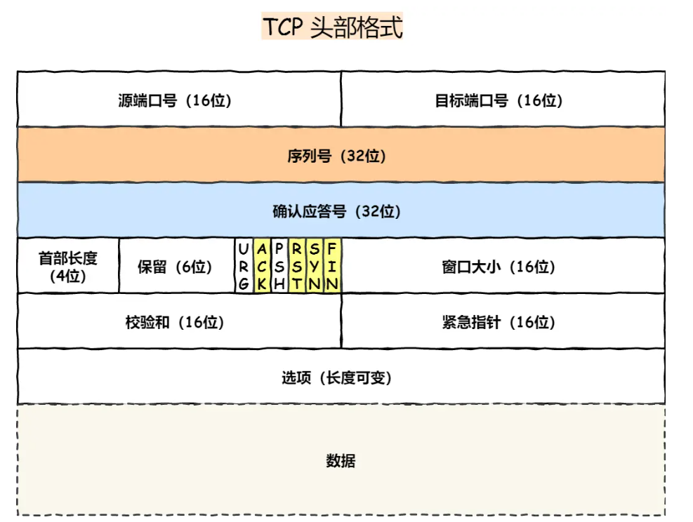
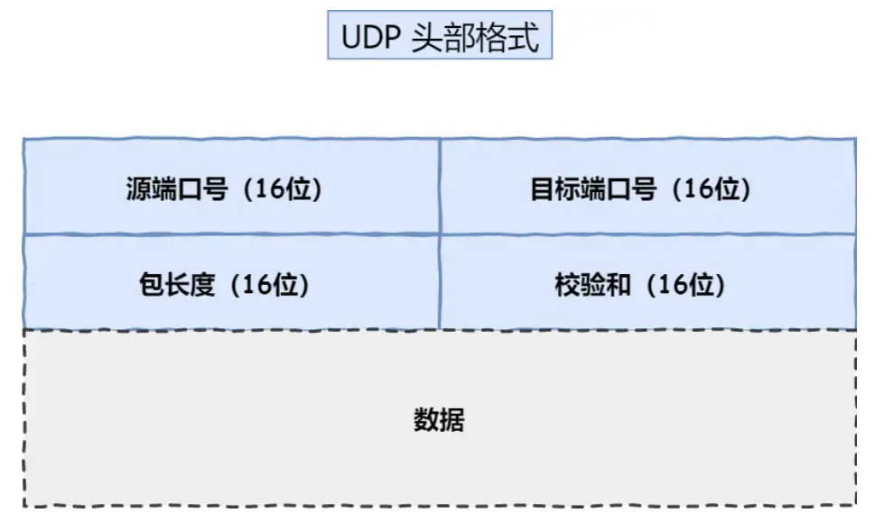
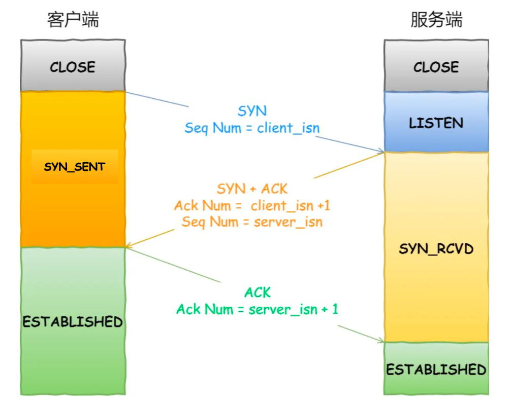
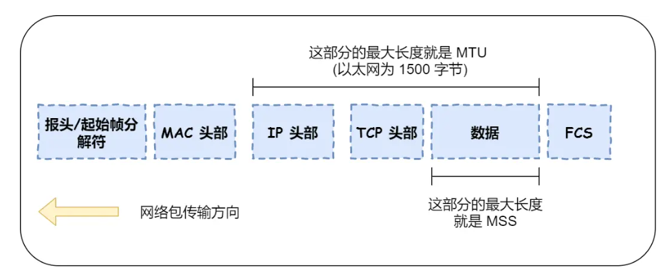
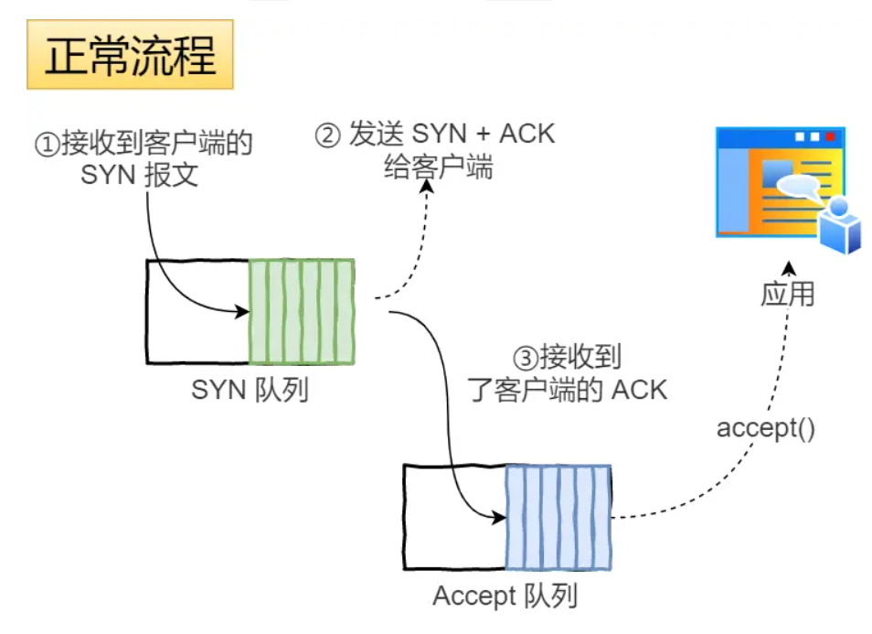
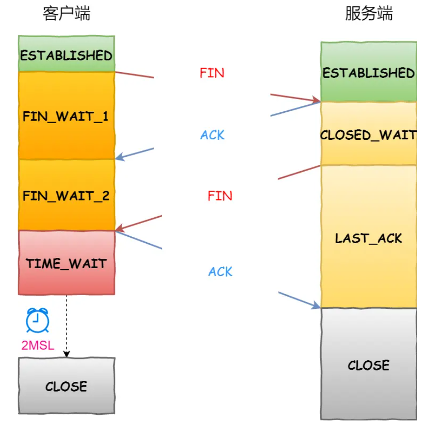
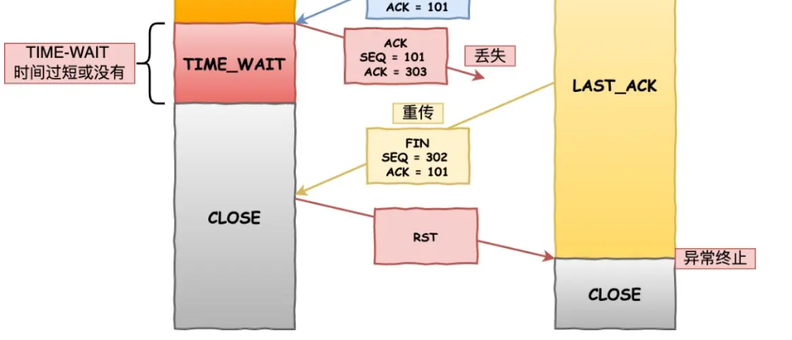
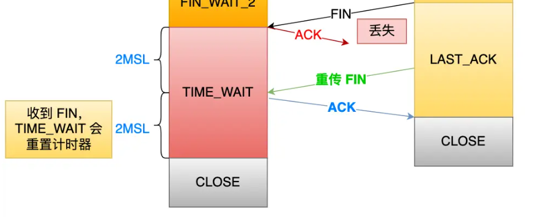

# TCP之概念、三握四挥

图片和部分文字来源[小林coding (xiaolincoding.com)](https://xiaolincoding.com/network/3_tcp/tcp_interview.html)

---

TCP是传输层的协议，全称"**传输控制协议**"，用于在IP网络上实现数据和消息的**可靠**传输，并以建立**连接**的方式进行面向**字节流**的数据的传输。

 

 

在可靠性方面，TCP实现了：

- **连接的建立和断开**，**重传机制**（定时器），**流量控制**（滑动窗口），**拥塞控制**等机制功能。
- 达到的可靠效果：网络包的收发是**无损坏、无间隔、按序（seq，ack）、非冗余**

---

 

  

 

## TCP格式

### TCP头部

- **源端口号、目的端口号**
- **序列号**seq
- **确认应答号**ack
- **首部长度** 因为有长度不固定的选项字段，所以首部长度需要明确表示
- **标志位**（URG、ACK、PSH、RST、SYN、FIN）
  - RST 是强制对方断开连接，说明出现异常
  - SYN 在建立连接时用到，同步
  - ACK 为确认应答标识
  - FIN 在断开连接时用到
  - URG 表示有紧急数据，并通过紧急指针定位
  - PSH 告诉接收方立即将数据交给应用层，不用等到缓冲区满了
- **窗口大小**
- 校验和、紧急指针
- **选项**（可变长度）

 

 

### TCP连接

一个连接包括连接双方的：

- socket（IP + port）
- 滑窗大小（接收窗口、发送窗口）
- 序列号（seq）
- ...

 

理论上可以一个服务端socket可以与 **IP数量*端口数量** 个socket建立连接，但实际上受系统**fd数量**、**内存**的限制。

 

 

## TCP与UDP的区别

### UDP格式

**头部**

- **源端口号、目标端口号**
- **包长度**（数据报）
- **校验和**（可以校验首部和数据是否正确）

 

 

### 区别

1. 连接：TCP有连接，UDP无连接
2. 传输对象：TCP一对一，**UDP一对一、一对多、多对多**
3. **可靠性**：TCP传输**按序**、**无差错**、**不丢失**、**无重复**，UDP不保证
4. **流量控制、拥塞控制**：TCP的机制
5. **传输方式**：TCP流式传输，面向**字节流**，保证数据**顺序**和**可靠**，但是**数据没有边界**（粘包问题）；UDP传输数据包，面向**数据报**，但可能会**乱序和丢包**。

 

**应用场景**

**TCP**：倾向可靠性要求的

- 文件传输
- HTTP/HTTPS

 

**UDP**：倾向传输速率的、即时性的

- DNS，SNMP，数据量较少的
- 视频、音频、游戏
- 广播通信

 

 

 

 

## TCP连接建立-三次握手

### 过程

- 客户端(SYN_SENT) > 服务端(LISTEN->SYN_RCVD)： SYN（seq=c_x）
- 客户端(SYN_SENT->EST) < 服务端(SYN_RCVD)：    SYN+ACK（seq=s_x,ack=c_x+1）
- 客户端(EST) > 服务端(SYN_RCVD->EST)：         ACK（ack=s_x+1）

> **第三次**握手可以**携带数据**，因为经过前两次握手已经确认同步了客户端这边的序列号

 

 

### 常见问题:

#### 为什么是三次握手？

为什么不是两次：

**三次握手让服务端多了一个过渡状态即SYN_RECV，在此期间可以先确认连接的正确性，排除重复的历史连接**

客户端的第一次握手发送的SYN包（A）收到网络阻塞超时了，于是客户端重发新的SYN包（B）（并采用另一个seq号）;

但是服务端最终先收到了旧的SYN包（A），于是进行了第二次握手（回送ack=A+1）:

- 如果不进行第三次握手，此时就建立连接，会导致双方对客户端seq序列号的不同步：客户端用的是 B，服务端用的是 A

- 而进行第三次握手，客户端会检查第二次握手的ack=A+1，发现并非期待的ack=B+1，则会回送RST报文告诉服务端这个错误终止连接。并等待服务端回送正确的ack=B+1。

之后服务端收到最新的SYN（B）并回送正确的ack=B+1，客户端收到后进行第三次握手，同步服务端这边的序列号。

> 如果服务端<u>连续收到两个SYN报文（先A后B）</u>，即<u>没有在中间收到RST报文</u>，那么服务端第二次收到之后会回送 **Challenge Ack** 报文（其序列号仍是旧SYN报文的响应即ack=A+1）

阻止重复历史连接的目的是：**为了避免资源浪费**

- 三次握手中服务端会有一个 SYN_RCVD 状态，作为中间状态来确认连接的正确建立。
- 如果是两次握手，没有中间状态过渡，服务端收到SYN就立即建立连接，但服务端最终还是会收到客户端发来的RST报文断开连接，在此期间连接占用了系统资源（连接队列、socket_fd、内核内存），并且可能会发送数据（无效）

 

为什么不是四次：

**三次握手的目的是建立连接并且同步双方初始序列号，同步序列号需要一来一回，理论上需要两个来回，但是中间的两步可以合并**

第一次握手和第二次握手同步了客户端的序列号：seq=A，ack=A+1

第二次握手和第三次握手同步了服务端的序列号：seq=B，ack=B+1

- 第二次握手把 seq=B, ack=A+1 一起发了，所以相当于减少了一次握手，所以不是四次

 

 

#### 为什么每次TCP连接建立时的序列号不同？

- 分辨不同的连接同步情况，主要是跟历史连接区分（前后两次连接建立时的seq都相同的话，后续发送的数据包的序列号也可能相同，如果历史连接的数据包延迟到新连接时才被接收，若序列号相同则会导致不应该的数据接收）

> 此外，还是有可能会发生历史数据包的seq冲突，还需要利用 **时间戳** 来分辨

- 防止黑客伪造相同序列号的报文让接收方接收

初始序列号 ISN 的生成利用到了时钟和哈希算法，重复率很低。

 

 

#### IP 层会分片（MTU），为什么TCP层还需要分片（MSS）

- **MTU**：**IP网络包的最大长度**，以太网的一般为1500字节；
- **MSS**：IP网络包除去IP头、TCP头，剩下的**TCP数据的最大长度**；

MTU是针对数据在IP层的分片大小，MSS是针对数据在TCP层的分片大小。

假设TCP层要发送的数据长度为3个MTU左右：（注意 **重传** 是TCP而不是IP的机制）

- **无MSS**的情况下，数据通过3个IP包来发送，但只有第一个包中包含TCP头。如果**其中一个IP包**丢失了，因为**唯一的TCP头**中说明的数据长度应该是大概3个MTU的大小，无法确认丢失部分的长度，那么就得重新发送**所有的IP包**。
- **有MSS**的情况下（一般MSS长度略小于MTU，使得MSS分片不需要在MTU中再分），如果其中一个IP包丢失了，则可以根据缺失的TCP头（重传情况之一：收到重复的ack）来确定要重发哪一部分的数据，即只需重新发送少量IP包。

> **建立连接的时候**，通信双方会协商各自的MSS值

 

 

#### 握手丢失的情况

1. **第一次握手丢失**

- 服务端没有收到SYN，则不会回送SYN-ACK；客户端长时间没收到ACK，触发超时重传，重新发送SYN。
- 重传次数：由内核文件中的参数`tcp_syn_retries`设置；超时时间：每次是上一次的2倍
- 当超时次数达到上限之后，若还是没有收到ACK，那么客户端就会断开

2. **第二次握手丢失**

- 客户端长时间没有收到SYN-ACK，触发超时重传
- 服务端长时间没有收到第三次握手的ACK，触发超时重传
- 在达到重传次数上限后，若还没有收到回应，则会断开，CLOSE

3. **第三次握手丢失**

- 服务端长时间没有收到第三次握手的ACK，触发超时重传
- 客户端已经建立起了连接，若收到服务端的重传，则会发送ACK
- 服务端达到重传次数上限，若还没有收到回应，则会断开，CLOSE
- **客户端处于ESTABLISHED状态**：
  - 若客户端不主动发数据，则长时间无数据交互，客户端最终会断开。
  - 若客户端主动发数据，则会一直触发重传并到达上限断开。

 

 

### 其他知识：SYN攻击、半连接队列、全连接队列

针对服务端的攻击，攻击者发送大量SYN包给服务端，但不进行第三次握手，使得服务端的TCP**半连接队列**爆满，无法正常接收后续的SYN连接请求。

> 
>
> 半连接队列（SYN队列）：存放已进行第一次握手的客户端
>
> 全连接队列（accept队列）：存放已进行第三次握手的客户端
>
> - 收到第一次握手后把客户端放入SYN队列，并进行第二次握手；
> - 收到第三次握手后把客户端移出SYN队列，并放入Accept队列；
> - 应用程序执行accept()从Accept队列中取出客户端，建立起连接。

**应对方式**：

1. 调大 netdev_max_backlog ：内核处理速度<u>小于</u>网卡接收数据速度时的额外数据缓存队列大小。
2. 增大 TCP半连接队列 ：
   - 增大 net.ipv4.tcp_max_syn_backlog
   - 增大 listen() 函数中的 backlog
   - 增大 net.core.somaxconn
3. 开启 net.ipv4.tcp_syncookies ：SYN队列满了以后，服务端对于收到的新的SYN连接请求，根据算法算出cookie并直接进行第二次握手，且将cookie作为seq。服务端收到第三次握手时，检查ack=cookie+1，并将客户端连接放入全连接Accept队列。
4. 减少 SYN+ACK 重传次数（修改内核参数）：减少了无效连接的占用队列的时间。

 

 

## TCP连接断开-四次挥手

### 过程

以客户端主动关闭连接为例。

1. 客户端发送FIN，并进入**FIN_WAIT_1**状态；
2. 服务端收到FIN，回送ACK，并进入**CLOSED_WAIT**状态；在服务端发送FIN之前，服务端还可以发送数据；
3. 客户端收到ACK，进入**FIN_WAIT_2**状态，等待服务端的FIN，在此期间可以接收数据；
4. 服务端处理完数据后，发送FIN，并进入**LAST_ACK**状态；
5. 客户端收到FIN，回送ACK，并进入**TIME_WAIT**状态等待一段时间（留机会给服务端重发FIN），确保对方收到了ACK。之后连接正常关闭。
6. 服务端收到ACK，连接关闭。

 

 

### 常见问题：

以客户端主动断开为例

#### 为什么是4次

- 关闭连接时，客户端先发送FIN包仅表示客户端不再发送数据，但能继续接收数据
- 服务端收到FIN后回送ACK，但在发送FIN之前还可以处理剩余数据并发送，等到不再需要发送数据之后才发送FIN，向客户端表示同一关闭连接

如果中间无其余数据需要处理，可以合并服务端的ACK和FIN可以为合并为一次。

 

 

#### 挥手丢失的情况

FIN的重发次数由`tcp_orphan_retrie`设置

1. **第一次挥手丢失**

服务端没有收到FIN，则不会回送ACK。客户端没有收到ACK，触发超时重传，达到上限后直接断开连接，而此时服务端的连接还没关闭，则可分为有数据发送（重传到关闭）和无数据发送（长时间后关闭）的两种情况。

2. **第二次挥手丢失**

服务端的ACK丢失，客户端没有收到ACK，触发超时重传，达到上限后直接断开连接，而此时服务端处于CLOSE_WAIT状态，后续会发送数据以及发送FIN。

3. **第三次挥手丢失**

客户端收到ACK后，关于**FIN_WAIT_2**状态：

- 若客户端采用的是close()关闭连接，则FIN_WAIT_2状态的持续时间由内核参数`tcp_fin_timeout`决定，在此时限内没有收到服务端的FIN的话会直接断开连接；
- 若客户端采用的是shutdown()关闭连接（明确表示后续还要接收数据，即只关闭客户端连接的**发送**方向，保留接收方向），则FIN_WAIT_2状态会一直持续；

服务端收到FIN，并回送ACK后，处于**CLOSE_WAIT**状态，后续**何时发送FIN**则由**程序中执行close()的时机**决定。

- 第三次挥手丢失，客户端没有回送ACK，服务端触发超时重传FIN，直到超限断开。
- 后续客户端则处于FIN_WAIT_2直到超时断开。

4. **第四次挥手丢失**

客户端发送ACK后进入TIME_WAIT状态（**2MSL**时间）。四挥丢失会触发服务端的FIN超时重传，客户端在TIME_WAIT状态内收到FIN的话也会重发ACK（并且**重置2MSL定时器**）。

- 第四次挥手一直丢失，则服务端重发FIN次数达到上线后便会直接关闭。而客户端经过2MSL时长后便会关闭。

 

 

#### 关于TIME_WAIT

**为什么TIME_WAIT时长是2MSL**

`MSL` 是 Maximum Segment Lifetime，**报文最大生存时间**。大概是消耗掉最大**TTL**的时间。（Linux下约30s）

TIME_WAIT 等待 2 倍的 MSL，比较合理的解释是： 

- 网络中可能存在来自发送方的数据包，当这些发送方的数据包被接收方处理后又会向对方发送响应，所以**一来一回需要等待 2 倍的时间**。
- 相当于允许我方发送的报文丢失一次，**留一个时间来接收对方可能重发的报文**。比如，若 ACK 在一个 MSL 内丢失，这样被动方重发的 FIN 会在第 2 个 MSL 内到达。

为什么不是4MSL、8MSL：因为连续丢包的概率很小，忽略不做处理的性价比更高。

 

 

**TIME_WAIT状态的作用**

1. 防止**历史连接中的数据**，被后面相同四元组的连接错误的接收。（发生seq绕回的情况，即报文seq出现重复而无法识别新老数据的情况）

经过2MSL的时间可以确保旧连接的数据包全部失效。

2. 保证**被动关闭连接方**（此例为服务端）能正确关闭

即在客户端ACK丢失的情况下，**让客户端有机会收到服务端重发的FIN**，并重发ACK给服务端。

否则，在客户端关闭之后，服务端后续重发的FIN会返回RST报文

**TIME_WAIT过多的影响**

- 第一是占用系统资源，比如文件描述符、内存资源、CPU 资源、线程资源等；
- 第二是占用端口资源；端口资源也是有限的，一般可以开启的端口为 `32768～61000`，也可以通过 `net.ipv4.ip_local_port_range`参数指定范围。

可以分别对客户端（主要是端口）和服务端（主要是系统资源）进行分析

- 如果**服务端**要避免过多的 TIME_WAIT 状态的连接，就**永远不要主动断开连接**，让客户端去断开，由分布在各处的客户端去承受 TIME_WAIT

 

 

#### 优雅关闭连接

- 默认为优雅关闭连接，即正常地完成4次握手地流程。
- 不优雅地关闭连接，对 socket 设置 *SO_LINGER* 选项：
  - 使得调用close()后直接给对方发送RST报文，并关闭连接

 

 

### 保活机制

建立连接后，客户端发生了故障如**宕机、断电**的情况（**进程崩溃**的情况会自己发FIN或RST报文给对方），若服务端不主动发送数据给客户端，会发生什么？

长时间没有数据交互的情况，对应有**保活机制**，服务端会每隔一个时间间隔发送一个**探测报文**，如果连续几个探测报文都没有响应，则内核会认为连接失效并报告错误信息。

- tcp_keepalive_xxx 系列内核参数设置时间。

- SO_KEEPALIVE 设置socket选项开启保活机制。

此外，我们一般在**应用层**程序实现**定时器、心跳**之类的机制，来关闭长时间没有数据交互的连接。

 

  

 
