## Unity新手入门（一）

资料来源[擅码网-Monkey的个人空间_哔哩哔哩_bilibili](https://space.bilibili.com/34412870)

### （1）Unity基础使用

**特点**：开发跨平台，资源商店（含开发插件）

**界面**：

- 菜单栏
- 状态栏
- 操作界面

**项目结构**：

 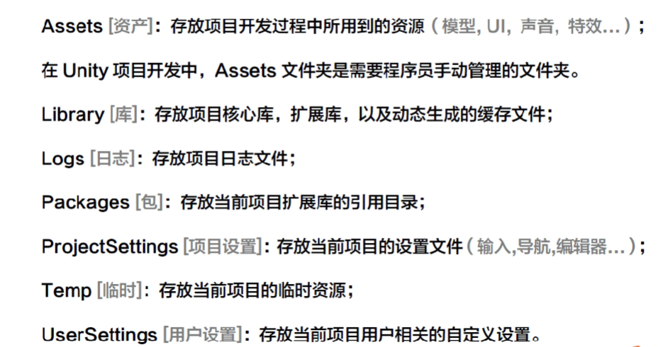

**Editor** **界面和组织**：

- Project
  - 目录文件结构
- Hierarchy
  - 含有场景内的Gameobj对象
- Inspector
  - 检查面板
- Scene
  - 场景视图

**场景视图内的操作**：

- 几何模型，素材模型
- 坐标系（世界坐标系、局部坐标系）
- 选择物体按F快速定位，或双击物体
- ALT +鼠标左键旋转、+右键拉远拉近
- 光源预渲染失败：需要到lighting设置中generate
- 观察模式：透视persp，正交iso

### （2）游戏物体与组件

#### 游戏物体

场景中所有物体都是GameObject

操作：

- F2重命名
- shift+点击首个和末尾的obj可以多选
- ctrl单个选择
- Gizmos菜单Scene界面显示设置

#### 组件

inspector窗口

挂载于GameObject的各种Component

#### 项目资产管理

Assets文件夹内容管理

创建各类二级文件夹

#### 模型与材质

模型 Model

材质 Material

纹理贴图 Texture

**材质球制作**

贴图与模型之间的中间过渡——材质球

- Create material

- 纹理贴图拖到材质的Albedo参数
  - Albedo：反照率[贴图]；用于体现模型的纹理，颜色。
- 材质球拖到模型的组件位置

#### 资源复用和预制体

Prefab

获取外部资源的Prefab后，放到编辑器内进行二次编辑，然后保存为自己的Prefab

 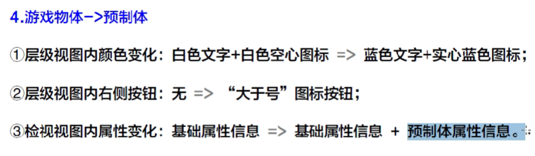

编辑prefab

- 直接编辑文件
- 点击Hierarchy中prefab对应的游戏对象的 > icon
- 点击对象的Inspector的Open选项
- 直接在场景内编辑预制体游戏对象，编辑后点Override-> Apply all

断开prefab关联

- 右键Hierarchy中的游戏对象，选择Prefab->Unpack

#### 基础组件

##### Transform 组件

- 位置
- 旋转
- 缩放

位置是相对于世界坐标轴，旋转和缩放是相对于物体自身坐标轴。

GameObject最基本的组件——Transform。

Empty object可以用来控制层级关系，是天然的父物体。

##### 摄像机组件

- 视锥体
- 选中物体 Align with View（按ctrl+shift+f 快速改变位置 
- 第一人称、第三人称、上帝视角、过肩视角... 

常用参数：

- 投影 Projection：
  - 透视 perspective：可以设置Field of View视野范围FOV
  - 正交 Orthographic：可以设置 矩形大小Size
- 裁剪面 Clipping Planes：
  - near，far 控制视锥体的两个面距离摄像机的距离

 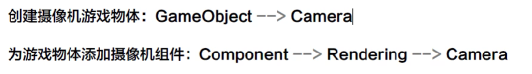

##### 灯光组件

类型：

- 方向光（太阳）
  -  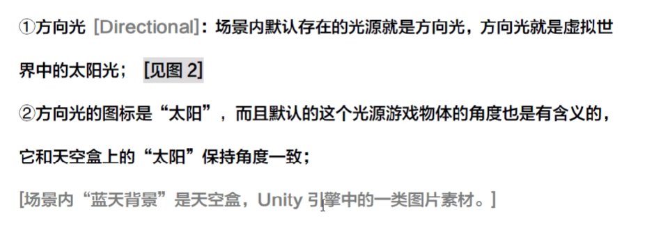
- 点光源（灯泡）
- 聚光灯（探照灯）

部分属性

 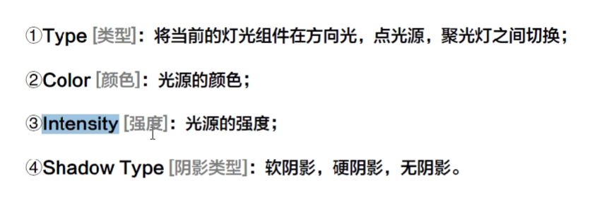

 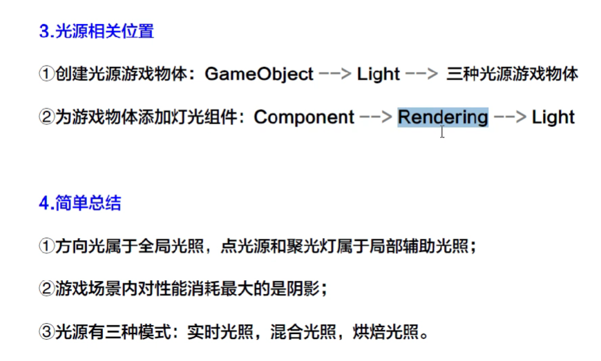

重点：**阴影** 和 **光照模式**

#### Shader 与 PBR

##### Shader

着色器 Shader，包含如下属性等。 跟材质球是 蛋壳(材质球Material) 和 蛋清蛋黄(着色器Shader) 的关系，即一个负责展示表现效果，一个负责效果的实现

 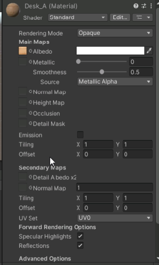

基本信息

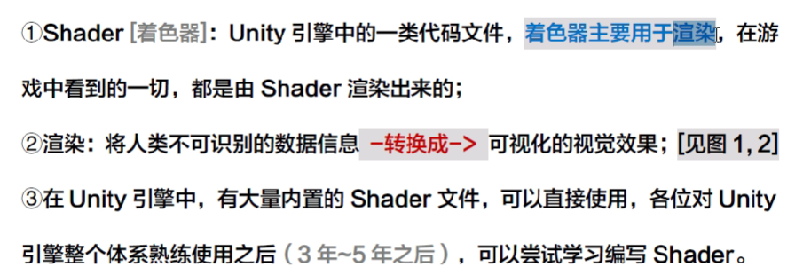

##### PBR

Physicallly-Based-Rendering 基于物理的渲染

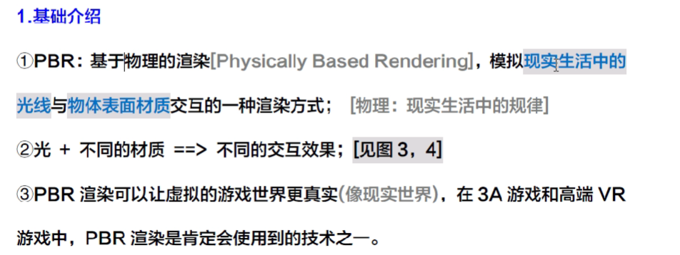

工作流程  

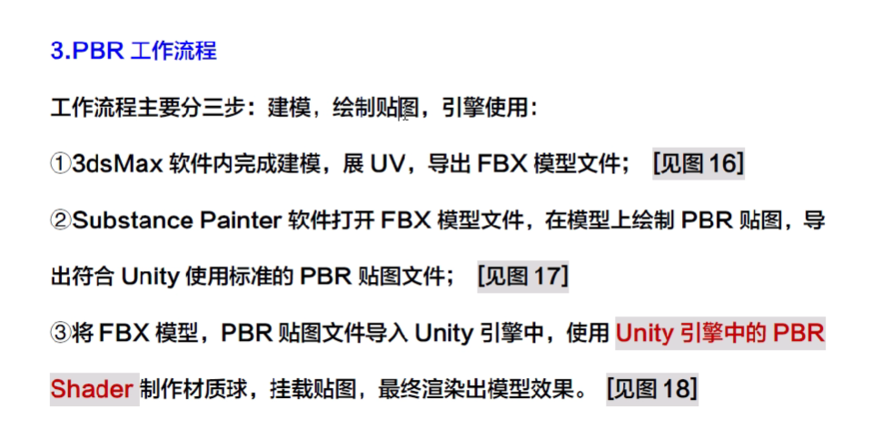

 

##### Unity 标准着色器

- 材质球的默认 Shader着色器 为 Standard Shader (Unity内的 PBR 渲染Shader)

材质球的三种常用效果

- 单贴图：将Texture拖到Albedo属性上
- 单颜色：直接修改Albedo属性的颜色项
- 地面瓷砖效果：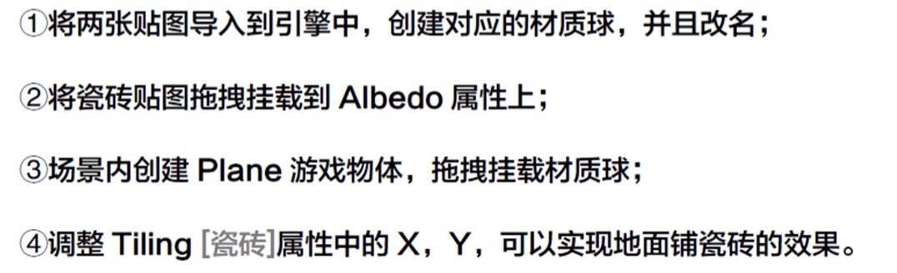

贴图 - 材质球 - Shader - 游戏物体 之间的关系

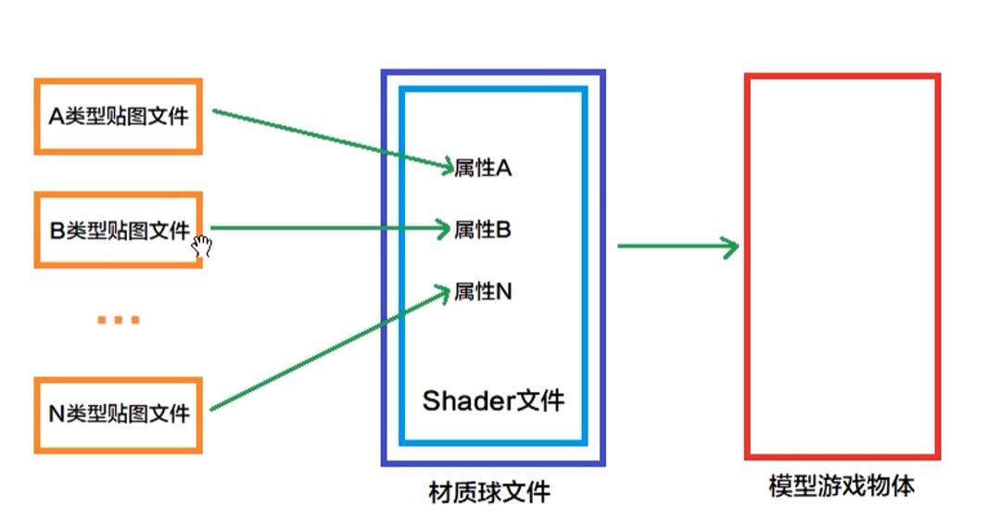

#### 脚本代码（脚本组件）

即 C# 脚本代码 

- 创建script后要立即重命名，使得脚本名和类名一致。
- 往GameObject上挂脚本组件，相当于new一个脚本对象供后续使用。

 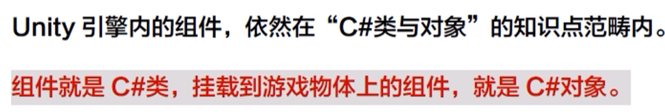

**普通C#项目文件与 Unity C#文件对比**

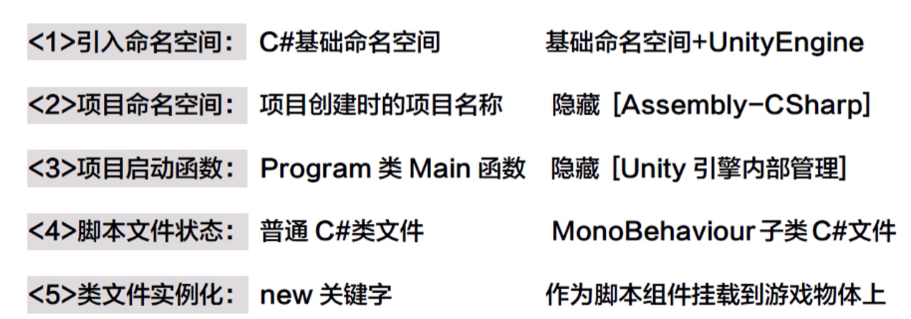

##### 脚本生命周期

- C# 控制台项目的脚本类对象生命周期（方法/函数）：构造，使用字段、属性、方法，析构

- 继承MonoBehaviour类的脚本类对象的九大生命周期（方法/函数）：

  1. Awake 函数 :

  在加载场景时运行 , 即在游戏开始之前初始化变量或者游戏状态 . 只执行一次

  2. OnEnable 函数 :

  在激活当前脚本时调用 , 每激活一次就调用一次该方法

  3. Start 函数 :

  在第一次启动时执行 , 用于游戏对象的初始化 , 在Awake 函数之后执行,只执行一次

  4. Fixed Update : 固定频率调用 , 与硬件无关, 可以在 Edit -> Project Setting -> Time -> Fixed Time Step 修改

  5. Update : 几乎每一帧都在调用 , 取决于你的电脑硬件 , 不稳定

  6. LateUpdate : 在Update函数之后调用 , 一般用作摄像机跟随

  7. OnGUI 函数 : 调用速度是上面的两倍 , 一般用于老版本的 GUI 显示

  8. OnDisable 函数 : 和 OnEnable 函数成对出现 , 只要从激活状态变为取消激活状态 , 就会执行一次 (和 OnEnable互斥)

  9. OnDestroy 函数 : 当前游戏对象或游戏组件被销毁时执行

- 不加访问权限修饰的字段、属性、方法默认为private

##### 获取鼠标键盘操作状态

时刻检测，在Update里面调用

**鼠标**

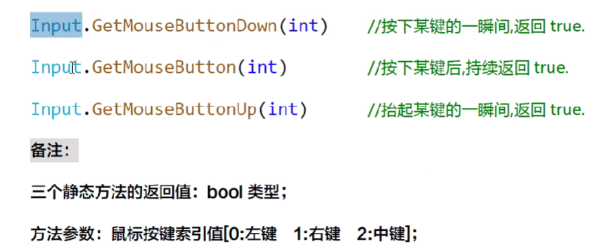

键盘

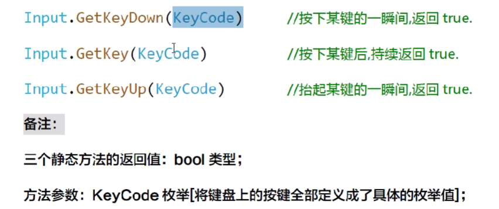

##### 从脚本代码理解游戏对象和组件

- 值传递：基本类型赋值

- 引用传递：非基本类型赋值，相当于浅拷贝

**GameObject 和 gameObject**

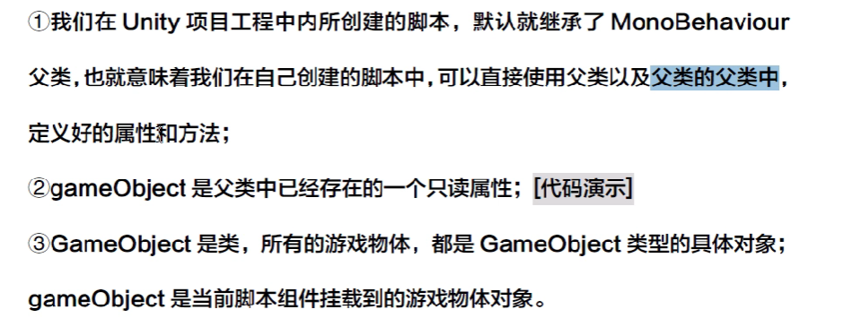

**命名方法**

- 小驼峰命名：首个单词小写，其余单词首字母大写
- 帕斯卡命名（大驼峰）：每个单词首字母都大写

**持有对象关系**

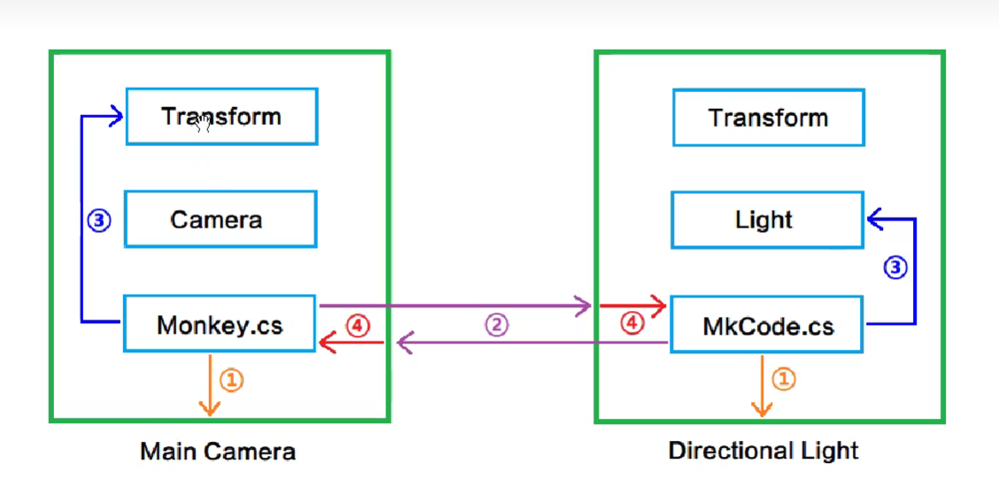

- 持有**自身游戏对象**：使用gameObject属性获取
- 持有**其他游戏物体对象**
  - 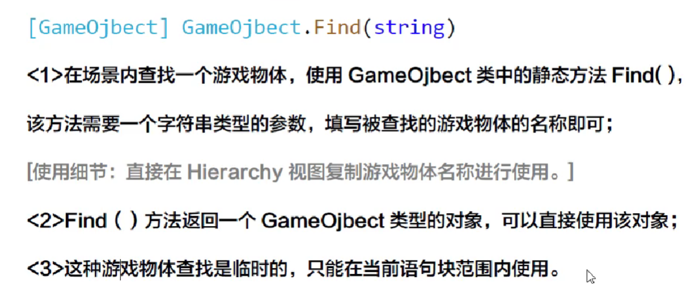
  - 可以用成员变量来存放引用，延长使用周期
    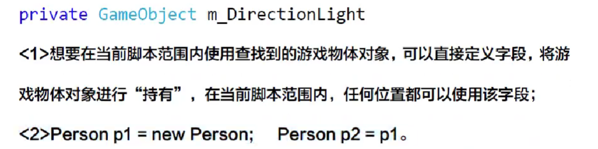
- 持有**自身组件对象**
  - 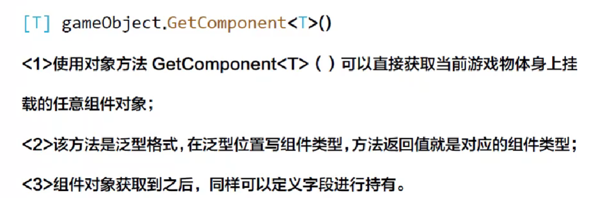
- 持有其他游戏对象的组件对象
  - 结合前面“持有**其他游戏物体对象**”和“持有**自身组件对象**”

#### Transform组件的代码控制

##### 移动物体位置

- Translate()方法
  - 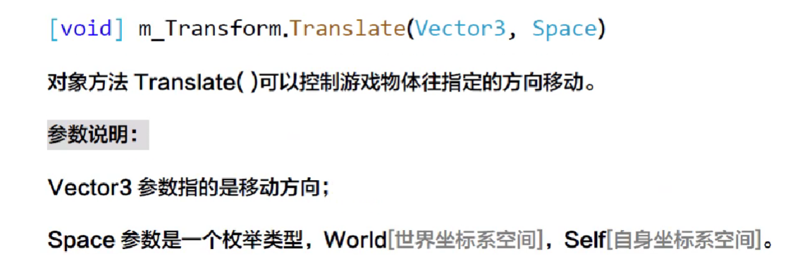
- 结合键盘输入，可以设置四方向移动

### （3）物理系统

- 三个最基础的系统：**物理、动画、UI**
- 此外还有**输入控制、特效、导航、音效、渲染、热更新系统**等

 

Unity物理系统：模拟了 **重力** 和 **碰撞**

- 分有 3D物理（基于PhysX引擎） 和 2D物理（基于Box2D引擎）

- 主要有 刚体组件（重力） 和 碰撞器组件（碰撞）

#### 刚体

刚体组件的参数：

- Mass 质量
- Drag 阻力
- Angular Drag 角阻力
- Use Gravity 重力开关
- Is Kinematic 运动学开关

移动刚体组件的位置

- MovePosition(Vector3)方法
  - 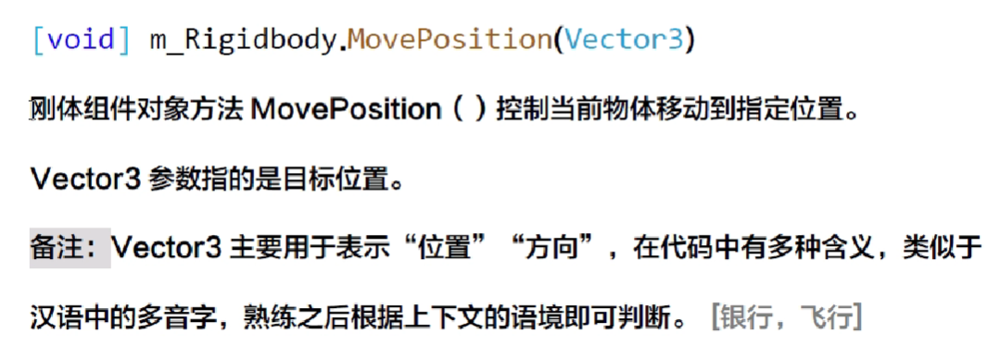

刚体组件添加动力

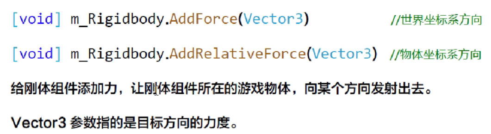

**固定更新**

Update 和 FixedUpdate

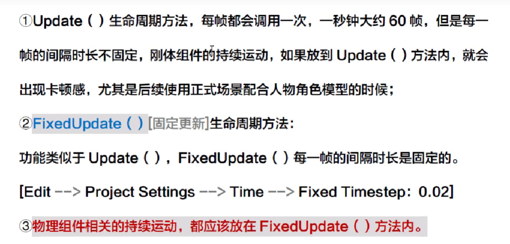

**控制组件的启用与否**

- Inspector界面勾选
- 代码控制：
  - GameObject
    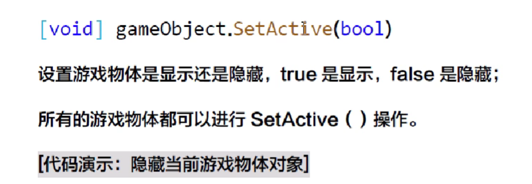
  - Component
    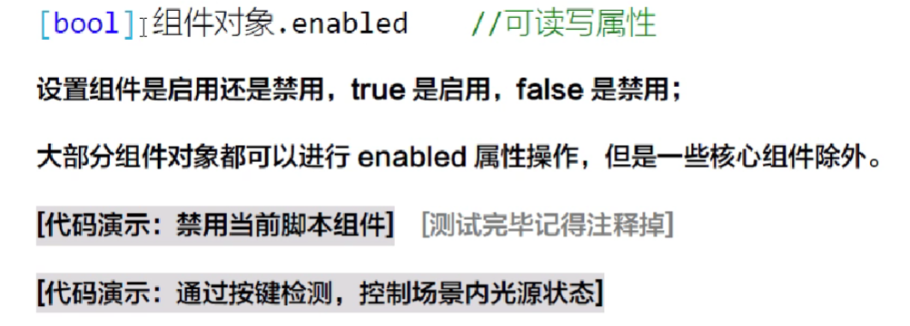

**轴向约束控制**

Constraints约束

- position和rotation
- xyz三个轴

#### （非物理组件）网格 Mesh

网格：三维模型的数据文件，美术完成三维建模就是完成模型的网格制作。三维模型由点线面组成。

- **Mesh Filter组件**
  - 设置网格模型（文件）
  - 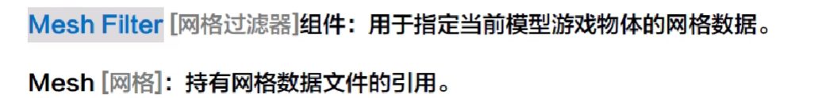

- **Mesh Renderer组件**
  - 设置网格模型的渲染
  - 核心参数
    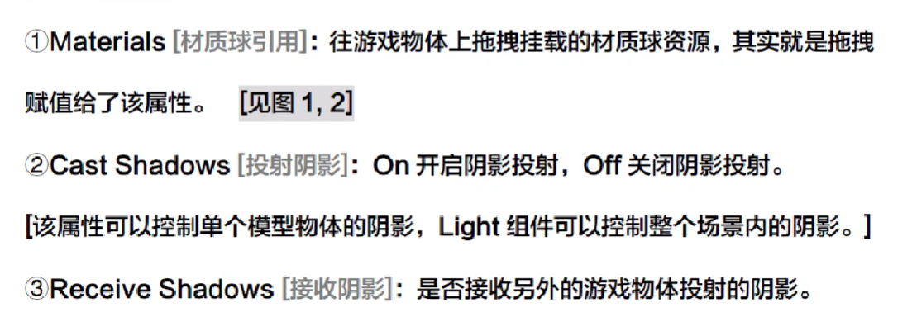

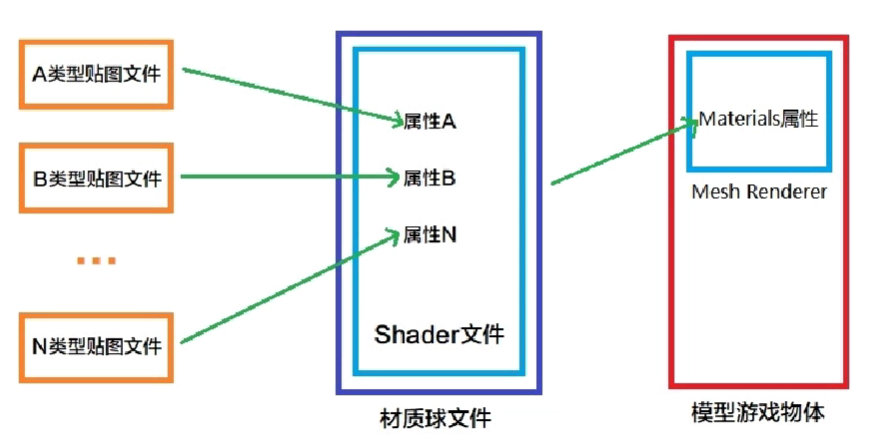

#### 碰撞器

和刚体组件配合使用

- Box、Sphere、Mesh、Capsule四种常用collider模型

参数：

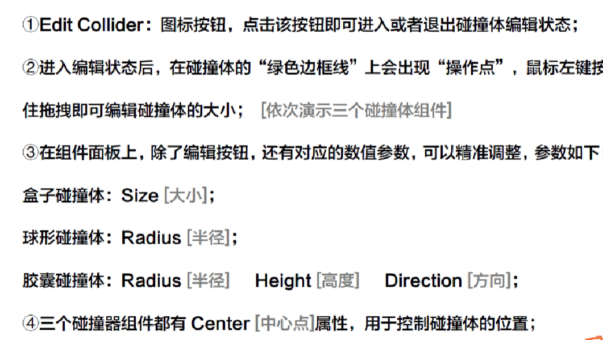

##### 碰撞检测

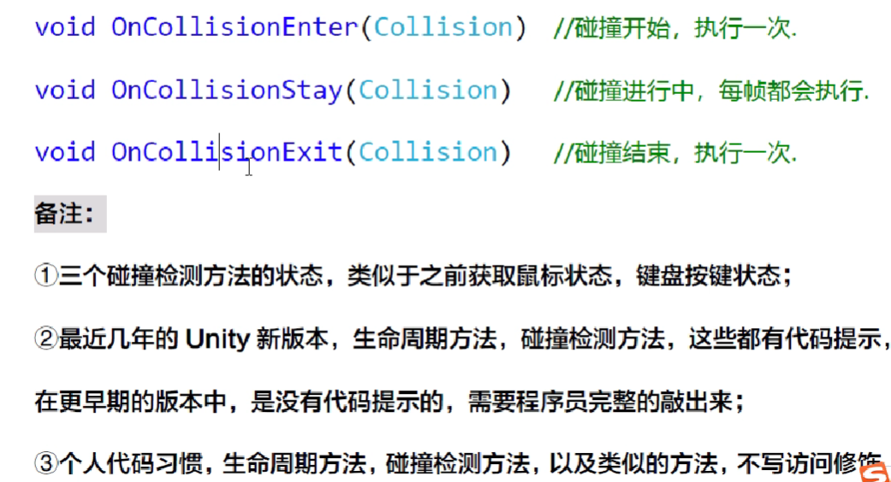

- collision Detection 参数设置碰撞检测频率
- gameObject.Collision 只读属性，返回物理碰撞到的游戏物体

##### 触发检测

Collider组件的 Is Trigger 选项

- 勾选后，不会产生物理碰撞，而是进行触发检测
- 触发的三种状态跟碰撞检测相同

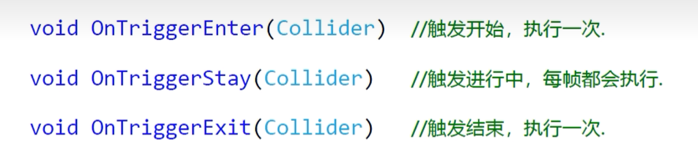

- gameObject.Collider 只读属性，返回物理触发到的游戏物体

### （4）Transfom组件控制

#### 旋转

- 欧拉角
  - 存在万向锁
- 四元数
  - 无法直观地表示旋转角度

Unity的使用

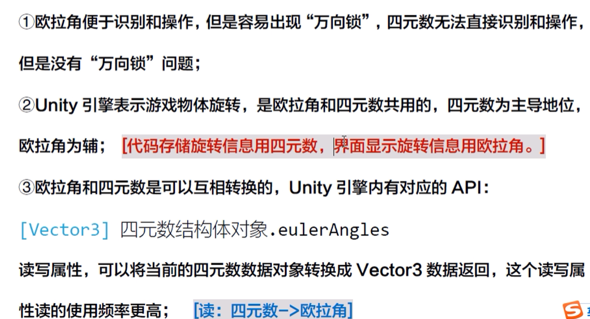

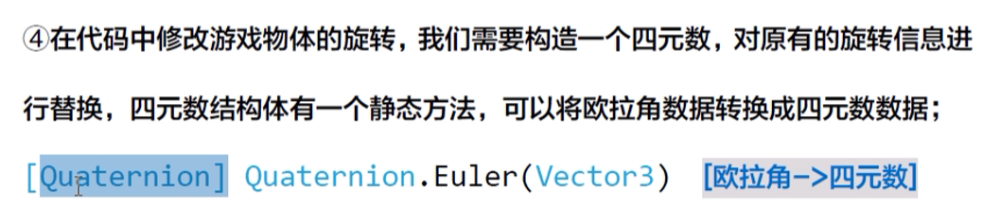

**游戏物体持续旋转**

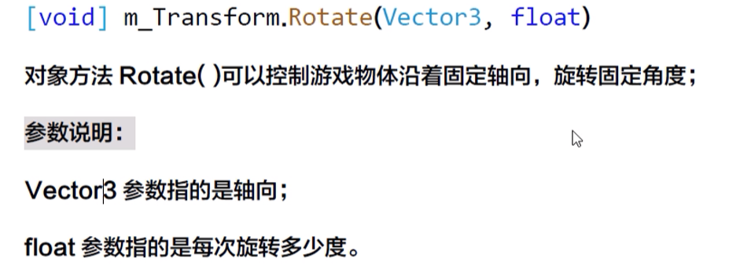

**中心点的改变**

- 创建空子物体，移动到特定位置
- 空子物体改为同级空物体
- 将原物体作为空物体的子物体

Scene界面的设置

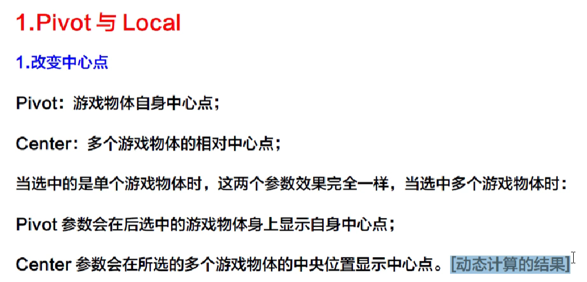

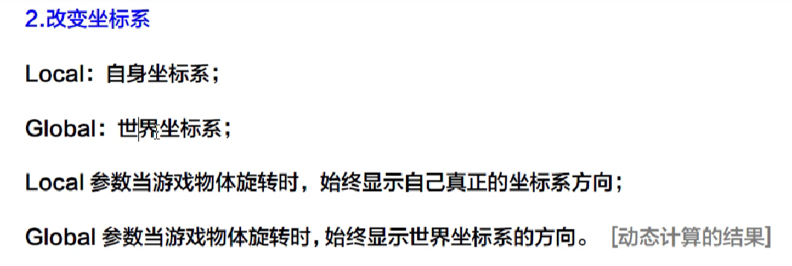

### Unity协程相关

切换时机

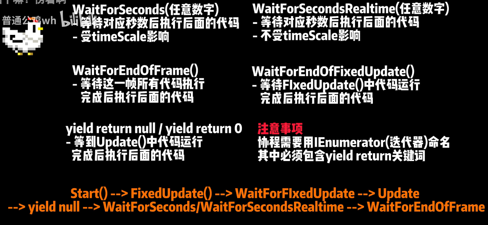

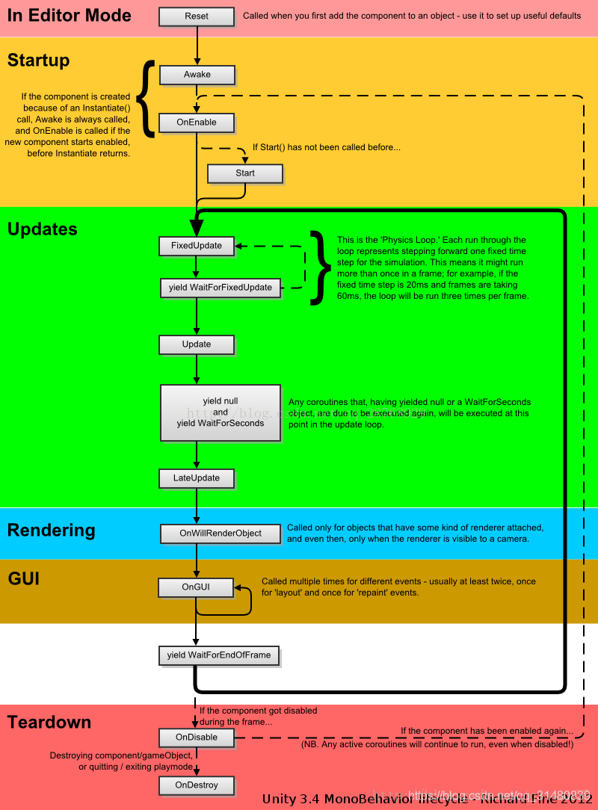

