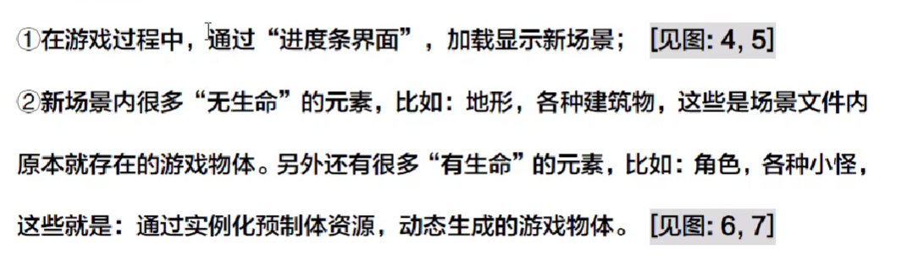

## Unity新手入门（二）

资料来源[擅码网-Monkey的个人空间_哔哩哔哩_bilibili](https://space.bilibili.com/34412870)

### UI系统

指UGUI

由UI游戏对象和UI组件

#### 两大UI游戏对象

**Canvas 画布**

- 画布Gameobject，是所有 UI Gameobject (如Image、text等)的父物体；

**EventSystem 事件系统**

- 用于响应和处理用户对UI的各种操作
- 同一场景内，Canvas可以有多个，EventSystem只能有一个

#### 组件

由两部分组成：

- UI布局组件 Layout
- UI元素组件 UI

##### Text组件

字体.ttf格式

##### Text TMP组件

字体.SDF格式

##### Image组件

常用的图片格式为PNG，可以存储透明通道。

- 图片素材的管理
  - 
- 参数
  - 

##### Button组件

**普通Button**

Interactable可交互

Transition过渡模式

- Color Tint颜色过渡
  - 

**TMP Button**

- 跟普通button的区别在于子text物体的格式：普通和TMP两种格式

**点击事件**

- 点击按钮，触发事件，执行事件处理函数
- 

#### 补充

##### TextMeshPro插件

TMP中文字体文件的实质是**图集**

### 特效系统

Unity的特效系统主要是

- 粒子系统 Particle System
- 力场 Force Field
- 拖尾 Trail
- 线 Line

#### 拖尾渲染器组件

**参数**

- 宽度设置
- 其他
  - 

**材质**

**调试面板**

**细节**

#### 线渲染器

用途：绘制“特效线”，如激光，台球线，或各种辅助线。

基本使用

### 音效系统

各种音效

Unity内的音效系统，两大核心：

- 播放音效
- 监听音效

音效产生器：

- AudioSource
  - 参数：
  - 

音效文件：

- AudioClip

音频监听器：

- AudioListener

### 常用API

---

#### Resource类

- 用于资源文件的加载
- 需要先创建/Assets/Resources文件夹存放资源文件
- 常用资源类型
  - 

**单个资源加载**

**多个资源加载**

#### AudioSource

**AudioSource组件**

AudioSource类的.clip字段对应AudioSource组件的AudioClip参数

AudioSource组件的使用

**AudioSource类**

- 在指定位置播放小段音频（one shot）
  - 
  - 

#### 游戏物体设置

**两类资源**

- 纯资源
- GameObject资源
  - 需要多一步实例化instantiate，相当于new出来

##### 实例化游戏物体

**API**

**预制体**

**实例化操作的作用**

##### 销毁游戏物体

- 实例化和销毁对游戏物体的出生和死亡
- 比在如战死后进行销毁

**API**

##### 添加/移除组件

移除方式：

- 使用GetComponent\<T>()获取组件
- 使用Destroy()销毁组件

#### 脚本生命周期

**三种状态**

**脚本生命周期**

**GameObject生命周期**

**脚本生命周期**（MonoBehaviour类的子类）

**说明**

开启状态：

- awake和start只会执行一次

进行中状态：

结束状态：

**其他问题**

Awake和Start

- A脚本调用B脚本为例，B脚本的初始化操作要放在Awake内完成，然后A脚本在Start内查找B脚本并调用其方法。

#### Invoke函数

延迟调用、重复调用

**API**

#### 协程

**介绍**

- 协程方法
- 协程操作：开启，关闭

- Unity的线程比较特殊，大多数内容在主线程中执行。
- 子线程无法调用引擎相关API，于是采用协程来替代线程。

**语法**

- 协程方法的编写
  - 
- 开启协程
  - 
- 终止协程
  - 

**应用**

- 物体移动，每帧移动一点点
  - while循环配合yield return null
  - 
- 。
- 。
- 。

**生命周期**

- 不使用协程，while循环的代码会在1帧内完成。
- 使用协程，可以达到每帧分步完成的效果

**协程的运行时机**

- 
- 

**由其他脚本调用的情况**

- 原始：其他脚本使用该脚本的引用来调用StartCorotine
- 常用：该脚本封装好协程开启和关闭的代码，供其他脚本调用

**协程与Invoke对比**

- 相同之处
  - 都是MonoBehaviour类中定义的公开方法
  - 都可以实现延迟调用
- 不同之处
  - 协程可以动态传递参数，Invoke只能使用无参方法
  - 协程的方法体内可以多次延迟，Invoke只能在开启时延迟

#### 消息发送

问题：

对于同一个游戏物体的脚本组件 ——

 

解决：

- 给同级、子级脚本发送消息

- 给同级、子级脚本广播发送消息

- 给父级脚本发送消息

#### GameObject查找

**全局名称查找**

-  
-   
   - 如果要持有隐藏的物体：
-  含有重名的游戏物体的情况：
   -  

采用路径查找

-  

**全局标签查找**

 

**API**

#### Transform查找

**查找子物体**

 

 

**查找子物体组件**

 

可以获取多层嵌套的子物体及其组件

 

**两种查找的对比**

### 物理射线

- 可以与collider发生碰撞
- 从**起点**往**指定方向**无限延申的物理射线

#### 创建物理射线

- 射线结构体：**Ray**
- 创建方式：
  - 直接new一个Ray对象
  - 通过摄像机相关API构造
    -  

**主摄像机**

 

#### 检测物理射线

**绘制线段**

- Scene中显示射线

 

- 游戏中的射线

 

### 插值运算

#### Time时间类

**API**

 

#### Mathf数学类

 

- 角度与弧度转换
  -  

#### 插值运算

确定两个参数A和B，从A平滑过渡到B

 

**使用**：

 

 

 

**采用累加插值系数解决前快后慢**

 

**其他插值API**

- 向量插值
  -  
- 四元数插值
  -  

### Unity核心类的继承关系

Unity安全模式

