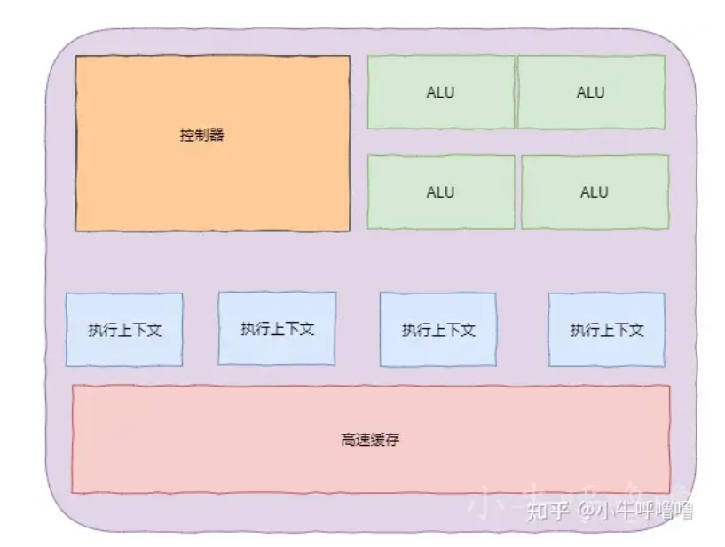
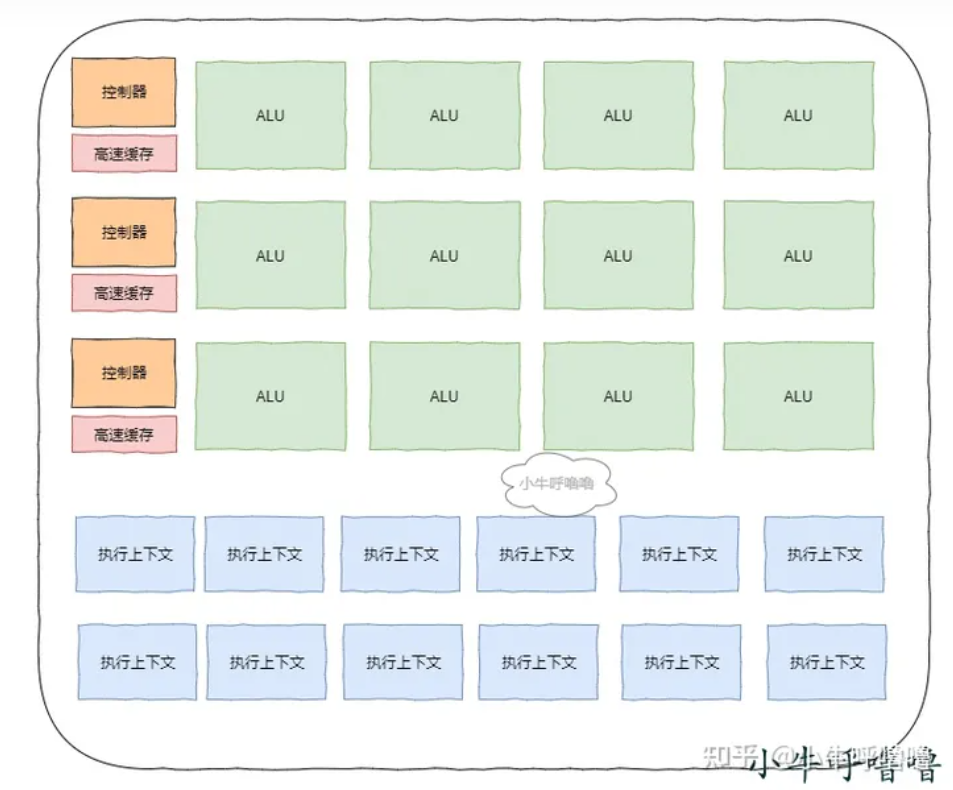
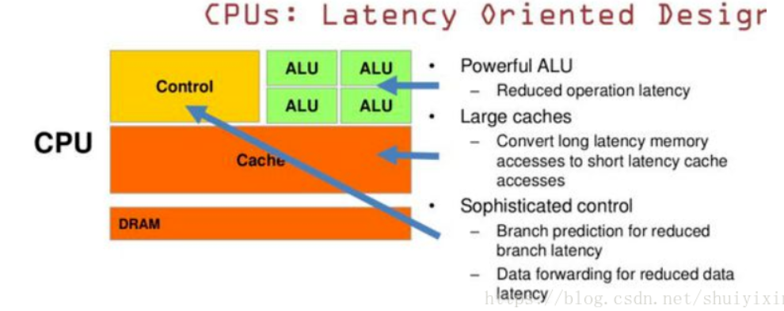
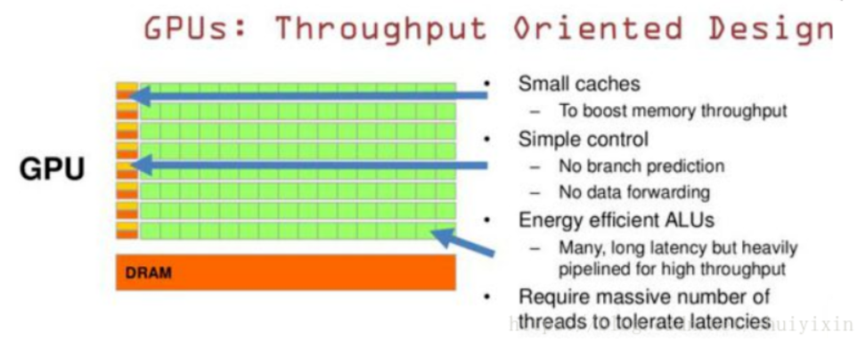

# GPU的特点以及与CPU有何不同

## New Bing 的回答

GPU和CPU的区别在于它们的设计目标不同。

- CPU需要**很强的通用性**来处理**各种不同的数据类型**，同时又要逻辑判断又会引入大量的**分支跳转和中断**的处理。这些都使得CPU的内部结构异常复杂。
- 而GPU面对的则是**类型高度统一的**、**相互无依赖的**大规模数据和**不需要被打断的**纯净的计算环境。
- 于是CPU和GPU就呈现出非常不同的架构。GPU采用了<u>数量众多的计算单元和超长的流水线</u>，但只有<u>非常简单的控制逻辑</u>并<u>省去了Cache</u>[1](https://blog.csdn.net/shuiyixin/article/details/82915378)。

简单来说，`GPU是专门为PC或者嵌入式设备进行**图像运算工作**的微处理器，而CPU则是一台计算机的**控制和运算核心**，它主要功能便是解释计算机发出的指令以及处理电脑软件中的大数据[2](https://zhidao.baidu.com/question/422288800.html)。

相关链接：

[聊聊GPU与CPU的区别 - 知乎 (zhihu.com)](https://zhuanlan.zhihu.com/p/592006016)

## 架构对比

CPU and GPU

  

 

- CPU 基于低延时的设计：
- CPU有强大的ALU（算术运算单元）,它可以在很少的时钟周期内完成算术计算。
  - 当今的CPU可以达到64bit 双精度。执行双精度浮点源算的加法和乘法只需要1～3个时钟周期。CPU的时钟周期的频率是非常高的，达到1.532～3gigahertz(千兆HZ, 10的9次方).大的缓存也可以降低延时。保存很多的数据放在缓存里面，当需要访问的这些数据，只要在之前访问过的，如今直接在缓存里面取即可。
  - 复杂的逻辑控制单元。当程序含有多个分支的时候，它通过提供分支预测的能力来降低延时。数据转发。 当一些指令依赖前面的指令结果时，数据转发的逻辑控制单元决定这些指令在pipeline中的位置并且尽可能快的转发一个指令的结果给后续的指令。这些动作需要很多的对比电路单元和转发电路单元。

 

- GPU是基于大的吞吐量设计。
  - GPU的特点是有很多的ALU和很少的cache. 缓存的目的不是保存后面需要访问的数据的，这点和CPU不同，而是为thread提高服务的。如果有很多线程需要访问同一个相同的数据，缓存会合并这些访问，然后再去访问dram（因为需要访问的数据保存在dram中而不是cache里面），获取数据后cache会转发这个数据给对应的线程，这个时候是数据转发的角色。但是由于需要访问dram，自然会带来延时的问题。
- GPU的控制单元（左边黄色区域块）可以把多个的访问合并成少的访问。
  - GPU的虽然有dram延时，却有非常多的ALU和非常多的thread. 为啦平衡内存延时的问题，我们可以中充分利用多的ALU的特性达到一个非常大的吞吐量的效果。尽可能多的分配多的Threads.通常来看GPU ALU会有非常重的pipeline就是因为这样。所以与CPU擅长逻辑控制，串行的运算。和通用类型数据运算不同，GPU擅长的是大规模并发计算，这也正是密码破解等所需要的。所以GPU除了图像处理，也越来越多的参与到计算当中来。

### **GPU的由来**

计算机对图像进行实时渲染， 一般需要经过**图形流水线**的过程：`顶点处理->图元处理->栅格化->片段处理->像素操作`, 期间需要大量的计算，比如 640×480的分辨率的屏幕，为了显示游戏画面，大概有30万个像素需要渲染 ，为了让人眼看到画面动起来，其不像电影一样只需要24帧，至少需要60帧，即每秒我们需要完成 1800 万次单个像素的渲染，每个像素都需要经过**图形流水线过程**，需要耗费大量资源。

由于图像渲染的流程是固定的，通过硬件来解决这个问题，那就设计一个不需要考虑CPU的流水线停顿、乱序执行、 分支预测、内存管理、IO等等的各类问题的芯片，这其实就是GPU。

### GPU优化设计思路

现代的 GPU 为了图形渲染、深度学习上有相较于CPU更强大的性能，做出来哪些设计上的优化：

1. 由于GPU不需要考虑CPU的流水线停顿、乱序执行、分支预测等等的各类问题，只需要流式计算的功能，所以内部许多CPU的电路是不需要的，这样就节约了大量空间
2. 由于GPU相比CPU电路就简单多了，这样就可以塞入更多的电路，即更多的"核"，他们都是**并行**的，能够极大提升性能
3. 除了塞更多的核，为了更大程度提升GPU的性能，还采用 **SIMT** 技术，可以把多条数据，交给不同的线程去处理。类似于CPU中，SIMD技术，但是其只能一次性取出了固定长度的多个数据，放到寄存器里面，用一个指令去执行
4. GPU同样采用**超线程**技术，当任务计算遇到停顿的时候，调度一些别的计算任务给当前的 ALU ，这样就需要保证核心中提供更多的执行上下文给ALU算数计算单元使用

### 区别

CPU和GPU因为最初用来处理的任务就不同，所以设计上有不小的区别，而某些任务和GPU最初用来解决的问题比较相似，所以用GPU来算了，GPU的运算速度取决于雇了多少小学生，CPU的运算速度取决于请了多么厉害的教授，教授处理复杂任务的能力是碾压小学生的，但是对于没那么复杂的任务，还是顶不住人多。

当然现在的GPU也能做一些稍微复杂的工作了，相当于升级成初中生高中生的水平，但还需要CPU来把数据喂到嘴边才能开始干活，究竟还是靠CPU来管的。
