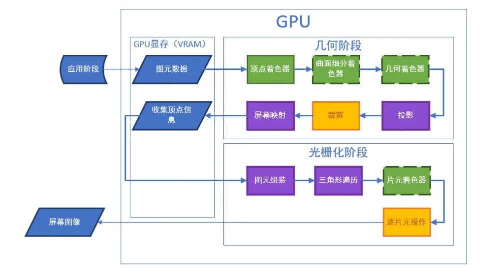
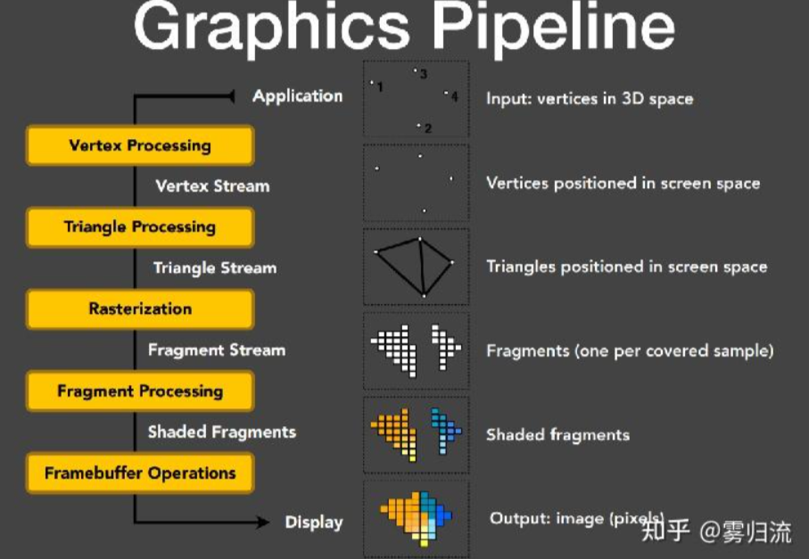

# 什么是图形流水线

链接：

[猴子也能看懂的渲染管线（Render Pipeline） - 知乎 (zhihu.com)](https://zhuanlan.zhihu.com/p/137780634)

一图流：

<!--more-->

相关概念：

- 显存
  - GPU显存是一种高速缓存，用于存储图形处理器需要的数据。GPU显存是专门为图形处理器设计的，因此它具有比CPU内存更高的带宽和更低的延迟。GPU显存通常用于存储**纹理、顶点数据、渲染目标和其他与图形相关**的数据。
- 渲染管线
  - 渲染管线是一种将**3D场景转换为2D图像**的过程，它包括**几何处理、光照计算、纹理映射等多个阶段**。这些阶段可以被分为**顶点处理**、**光栅化**和**像素处理**三个部分。
- 渲染图元
  - 渲染图元是指在图形处理流水线中的基本图形单元，例如点、线和三角形。在渲染过程中，这些基本图形单元被组合成更复杂的几何体，例如多边形和曲面。这些几何体可以被进一步处理，例如进行光照计算、纹理映射等操作。最终，这些几何体被转换为像素，并在屏幕上显示出来。
- 顶点
  - 在图形处理流水线中，顶点是指几何体的基本构成单元。在三维图形中，顶点通常由三个浮点数表示，分别表示顶点的x、y和z坐标。在渲染过程中，顶点被组合成更复杂的几何体，例如多边形和曲面。这些几何体可以被进一步处理，例如进行光照计算、纹理映射等操作。最终，这些几何体被转换为像素，并在屏幕上显示出来。
