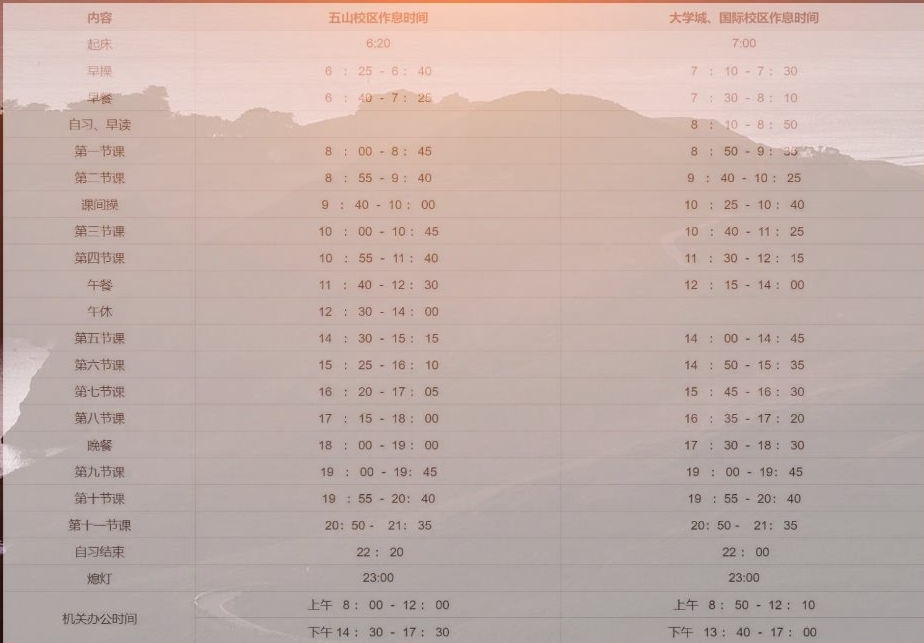

现在是2023年2月12日，凌晨1：33...

临近大三下学期开学，目前三线作战，一条线是考试复习，一条线是SRP项目，一条线是实习秋招。感觉时间非常紧张，精神压力也非常大。甚至考试上已经放弃了某一难啃的科目。

那么时间为什么又会如此紧迫？

 

 

 

这里需要展开一场自我反思

 

 

 

 

## 拷打FW

### 一事无成

其实我是很早就了解到大学应该做什么的（可惜不知道具体该如何去做）。在**大一上学期，差不多2020年10月份的时候**，已经有学长指明了三条路：1.竞赛（CTF，ACM...） 2.工作（尽早去实习） 3.绩点科研（搞成绩以及进实验室）

 

**竞赛：**

那时候又刚好听了CTF的讲座，于是心中默认自己以后要走安全路线。可惜我太高估自己了，选择了pwn路线来入门CTF。因为很多前置知识都没学过，也不知道要去学，去哪学，也就没有一个循序渐进的学习过程，所以就学不下去了。

连一点语言基础、操作系统方面的知识都没有，所以看那些什么虚拟地址空间、段、函数引用表等词汇完全没有概念，即使是到网上查资料看视频，也很难消化进去。比起艰难地去理解一些新概念，打游戏实在爽快多了，所以我也就没有学下去了。（现在想想，当时也不太会检索信息）

 

到了大二自己还是有一点这方面的想法，也稍微付出了多一点的时间，浅浅地捡了一点东西，去应付招新的事。结果，花的时间和学的东西还是太少了，只能用特殊方式入队。

入队后，又没有驱动力去学了，就一直搁置着，后面也没有参加过一次比赛。

 

现在回想，也许我应该选一个简单一点的方向，或者是，学的时候直接从解题入手，边做题边学新概念。在学习过程中，以解出题目作为激励，或许我就能学的下去，从而形成一个良性循环。

不过还是得怪自己太懒了。

  

**工作：**

当时，我默认自己不读研，本科毕业就工作。所以我应该是尽早往工作路线靠拢，但是，那会儿实在是不知道要学什么方向。

**开始的开始**

真正开始学习计算机之前，也就是中学时期，我因为喜欢玩各种单机游戏，就曾有过日后做一名游戏开发者的想法。在高考完的暑假，我也买了一本C语言的教材。可惜当时并不知道怎么学习这些东西，还按照高中的学习方式，学一点就记一点（比如C语言的关键字还要列出来然后去背...），导致效率很低。于是没学多少就没一点兴趣了（好像也没那么少，可惜没有进度没有推到内存管理和网络编程相的部分）。unity也不知道因为什么始终没有开始学。

> 翻看了那时候的笔记，感觉那是高考结束到目前为止，自己最认真学习的一段时间了，泪目啊
>
> 好恨啊，如果当时的学习方式对了，后面这几年应该会顺利很多

又因为中学过得太憋屈了，加上自控力差，高考完的那个暑假就疯狂的玩。当时我对未来十分憧憬、充满动力，然而这些还是没能变成我的自制力。

 

**路线**

到后来，每一年，每一学期，都会更新自己的方向。一会儿是游戏开发，一会儿是Linux C++，一会儿是信息安全，一会儿是区块链。看到网上的一些信息，就会影响自己的心态，忧虑这个那个。再加上我的学习方式不正确，就导致什么都没有学好。

 

**数据结构与算法**

大一寒假（两年前），有学长告诉我们得趁早刷题，可惜我当时不了解这方面的重要性，以及该如何去学，答案稍微看不懂，就不想学了。也不知道原来平时C++上机的内容，就是一些数据结构和算法题。每次只能看着大神们30分钟解决战斗，潇洒离开机房，而自己只有羡慕的份。

在数据结构和算法题这方面，后面又是因为学习方式不对，搁置了很长一段时间（还有自己懒惰）。

直到最近换了方式，先分类，然后边做题边看别人的总结，才顺利起来。

 

**编程语言**

这个应该是我大三之前就要掌握好的。

大一的时候决定要学C++，可惜，学了基本语法和一点点面向对象、泛型编程之后就停了，也就是学完课本上的一点东西就停了。还记得两年前的寒假，我在艰难地翻看C++课本，因为太关注那些语法规则，那些细枝末节，导致因小失大，学得很难受而学不下去。

又因为课本上没有STL的内容，STL的东西也没学到。

也不知道有系统编程，网络编程这些东西，虽然那会儿还没学操作系统和计算机网络。我要是能够意识到这两点，就应该早点自学操作系统和计算机网络，不用等到大二下学期才去学。

还有应该面向项目来学习编程语言，在学语言的同时，又能掌握工程技能。可惜自己太懒，浅学即止。

到现在因为要找实习找工作，需要项目经验，才从网上找视频一步一步跟着构建。对了，在项目选择这方面，我又浪费了不少时间。

除了做项目，C++其实还有好多需要学的，哎...

 

 

**本科学习**

这是我在选择摆烂的同时，又不愿放弃的东西。

大一上学期玩得很嗨，把学分最高的两门数学可都丢了。

大一下学期，稍微知耻而后勇了一点，但是还是把学分最高的数学丢了。并且该学好的专业课，也没好好学。

大二上学期（大一虽然浪飞了，但是分流后的排名也不是说毫无保研希望），于是就想在这方面努力一点，最后这学期的成绩总体也还不错，但还是够高，某些科目拖了后腿。分析原因，主要还是因为自己贪玩，没有花足够的时间学习。

大二下学期，明显后劲不足了，但是三门专业课都还行，就计算机网络稍微拖了一点后腿（这时候还没意识到计网的重要性），政治课成绩掉大分。

大三上学期，现在正在复习的。其实一开始还是打算好好学，然而还是第n次虎头蛇尾。有一个原因是因为自己选的课太多，但也只是我的借口罢了。

 

为什么说不愿放弃：因为对于主要科目，我在学习的时候都会做好很多笔记，包括大一被我丢掉的数学分析、线性代数。

为什么又说是摆烂：虽然做了笔记，但是，就仅限于笔记。该刷题的科目，我几乎都没有刷题；该深入实践的科目，我都是应付任务。

最后成绩不上不下，不下是因为我确实学了，不上是因为我没有花更多时间去加强我学的东西。

其实想要分数更高，只要再多刷一点题就行了，笔记甚至也可以不做。而我在笔记上面花费了大量时间，最后也没有好好利用笔记去提高分数（但保住了下限），只能说怪谁呢？怪自己SB，认命了。

 

 

 

 

### 时间都去哪了

上了大学后，我生活的各项内容占比，大概是：

（计算方式： 实际时间*权值）

1. 打游戏
2. 踢球
3. 刷视频，刷知乎
4. 学习

 

这个权值，可以认为是实际做事时的优先级

权值排行：

top1 踢球

top2 打游戏

top3 刷视频，刷知乎

top4 学习

而我认为的，正确的优先级排行应该是：

top1 学习

top2 踢球

top3 打游戏

top4 刷视频，刷知乎

 

实际时间排行:

1. 学习（上课）
2. 打游戏
3. 踢球
4. 学习（课后）or 刷视频，刷知乎

 

 

**关于游戏：**

有很多个晚上，我在宿舍里快乐开黑打 LOL ，可以从六七点打到九点十点，或者是从九点十点，打倒十二点断网。如果是白天，可以打一整个下午。只要是开始了游戏，就会持续很久，没有说打一把两把就关了的。除了LOL，又有很多时间贡献给了 Planeside2，骑马与砍杀，饥荒......

我知道自己深陷其中，也尝试过很多次物理戒断，但是一直不能解决这个问题。把这个游戏卸载了，过段时间就会去玩没有卸载地游戏。把所有游戏都卸载了，过段时间又会忍不住重新下回来一个。每次破戒，都会破得很彻底。

也许根本原因在于自制力不足，我习惯了中学时期的种种约束，现在给予了我足够的自由，我却不能够合理地去发展。

 

**关于踢球：**

虽然说运动强身健体，但是踢球确实占据了我不少时间和精力。每次踢球，一般是从四五点，踢到六七点，然后吃饭、洗澡、歇息，一晃就八点多九点多，也快半天时间。而且踢完球了，一般也提不起学习的念头，就又是游戏，短视频...

一周多则踢个3次4次，少则1次2次，时间也就这么消失了。

 

**关于刷视频：**

这个没什么好说的，手机打开，只要一点进去，时间就消失了。尤其是微信视频号，毫无营养的视频非常多，但却能让我在半夜刷上一两个小时。因为太容易点到这个玩意儿了，现在我已经把视频号给撤了。

另外就是B站，知乎...很多没意义没营养的内容，都消耗了我不少时间。并且，知乎的很多负能量在不经意间击碎了我对未来的憧憬，陡增焦虑。

 

**剖析每一天的时间：**

每学期都有一段时间课比较多，一段时间没什么课

- 有课：获得逃课技能之前，上完课之后的时间，几乎都不想学习。习得逃课技能之后，该逃不该逃的课也都逃过了，逃了之后有去自学的，也有去游戏人生的，还有去踢球的...
- 没课：没课一般是中午起床，吃个饭之后就一点多了。这个时候要么会犯困（奇了怪了），要么没忍住点开了游戏，通常来说一下午就又没了。如果衔接踢球的话，这一天就没了。衔接学习的话，多半是在完成作业什么的，完成任务罢了。到了比较晚的时候，就轮到短视频、新媒体什么的来抢占我的时间了。

 

**再仔细回想，发现我用来学习的时间几乎都在深夜。好像只有在这个时候我才能保持专注，才能进入状态。**

浪费了一天的时间后，夜里常常感到愧疚。这个时候我就有动力学习了，而一旦进入状态，我就舍不得去睡觉。或许这就是我深夜学习的原因。

 

**放长假：**

每个假期都会带几本书回家，然而一点也没看。

在家里就是阴间作息+游戏人生。完全没有考虑学习什么的，有的话也是浅尝即止，觉得香不过游戏。

直到这个寒假的前2/3部分，也还是如此。虽然刚回家的那几天都有刷题。

到现在因为面临春招实习的压力（很可能寄了，来不及），这段时间才开始猛学，才开始追悔莫及。

 

 

就像我在一天中的深夜里学习一样，在某些时间段的尾段，我也是冲刺地学习。这并不是一个好的现象和方式，因为情况通常都是时间不够充裕，大脑不能稳定和冷静地运行。冲刺式的学习不能够深入知识和技术，通常只是以应付任务作为目的，达到应付任务的效果。

 

这样子的一天一天连在一起，就成了我不堪回首的大学时光。（虽然也就过了5/8，还有一点抢救的机会）

 

 

 

### 为什么会这样

不妨回忆一下高中生涯，跟现在很相似。高一高二处于半摆烂状态，高三开始冲刺，就像我半摆烂到现在开始冲刺。高三冲刺到最后填平了前面摆烂挖的坑，结果也还不错。而现在，我实在不敢去奢求未来有多好的结果，只要不是烂果就行了。但是冲刺不能停，这点必须时刻提醒自己。

 

这种 半摆烂+冲刺 现象的成因如何解释。

- 先说为什么会出现冲刺：时间临近终点，即将取得某种结果。此时，我会明确的希望自己能达到什么层次，确定自己的风格路线，并去了解应该如何去实现目标。

  - 概括下来就是：

    ​	一定的野心 + 明确的目标 + 合适的方法

    分析高三冲刺：

    ​	希望中学生涯有个好的结尾  + 92计算机专业 + 学习方法比较正确

    分析现在的冲刺：

    ​	希望毕业有个匹配的工作 + C++服务器开发 + 我不好说

- 再说为什么会半摆烂：无非就是，没有明确的目标，学习方式不对，迷茫，没有动力，自制力不足，玩心太重...

 

补救措施：

- 目标，现在有了
- 路线，有了
- 学习方式，这个感觉得参考别人了
- 动力，压力都变成动力了
- 自制力，只能改，从好习惯开始
- 玩心重，不敢玩了

还有一个，自我监督。

 

 

### 以后怎么办

高三和现在又有些许不同：高三靠约束，现在靠自律；高三有贵人相伴，现在孤身奋战。约束养不成我的自控力，但代替了我的自控力；而贵人在我低落的时候给了我不少鼓励，在我松懈的时候给了我十足的动力。而目前形势严峻。

我不好说未来会是什么结果，只能再次提醒自己，冲刺不能停。

还有就是，吸取教训。不要过了这个坎，就觉得万事大吉，等到下一个坎到来，又像现在这样猴急。

先从养成习惯开始吧，两个目标：**规律作息，按时三餐**。

 

今晚无论有什么事情没做，也要在12点前熄灯睡觉

 

 

 

 

 

而现在是2023年2月12日，早上6点27。本来是想反思一下自己的拖延症和网瘾，一不小心反思了一个晚上。

