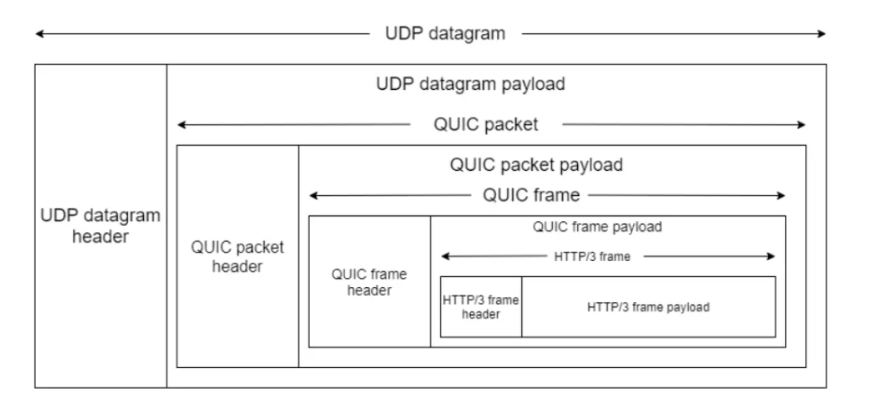
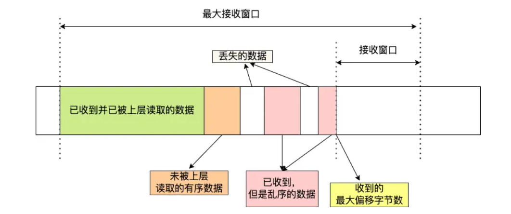
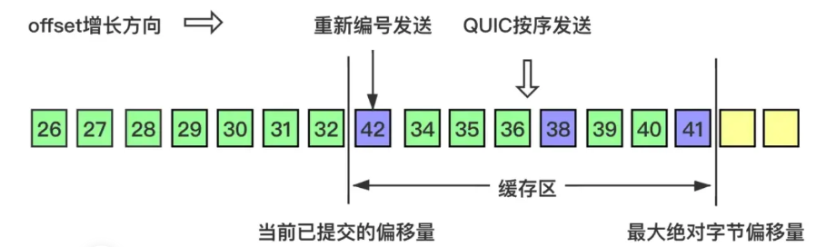
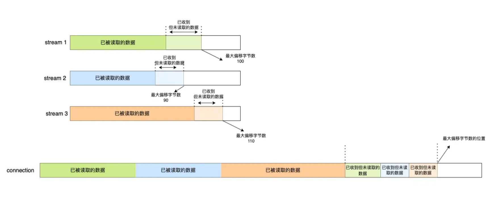

# 使用UDP做到TCP的效果

图片和部分文字来自[4.17 如何基于 UDP 协议实现可靠传输？ | 小林coding (xiaolincoding.com)](https://xiaolincoding.com/network/3_tcp/quic.html#quic-对拥塞控制改进)

---

即基于UDP协议实现**可靠传输**，以 **QUIC** 协议为例

TCP存在的几个问题：

- 需要建立连接，会产生**延迟**
- Http2及之前的版本使用TCP存在**队头阻塞**
- **网络迁移**需要重新建立连接

QUIC需要实现的效果：

- 可靠传输
- 解决队头阻塞
- 流量控制
- 拥塞控制
- 更快的建立连接
- 迁移连接

## 可靠传输

在应用层下功夫：

以 HTTP3.0 为例：

UDP格式照旧，但是**UDP的数据内容**则包含了多层用户层的协议数据：QUIC包、QUIC帧、最后才是HTTP/3的帧。

### QUIC Packet header

分为

- **Long** Packet header **首次建立连接**
  - **源连接ID**、**目标连接ID**
- **Short** Packet header **日常传输数据**
  - **目标连接ID**
  - 编号 Packet Number，类似seq，但是**严格单调递增**，数据发生重传也使用递增的编号（可以通过ACK的不同判定是哪个重传的包还是原始包被收到了，便于计算 RTT ）
  - 数据负载

- 需要 **三次握手** ，协商**连接ID**。

- 后续发送数据只需要指定目标连接ID。
- 编号**单调递增**，使得支持**乱序确认**
- 编号单调递增，使得发生重传时，窗口可以继续移动，解决队头阻塞

### QUIC Frame header

QUIC帧放在QUIC包的数据负载部分。

Frame分有不同类型，各自有不同的格式和功能。

以 Stream 类型为例（类似HTTP/2的Stream），一条**Stream**对应一次**HTTP请求和响应**，格式包含：

- Stream **ID**
- **Offset**，类似seq
- **Length**
- 数据负载

通过 **Stream ID + Offset** 来体现**数据的有序性**，标识具体数据内容。

即 QUIC 通过**单向递增的 Packet Number**，配合 **Stream ID 与 Offset** 字段信息，可以**支持乱序确认**而不影响数据包的**正确组装**。

## 解决队头阻塞

**接收窗口**的队头阻塞。

若有**数据丢失**，或者是**乱序**，TCP只有在处理完丢失或未收到的数据之后，才能继续移动窗口。

于是在一段时间内，**接收窗口停留**，导致后面的数据无法接收，造成队头阻塞。

HTTP/2 的Stream是在TCP基础之上，将一次HTTP请求和响应抽象成一条Stream，通过Stream ID标识。

对于并发的HTTP请求和响应，**不同的Stream**可以**乱序**发送和接收，<u>而**每条Stream内的数据**则需要保证**有序**发送和接收。</u>

因为**多条Stream会共用一条TCP连接**，如果某一条Stream出现阻塞，则会阻塞整个TCP连接的窗口，造成队头阻塞。

HTTP/3使用QUIC之后，每条Stream内的数据也可以做到乱序的接收（并进行有序的重组）。（通过 递增编号 和 Stream ID+Offset 机制实现）

QUIC为每条Stream都建立了一个窗口，则当某条Stream出现阻塞，只有一个窗口停滞，其他Stream的窗口还还能继续接收数据。

## 流量控制

接收方通过：

- window_update Frame 告知窗口大小
- Block Frame 告知窗口关闭

两种级别的流量控制：

- **Stream** 级别：
  - Stream 可以认为就是一条 HTTP 请求，每个 Stream 都有独立的滑动窗口，所以每个 Stream 都可以做流量控制，防止单个 Stream 消耗连接（Connection）的全部接收缓冲。
- **Connection** 级别
  - 限制连接中所有 Stream 相加起来的总字节数，防止发送方超过连接的缓冲容量。

Connection级别限制了连接的总流量，Stream级别保证了流量的分配均匀。

### Stream 级

**接收方**：

**发送方**：

上面的数字是 **编号**

控制数据发送的唯一限制就是**最大绝对字节偏移量**，该值是接收方基于当前已经提交的偏移量（连续已确认并向上层应用提交的数据包offset）和发送方协商得出。

### Connection 级

可用窗口大小就是各个Stream可用窗口大小之和。

- 各个Stream的流量不超过各个Stream窗口
- 所有Stream的流量不超过Connection窗口

## 拥塞控制

参照TCP的拥塞控制，但QUIC可以作更多改进，且更容易进行修改和普及应用。

- TCP 更改拥塞控制算法是对系统中所有应用都生效，无法根据不同应用设定不同的拥塞控制策略。
- 但是因为 QUIC 处于应用层，所以就**可以针对不同的应用设置不同的拥塞控制算法**，这样灵活性就很高了

## 快速建立连接

对于HTTP：

- HTTP/3之前的连接建立：TCP三次握手+TLS四次握手

- QUIC建立连接只需一次握手

**HTTP/3的 QUIC 内部包含了 TLS**，它在自己的帧会携带 TLS 里的“记录”，再加上 QUIC 使用的是 TLS1.3，因此仅需 1 个 RTT 就可以「同时」完成建立连接与密钥协商，甚至在第二次连接的时候，应用数据包可以和 QUIC 握手信息（连接信息 + TLS 信息）一起发送，达到 0-RTT 的效果。

## 迁移连接

- TCP连接 是通过四元组来标识通信两端，若网络环境发生变化导致IP或端口改变，则需要重新建立连接，代价较高。

- QUIC 通过**连接 ID**来标记通信两端，连接建立时双方协商好各自的 **连接ID**。当网络环境变化时，只要仍保有**上下文信息**（比如**连接 ID**、**TLS 密钥**等），就可以“无缝”地复用原连接，消除重连的成本，达到了**连接迁移**的功能。

