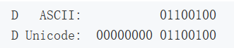
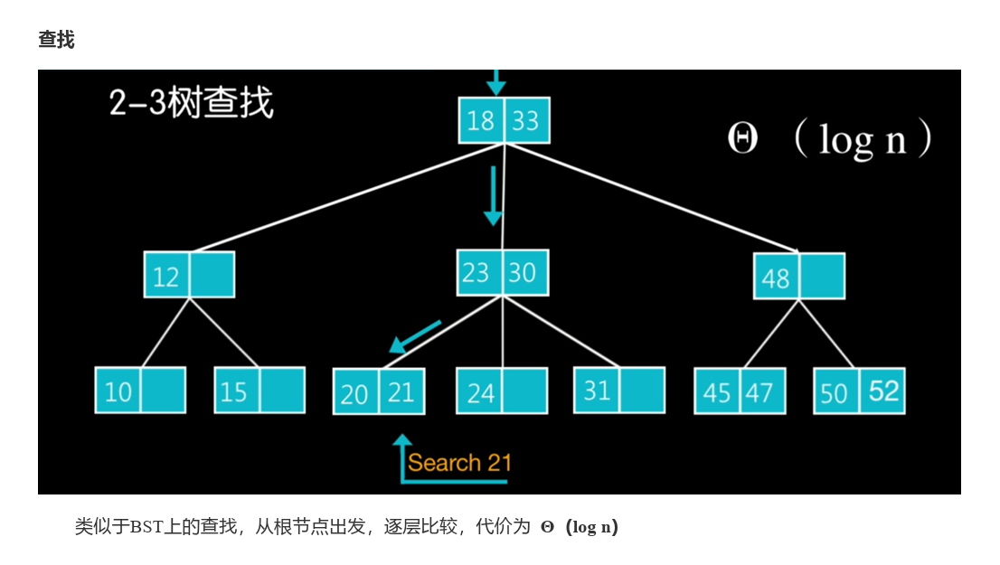
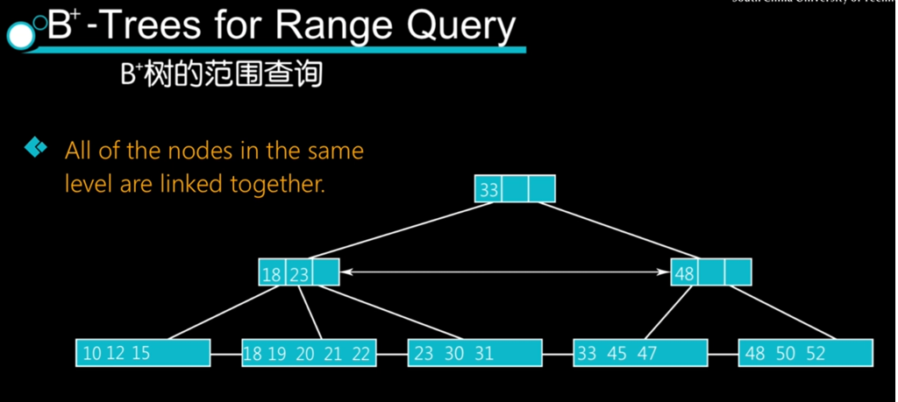
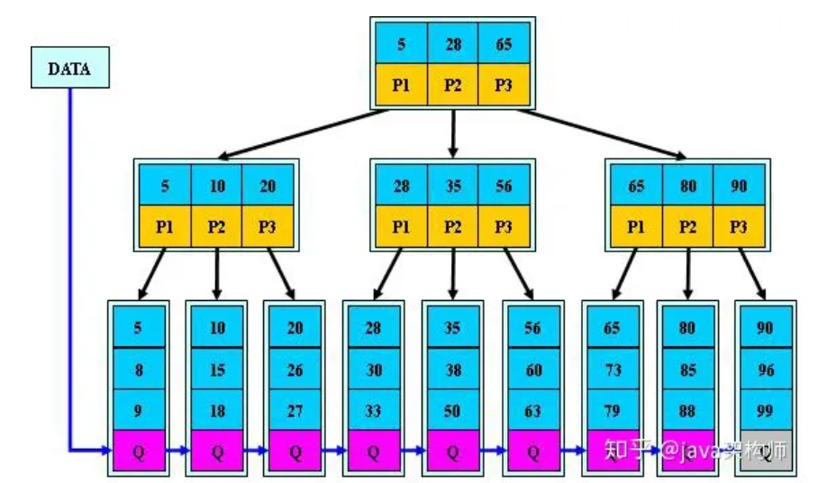

## 关系型数据库

**关系型数据库的三大范式**

- 第一范式：
  - 单一字段只能表示一种数据（字段的原子性）
  - （否则可分为多个字段）
- 第二范式：
  - 非主键必须依赖整个主键，而非部分主键
  - （否则可以分为多个表）
- 第三范式：
  - 非主键必须直接依赖主键，不能间接依赖
  - （否则可以分为多个表）

## 事务

**事务的四大特性**

- 原子性：事务中的操作 要么全部成功，要么全部失败回滚
- 一致性：一个事务执行前后，数据库的状态保持一致（类比能量守恒）
- 隔离性：一个事务只能读到已经提交的修改
- 持久性：一个事务一旦提交，对数据库中的数据的改变是永久性的，即使数据库系统遇到故障也不会丢失事务操作所做的修改。

**事务的隔离等级**

前置概念

- **脏读**：一个事务处理过程中读取了另一个未提交的事务中的数据
  - 当一个事务对数据进行修改但还没有提交时，其他事务可能会读取到这个尚未提交的数据。
  - 类似的情况在并发编程中被称为**竞态条件**（Race Condition），它指的是多个线程同时访问临界资源，并且对该资源进行修改，从而导致结果的不确定性或错误。
  - 数据库通常使用锁机制来控制并发访问。
- **不可重复读**
  - 一个事务范围内，多次相同的查询却返回了不同的数据值
  - 原因是在查询间隔内，另一个事务修改了数据并提交了
- **幻读**
  - 对于一个事务，在前面进行了查询，之后又有其他事务插入或删除数据，导致前面查询到的数据失去有效性。
  - 原因：使用了读取一致性级别不同的事务隔离级别

MySQL的四种隔离级别

- **串行化** Serializable
  - 强制事务顺序，使之不可能相互冲突，解决幻读
- **可重复读** Repeatable Read
  - 默认事务隔离级别，确保同一事务的多个实例在并发读取数据时，会看到同样的数据行，解决了不可重复读的问题。
- **读已提交** Read Committed
  - 一个事务只能看见已经提交的事务所做的改变，避免脏读
- **读未提交** Read Uncommitted
  - 所有的事务都可以看到其他未提交事务的执行结果

生存环境一般使用 **读已提交RC**

- 为什么使用RC而不是RR
  - RR存在<u>间隙锁</u>，更容易出现死锁
  - RR级别下，<u>条件列未命中索引</u>会锁表，而RC级别下只锁行
  - 可见RC的并发性高于RR
  - 另外不可重复读问题<u>有时候</u>是可接受的

## 编码与字符集

**编码和字符集**

- ASCII
  - 单字符：8bits，1Byte
  - 只能表示256个字符
- 各种特殊编码，如中文的 GB2312，希腊语的 greek，俄语的 cp866
- Unicode，统一各种编码为一种
  - 单字符：2~4Byte
  -  
- UTF-8
  - 优化了Unicode的字符中不必要的字节
- 总结
  - 按照一定规则把符号和二进制码对应起来，这就是**编码**。而把n多这种已经编码的字符聚在一起，就是我们常说的**字符集**。
  - 比如utf-8字符集就是所有utf-8编码格式的字符的合集。

## 索引

### 索引概述

> 是什么
>
> - 索引用于加快磁盘数据的访问，属于用空间换时间
> - 索引记录的内容有一组数据的关键字和数据各个部分的存储位置，通过某些数据结构（B树、B+树）组织关键字，在这样数据结构上对关键字进行查询，从而找到关键字对应数据的存储位置，再到磁盘中直接获取。
> - 数据存储在磁盘中的某个位置，我们要访问某个磁盘中的数据
>   - 在没有使用索引的情况下，就得把全部相关的数据加载到内存中（如果数据量很大，就需要加载多次，非常耗时），然后再从内存中遍历找到数据。
>   - 使用索引，只需将索引加载到内存，然后在索引中根据关键字找到数据的存储位置，便可直接找到磁盘中数据并进行加载
>     - 一般来说不会一次性加载所有的索引节点，如果是B树，B+树，每次会根据需要加载一定数量的节点，对磁盘的访问次数最多等于树的高度
>     - 此外，对于高频使用的索引，还会将其缓存到内存中
> - 索引键值一般就是该行数据某个列上的具体值

> **GPT**
>
> Q: 对于数据库中的一列，为其建立索引，那么其键值是什么，查找某个数据的过程是怎样的
>
> A:
>
> 在为数据库中的一列建立索引时，键值是该列中的具体值。具体来说，对于每个索引条目，键值是该列中一行数据的值。
>
> 当进行通过索引进行数据查询时，数据库系统会使用索引树的结构来加速查询过程。以下是查找某个数据的一般过程：
>
> 1. 查询条件：首先，根据查询语句中的条件确定需要查找的数据。
> 2. 索引搜索：数据库会根据索引的键值进行搜索。如果该列上有索引，并且该索引适用于查询条件，则数据库系统会根据索引树进行搜索。
> 3. 索引树遍历：数据库系统会依次遍历索引树的节点，从根节点开始，在每个节点选择合适的子节点继续查找，直到找到满足查询条件的数据。
> 4. 数据访问：一旦找到满足条件的索引节点，数据库系统会使用该节点中的指针来访问相应的数据行。这可能涉及到磁盘读取操作，将数据从磁盘中加载到内存。
> 5. 数据返回：找到满足条件的数据行后，数据库系统会将其返回给用户。
>
> 需要注意的是，索引的目的是为了加速数据的查询操作。索引的建立和使用需要在一定程度上增加存储空间和维护开销。因此，对于不频繁搜索的列或一些其他条件，建立索引可能并不总是必要或有效的选择。

作用

- 数据是存储在磁盘上的
- 查询数据时，如果没有索引，会加载所有的数据到内存，依次进行检索，读取磁盘次数较多。
- 有了索引，就不需要加载所有数据，因为B+树的高度一般在2-4层，最多只需要读取2-4次磁盘，查询速度大大提升。

优点：

- **加快数据查找的速度**
- 为用来排序或者是分组的字段添加索引，可以加快分组和排序的速度
- 加快表与表之间的连接

缺点：

- 建立索引需要**占用物理空间**
- 会降低表的增删改的效率，因为每次对表记录进行增删改，需要进行**动态维护索引**，导致增删改时间变长

使用场景

- 经常用于查询的字段
- 经常用于连接的字段建立索引
- 经常需要排序的字段建立索引（建立索引就排好序了）

不适用的

- `where`条件中用不到的字段不适合建立索引
- 表记录较少
- 需要经常增删改
- **参与列计算**的列不适合建索引
- **区分度不高**的字段不适合建立索引，如性别

### 索引的数据结构

#### 线性索引

- 用有序数组组织索引
- 可以通过二分查找快速找到键值位置
- 当数据量太大时，可以分为多层线性索引，在最底层记录每一个数据的存储位置
- 缺点
  - 对于数组，增删的代价比较大

#### B树索引

2-3树即3阶B树

#### B+树索引

- 中间结点中，只保存关键字的值（引导） 
- 叶子节点中，保存关键字以及相应的数据记录（即数据记录存放在叶子结点）

- 支持范围查找 ： 同一层的结点还通过链表相连 

> B树和B+树的插入、删除产生的分裂和合并以及层次变化的过程，可以去看下一华工数据结构慕课。

- 也有不完全一样的定义方式

#### 哈希表索引

- 哈希索引是基于哈希表实现的，对于每一行数据，存储引擎会对索引列进行哈希计算得到哈希码，并且哈希算法要尽量保证不同的列值计算出的哈希码值是不同的。
- 将哈希码的值作为哈希表的key值，将指向数据行的指针作为哈希表的value值。
- 这样查找一个数据的时间复杂度就是O(1)，一般多用于精确查找。

与 B+树 索引的比较

- 哈希索引**不支持排序**，因为哈希表是无序的。
- 哈希索引**不支持范围查找**。
- 哈希索引**不支持模糊查询**及多列索引的最左前缀匹配。
- 因为哈希表中会**存在哈希冲突**，所以哈希索引的性能是不稳定的，而B+树索引的性能是相对稳定的，每次查询都是从根节点到叶子节点。

#### 为什么B+树比B树更适合实现数据库索引？

- 由于B+树的数据都存储在叶子结点中，叶子结点均为索引，方便扫库，只需要扫一遍叶子结点即可，但是B树因为其分支结点同样存储着数据，我们要找到具体的数据，需要进行一次中序遍历按序来扫，所以B+树更加适合在区间查询的情况，而在数据库中基于范围的查询是非常频繁的，所以通常B+树用于数据库索引。
- B+树的节点只存储索引key值，具体信息的地址存在于叶子节点的地址中。这就使以页为单位的索引中可以存放更多的节点。减少更多的I/O支出。
- B+树的查询效率更加稳定，任何关键字的查找必须走一条从根结点到叶子结点的路。所有关键字查询的路径长度相同，导致每一个数据的查询效率相当。

## MySQL

### 架构篇

