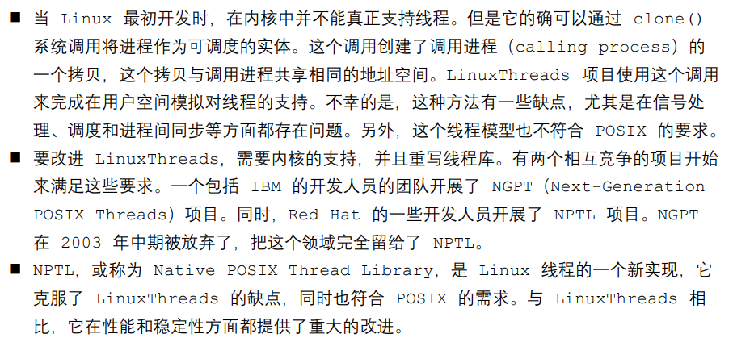
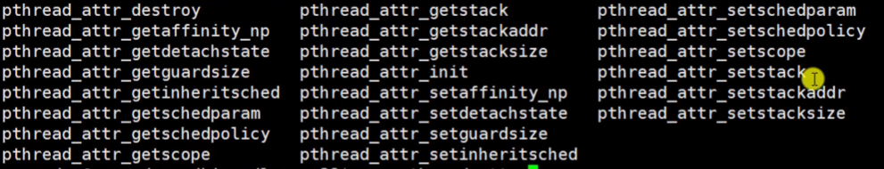
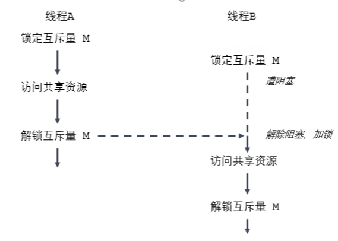
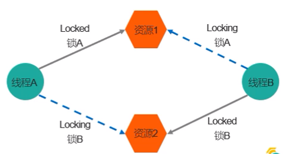
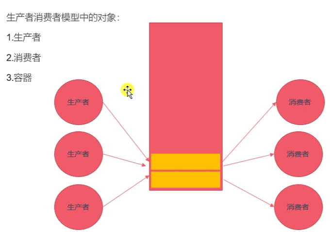
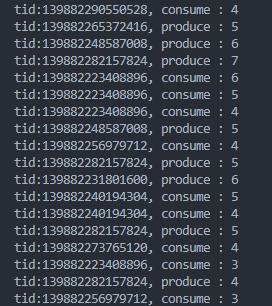

# 第三章 Linux多线程开发

---

<br>

## 3.1 线程

### 概述

- 与进程类似，线程是允许应用程序并发执行多个任务的一种机制。
  - 一个进程可以包含多个线程。
  - 同一个程序中的所有线程均会独立执行相同程序，且共享同一份全局内存区域，其中包括初始化数据段、未初始化数据段，以及堆内存段。（传统意义上的 UNIX 进程只是多线程程序的一个特例，该进程只包含一个线程）
- 进程是 CPU 分配资源的最小单位，线程是操作系统调度执行的最小单位
- 线程是轻量级的进程( LWP ,Light Weight Process )，在 Linux 环境下线程的本质仍是进程
- 查看指定进程的 LWP 号：`ps -Lf pid`

<br>

<br>

**线程与进程的区别**

进程：

- 进程间的信息难以共享。由于除去只读代码段外，父子进程并未共享内存，因此必须采用一些进程间通信方式，在进程间进行信息交换
- 调用 fork() 来创建进程的代价相对较高，即便利用了 写时复制 技术，仍需要复制诸如内存页表和文件描述符表之类的多种进程属性

<br>

线程：

- 线程之间能够方便、快速的共享信息。只需要将数据复制到共享(全局或堆)变量中即可
- 创建线程比创建进程通常要快得多。线程间是共享虚拟地址空间的，无需采用写时复制来复制内存，也无需复制页表


**线程资源**

共享资源：

- 进程id，父进程id
- 进程组id，会话id
- 用户id，用户组id
- 文件描述符表
- 信号处置（注册的、默认的）
- 文件系统的相关信息：umask、当前工作目录
- 虚拟地址空间（除了栈、.text段)

<br>

非共享资源：

- 线程id
- 信号掩码
- 线程特有数据
- error 变量（线程特有）
- 实时调度策略 和 优先级
- 栈、本地变量和函数的调用链接信息

<br>

**NPTL**

查看当前 pthread 库版本：`getconf GNU_LIBPTHREAD_VERSION`



<br>

<br>

<br>

### 线程创建

一般情况下，main函数所在的线程作为主线程（main线程），其余创建的称为子线程

```c
#include <pthread.h>

int pthread_create(pthread_t *thread, const pthread_attr_t *attr, void *(*start_routine) (void *), void *arg);
/*
	创建一个子线程
	参数：
		- thread：传出参数，线程创建成功后，子线程的线程id被写入该变量
		- attr：设置线程的属性，一般使用默认值 NULL
		- start_routine：函数指针，子线程需要处理的逻辑代码
		- arg：作为start_routine的参数
	返回值：
		成功 返回0
		失败 返回错误号。与之前的erron不太一样
		获取错误号信息：char *strerror(int errnum);
*/	

```

<br>

> 编译的时候要加 -pthread

<br>

**案例**

```c
#include <stdio.h>
#include <pthread.h>
#include <string.h>
#include <unistd.h>

void *callback(void*arg) {
    printf("child thread and arg: %d\n",*(int *)arg);
    return NULL;
}

int main() {

    pthread_t tid;

    int num = 10;

    int ret = pthread_create(&tid, NULL, callback, (void*)&num);

    if(ret != 0) {
        char *errstr = strerror(ret);
        printf("err:%s\n",errstr);
    }


    for (int i = 0; i < 5; i++)
    {
        printf("%d\n",i);
    }
    
    sleep(1);

    return 0;
}
```

<br>

<br>

<br>

### 线程终止

```c
#include <pthread.h>

// 相当于提前 return
void pthread_exit(void *retval);
/*
	终止一个线程，在哪个线程中调用就终止哪个线程
	参数：
		- retval：需要传递一个指针，作为一个返回值，可以在 pthread_join() 中获取到

*/


// 获取当前线程的线程id
pthread_t pthread_self(void);


// 比较两个线程 ID 是否相等
// 不同的操作系统，pthread_t类型的实现不同，有的是无符号长整形，有的是结构体。
int pthread_equal(pthread_t t1, pthread_t t2);

```

<br>

<br>

<br>

### 连接已终止的线程

```c
#include <pthread.h>

int pthread_join(pthread_t thread, void **retval);
/*
	和一个已经终止的线程进行连接（阻塞的）
	回收子线程的资源（一次回收一个）
	一般在主线程中使用

	参数：
		- thread：需要回收的子线程的id
		- retval：二级指针，接收子线程退出时的返回值

	返回值：
		成功 0
		失败 非0 返回错误号
*/

```

<br>

**接收返回值的join案例**

```c
#include <stdio.h>
#include <pthread.h>
#include <string.h>
#include <unistd.h>
int value =10;

void *callback(void*arg) {
    printf("child thread and arg: %d\n",*(int *)arg);
    pthread_exit((void *)&value);	// return (void *)&value;
}

int main() {

    pthread_t tid;

    int num = 10;

    int ret = pthread_create(&tid, NULL, callback, (void*)&num);
    if(ret != 0) {
        char *errstr = strerror(ret);
        printf("err:%s\n",errstr);
    }

	// 主线程
    for (int i = 0; i < 5; i++)
    {
        printf("%d\n",i);
    }
    
    // 回收
    int *rtvalue;	// 作接收的变量
    ret = pthread_join(tid,(void **)&rtvalue);
    if(ret != 0) {
        char *errstr = strerror(ret);
        printf("err:%s\n",errstr);
    }	
    
    printf("get return value:%d\n",*rtvalue);
        
        
    return 0;
}
```

<br>

<br>

<br>

### 线程分离

```c
#include <pthread.h>

int pthread_detach(pthread_t thread);


/*
	分离一个线程
	将指定线程标记为分离，当该线程终止时系统会自动回收资源，而不再需要别的线程来join回收
	不能 detach / join 一个已经分离的线程
	
	参数：
		- thread：需要分离的线程的id

	返回值：
		成功 0
		失败 非0 返回错误号
*/


```

<br>

<br>

<br>

### 线程取消

- 调用 pthread_cancel 之后，线程不会立即退出，而是等运行到某一 取消点 的时候才会真正取消
- 取消点：系统规定好的一些系统调用，一般在用户态切换到内核态的场景出现

```c
#include <pthread.h>

int pthread_cancel(pthread_t thread);
/*
	取消线程，当子线程执行到一个取消点时，线程才会终止
	线程能否取消取决于线程的一些属性
*/


```

<br>

<br>

<br>

### 线程属性

pthread_create()的第二个参数传入线程属性

**相关函数**



```c
线程属性类型 pthread_attr_t

    变量初始化与回收
    
int pthread_attr_init(pthread_attr_t *attr);
/*
	初始化线程属性变量
*/

int pthread_attr_destroy(pthread_attr_t *attr);
/*
	释放线程属性变量的资源
*/


	属性设置和获取
        
int pthread_attr_getdetachstate(const pthread_attr_t *attr, int 
*detachstate);
/*
	获取线程分离的状态属性
*/

int pthread_attr_setdetachstate(pthread_attr_t *attr, int 
detachstate);
/*
	设置线程分离的状态属性
*/

......

```

<br>

<br>

<br>

<br>

<br>

## 3.2 同步互斥

### 线程同步

- 线程的主要优势在于能够通过全局变量来共享信息。但是要确保多个线程不会同时修改同一变量，或者某一线程不会读取正在由其他线程修改的变量。

<br>

**临界区**

指访问某一共享资源的代码片段，并且这段代码的执行应该为 原子操作 ，也就是同时访问同一共享资源的其他线程不应该中断该片段的执行。

<br>

**同步与互斥**

**线程同步** 就是协同步调，按预定的先后次序进行运行。如：你说完，我再说。线程同步是指多线程通过特定的设置（如互斥量，事件对象，临界区）来控制线程之间的执行顺序（即所谓的同步）也可以说是在线程之间通过同步建立起执行顺序的关系，如果没有同步，那线程之间是各自运行各自的，也即异步。

**线程互斥** 是指对于共享的进程系统资源，在各单个线程访问时的排它性。当有若干个线程都要使用某一共享资源时，任何时刻最多只允许一个线程去使用，其它要使用该资源的线程必须等待，直到占用资源者释放该资源。线程互斥可以看成是一种特殊的线程同步。

<br>

### 互斥锁

- 为了线程更新共享变量时出现问题，可以使用互斥量 mutex( mutual exclusion ) 来确保同时仅有一个线程可以访问某项共享资源。可以使用互斥量来保证对任意共享资源的原子访问。
- 互斥量有两种状态：锁定locked 和 未锁定unlocked 。任何时刻，至多只有一个线程可以锁定该互斥量。试图对已经锁定的某一互斥量再次加锁，将可能阻塞线程或者报错失败，具体取决于加锁使用的方法。
- 一旦线程锁定互斥量，随即成为该互斥量的所有者，只有所有者才能给互斥量解锁。一般情况下，对每一共享资源（可能有多个相关变量组成）会使用不同的互斥量，每一线程在访问同一资源时将采用如下协议：
  - 锁定相应的互斥量
  - 访问共享资源
  - 对互斥量解锁

<br>



<br>

<br>

**互斥量相关函数**

互斥量类型 `pthread_mutex_t`

```c
#include <pthread.h>


int pthread_mutex_init(pthread_mutex_t *restrict mutex, const pthread_mutexattr_t *restrict attr);
/*
	初始化互斥量
	参数：
		- mutex：需要初始化的互斥变量
		- attr：互斥量相关的属性，一般NULL
	
	restrict ：C语言的修饰符，被修饰的指针指向的内容不能由别的指针进行操作
	
*/

int pthread_mutex_init(pthread_mutex_t *mutex);
/*
	释放互斥量
*/


int pthread_mutex_lock(pthread_mutex_t *mutex);
/*
	给互斥量加锁
	阻塞的
*/

int pthread_mutex_trylock(pthread_mutex_t *mutex);
/*
	给互斥量尝试加锁
	非阻塞
*/

int pthread_mutex_unlock(pthread_mutex_t *mutex);
/*
	解锁
*/

```

<br>

<br>

<br>

<br>

### 死锁

- 有时，一个线程需要同时访问两个或更多不同的共享资源，而每个资源又都有不同的互斥量管理。当超过一个线程加锁同一组互斥量时，就可能发送死锁



<br>

> **死锁**：两个或两个以上的进程在执行过程中，因为夺取资源而造成的一种相互等待的现象，若无外力作用，它们都将无法推进下去。此时称系统处于死锁状态或系统发生了死锁。
>
> 
>
> **场景**：
>
> - 忘记释放锁
> - 重复加锁
> - 多线程多锁，抢占资源

<br>

<br>

更多相关内容详见操作系统课程...

<br>

<br>

<br>

<br>

### 读写锁

- 当一个线程已经持有互斥锁时，互斥锁将所有试图进入临界区的线程都阻塞住。
  但考虑一种情况：当前持有互斥锁的线程只是读共享资源，而同时有其他几个线程也想读取这个共享资源，但由于互斥锁的排他性，所有线程都无法获取锁，即无法读访问共享资源，但是实际上多个线程同时读访问共享资源并不会导致问题
- 在对数据的读写操作中，更多的是读操作，写操作较少。为了满足允许多个读出，而只允许单个写入的情况，线程提供了读写锁来实现。

<br>

**读写锁特点**：

- 如果有其他线程 **读数据** ，则允许其他线程执行读操作，但不允许写操作
- 如果有其他线程 **写数据** ，则其他线程都不允许读、写操作
- 写是独占的，写的优先级更高

<br>

<br>

**相关函数**

读写锁类型 `pthread_rwlock_t`

```c
#include <pthread.h>

// 初始化读写锁
int pthread_rwlock_init(pthread_rwlock_t *restrict rwlock, const pthread_rwlock_t *restrict attr);

// 回收读写锁
int pthread_rwlock_destroy(pthread_rwlock_t *rwlock);

// 加读锁
int pthread_rwlock_rdlock(pthread_rwlock_t *rwlock);

// 尝试加读锁
int pthread_rwlock_tryrdlock(pthread_rwlock_t *rwlock);

// 加写锁
int pthread_rwlock_wrlock(pthread_rwlock_t *rwlock);

// 尝试加写锁
int pthread_rwlock_trywrlock(pthread_rwlock_t *rwlock);

// 解锁
int pthread_rwlock_unlock(pthread_rwlock_t *rwlock);

```

<br>

<br>

<br>

<br>

**生产者与消费者模型**



<br>

更多相关内容详见操作系统课程...

<br>

<br>

<br>

### 条件变量

不是锁，能够配合互斥量使用实现线程的同步关系

类型 `pthread_cond_t`

```c
#include <pthread.h>

// 初始化
int pthread_cond_init(pthread_cond_t *restrict cond, const pthread_condattr_t *restrict attr);

// 回收
int pthread_cond_destroy(pthread_cond_t *cond);

// 等待条件实现（阻塞）
int pthread_cond_wait(pthread_cond_t *restrict cond, pthread_mutex_t *restrict mutex);

// 等待条件实现（阻塞指定的一段时间）
int pthread_cond_timewait(pthread_cond_t *restrict cond, pthread_mutex_t *restrict mutex, const struct timespec *restrict abstime);

// 唤醒等待的一个或多个等待的线程
int pthread_cond_signal(pthread_cond_t *cond);

// 唤醒所有等待的线程
int pthread_cond_broadcast(pthread_cond_t *cond);
    
    
```

<br>

> 注意当 wait 阻塞的时候，会将 互斥锁 解锁；
>
> 等到 wait 被唤醒之后，又会在原处重新 对 互斥锁 加锁

<br>

<br>

<br>

<br>

### 信号量

类型 `sem_t`

与条件变量类似，与互斥锁搭配使用，实现线程同步关系

```c
#include <>


int sem_init(sem_t *sem, int pshared, unsigned int value);
/*
	信号量初始化
	参数：
		sem：信号量变量的地址
		pshared：0 表示用于线程间， 非0 表示用于进程间
		value：信号量中的值，可表示资源数量
*/

// 释放资源
int sem_destroy(sem_t *sem);

// 若信号量值为 0 就阻塞，信号量值大于 0 就 -1，
int sem_wait(sem_t *sem);
int sem_trywait(sem_t *sem);
int sem_timewait(sem_t *sem,const struct timespec *abs_timeout);

// 信号量值 +1 ，并且如果有的话就唤醒一个 wait 中的线程
int sem_post(sem_t *sem);

int sem_getvalue(sem_t *sem, int sval);
```

<br>

> wait -- post 对应 P -- V 操作

<br>

模拟生产者消费者

以资源容量为 8 为例：

```c
#include <pthread.h>
#include <stdio.h>
#include <semaphore.h>
#include <unistd.h>
#include <stdlib.h>


int resource = 0;

sem_t psem;
sem_t csem;

pthread_mutex_t mutex;


void * producer(void* arg) {

    while(1) {
        sem_wait(&psem);
        pthread_mutex_lock(&mutex);
        ++resource;
        usleep(100);
        printf("tid:%ld, produce : %d\n",pthread_self(),resource);
        pthread_mutex_unlock(&mutex);
        sem_post(&csem);
    }

    return NULL;
}

void * consumer(void* arg) {

    while(1) {
        sem_wait(&csem);
        pthread_mutex_lock(&mutex);
        --resource;
        usleep(100);
        printf("tid:%ld, consume : %d\n",pthread_self(),resource);
        pthread_mutex_unlock(&mutex);
        sem_post(&psem);
    }

    return NULL;
}

int main() {

    pthread_mutex_init(&mutex, NULL);
    sem_init(&psem, 0, 8);
    sem_init(&csem, 0, 0);

    pthread_t ptids[5],ctids[5];

    for(int i=0; i<5; i++) {
        pthread_create(&ptids[i],NULL,producer,NULL);
        pthread_create(&ctids[i],NULL,consumer,NULL);
    }

    for(int i=0; i<5; i++) {
        pthread_join(ptids[i],NULL);
        pthread_join(ctids[i],NULL);
    }

    exit(0);
    pthread_mutex_destroy(&mutex);
    sem_destroy(&psem);
    sem_destroy(&csem);
    return 0;
}

```

<br>



<br><br><br>

第三章完结！

<br>

<br>


