# 5.项目相关知识点

<br>

<br>

<br>

## 5.1 阻塞/非阻塞，同步/异步

此处是对于 **网络IO**

IO的两个阶段：1.**数据就绪** 2.**数据读写**

<br>

**数据就绪**	操作系统、内核缓冲区中

- 阻塞   ：调用IO方法的线程进入阻塞状态
- 非阻塞  ：不改变线程的状态，通过返回值判断

<br>

**数据读写**	缓冲区的数据<-->内存

- 同步   : 应用程序自行读写
- 异步   : 操作系统辅助读写   （异步IO接口、通知方式）

<br>

<!--more-->

> 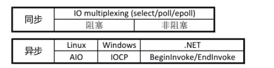
>
> 陈硕：在处理IO的时候，阻塞和非阻塞都是同步IO，只有使用了特殊的API才是异步IO

<br>

对于网络IO

- 一个典型的**网络IO接口调用**，分为两个阶段，分别是“**数据就绪**” 和 “**数据读写**”
  - **数据就绪**阶段分为**阻塞和非阻塞**，表现得结果就是，**阻塞当前线程**或是**直接返回**。

<br>

- **同步**表示A向B请求调用一个网络IO接口时（或者调用某个业务逻辑API接口时），**数据的读写**都是由**请求方A自己来完成的**（不管是阻塞还是非阻塞）

- **异步**表示A向B请求调用一个网络IO接口时（或者调用某个业务逻辑API接口时），向B传入**请求的事件**以及**事件发生时通知的方式**，**A就可以处理其它逻辑了**，当B监听到事件处理完成后，会用事先约定好的通知方式，通知A处理结果。

  - 同步阻塞

  - 同步非阻塞

  - 异步阻塞

  - 异步非阻塞

<br>

<br>

<br>

<br>

## 5.2 Linux的五种IO模型


### 阻塞 blocking

调用者调用了某个函数，等待这个函数返回，期间什么也不做，不停的去检查这个函数有没有返回，必须等待这个函数返回才能进行下一步操作。

以read为例：

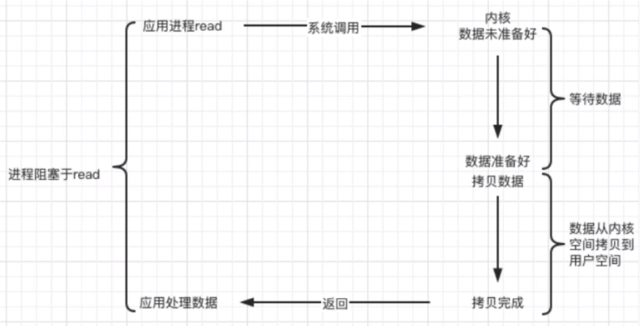

<br>

### 非阻塞 non-blocking（NIO）

非阻塞等待，每隔一段时间就去检测IO事件是否就绪，若没有就绪就可以做其他事。

非阻塞I/O执行系统调用总是立即返回，不管事件是否已经发生。若事件没有发生，则返回-1，此时可以根据errno区分情况。

对于**accept，recv和send**，事件未发生时，errno通常被设置为**EAGAIN**。

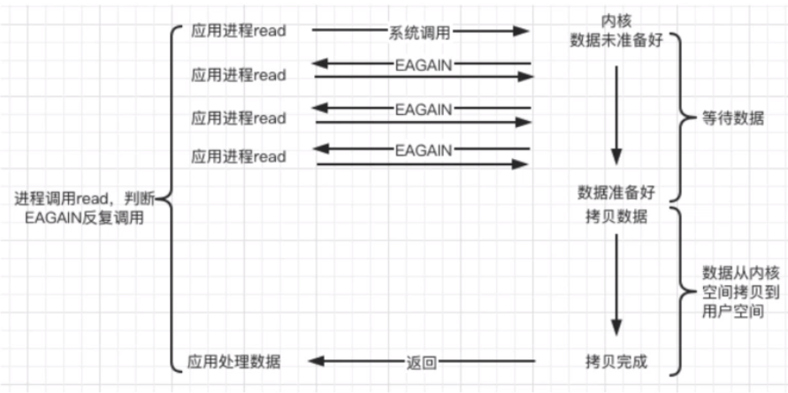

<br>

### IO复用（multiplexing）

Linux用select/poll/epoll函数实现IO复用模型，这些函数也会使进程阻塞，但是和阻塞IO所不同的是这些函数**可以同时阻塞多个IO操作**。而且可以**同时对多个读操作、写操作的IO函数进行检测**。直到有数据可读或可写时，才真正调用IO操作函数。

用于在一个服务端线程中响应多个客户端，但是不是处理高并发的（多线程多进程）。

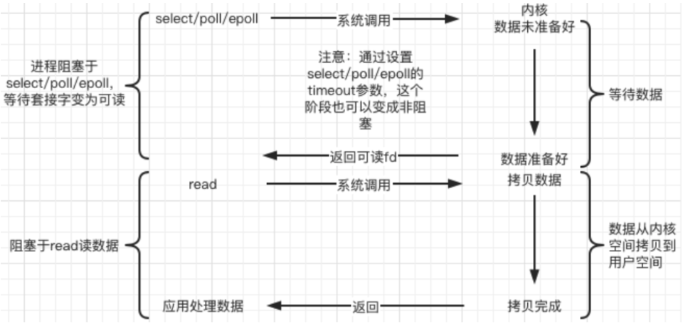

<br>

### 信号驱动（signal-driven）

Linux用套接口进行信号驱动IO，安装一个**信号处理函数**，进程继续运行并不阻塞。当IO事件就绪，进程收到SIGIO信号，然后处理IO事件。

- 内核在数据准备阶段是异步的，在数据读写结段是同步的
- 与非阻塞IO的区别在于它提供了消息通知机制，不需要用户进程不断轮询检查，减少了系统API的调用次数，提高了效率

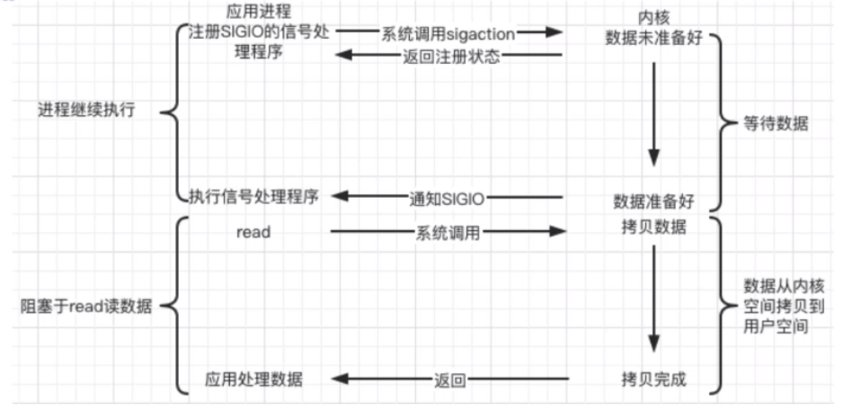

<br>

### 异步IO（asynchronous）

Linux中，可以调用 aio_read 函数告诉内核**描述符缓冲区指针**和**缓冲区的大小**、**文件偏移**及**通知的方式**等，然后立即返回，当内核将数据拷贝到缓冲区后，在通知应用程序。

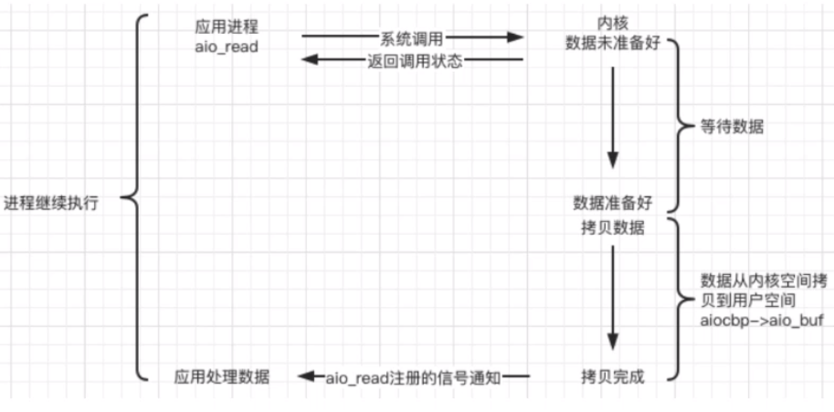

<br>

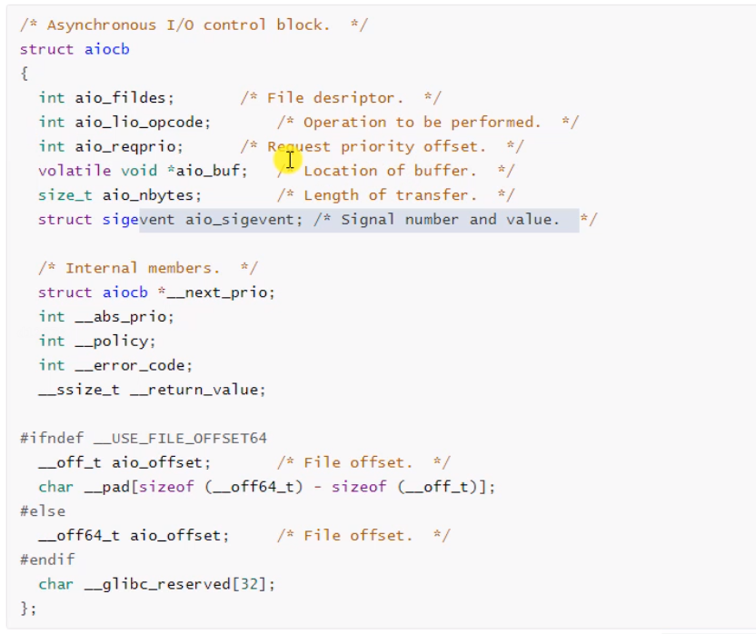

<br>

<br>

<br>

<br>

## 5.3 Web服务器简介及http协议

### Web Server

网页服务器

一个 Web Server 就是一个**服务器软件**（程序），或者是**运行这个服务器软件的硬件**（计算机）。

其主要功能就是通过 **HTTP** 协议与**客户端**（通常是浏览器Browser）进行**通信**，来**接收、存储、处理**来自客户端的 **HTTP请求** ，并对其请求做出 **HTTP响应** ，返回给客户端其请求的内容（**文件、网页等**）或返回一个 **Error 信息**。

<br>

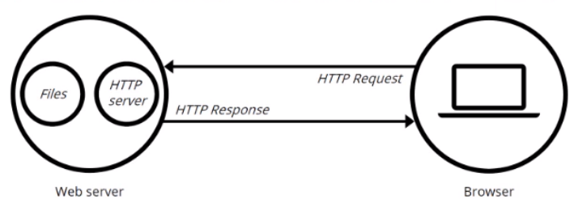

<br>

通常用户使用 Web浏览器 与相应服务器进行通信。在浏览器中键入**”域名“或”IP:Port“**，浏览器先将你的**域名解析成相应的IP地址**或者直接根据你的IP地址向对应的Web服务器发送一个 **HTTP请求** 。这一过程首先要通过**TCP协议的三次握手**建立与目标Web服务器的连接，然后HTTP协议生成针对目标Web服务器的**HTTP请求报文**，通过**TCP、IP等协议**发送到目标服务器上。

<br>

<br>

<br>

### http协议

**简介**

**超文本传输协议**（Hypertext Transfer Protocol，HTTP）是一个简单的 **请求-响应** 协议，它通常运行在 TCP 之上。

- 它指定了客户端可能发送给服务器**什么样的消息**以及得到**什么样的响应**。
- 请求和响应消息的**头**以 ASCII 形式给出；而**消息内容**则具有一个类似 MIME 的格式。
- HTTP是万维网的数据通信的基础。

**概述**

HTTP 是一个客户端终端（用户）和服务器端（网站）请求和应答的标准（TCP）。

- 通过使用网页浏览器、网络爬虫或者其它的工具，客户端发起一个HTTP请求到服务器上指定端口（默认端口为80）。我们称这个**客户端**为**用户代理程序**（user agent）。
- 应答的服务器上存储着一些资源，比如 HTML 文件和图像。我们称这个**应答服务器**为**源服务器**（origin server）。在用户代理和源服务器中间可能存在多个“**中间层**”，比如**代理服务器**、**网关**或者**隧道**（tunnel）。
- 尽管 TCP/IP 协议是互联网上最流行的应用，HTTP 协议中，并没有规定必须使用它或它支持的层。事实上，HTTP可以在任何互联网协议上，或其他网络上实现。**HTTP 假定其下层协议提供可靠的传输**。因此，任何能够提供这种保证的协议都可以被其使用。因此也就是其在  TCP/IP 协议族使用 TCP 作为其传输层。

通常，由HTTP客户端发起一个请求，创建一个到服务器指定端口（默认是80端口）的 TCP 连接。HTTP服务器则在那个端口监听客户端的请求。一旦收到请求，服务器会向客户端返回一个状态，比如"HTTP/1.1 200 OK"，以及返回的内容，如请求的文件、错误消息、或者其它信息。

<br>

**工作原理**

HTTP 协议定义 Web 客户端如何从 Web 服务器请求 Web 页面，以及服务器如何把 Web 页面传送给客户端。HTTP 协议采用了**请求/响应模型**。

- 客户端向服务器发送一个**请求报文**，请求报文包含**请求的方法**、**URL**、**协议版本**、**请求头部**和**请求数据**。
- 服务器以一个**状态行**作为响应，响应的内容包括**协议的版本**、**成功或者错误代码**、**服务器信息**、**响应头部**和**响应数据**。
  

**HTTP请求/响应的步骤：**

1. 客户端连接到 Web服务器
   - 客户端比如浏览器，与Web服务器的HTTP端口(默认为**80**)建立一个TCP套接字连接
2. 客户端发送HTTP请求
   - 通过TCP套接字，客户端向Web服务器发送一个文本的请求报文，一个请求报文由 **请求行**、**请求头部**、**空行**和**请求数据** 4部分组成
3. 服务器接受请求并返回HTTP响应
   - Web服务器**解析请求**，**定位请求资源**。
   - 服务器**将资源副本写到TCP套接字**，由客户端读取。
   - 一个响应由 **状态行**、**响应头部**、**空行**和**响应数据** 4部分组成
4. 释放连接 TCP 连接
   - 若 connection 模式为 **close** ，则服务器主动关闭 TCP 连接，客户端被动关闭连接，释放TCP连接；
   - 若 connection 模式为 **keepalive** ，则该连接会保持一段时间，在该时间内可以继续接收请求；
5. 客户端浏览器解析 HTML 内容
   - 客户端浏览器**首先解析状态行**，查看表明请求是否成功的状态代码。**然后解析每一个响应头**，响应头告知以下为若干字节的HTML文档和文档的字符集。客户端浏览器读取响应数据HTML，根据HTML的语法对其进行格式化，并在浏览器窗口显示。

<br>

例如：在浏览器地址栏输入URL，按下回车之后

1. 浏览器向 DNS 服务器请求解析该 URL 中的域名所对应的IP地址
2. 解析出IP地址后，根据该IP地址和默认端口80，和服务器建立TCP连接
3. 浏览器发出读取文件（URL中域名后面部分对应的文件）的HTTP请求，该请求报文作为TCP三次握手的第三个报文的数据发送给服务器
4. 服务器对浏览器请求做出响应，并把对应的HTML文本发送给浏览器
5. 释放TCP连接
6. 浏览器将解析该HTML文本并显示内容

<br>


> HTTP协议规定，请求从客户端发出，最后服务端响应请求并返回。也即，是先从客户端开始建立通信的，**服务端在没有接收到请求之前不会发送响应**。

<br>

<br>

<br>

### http报文格式

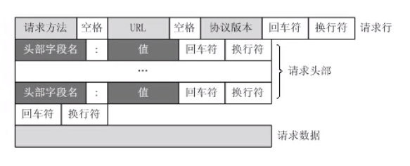

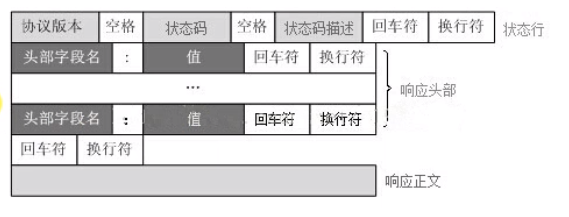

<br>

Web服务器要**解析请求，并生成响应信息**

<br>

我们要了解各种**请求头响应头**的含义，以及**状态码**的含义

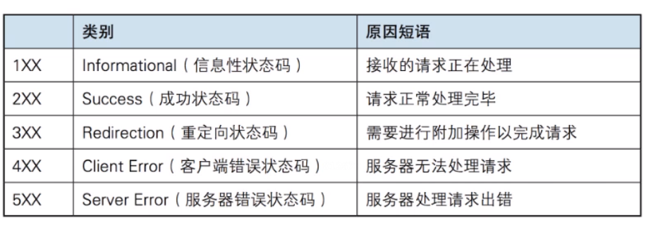

<br>

HTTP请求的各种**请求方法**，这里主要用 GET 和 POST
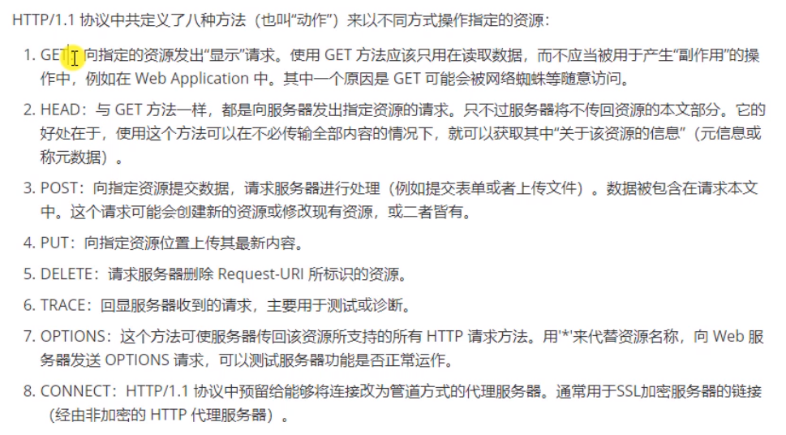

<br>

<br>

<br>

## 5.4 服务器编程基本框架

以及两种高效的**事件处理模式**

<br>

### 基本框架

Web 服务器程序种类繁多，但基本框架都一样，不同之处在于逻辑处理。

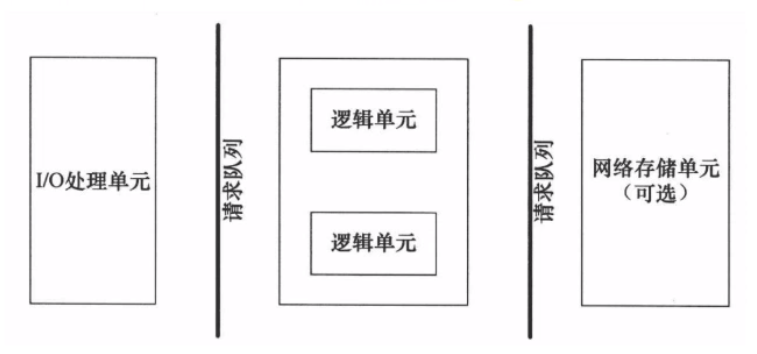

| 模块         | 功能                       |
| ------------ | -------------------------- |
| I/O 处理单元 | 处理客户连接，读写网络数据 |
| 逻辑单元     | 业务进程或线程             |
| 网络存储单元 | 数据库、文件或缓存         |
| 请求队列     | 各单元之间的通信方式       |

- **I/O处理单元**是服务器管理客户连接的模块。它通常要完成一下工作：

  - 等待并接受新的客户链接
  - 接收客户数据
  - 将服务器响应数据返回给客户端

  但是数据的收发不一定在I/O处理单元中执行，也可能在逻辑单元中执行，具体取决于事件处理模式

- 一个**逻辑单元**通常是一个进程或线程。它分析并处理客户数据，然后将结果**传递给I/O处理单元**或者**直接发送给客户端**（取决于事件处理模式）。服务器通常拥有多个逻辑单元，以实现对多个客户任务的并发处理

- **网络存储单元**可以是数据库、缓存和文件，但不是必须的

- **请求队列**是个单元之间的通信方式的抽象。

  - I/O处理单元接收到客户请求时，需要以某种方式通知一个逻辑单元来处理该请求。
  - 同样，多个逻辑单元同时访问一个存储单元时，也需要采用某种机制来协调处理竞态条件。
  - 请求队列通常被实现为**池(进程池、线程池)的一部分**。

<br>

<br>

### 两种高效的事件处理模式

服务器程序通常需要处理三类事件：

- I/O事件
- 信号
- 定时事件

<br>

两种高效的事件处理模式：

- **Reactor**   (一般用同步I/O模型实现)
- **Proactor**  (一般用异步I/O模型实现，或者用同步I/O模型模拟)

<br>

#### Reactor模式

- 要求**主线程**(**I/O处理单元**)只负责<u>监听文件描述符上是否有事件发生</u>，有的话就立即将该事件通知**工作线程**（**逻辑单元**），将socket可读可写事件放入**请求队列**，交给工作线程处理。除此之外，主线程不做任何其他实质性的工作。

- <u>读写数据，接受新的连接，以及处理客户请求</u>均在**工作线程**中完成。

<br>

使用同步I/O(epoll_wait为例)实现的Reactor模式的工作流程：

1. 主线程往epoll内核事件表中注册socket上的读就绪事件
2. 主线程调用epoll_wait等待socket上有数据可读
3. 当socket上有数据可读时，epoll_wait通知主线程。主线程则将socket可读事件放入请求队列
4. 睡眠在请求队列上的某个工作线程被唤醒，它从socket读取数据，并处理客户请求，然后往epoll内核事件表中注册该socket上的写就绪事件
5. 主线程调用epoll_wait等待socket可写
6. 当socket可写时，epoll_wait通知主线程。主线程将socket可写事件放入请求队列
7. 睡眠在请求队列上的某个工作线程被唤醒，他往socket上写入服务器处理客户请求的结果

<br>

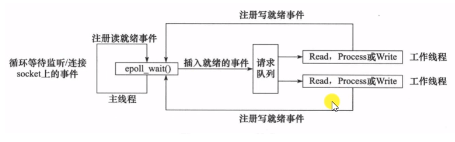

<br>

<br>

#### Proactor

- 将所有的**I/O操作**都交给**主线程和内核**来处理(进行读、写)，**工作线程仅仅负责业务逻辑**。

<br>

使用异步I/O模型实现的Proactor模式的工作流程：（以 aio_read 和 aio_wirte 为例)

1. **主线程**调用 aio_read 函数向内核注册socket上的**读完成事件**，并告诉内核用户**读缓冲区的位置**，以及读操作完成时**如何通知应用程序**(这里以信号为例)
2. 主线程继续处理其他逻辑
3. 当socket上的数据被读入缓冲区后，内核将向应用程序发送一个信号，以通知应用程序数据已经可用
4. **应用程序**预先定义好的**信号处理函数**选择一个工作线程来处理客户请求。
   **工作线程**处理完客户请求后，调用 aio_write 函数向内核注册socket上的写完成事件，并告诉内核用户写缓冲区的位置，以及写操作完成时如何通知应用程序。
5. 主线程继续处理其他逻辑
6. 当用户数据被写入socket之后，内核将向应用程序发送以一个信号，以通知应用程序数据已经发送完毕
7. 应用程序预先定义好的信号处理函数选择一个工作线程来做善后工作，比如决定是否关闭socket

<br>

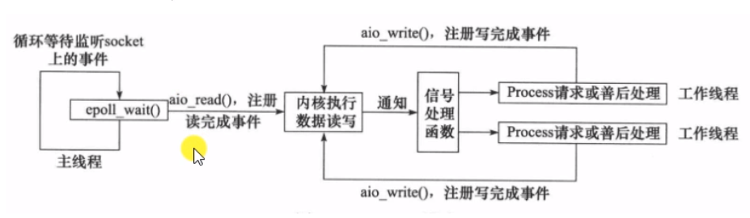


<br>

<br>

#### 模拟Proactor模式

使用**同步I/O**方式模拟Procator模式。

**原理**：主线程执行数据读写操作，读写完成之后，主线程向工作线程通知这一"完成事件"。从工作线程的角度看，它们就直接获得了数据读写的结果，接下来要做的只是对读写的结果进行逻辑处理。

<br>

使用同步I/O模型(epoll_wait为例)模拟Proactor模式的工作流程：

1. 主线程往epoll内核事件表中注册socket上的读就绪事件
2. 主线程调用epoll_wait等待socket上有数据可读
3. 当socket上有数据可读时，epoll_wait通知主线程。主线程从socket循环读取数据，直到没有更多数据可读，然后将读取到的数据封装成一个请求对象并插入请求队列
4. 睡眠在请求队列上的某个工作线程被唤醒，它获得请求对象并处理客户请求，然后往epoll内核事件表中注册socket上的写就绪事件
5. 主线程调用epoll_wait等待socket可写
6. 当socket可写时，epoll_wait通知主线程。主线程往socket上写入服务器处理客户请求的结果

<br>

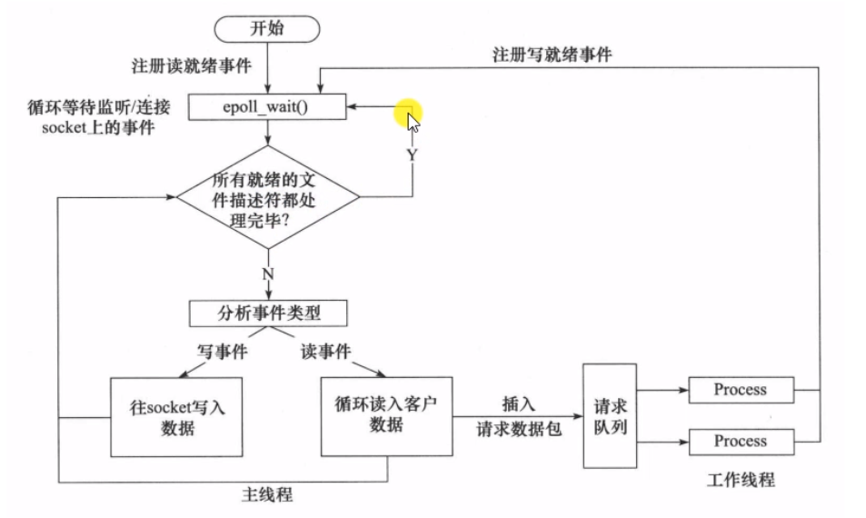

<br>

<br>

<br>

<br>

## 5.5 线程同步机制类封装及线程池实现

###  线程池

线程池是由服务器预先创建的一组子线程，线程池中的线程数量应该和 CPU 数量差不多。

- 线程池中的所有子线程都运行着相同的代码。
- 当有新的任务到来时，主线程将通过某种方式选择线程池中的某一个子线程来为之服务。
- 相于与动态的创建子线程，选择一个已经存在的子线程的代价显然要小得多。
- 至于主线程选择哪个子线程来为新任务服务，则有多种方式：
  - 主线程使用**某种算法**来主动选择子线程。最简单、最常用的算法是随机算法和 Round Robin（轮流选取）算法，但更优秀、更智能的算法将使任务在各个工作线程中更均匀地分配，从而减轻服务器的整体压力。
  - 主线程和所有子线程通过一个**共享的工作队列**来同步，子线程都睡眠在该工作队列上。当有新的任务到来时，主线程将任务添加到工作队列中。这将唤醒正在等待任务的子线程，不过只有一个子线程将获得新任务的”接管权“，它可以从工作队列中取出任务并执行之，而其他子线程将继续睡眠在工作队列上。

<br>

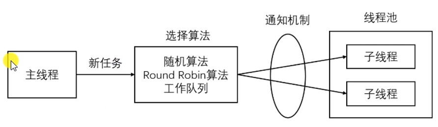

<br>

**线程数量**

线程池中的**线程数量最直接的限制因素**是中央处理器(CPU)的处理器(processors/cores)的数量N ：如果你的CPU是4-cores的，对于**CPU密集型**的任务(如视频剪辑等消耗CPU计算资源的任务)来说，那线程池中的线程数量最好也设置为4（或者+1防止其他因素造成的线程阻塞）；对于**IO密集型**的任务，一般要多于CPU的核数，因为线程间竞争的不是CPU的计算资源而是IO，IO的处理一般较慢，多于cores数的线程将为CPU争取更多的任务，不至在线程处理IO的过程造成CPU空闲导致资源浪费。

还可以动态控制线程池中的线程数量。

<br>

**线程池的特点**

- **空间换时间**，浪费服务器的硬件资源，换取运行效率。
- 池是一组资源的集合，这组资源在服务器启动之初就被完全创建好并初始化，这称为**静态资源**。
- 当服务器进入正式运行阶段，开始处理客户请求的时候，如果它需要相关的资源，可以直接从池中获取，**无需动态分配**。
- 当服务器处理完一个客户连接后，可以把相关的资源放回池中，**无需执行系统调用释放资源**。

<br>

<br>

<br>

<br>

<br>

<br>

<br>

## 5.6 其他内容

**EPOLLONESHOT事件**

- 即使可以使用 ET 模式，一个socket 上的某个事件还是可能被触发多次。这在并发程序中就会引起一个问题。比如一个线程在读取完某个 socket 上的数据后开始处理这些数据，而在数据的处理过程中该socket 上又有新数据可读（EPOLLIN 再次被触发），此时另外一个线程被唤醒来读取这些新的数据。于是就出现了两个线程同时操作一个 socket 的局面。一个socket连接在任一时刻都只被一个线程处理，可以使用 epoll 的 EPOLLONESHOT 事件实现。
- 对于注册了 EPOLLONESHOT 事件的文件描述符，操作系统最多触发其上注册的一个可读、可写或者异常事件，且只触发一次，除非我们使用 epoll_ctl 函数重置该文件描述符上注册的 EPOLLONESHOT 事件。这样，当一个线程在处理某个 socket 时，其他线程是不可能有机会操作该 socket 的。但反过来思考，注册了 EPOLLONESHOT 事件的 socket 一旦被某个线程处理完毕， 该线程就应该立即重置这个socket 上的 EPOLLONESHOT 事件，以确保这个 socket 下一次可读时，其 EPOLLIN 事件能被触发，进而让其他工作线程有机会继续处理这个 socket。

<br>

<br>

<br>

**有限状态机**

1. 有限状态机：逻辑单元内部的一种高效编程方法：有限状态机（finite state machine）。有的应用层协议头部包含数据包类型字段，每种类型可以映射为逻辑单元的一种执行状态，服务器可以根据它来编写相应的处理逻辑。如下是一种状态独立的有限状态机：

```cpp
STATE_MACHINE( Package _pack )
{
	PackageType _type = _pack.GetType();
	switch( _type )
	{
		case type_A:
			process_package_A( _pack );
			break;
		case type_B:
			process_package_B( _pack );
			break;
	}
}// 上面是一个简单的有限状态机，只不过该状态机的每个状态都是相互独立的，即状态之间没有相互转移。
```

2. 状态之间的转移是需要状态机内部驱动，如下代码：

```cpp
STATE_MACHINE()
{
	State cur_State = type_A;
	while( cur_State != type_C )
	{
		Package _pack = getNewPackage();
		switch( cur_State )
		{
			case type_A:
                process_package_state_A( _pack );
                cur_State = type_B;
                break;
			case type_B:
                process_package_state_B( _pack );
                cur_State = type_C;
                break;
		}		
	}
}

// 该状态机包含三种状态：type_A、type_B 和 type_C，其中 type_A 是状态机的开始状态，type_C 是状态机的结束状态。状态机的当前状态记录在 cur_State 变量中。在一趟循环过程中，状态机先通getNewPackage 方法获得一个新的数据包，然后根据 cur_State 变量的值判断如何处理该数据包。数据包处理完之后，状态机通过给 cur_State 变量传递目标状态值来实现状态转移。那么当状态机进入下一趟循环时，它将执行新的状态对应的逻辑。

```

