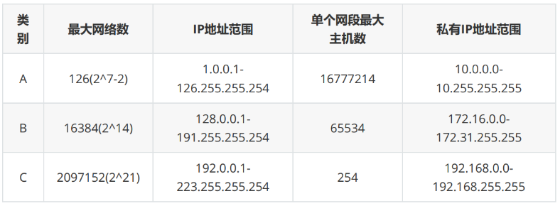

 

# 第四章 Linux网络编程

---

 

## 4.1 计算机网络相关知识

 

### 4.1.1 网络结构模式

#### C/S结构

**简介**

- 服务器 - 客户机，即 Client - Server（C/S）结构。**C/S 结构通常采取两层结构。服务器负责数据的管理，客户机负责完成与用户的交互任务。**客户机是因特网上访问别人信息的机器，服务器则是提供信息供人访问的计算机。
- **客户机通过局域网与服务器相连，接受用户的请求，并通过网络向服务器提出请求，对数据库进行操作。服务器接受客户机的请求，将数据提交给客户机，客户机将数据进行计算并将结果呈现给用户。**服务器还要提供完善安全保护及对数据完整性的处理等操作，并允许多个客户机同时访问服务器，这就对服务器的硬件处理数据能力提出了很高的要求。
- 在C/S结构中，**应用程序分为两部分：服务器部分和客户机部分。**服务器部分是多个用户共享的信息与功能，执行后台服务，如控制共享数据库的操作等；客户机部分为用户所专有，负责执行前台功能，在出错提示、在线帮助等方面都有强大的功能，并且可以在子程序间自由切换。

 

**优点**

1. 能充分发挥客户端 PC 的处理能力，**很多工作可以在客户端处理后再提交给服务器，**所以 C/S 结构**客户端响应速度快**；
2. 操作界面漂亮、形式多样，可以充分满足客户自身的**个性化**要求；
3. C/S 结构的**管理信息系统具有较强的事务处理能力**，能实现复杂的业务流程；
4. **安全性较高**，C/S 一般面向相对固定的用户群，**程序更加注重流程**，它可以**对权限进行多层次校验**，提供了更安全的存取模式，对信息安全的控制能力很强，一般**高度机密**的信息系统采用 C/S 结构适宜。

 

**缺点**

1. **客户端需要安装专用的客户端软件**。首先涉及到安装的工作量，其次任何一台电脑出问题，如病毒、硬件损坏，都需要进行安装或维护。系统软件升级时，每一台客户机需要重新安装，其维护和升级成本非常高；
2. **对客户端的操作系统一般也会有限制，不能够跨平台**

 

 

#### B/S 结构

**简介**

- B/S 结构（Browser/Server，浏览器/服务器模式），**是WEB兴起后的一种网络结构模式，WEB浏览器是客户端最主要的应用软件。**这种模式**统一了客户端**，将系统功能实现的**核心部分集中到服务器上**，简化了系统的开发、维护和使用。客户机上只要安装一个浏览器，如 Firefox 或 InternetExplorer，服务器安装 SQL Server、Oracle、MySQL 等数据库。浏览器通过 Web Server 同数据库进行数据交互

 

**优点**

- B/S 架构最大的优点是总体拥有**成本低、维护方便、 分布性强、开发简单**，可以不用安装任何专门的软件就能实现在任何地方进行操作，客户端零维护，系统的扩展非常容易，只要有一台能上网的电脑就能使用。

 

**缺点**

1. **通信开销大、系统和数据的安全性较难保障;**
2. 个性特点明显降低，无法实现具有个性化的功能要求；
3. 协议一般是**固定**的：**http/https**（无法输出大数据）
4. 客户端服务器端的交互是**请求-响应模式**，通常**动态刷新**页面，**响应速度明显降低**。

 

 

 

### 4.1.2 MAC、IP、端口

#### 网卡

（网卡分为 以太网卡 和 无线网卡 ）

- 网卡是一块被设计用来允许计算机在计算机网络上进行通讯的计算机硬件，又称为 **网络适配器** 或 **网络接口卡NIC** 。
- 其**拥有 MAC 地址**，属于 OSI 模型的**第 2 层**，它使得用户可以通过电缆或无线相互连接。
- 每一个网卡都有一个被称为 MAC 地址的独一无二的 **48 位**串行号。
- 网卡的主要功能：
  - 数据的封装与解封装
  - 链路管理
  - 数据编码与译码

 

#### MAC地址

- Media Access Control Address
- 直译为 **媒体存取控制位址** ，也称为 **局域网地址**、**以太网地址**、**物理地址** 或 **硬件地址** ，它是一个用来确认网络设备位置的位址，由网络设备制造商生产时烧录在网卡中
- 在 OSI 模型中，**第三层网络层负责IP地址，第二层数据链路层则负责MAC位址** 
- MAC 地址用于在网络中**唯一标识一个网卡**。一台设备若有一或多个网卡，则每个网卡都需要并会有一个唯一的 MAC 地址。
- MAC 地址的长度为 **48 位（6个字节）**，通常表示为 12 个 16 进制数，如：00-16-EA-AE-3C-40 就是一个MAC 地址。
  - 其中前 3 个字节，16 进制数 00-16-EA 代表网络硬件制造商的编号，它由IEEE（电气与电子工程师协会）分配
  - 而后 3 个字节，16进制数 AE-3C-40 代表该制造商所制造的某个网络产品（如网卡）的系列号。
  - 只要不更改自己的 MAC 地址，MAC 地址在世界是唯一的。形象地说，MAC 地址就如同身份证上的身份证号码，具有唯性。

 

#### IP

**简介**

​	IP（Internet Protocol）协议是为计算机网络相互连接进行通信而设计的协议。在 **因特网** 中，它是能使连接到网上的所有计算机网络实现相互通信的一套规则，规定了计算机在因特网上进行通信时应当遵守的规则。任何厂家生产的计算机系统，只要遵守IP协议就可以与因特网互连互通。

​	各个厂家生产的网络系统和设备，如以太网、分组交换网等，它们相互之间不能互通，不能互通的主要原因是因为它们所传送数据的基本单元（技术上称之为“帧”）的格式不同。IP 协议实际上是一套由软件程序组成的协议软件，它把各种不同“**帧**”统一转换成“**IP 数据报**”格式，这种转换是因特网的一个最重要的特点，使所有各种计算机都能在因特网上实现互通，即具有“开放性”的特点。正是因为有了 IP 协议，因特网才得以迅速发展成为世界上最大的、开放的计算机通信网络。因此，IP 协议也可以叫做“**因特网协议**”。

 

- **IP地址**（Internet Protocol Address）是指**互联网协议地址**，又译为**网际协议地址**。IP 地址是IP协议提供的一种统一的地址格式，**它为互联网上的每一个网络和每一台主机分配一个逻辑地址，以此来屏蔽物理地址的差异**

- IP 地址是一个 **32 位的二进制数**，通常被分割为 **4 个“ 8 位二进制数”**（也就是 4 个字节）。

 

**IP地址类型**

> 补充：
>
> - D类IP地址：D 类 IP 地址在历史上被叫做多播地址（multicast address），即组播地址。在以太网中，多播地址命名了一组应该在这个网络中应用接收到一个分组的站点。多播地址的最高位必须是 “1110”，范围从224.0.0.0 - 239.255.255.255。
> - 特殊的网址：
>   - 每一个字节都为 0 的地址（ “0.0.0.0” ）对应于当前主机；
>   - IP 地址中的每一个字节都为 1 的 IP 地址（ “255.255.255.255” ）是当前子网的广播地址；
>   - IP 地址中凡是以 “11110” 开头的 E 类 IP 地址都保留用于将来和实验使用。
>   - IP地址中不能以十进制 “127” 作为开头，该类地址中数字 127.0.0.1 到 127.255.255.255 用于回路测试，如：127.0.0.1可以代表本机IP地址

 

**子网掩码**

- 子网掩码（subnet mask）又叫网络掩码、地址掩码、子网络遮罩，它是一种用来指明一个 IP 地址的哪些位标识的是主机所在的子网，以及哪些位标识的是主机的位掩码。子网掩码不能单独存在，它必须结合 IP 地址一起用。子网掩码只有一个作用，就是**将某个 IP 地址划分成 网络地址 和 主机地址 两部分**。
- 子网掩码是一个 32 位地址，用于屏蔽 IP 地址的一部分以区别网络标识和主机标识，并说明该 IP地址是在局域网上，还是在广域网上。
- 子网掩码是在 IPv4 地址资源紧缺的背景下为了解决 IP 地址分配而产生的虚拟 IP 技术，通过子网掩码将A、B、C 三类地址划分为若干子网，从而显著提高了 IP 地址的分配效率，有效解决了 IP 地址资源紧张的局面。另一方面，在企业内网中为了更好地管理网络，网管人员也利用子网掩码的作用，人为地将一个较大的企业内部网络划分为更多个小规模的子网，再利用三层交换机的路由功能实现子网互联，从而有效解决了网络广播风暴和网络病毒等诸多网络管理方面的问题。

 

 

#### 端口

简介：

- 端口 是英文 port 的意译，可以认为是设备与外界通讯交流的出口。端口可分为 **虚拟端口** 和 **物理端口** ，其中虚拟端口指计算机内部或交换机路由器内的端口，不可见，是特指TCP/IP协议中的端口，是逻辑意义上的端口。例如计算机中的 80 端口、21 端口、23 端口等。物理端口又称为接口，是可见端口，计算机背板的 RJ45 网口，交换机路由器集线器等 RJ45 端口。电话使用 RJ11 插口也属于物理端口的范畴。
- 如果把 IP 地址比作一间房子，端口就是出入这间房子的门。真正的房子只有几个门，但是一个 IP地址的端口可以有 65536（即：2^16）个之多！端口是通过端口号来标记的，端口号只有整数，范围是从 0 到65535（2^16-1）。
  

 

 

 

 

 

### 4.1.3 网络模型

 

 

 

### 4.1.4 协议

 

 

  

 

 

## 4.2 Socket编程

 

 

  

 

  

 

 

## 4.3 TCP/UDP协议

 

 

  

 

  

 

 

## 4.4 并发服务器

 

 

  

 

  

 

  

 

  

 

 

## 4.5 IO复用

 

 

  

 

  

 

  

 

 
