 

# 第四章 Linux网络编程

---

 

## 4.1 计算机网络相关知识

 

### 4.1.1 网络结构模式

#### C/S结构

**简介**

- 服务器 - 客户机，即 Client - Server（C/S）结构。**C/S 结构通常采取两层结构。服务器负责数据的管理，客户机负责完成与用户的交互任务。**客户机是因特网上访问别人信息的机器，服务器则是提供信息供人访问的计算机。
- **客户机通过局域网与服务器相连，接受用户的请求，并通过网络向服务器提出请求，对数据库进行操作。服务器接受客户机的请求，将数据提交给客户机，客户机将数据进行计算并将结果呈现给用户。**服务器还要提供完善安全保护及对数据完整性的处理等操作，并允许多个客户机同时访问服务器，这就对服务器的硬件处理数据能力提出了很高的要求。
- 在C/S结构中，**应用程序分为两部分：服务器部分和客户机部分。**服务器部分是多个用户共享的信息与功能，执行后台服务，如控制共享数据库的操作等；客户机部分为用户所专有，负责执行前台功能，在出错提示、在线帮助等方面都有强大的功能，并且可以在子程序间自由切换。

 

**优点**

1. 能充分发挥客户端 PC 的处理能力，**很多工作可以在客户端处理后再提交给服务器，**所以 C/S 结构**客户端响应速度快**；
2. 操作界面漂亮、形式多样，可以充分满足客户自身的**个性化**要求；
3. C/S 结构的**管理信息系统具有较强的事务处理能力**，能实现复杂的业务流程；
4. **安全性较高**，C/S 一般面向相对固定的用户群，**程序更加注重流程**，它可以**对权限进行多层次校验**，提供了更安全的存取模式，对信息安全的控制能力很强，一般**高度机密**的信息系统采用 C/S 结构适宜。

 

**缺点**

1. **客户端需要安装专用的客户端软件**。首先涉及到安装的工作量，其次任何一台电脑出问题，如病毒、硬件损坏，都需要进行安装或维护。系统软件升级时，每一台客户机需要重新安装，其维护和升级成本非常高；
2. **对客户端的操作系统一般也会有限制，不能够跨平台**

 

 

#### B/S 结构

**简介**

- B/S 结构（Browser/Server，浏览器/服务器模式），**是WEB兴起后的一种网络结构模式，WEB浏览器是客户端最主要的应用软件。**这种模式**统一了客户端**，将系统功能实现的**核心部分集中到服务器上**，简化了系统的开发、维护和使用。客户机上只要安装一个浏览器，如 Firefox 或 InternetExplorer，服务器安装 SQL Server、Oracle、MySQL 等数据库。浏览器通过 Web Server 同数据库进行数据交互

 

**优点**

- B/S 架构最大的优点是总体拥有**成本低、维护方便、 分布性强、开发简单**，可以不用安装任何专门的软件就能实现在任何地方进行操作，客户端零维护，系统的扩展非常容易，只要有一台能上网的电脑就能使用。

 

**缺点**

1. **通信开销大、系统和数据的安全性较难保障;**
2. 个性特点明显降低，无法实现具有个性化的功能要求；
3. 协议一般是**固定**的：**http/https**（无法输出大数据）
4. 客户端服务器端的交互是**请求-响应模式**，通常**动态刷新**页面，**响应速度明显降低**。

 

 

 

### 4.1.2 MAC、IP、端口

#### 网卡

（网卡分为 以太网卡 和 无线网卡 ）

- 网卡是一块被设计用来允许计算机在计算机网络上进行通讯的计算机硬件，又称为 **网络适配器** 或 **网络接口卡NIC** 。
- 其**拥有 MAC 地址**，属于 OSI 模型的**第 2 层**，它使得用户可以通过电缆或无线相互连接。
- 每一个网卡都有一个被称为 MAC 地址的独一无二的 **48 位**串行号。
- 网卡的主要功能：
  - 数据的封装与解封装
  - 链路管理
  - 数据编码与译码

 

#### MAC地址

- Media Access Control Address
- 直译为 **媒体存取控制位址** ，也称为 **局域网地址**、**以太网地址**、**物理地址** 或 **硬件地址** ，它是一个用来确认网络设备位置的位址，由网络设备制造商生产时烧录在网卡中
- 在 OSI 模型中，**第三层网络层负责IP地址，第二层数据链路层则负责MAC位址** 
- MAC 地址用于在网络中**唯一标识一个网卡**。一台设备若有一或多个网卡，则每个网卡都需要并会有一个唯一的 MAC 地址。
- MAC 地址的长度为 **48 位（6个字节）**，通常表示为 12 个 16 进制数，如：00-16-EA-AE-3C-40 就是一个MAC 地址。
  - 其中前 3 个字节，16 进制数 00-16-EA 代表网络硬件制造商的编号，它由IEEE（电气与电子工程师协会）分配
  - 而后 3 个字节，16进制数 AE-3C-40 代表该制造商所制造的某个网络产品（如网卡）的系列号。
  - 只要不更改自己的 MAC 地址，MAC 地址在世界是唯一的。形象地说，MAC 地址就如同身份证上的身份证号码，具有唯性。

 

#### IP

**简介**

​	IP（Internet Protocol）协议是为计算机网络相互连接进行通信而设计的协议。在 **因特网** 中，它是能使连接到网上的所有计算机网络实现相互通信的一套规则，规定了计算机在因特网上进行通信时应当遵守的规则。任何厂家生产的计算机系统，只要遵守IP协议就可以与因特网互连互通。

​	各个厂家生产的网络系统和设备，如以太网、分组交换网等，它们相互之间不能互通，不能互通的主要原因是因为它们所传送数据的基本单元（技术上称之为“帧”）的格式不同。IP 协议实际上是一套由软件程序组成的协议软件，它把各种不同“**帧**”统一转换成“**IP 数据报**”格式，这种转换是因特网的一个最重要的特点，使所有各种计算机都能在因特网上实现互通，即具有“开放性”的特点。正是因为有了 IP 协议，因特网才得以迅速发展成为世界上最大的、开放的计算机通信网络。因此，IP 协议也可以叫做“**因特网协议**”。

 

- **IP地址**（Internet Protocol Address）是指**互联网协议地址**，又译为**网际协议地址**。IP 地址是IP协议提供的一种统一的地址格式，**它为互联网上的每一个网络和每一台主机分配一个逻辑地址，以此来屏蔽物理地址的差异**

- IP 地址是一个 **32 位的二进制数**，通常被分割为 **4 个“ 8 位二进制数”**（也就是 4 个字节）。

 

**IP地址类型**

补充：

- D类IP地址：D 类 IP 地址在历史上被叫做多播地址（multicast address），即组播地址。在以太网中，多播地址命名了一组应该在这个网络中应用接收到一个分组的站点。多播地址的最高位必须是 “1110”，范围从224.0.0.0 - 239.255.255.255。
- **特殊的网址**（E类）：
  - 每一个字节都为 0 的地址（ “0.0.0.0” ）对应于当前主机；
  - IP 地址中的每一个字节都为 1 的 IP 地址（ “255.255.255.255” ）是当前子网的广播地址；
  - IP 地址中凡是以 “11110” 开头的 E 类 IP 地址都保留用于将来和实验使用。
  - IP地址中不能以十进制 “127” 作为开头，该类地址中数字 127.0.0.1 到 127.255.255.255 用于回路测试，如：127.0.0.1可以代表本机IP地址

 

**子网掩码**

- 子网掩码（subnet mask）又叫网络掩码、地址掩码、子网络遮罩，它是一种用来指明一个 IP 地址的哪些位标识的是主机所在的子网，以及哪些位标识的是主机的位掩码。子网掩码不能单独存在，它必须结合 IP 地址一起用。子网掩码只有一个作用，就是**将某个 IP 地址划分成 网络地址 和 主机地址 两部分**。
- 子网掩码是一个 32 位地址，用于屏蔽 IP 地址的一部分以区别网络标识和主机标识，并说明该 IP地址是在局域网上，还是在广域网上。
- 子网掩码是在 IPv4 地址资源紧缺的背景下为了解决 IP 地址分配而产生的虚拟 IP 技术，通过子网掩码将A、B、C 三类地址划分为若干子网，从而显著提高了 IP 地址的分配效率，有效解决了 IP 地址资源紧张的局面。另一方面，在企业内网中为了更好地管理网络，网管人员也利用子网掩码的作用，人为地将一个较大的企业内部网络划分为更多个小规模的子网，再利用三层交换机的路由功能实现子网互联，从而有效解决了网络广播风暴和网络病毒等诸多网络管理方面的问题。

 

 

#### 端口

> 端口 就是一块缓冲区，有 读缓冲 和 写缓冲 

**简介**

- 端口 是英文 port 的意译，可以认为是设备与外界通讯交流的出口。端口可分为 **虚拟端口** 和 **物理端口** ，
  - **虚拟端口** 指**计算机内部或交换机路由器内的端口**，**不可见**，是特指**TCP/IP协议中的端口**，是**逻辑意义上**的端口。例如计算机中的 80 端口、21 端口、23 端口等。
  - **物理端口** 又称为**接口**，**是可见端口**，计算机背板的 RJ45 网口，交换机路由器集线器等 RJ45 端口。电话使用 RJ11 插口也属于物理端口的范畴。
- 如果把 IP 地址比作一间房子，端口就是出入这间房子的门。真正的房子只有几个门，但是一个 IP地址的端口可以有 **65536**（即：2^16）个之多！端口是通过端口号来标记的，端口号只有整数，范围是从 **0 到 65535**（2^16-1）。

 

**端口类型**

- **周知端口** Well Known Ports ：
  - 也叫知名端口、公认端口或者常用端口，范围从 **0 到 1023**，它们紧密绑定于一些特定的服务。
  - 例如 **80 端口分配给 WWW 服务，21 端口分配给 FTP 服务，23 端口分配给Telnet服务**等等。
  - 网络服务是可以使用其他端口号的，比如使用“8080” 作为 WWW服务的端口；但是有些系统协议使用固定的端口号，比如 139 端口专门用于 NetBIOS 与 TCP/IP 之间的通信

- **注册端口** Registered Ports ：
  - 端口号从 **1024 到 49151**，它们松散地绑定于一些服务，**分配给用户进程或应用程序**。
  - 这些端口在没有被服务器资源占用的时候，可以给用户端动态选用为源端口。
- **动态端口** / **私有端口** Dynamic Ports/Private Ports ：
  - 动态端口的范围是从 **49152 到 65535**。之所以称为动态端口，是因为它一般不固定分配某种服务，而是**动态分配**。

 

 

 

 

### 4.1.3 网络模型

#### OSI七层模型

Open System Interconnection

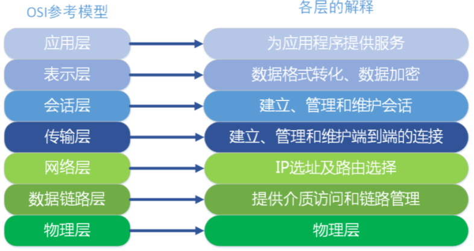

**物理层**：主要定义物理设备标准，如网线的接口类型、光纤的接口类型、各种传输介质的传输速率等。它的主要作用是传输比特流（就是由1、0转化为电流强弱来进行传输，到达目的地后再转化为1、0，也就是我们常说的数模转换与模数转换）。这一层的数据叫做比特。

 

**数据链路层**：建立逻辑连接、进行硬件地址寻址、差错校验等功能。定义了如何让格式化数据以帧为单位进行传输，以及如何让控制对物理介质的访问。将比特组合成字节进而组合成帧，用MAC地址访问介质。

 

**网络层**：进行逻辑地址寻址，在位于不同地理位置的网络中的两个主机系统之间提供连接和路径选择。Internet的发展使得从世界各站点访问信息的用户数大大增加，而网络层正是管理这种连接的层。

 

**传输层**：定义了一些传输数据的协议和端口号（ WWW 端口 80 等），如：TCP（传输控制协议，传输效率低，可靠性强，用于传输可靠性要求高，数据量大的数据），UDP（用户数据报协议，与TCP 特性恰恰相反，用于传输可靠性要求不高，数据量小的数据，如 QQ 聊天数据就是通过这种方式传输的）。 主要是将从下层接收的数据进行分段和传输，到达目的地址后再进行重组。常常把这一层数据叫做段。

 

**会话层**：通过传输层（端口号：传输端口与接收端口）建立数据传输的通路。主要在你的系统之间发起会话或者接受会话请求。

 

**表示层**：**数据的表示、安全、压缩。**主要是进行对接收的数据进行解释、加密与解密、压缩与解压缩等（也就是把计算机能够识别的东西转换成人能够能识别的东西（如图片、声音等）。

 

**应用层**：网络服务与最终用户的一个接口。这一层为用户的应用程序（例如电子邮件、文件传输和终端仿真）提供网络服务

 

 

#### TCP/IP 四层模型

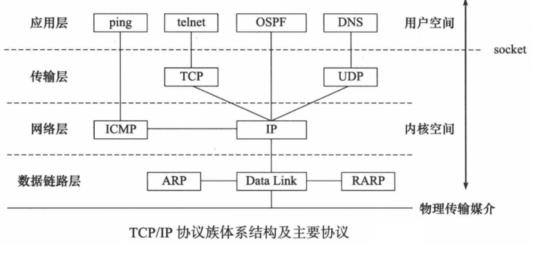

现在 Internet（因特网）使用的**主流协议族是 TCP/IP 协议族**，它是一个分层、多协议的通信体系。TCP/IP协议族是一个四层协议系统，**自底而上分别是数据链路层、网络层、传输层和应用层**。

 

**简化OSI七层模型**

1. **应用层、表示层、会话层** 三个层次提供的服务相差不是很大，所以在 TCP/IP 协议中，它们被合并为 **应用层** 一个层次。
2. 由于 **传输层、网络层** 在网络协议中的地位十分重要，所以在 TCP/IP 协议中它们被作为**独立**的两个层次。
3. 因为 **数据链路层、物理层** 的内容相差不多，所以在 TCP/IP 协议中它们被归并在 **网络接口层** 一个层次里。

 

**四层介绍**

- **应用层**：应用层是 TCP/IP 协议的第一层，是直接为应用进程提供服务的。
  - 对不同种类的应用程序它们会根据自己的需要来使用应用层的不同协议，邮件传输应用使用了 SMTP 协议、万维网应用使用了 HTTP 协议、远程登录服务应用使用了有 TELNET 协议。
  - 应用层还能**加密、解密、格式化数据**。
  - 应用层可以**建立或解除与其他节点的联系**，这样可以充分节省网络资源。
- **传输层**：作为 TCP/IP 协议的第二层，运输层在整个 TCP/IP 协议中起到了中流砥柱的作用。且在运输层中， **TCP 和 UDP** 也同样起到了中流砥柱的作用。
- **网络层**：网络层在 TCP/IP 协议中的位于第三层。在 TCP/IP 协议中网络层可以进行**网络连接的建立和终止**以及 **IP 地址的寻找**等功能。
- **网络接口层**：在 TCP/IP 协议中，网络接口层位于第四层。由于网络接口层兼并了物理层和数据链路层所以，网络接口层既是**传输数据的物理媒介**，也可以为网络层**提供一条准确无误的线路**。

 

 

**比较**

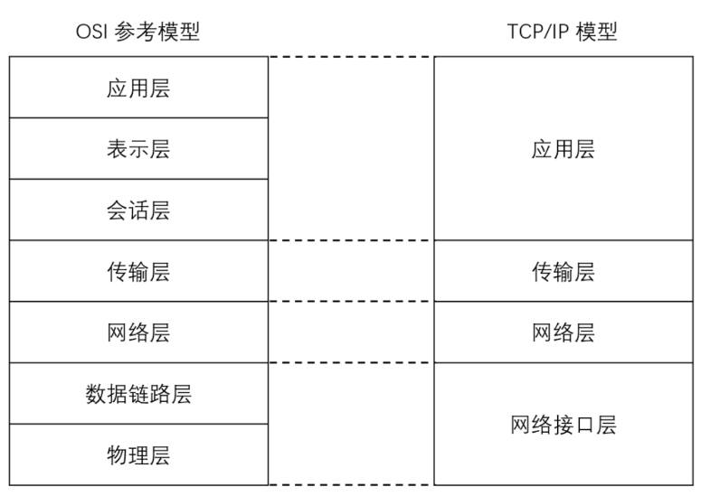

 

 

 

 

### 4.1.4 协议

**简介**

​	**协议**，网络协议的简称，网络协议是通信计算机双方必须共同遵从的一组约定。

- 如怎么样建立连接、怎么样互相识别等。只有遵守这个约定，计算机之间才能相互通信交流。
- 它的三要素是：**语法、语义、时序**。
- 为了使数据在网络上从源到达目的，网络通信的参与方必须遵循相同的规则，这套规则称为协议（protocol），它最终体现为在网络上传输的**数据包的格式**。协议往往分成几个层次进行定义，**分层定义**是为了<u>使某一层协议的改变不影响其他层次的协议</u>。

 

**常见协议**

- 应用层：
  - FTP协议（File Transfer Protocol 文件传输协议）
  - HTTP协议（Hyper Text Transfer Protocol 超文本传输协议）
  - NFS（Network File System 网络文件系统）。（SSH协议端口号是22）

- 传输层：
  - TCP协议（Transmission Control Protocol 传输控制协议）
  - UDP协议（User Datagram Protocol 用户数据报协议）。
- 网络层：
  - IP 协议（Internet Protocol 因特网互联协议）
  - ICMP 协议（Internet Control Message Protocol 因特网控制报文协议）
  - IGMP 协议（Internet Group Management Protocol 因特网组管理协议）。
- 网络接口层：
  - ARP协议（Address Resolution Protocol 地址解析协议）
  - RARP协议
    （Reverse Address Resolution Protocol 反向地址解析协议）

 

 

#### UDP报

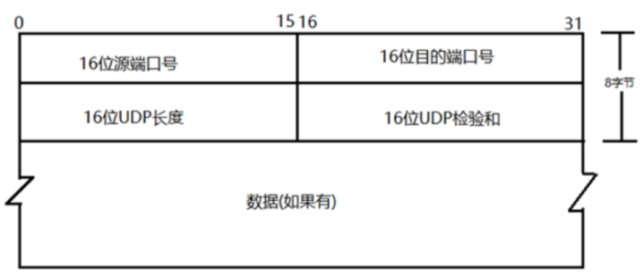

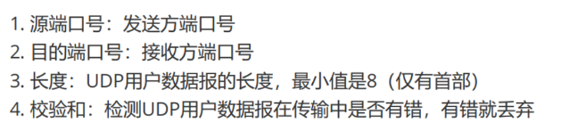

 

#### TCP报

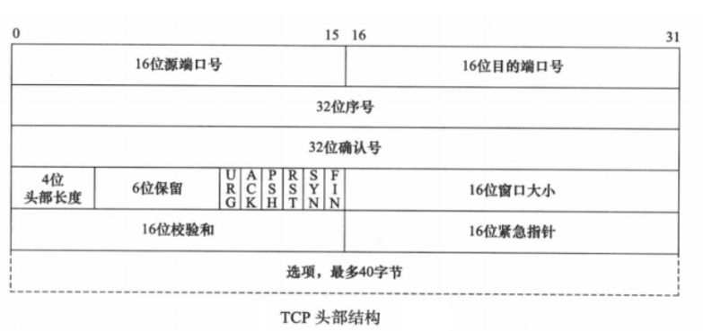

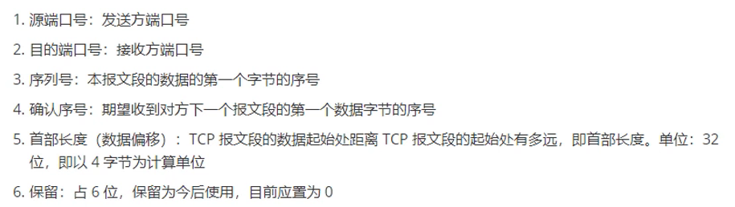

flag：
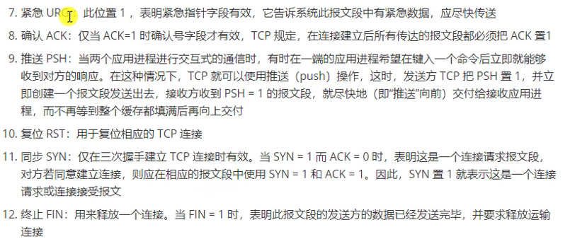

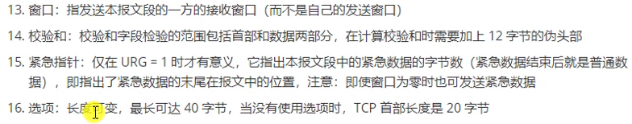

 

#### IP报

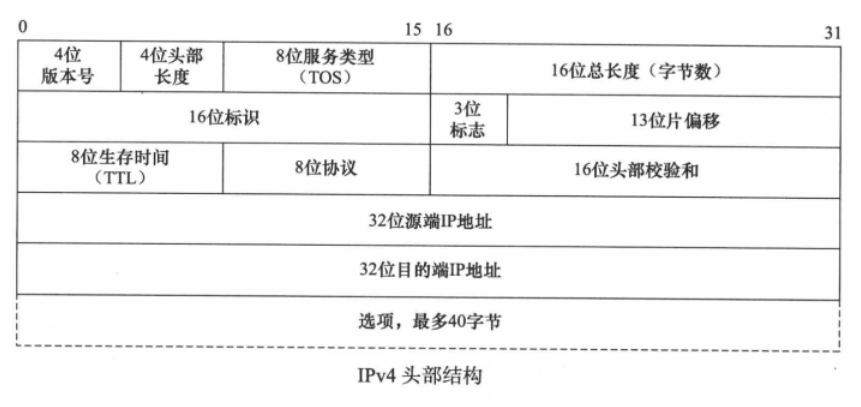

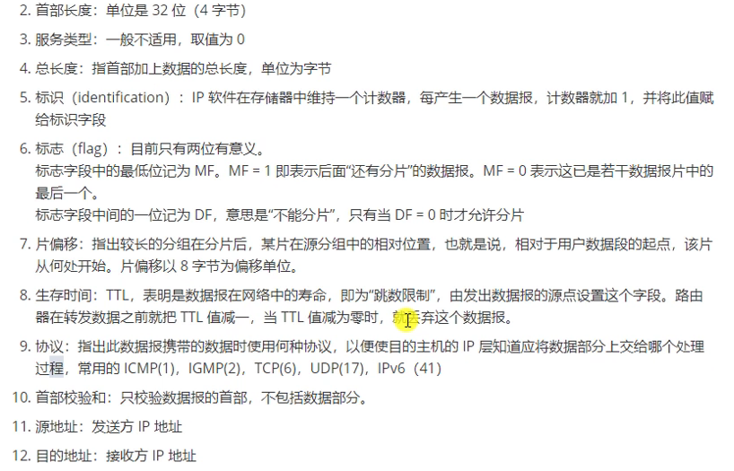

 

#### 以太网帧

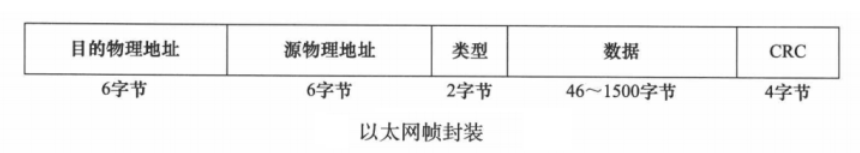

类型：0x800 IP，0x806 ARP，0x835 RARP

 

#### ARP协议

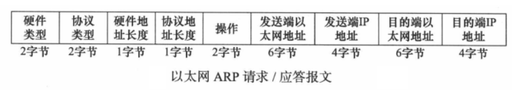

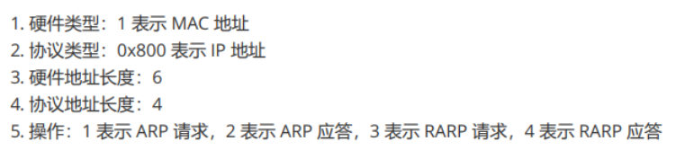

 

 

#### 通信过程

**封装**

​	应用程序数据在发送到物理网络上之前，将沿着协议栈从上往下依次传递。每层协议都将在上层数据的基础上加上自己的头部信息（有时还包括尾部信息），以实现该层的功能，这个过程就称为封装。

> 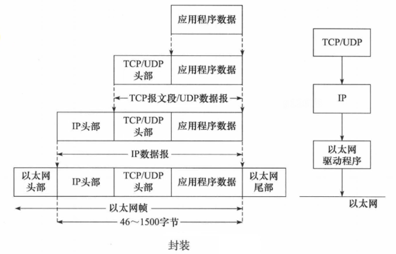

 

**分用**

​	当帧到达目的主机时，将沿着协议栈自底向上依次传递。各层协议依次处理帧中本层负责的头部数据，以获取所需的信息，并最终将处理后的帧交给目标应用程序。这个过程称为分用（demultiplexing）。分用是依靠头部信息中的类型字段实现的。

>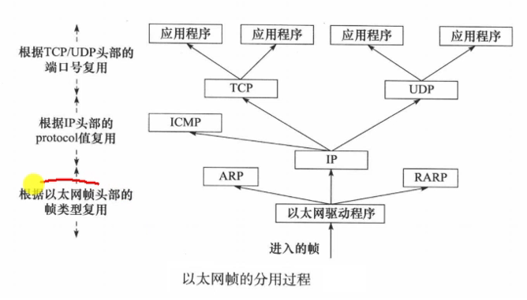

 

**封装与解封装案例**

（数据链路层还有 帧尾 的校验码）

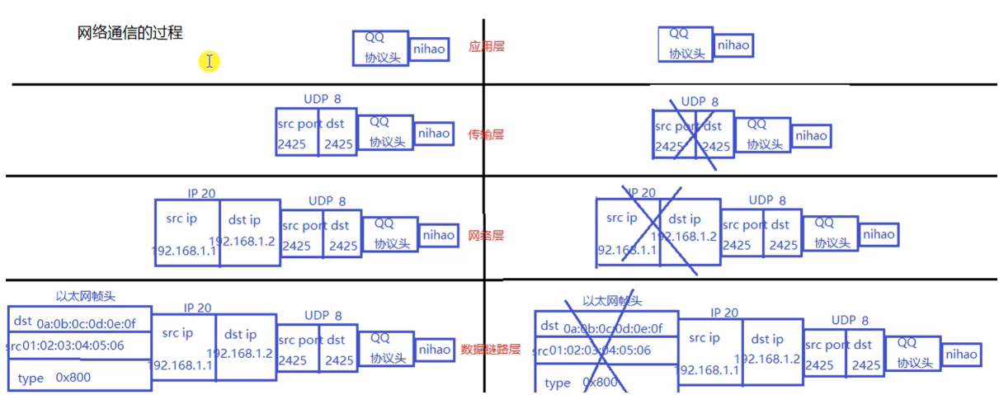

 

 

#### ARP协议的分析

封装过程中，从网络层到数据链路层，需要添加的以太网帧头含有 **目的mac地址** 字段

**问题**：目前知道 目的IP地址 ，要从何获取目的mac地址？ —— 利用ARP协议（通过 IP 获取 mac）

先查找本地 地址解析表 ，如果没有就如下：

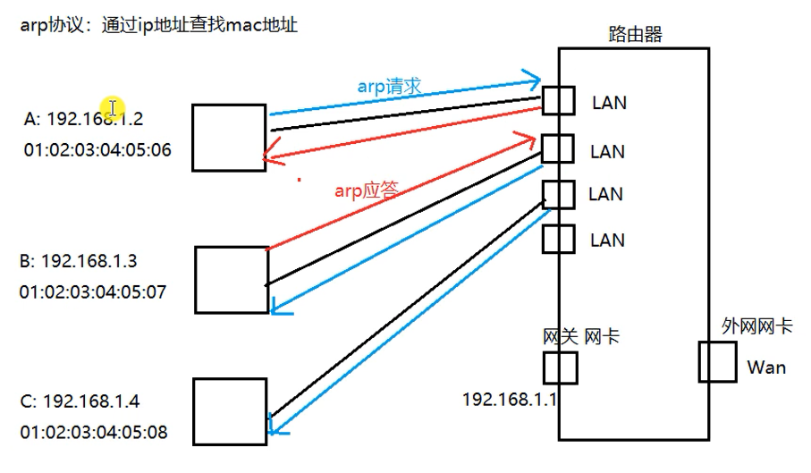

- 广播发送
- 单播应答

 

**帧结构**

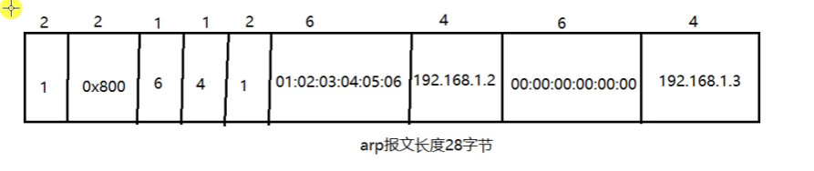

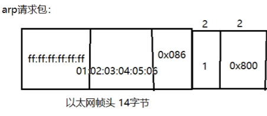

> 

 

 

### 4.1.5 Socket套接字

**socket**（套接字），就是对 **网络中不同主机上的应用进程之间** 进行**双向通信**的**端点**的抽象。一个套接字就是网络上进程通信的一端，提供了应用层进程利用网络协议交换数据的机制。从所处的地位来讲，套接字上联应用进程，下联网络协议栈，是应用程序通过网络协议进行通信和交互的接口。

 

socket 可以看成是两个网络**应用程序**进行通信时，各自**通信连接中的端点**，这是一个**逻辑上的概念**。它是网络环境中进程间通信的 API，也是可以 **被命名** 和 **寻址** 的通信端点，使用中的每一个套接字都有其类型和一个与之相连进程。通信时其中一个网络应用程序将要传输的一段信息写入它所在主机的 socket 中，该 socket 通过与网络接口卡（NIC）相连的传输介质将这段信息送到另外一台主机的 socket 中，使对方能够接收到这段信息。socket 是由 **IP** 和 **端口** 结合的，提供**向应用层进程传送数据包**的机制。

 

socket 本身有“**插座**”的意思，在 Linux 环境下，用于表示进程间网络通信的特殊文件类型。本质为内核借助 **缓冲区** 形成的 **伪文件** 。既然是文件，那么理所当然的，我们可以使用 **文件描述符** 引用套接字。与管道类似的，<u>Linux 系统将其封装成文件的目的是为了统一接口</u>，使得读写套接字和读写文件的操作一致。<u>区别是管道主要应用于本地进程间通信，而套接字多应用于网络进程间数据的传递。</u>

 

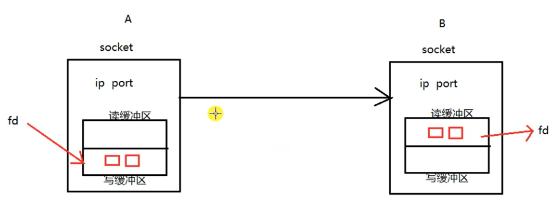

 

套接字通信分两部分：
- **服务器端**：被动接受连接，一般不会主动发起连接
- **客户端**：主动向服务器发起连接

> socket是一套通信的接口，Linux 和 Windows 都有，但是有一些细微的差别

 

 

### 4.1.6 字节序

 

  

 

 

## 4.2 TCP/UDP协议分析

 

 

  

 

  

 

 

## 4.3 并发服务器

 

 

  

 

  

 

  

 

  

 

 

## 4.4 IO复用

 

 

  

 

  

 

  

 

 

